# Istio

## Kubernetes相关

### 容器

#### 容器运行时

+ Docker

+ Podman ：完全兼容docker，无daemon 、集成入OS中，Redhat推出
+ RKT
+ containerd (k8s推出)

### 工作负载

#### Deployment 演进

+ replicationcontroller  - 不支持set标签选择，只支持等于
+ replicaset - 支持set标签
+ Deployment -  replicaset的管理

#### 滚动升级

滚动升级：工作负载层面的升级，通过创建新的工作负载代替旧的工作负载

### 服务发现

集群内部/集群外部

容器内 http://servicename:serviceport -> pod:targetPort

+ headless 类型,创建关联Pod的一条DNS记录

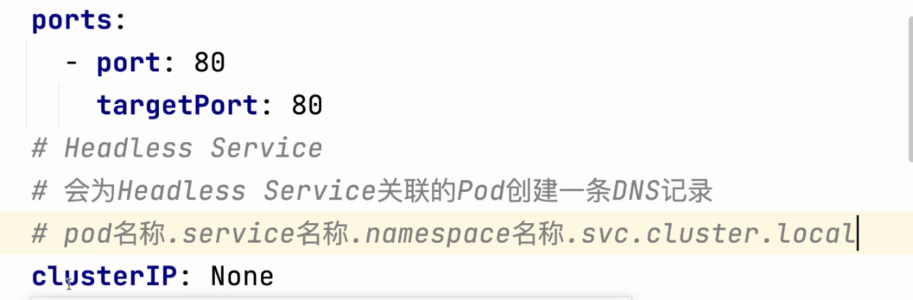

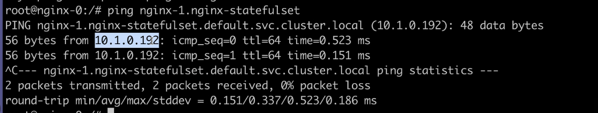

## Spring Boot

Spring Actuato 可监控信息项 - 配置信息，beans(依赖注入), conditions(阅读源码-SpringBoot 整合bean)

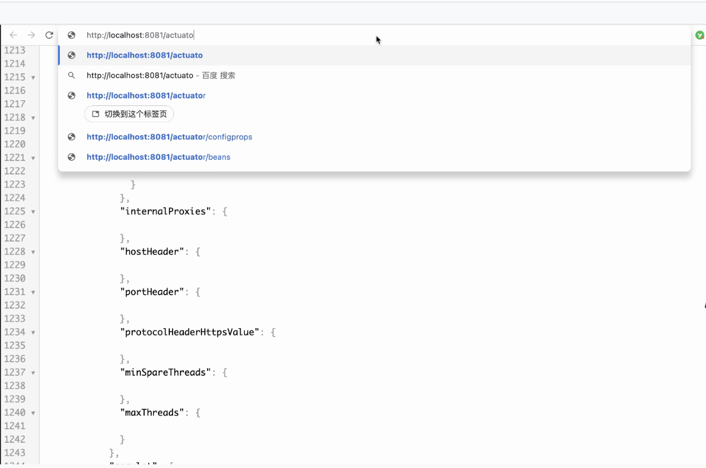

镜像加速器

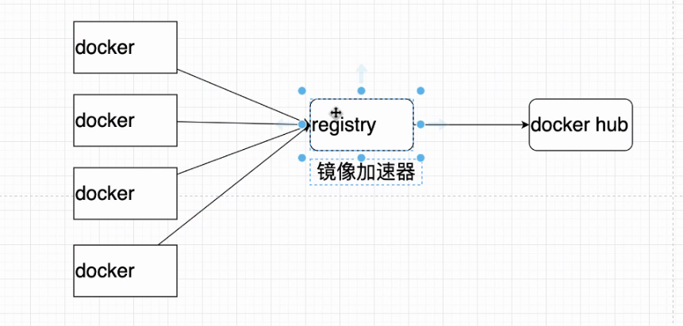

使用私服镜像进行编排

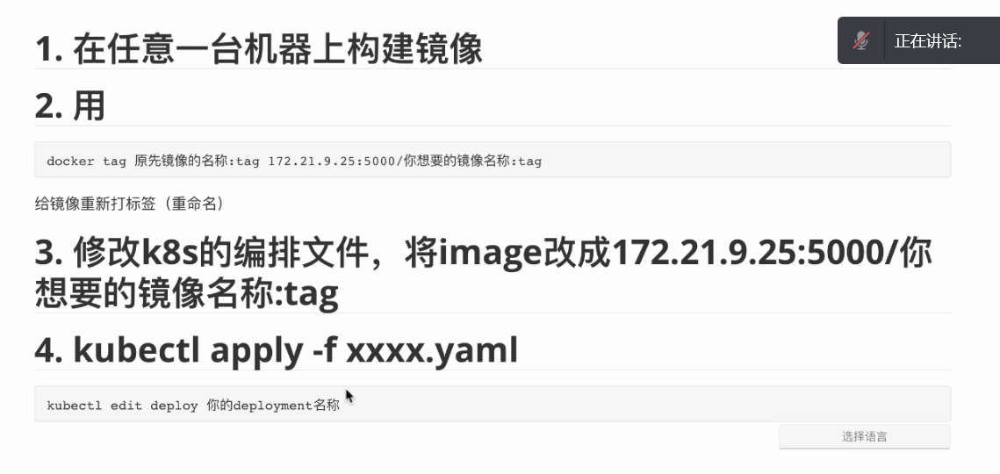

## Istio

### 版本

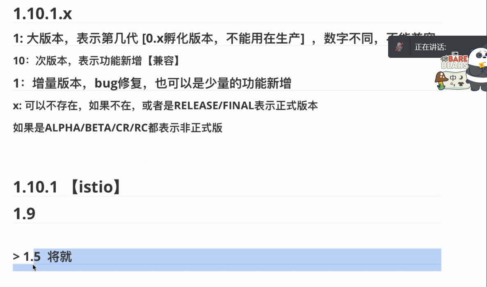

### 场景

#### 超时、限流、断路器

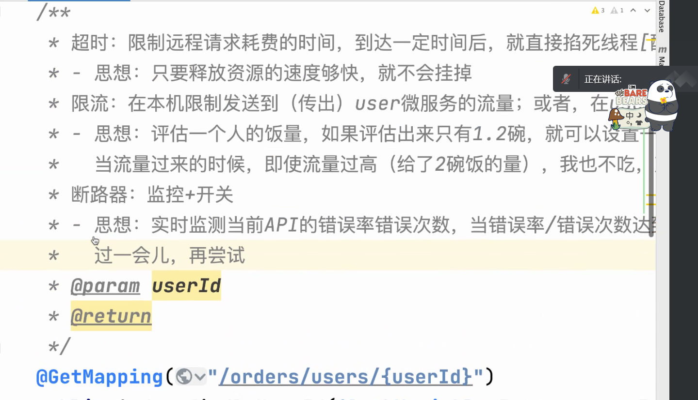

如何不修改代码，实现上述场景？ - Istio sidecar

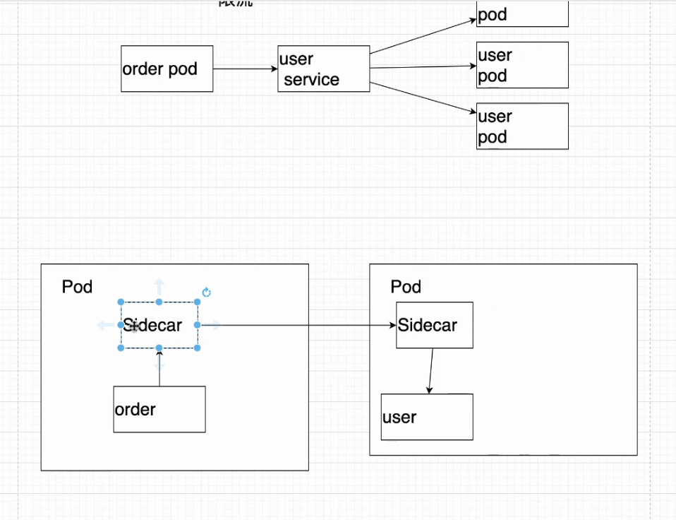

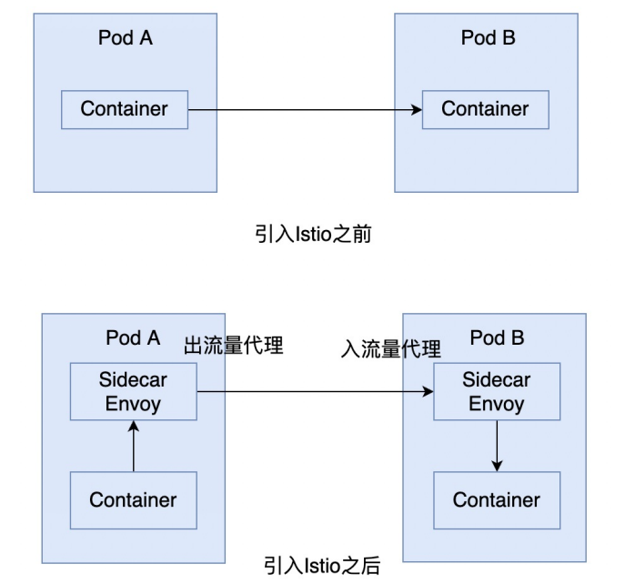

### pilot 

istio的注册发现中心

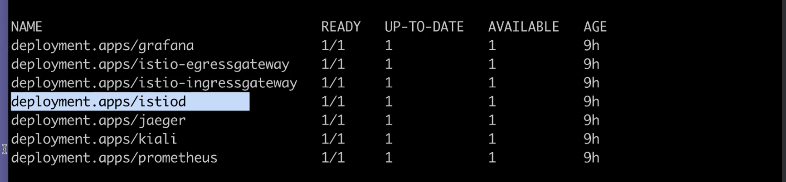

### 安装

#### pod注入Envoy

+ 单个手动注入

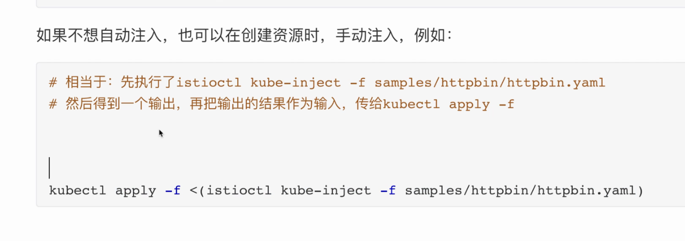

istioctl kube-inject -f  xxx.yaml

istioctl 给指定yaml添加sidecar  (Envoy), 修改自写的yaml文件

kubectl apply -f <(istioctl kube-inject -f user.yaml) -n ns-czw

+ 指定namespace 批量操作添加sidecar

  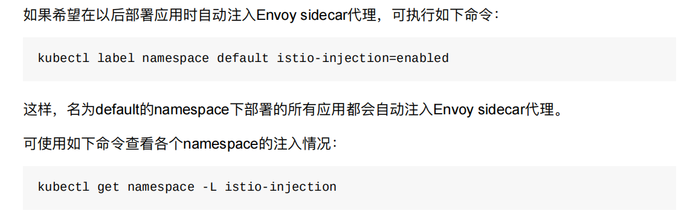

  + 1 

启动时

init 启动时修改iptables 劫持入口与出口流量

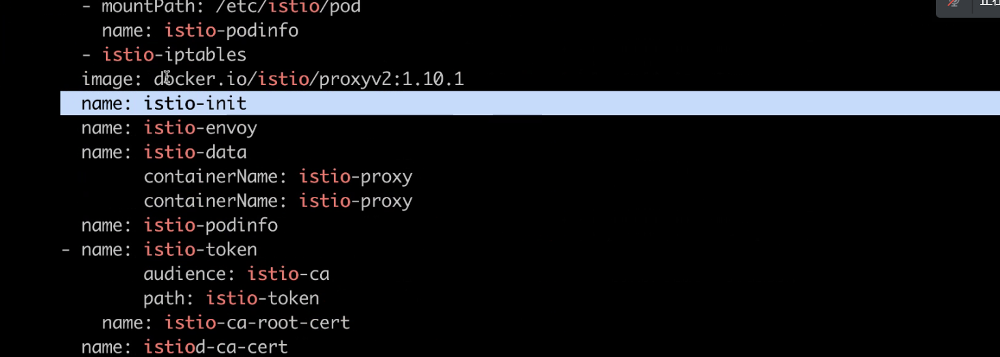

### 案例

VirtualService 配置规则控制流量

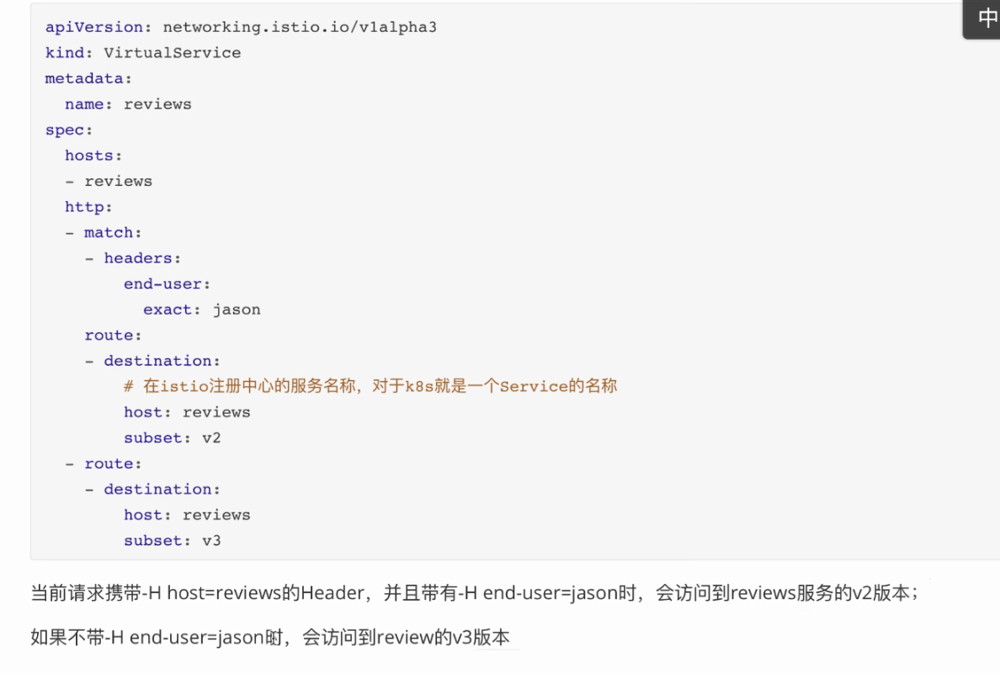

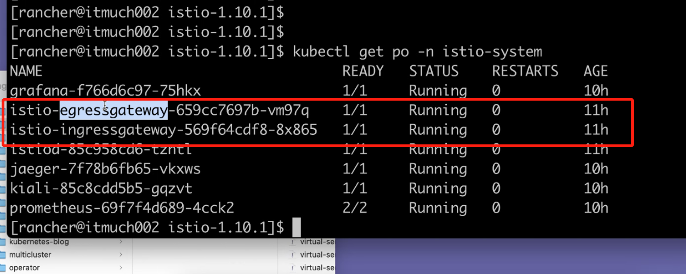

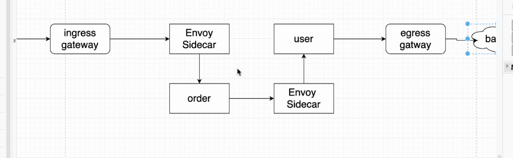

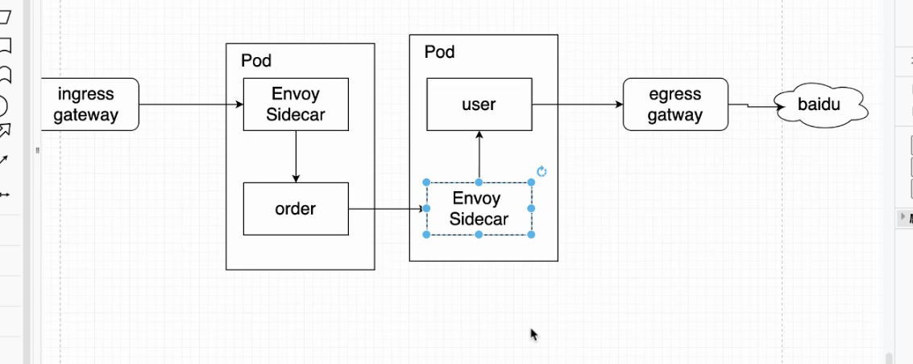

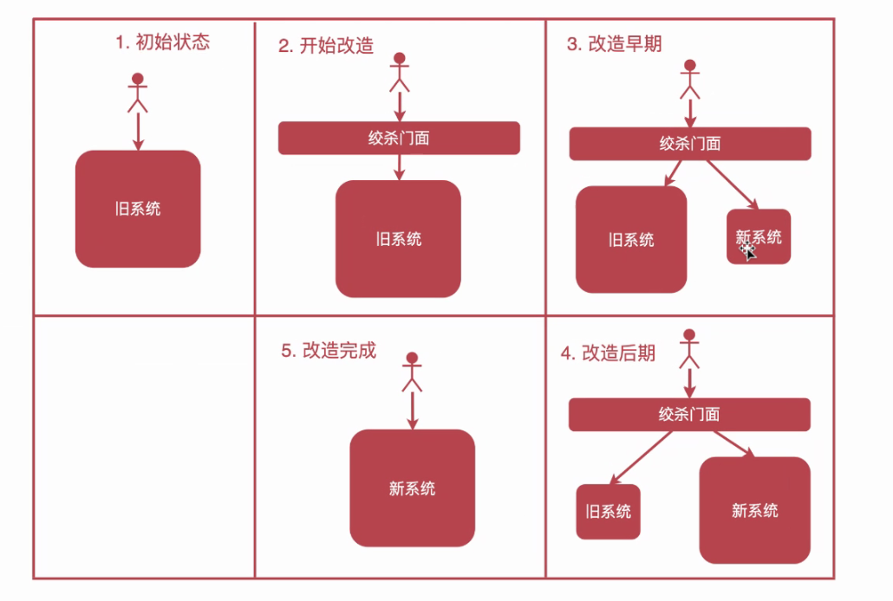