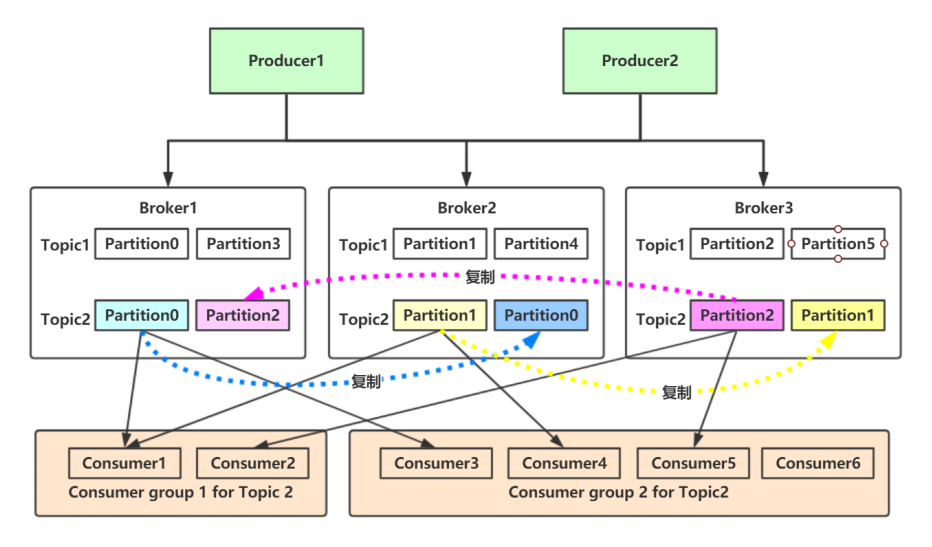
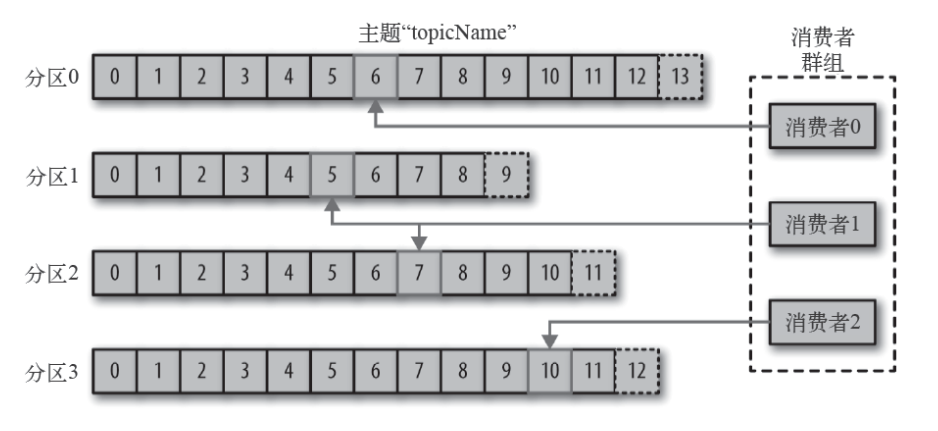
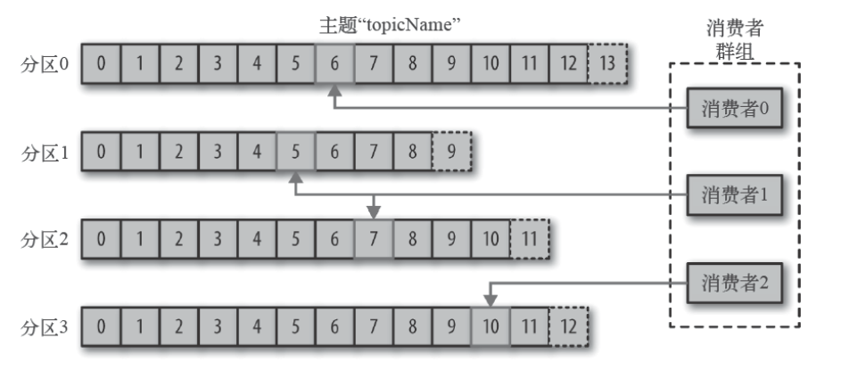
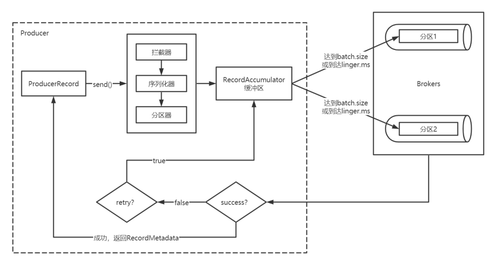
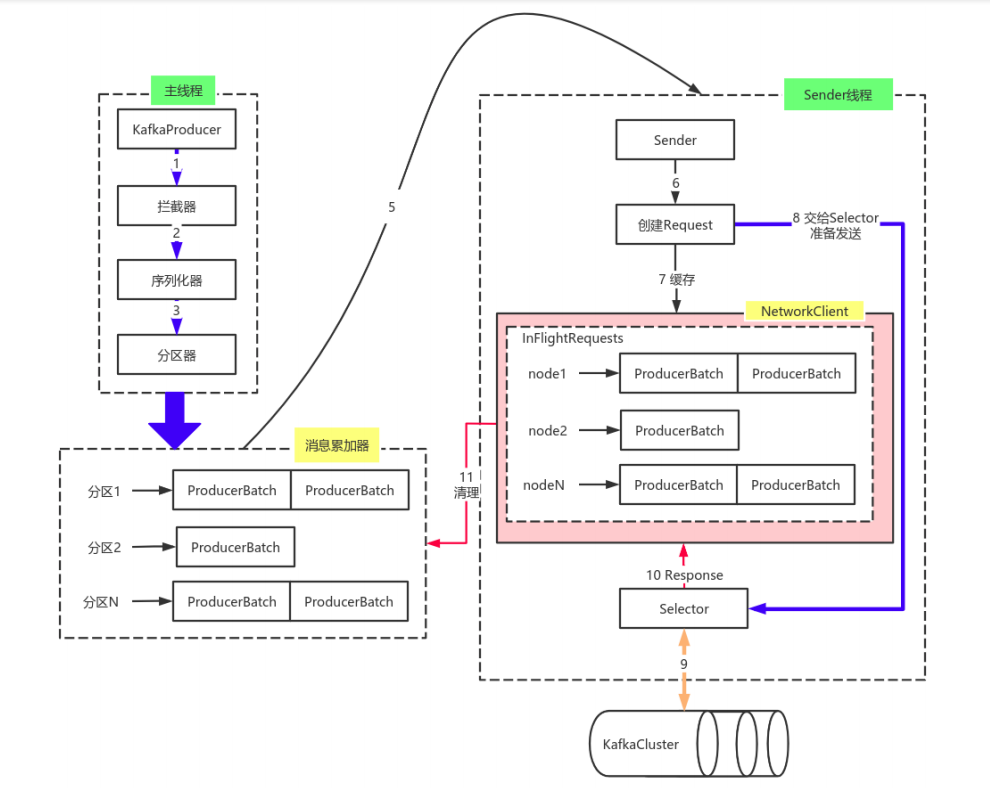
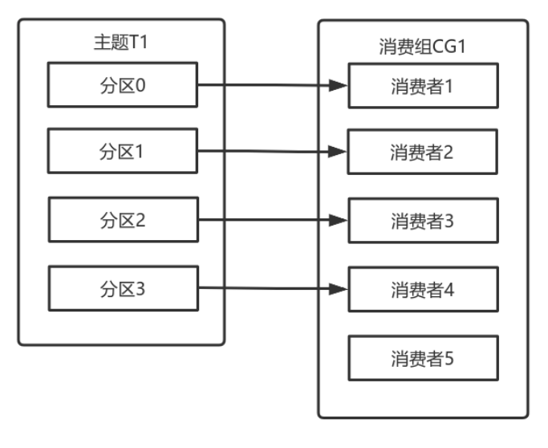
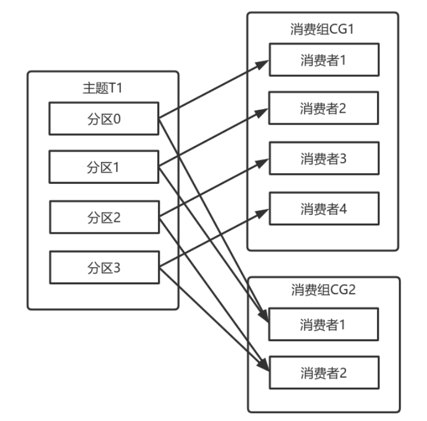

# Kafka

## 架构



### Broker 

**Kafka 的服务器端由被称为 Broker 的服务进程构成，即一个 Kafka 集群由多个 Broker 组成，Broker 负责接收和处理客户端发送过来的请求，以及对消息进行持久化。**虽然多个 Broker 进程能够运行在同一台机器上，但更常见的做法是将不同的 Broker 分散运行在不同的机器上，这样如果集群中某一台机器宕机，即使在它上面运行的所有 Broker 进程都挂掉了，其他机器上的 Broker 也依然能够对外提供服务。这其实就是 Kafka 提供高可用的手段之一。

broker 是集群的组成部分。每个集群都有一个broker 同时充当了集群控制器的角色（自动从集群的活跃成员中选举出来）。控制器负责管理工作，包括将分区分配给broker 和监控broker。


### Topic - 逻辑概念

Kafka 采用发布-订阅模式传递消息；发布订阅的对象是主题（Topic），你可以为每个业务、每个应用甚至是每类数据都创建专属的主题。**实际上为一个逻辑概念**

每条发布到Kafka集群的消息都有一个类别，这个类别被称为Topic。物理上不同Topic的消息分开存储。主题就好比数据库的表，尤其是**分库分表之后的逻辑表**


### Partitioning - 横向扩展能力

**一个主题通过分区分布于Kafka集群中，提供了横向扩展的能力。**

Kafka 中的分区机制指的是将每个主题划分成多个分区（Partition），每个分区是一组有序的消息日志。生产者生产的每条消息只会被发送到一个分区中，也就是说如果向一个双分区的主题发送一条消息，这条消息要么在分区 0 中，要么在分区 1 中。如你所见，Kafka 的分区编号是从 0 开始的，如果 Topic 有 100 个分区，那么它们的分区号就是从 0 到 99。

+ 一个Topic 可实际被分为多个分区，分区均匀的分布在Broker上
+ 一条消息只会写入一个分区中（由生产者控制），**以追加的形式写入；以先入先读的模式读取**
+ 无法在整个主题范围内保证消息的顺序，但可以保证消息在单个分区内的顺序。若对于整个Topic 严格保持消息顺序，topic设置一个分区可以实现；若对于有相同因果关系的消息保持顺序性，这可以设定消息key生产者通过key进行消息划分


### Replication - 备份机制

备份的思想很简单，就是把相同的数据拷贝到多台机器上，而这些相同的数据拷贝在 Kafka 中被称为副本（Replica）。

Kafka 使用主题来组织数据，每个主题被分为若干个分区，每个分区有多个副本。那些副本被保存在broker 上，每个broker 可以保存成百上千个属于不同主题和分区的副本。**基本上某一分区的副本也需要均匀的分布在broker上。**

+ 首领副本 Leader Replica

  为了保证一致性，所有生产者请求和消费者请求都会使用这个副本。领导者副本负责对外提供服务。

+ 追随副本 Follower Replica

  不和外部进行交互，只是对领导者副本的拷贝，它们唯一的任务就是从首领那里复制消息，保持与首领一致的状态。如果首领发生崩溃，其中的一个跟随者会被提升为新首领。


### **Producer - 生产者**

生产者负创建消息 发送到 topic 中，生产者选定一个分区发送消息，一个消息只会存在于一个分区中

+ 默认情况下通过轮询把消息均衡地分布到主题的所有分区上。
+ 生产者指定分区。通过消息键和分区器来实现的，分区器为键生成一个散列值，并将其映射到指定的分区上。这样可以保证包含同一个键的消息会被写到同一个分区上。
+  生产者也可以使用自定义的分区器，根据不同的业务规则将消息映射到分区。



### Consumer - 消费者

消费者负责消费消息

+ Consumer Group。多个消费者实例共同组成的一个组，同时消费多个分区以实现高吞吐。

+ 消费者订阅一个或多个主题，并按照消息生成的顺序读取它们。

+ 消费者是消费组的一部分。消费组保证**每个分区只能被组内的一个消费者使用**，避免重复消费
+ 消费者通过检查消息的**偏移量**来区分已经读取过的消息。偏移量是另一种元数据，它是一个**不断递增的整数值**，在创建消息时，Kafka 会把它添加到消息里。在给定的**分区**里，每个消息的偏移量都是**唯一**的。消费者把每个分区最后读取的消息偏移量保存在Zookeeper 或Kafka上，如果消费者关闭或重启，它的读取状态不会丢失。
+ 如果一个消费者失效，消费组里的其他消费者可以接管失效消费者的工作，再平衡，分区重新分配。



### Offset - 偏移量

每个消息在一个分区内都有一个唯一的偏移量，表示分区中每条消息的位置信息，是一个单调递增且不变的值。

注意区分 **消费者偏移量**：表征消费者消费进度，每个消费者都有自己的消费者位移。


## 分区机制

### 为啥分区

Kafka 中的topic 是承载消息的**逻辑容器**， Kafka 的消息组织方式实际上是三级结构：主题 - 分区 - 消息。消息实际上被保存在分区中。主题下的每条消息只会保存在某一个分区中，而不会在多个分区中被保存多份。分区的作用就是提供负载均衡的能力。实现系统的高伸缩性（Scalability）。

**不同的分区能够被放置到不同节点的机器上，而数据的读写操作也都是针对分区这个粒度而进行的，这样每个节点的机器都能独立地执行各自分区的读写请求处理。**

**利用分区也可以实现其他一些业务级别的需求，比如实现业务级别的消息顺序的问题；**

并且，我们还可以通过添加新的节点机器来增加整体系统的吞吐量。不同的分布式系统对分区的叫法也不尽相同。比如在 Kafka 中叫分区，在 MongoDB 和 Elasticsearch 中就叫分片 Shard，而在 HBase 中则叫 Region，在 Cassandra 中又被称作 vnode。从表面看起来它们实现原理可能不尽相同，但对底层分区（Partitioning）的整体思想却从未改变。


### 生产者选定分区策略

#### 轮询策略

按照一个topic 下拥有的分区进行轮询发送消息， **轮询策略有非常优秀的负载均衡表现，它总是能保证消息最大限度地被平均分配到所有分区上**，故默认情况下它是最合理的分区策略，也是我们最常用的分区策略之一。


#### 随机策略

随机就是我们随意地将消息放置到任意一个分区上。


#### Key值策略

Kafka 允许为每条消息定义消息键，简称为 Key。这个 Key 的作用非常大，它可以是一个有着明确业务含义的字符串，比如客户代码、部门编号或是业务 ID 等；也可以用来表征消息元数据。

通过制定消息的key值，可根据key值得hash分派到分区上


**自定义分区策略**

生产者 编写一个具体的类实现org.apache.kafka.clients.producer.Partitioner接口的实现类，在配置文件中指定

```
# 自定义分区器
spring.kafka.producer.properties.partitioner.class=com.felix.kafka.producer.CustomizePartitioner

```

接口需要实现方法

```

int partition(String topic, Object key, byte[] keyBytes, Object value, byte[] valueBytes, Cluster cluster);
```

这里的topic、key、keyBytes、value和valueBytes都属于消息数据，cluster则是集群信息（比如当前 Kafka 集群共有多少主题、多少 Broker 等）


## 消息

### 压缩与解压缩

Producer 端压缩、Broker 端保持、Consumer 端解压缩。Broker实际上也解压缩验证消息。

+ ztsd 最高的压缩比
+ GZIP
+ Snappy
+  LZ4 最高吞吐量


## 生产者

### 消息流程



+ Producer创建时，会创建一个Sender线程并设置为守护线程。生产者为异步处理消息，需要守护线程真正去发送消息(批次发送消息)

+ 异步流程；生产的消息先经过拦截器->序列化器->分区器，然后将消息缓存在缓冲区（该缓冲区也是Producer创建时创建）

+ 批次发送的条件为：缓冲区数据大小达到batch.size或者linger.ms达到上限，哪个先达到就算哪个。

  为了提高效率，消息被分批写入Kafka。批次就是一组消息，这些消息属于同一个主题和分区。把消息分成批次可以减少网络开销。批次越大，单位时间内处理的消息就越多，单个消息的传输时间就越长。批次数据会被压缩，这样可以提升数据的传输和存储能力，但是需要更多的计算处理。

+ 批次发送后，**发往指定分区**，然后落盘到broker；如果生产者配置了retrires参数大于0，并且失败原因允许重试，那么客户端内部会对该消息进行重试。

+ 落盘到broker成功，返回生产元数据给生产者。元数据返回有两种方式：一种是通过阻塞直接返回 为同步Send ，另一种是通过回调返回 为异步Send


### 拦截器

Producer拦截器（interceptor）和Consumer端Interceptor是在Kafka 0.10版本被引入的，主要用于实现Client端的定制化控制逻辑。

对于Producer而言，Interceptor使得用户在消息发送前以及Producer回调逻辑前有机会对消息做一些定制化需求，比如修改消息等。同时，Producer允许用户指定多个Interceptor按序作用于同一条消息从而形成一个拦截链(interceptor chain)。 

**生产者Intercetpor的实现接口org.apache.kafka.clients.producer.ProducerInterceptor**，其定义的方法包括：

+ onSend(ProducerRecord)：

  该方法封装进KafkaProducer.send方法中，即运行在用户主线程中。Producer**确保在消息被序列化，计算分区前调用该方法**。用户可以在该方法中对消息做任何操作，但最好保证不要修改消息所属的topic和分区，否则会影响目标分区的计算。

+ onAcknowledgement(RecordMetadata, Exception)：

  该方法会在消息被应答之前或消息发送失败时调用（消息确认或异常），并且通常都是在Producer回调逻辑触发之前。onAcknowledgement运行在Producer的IO线程中，因此不要在该方法中放入很重的逻辑，否则会拖慢Producer的消息发送效率。

+ close：关闭Interceptor，主要用于执行一些资源清理工作。

如前所述，Interceptor可能被运行在多个线程中，因此在具体实现时用户需要**自行确保线程安全**。另外倘若指定了多个Interceptor，则Producer将按照指定顺序调用它们，并仅仅是捕获每个Interceptor可能抛出的异常记录到错误日志中而非在向上传递。这在使用过程中要特别留意。

写入Producer 的配置中

```
// 如果有多个拦截器，则设置为多个拦截器类的全限定类名，中间用逗号隔开
configs.put(ProducerConfig.INTERCEPTOR_CLASSES_CONFIG, "com.lagou.kafka.demo.interceptor.InterceptorOne," +
                "com.lagou.kafka.demo.interceptor.InterceptorTwo," +
                "com.lagou.kafka.demo.interceptor.InterceptorThree");

// 拦截器中 可直接获取 configs 设置的值
configs.put("classContent", "this is lagou's kafka class");

KafkaProducer<Integer, String> producer = new KafkaProducer<Integer, String>(configs);
```

自定义拦截器

```
public class InterceptorOne implements ProducerInterceptor<Integer, String> {

    private static final Logger LOGGER = LoggerFactory.getLogger(InterceptorOne.class);

    @Override
    public ProducerRecord<Integer, String> onSend(ProducerRecord<Integer, String> record)     {
        System.out.println("拦截器1 -- go");
        // 消息发送的时候，经过拦截器，调用该方法
    }

    @Override
    public void onAcknowledgement(RecordMetadata metadata, Exception exception) {
        System.out.println("拦截器1 -- back");
        // 消息确认或异常的时候，调用该方法，该方法中不应实现较重的任务
        // 会影响kafka生产者的性能。
    }

    @Override
    public void close() {

    }

    @Override
    public void configure(Map<String, ?> configs) {
        // 可获取 congfig 中的配置
        final Object classContent = configs.get("classContent");
        System.out.println(classContent);
    }
```


注意： **当有多个拦截器形成一条拦截器链时，request 与 response 的顺序是一样的，这和过滤器Filter 是不一致的**

```
拦截器1 -- go
拦截器2 -- go
拦截器3 -- go
拦截器1 -- bac
拦截器2 -- bac
拦截器3 -- bac
```


### 序列化器

由于Kafka中的数据都是字节数组，在将消息发送到Kafka之前需要先将数据序列化为字节数组。

创建生产者时，需要指定key 与 value 的序列化器，目前kafka已提供基础类型的序列化器，若需要自定义消息结构体，着需要自己构造序列化类

```
Map<String, Object> configs = new HashMap<>();
configs.put(ProducerConfig.BOOTSTRAP_SERVERS_CONFIG, "node1:9092");
// key 值  
configs.put(ProducerConfig.KEY_SERIALIZER_CLASS_CONFIG, StringSerializer.class);
// value 设置自定义的序列化器
configs.put(ProducerConfig.VALUE_SERIALIZER_CLASS_CONFIG, UserSerializer.class);

KafkaProducer<String, User> producer = new KafkaProducer<String, User>(configs);
```

继承 org.apache.kafka.common.serialization.Serializer

```
public class UserSerializer implements Serializer<User> {
    @Override
    public void configure(Map<String, ?> configs, boolean isKey) {
        // do nothing
        // 用于接收对序列化器的配置参数，并对当前序列化器进行配置和初始化的
    }

    @Override
    public byte[] serialize(String topic, User data) {
        try {
            if (data == null) {
                return null;
            } else {
                final Integer userId = data.getUserId();
                final String username = data.getUsername();

                if (userId != null) {
                    if (username != null) {
                        final byte[] bytes = username.getBytes("UTF-8");
                        int length = bytes.length;
                        // 第一个4个字节用于存储userId的值
                        // 第二个4个字节用于存储username字节数组的长度int值
                        // 第三个长度，用于存放username序列化之后的字节数组
                        ByteBuffer buffer = ByteBuffer.allocate(4 + 4 + length);
                        // 设置userId
                        buffer.putInt(userId);
                        // 设置username字节数组长度
                        buffer.putInt(length);
                        // 设置username字节数组
                        buffer.put(bytes);
                        // 以字节数组形式返回user对象的值
                        return buffer.array();
                    }
                }
            }
        } catch (Exception e) {
            throw new SerializationException("数据序列化失败");
        }
        return null;
    }

    @Override
    public void close() {
        // do nothing
        // 用于关闭资源等操作。需要幂等，即多次调用，效果是一样的。
    }
}
```


### 分区器

kafka 生产者可自定义分区器，指定分区策略。默认的 DefaultPartitioner）分区计算如下：

+  如果record提供了分区号，则使用record提供的分区号
+ 如果record没有提供分区号，则使用key的序列化后的值的hash值对分区数量取模
+ 如果record没有提供分区号，也没有提供key，则使用轮询的方式分配分区号
  +  会首先在可用的分区中分配分区号
  + 如果没有可用的分区，则在该主题所有分区中分配分区号

自定义分区器 配置指定自定义分区类

```
// 指定自定义的分区器
configs.put(ProducerConfig.PARTITIONER_CLASS_CONFIG, MyPartitioner.class);

KafkaProducer<String, String> producer = new KafkaProducer<String, String>(configs);

// 此处不要设置partition的值
ProducerRecord<String, String> record = new ProducerRecord<String, String>(
                "tp_part_01",
                "mykey",
                "myvalue" );
```

```
public class MyPartitioner implements Partitioner {
    @Override
    public int partition(String topic, Object key, byte[] keyBytes, Object value, byte[] valueBytes, Cluster cluster) {
        // 此处可以计算分区的数字。
        // 我们直接指定为2
        return 2;
    }

    @Override
    public void close() {

    }

    @Override
    public void configure(Map<String, ?> configs) {

    }
}
```


### 生产者流程



KafkaProducer有两个基本线程：

+ 主线程：负责消息创建，拦截器，序列化器，分区器等操作，并将消息追加到消息收集RecoderAccumulator中
  + 消息收集器RecoderAccumulator为**每个分区**都维护了一个Deque<ProducerBatch> 类型的双端队列。用于缓存消息转成批量发送；
  + ProducerBatch 可以理解为是 ProducerRecord 的集合，批量发送有利于提升吞吐量，降低网络影响；
  + 每次追加一条ProducerRecord消息，会寻找/新建对应的双端队列，从其尾部获取一个ProducerBatch，判断当前消息的大小是否可以写入该批次中。若可以写入则写入；若不可以写入，则新建一个ProducerBatch，判断该消息大小是否超过客户端参数配置 batch.size 的值，不超过，则以 batch.size建立新的ProducerBatch，这样方便进行缓存重复利用；若超过，则以计算的消息大小建立对应ProducerBatch ，缺点就是该内存不能被复用了
+ Sender线程：负责发送到 Kafka Cluster
  + 从消息收集器获取缓存的消息，将其处理为 <Node, List<ProducerBatch> 的形式， Node 表示集群的broker节点。即封装为一个request 制定了一个分区+批量数据
  + 程将消息以 Map<NodeId, Deque<Request>> 的形式保存到InFlightRequests 中进行缓存
  + 交给Selector 进行真正的发送
+ 1


### 提交消息

```
        Map<String, Object> configs = new HashMap<>();
        // 指定初始连接用到的broker地址
        configs.put("bootstrap.servers", "192.168.100.101:9092");
        // 指定key的序列化类
        configs.put("key.serializer", IntegerSerializer.class);
        // 指定value的序列化类
        configs.put("value.serializer", StringSerializer.class);
        
        // 消息确认：所有副本
        configs.put("acks", "all");
        configs.put("reties", "3");

        KafkaProducer<Integer, String> producer = new KafkaProducer<Integer, String>(configs);

        // 用于设置用户自定义的消息头字段
        List<Header> headers = new ArrayList<>();
        headers.add(new RecordHeader("biz.name", "producer.demo".getBytes()));

        ProducerRecord<Integer, String> record = new ProducerRecord<Integer, String>(
                "topic_1",
                0,
                0,
                "hello lagou 0",
                headers
        );

        // 消息的同步确认 send 
//        final Future<RecordMetadata> future = producer.send(record);
//        final RecordMetadata metadata = future.get();
//        System.out.println("消息的主题：" + metadata.topic());
//        System.out.println("消息的分区号：" + metadata.partition());
//        System.out.println("消息的偏移量：" + metadata.offset());

        // 消息的异步确认 send callback
        producer.send(record, new Callback() {
            @Override
            public void onCompletion(RecordMetadata metadata, Exception exception) {
                if (exception == null) {
                    System.out.println("消息的主题：" + metadata.topic());
                    System.out.println("消息的分区号：" + metadata.partition());
                    System.out.println("消息的偏移量：" + metadata.offset());
                } else {
                    System.out.println("异常消息：" + exception.getMessage());
                }
            }
        });

        // 关闭生产者
        producer.close();
```


## 消费者

### 消费者组

多个从同一个主题消费的消费者可以加入到一个消费组中，group_id一般设置为应用的逻辑名称。比如多个订单处理程序组成一个消费组，可以设置group_id为"order_process"。通过消费者配置指定所属消费者组；**消费组均衡地给消费者分配分区，每个分区只由消费组中一个消费者消费。若消费者组中数量超过分区，部分消费者就会闲置**



多个消费者组消费同一主题，**只要保证每个应用都有自己的消费组，就可以让它们获取到主题所有的消息**。横向扩展消费者和消费组不会对性能造成负面影响



消费者组可以看做一个利于横向扩展，且具有容错性的一种设计，目前主要的消息模型有两种

+ 点对点模型：一个消息只能被一个消费者消费，**但消息消费后不留存，且多个消费者竞争消息**
+ 发布/订阅： 生产者发布消息到主题，订阅这个主题的所有消费者都可收到该消息

kafka对于点对点模式的设计，一个消费者组内一条消息只能被一个消费者消费，但分区可消除消费者竞争和消费者扩容；

kafka对于订阅模式的设计，多个消费者组消费同一个topic, 对于每个消费者组来讲可以消费topic 所有的消息


### 独立消费者

**consumer 采用 pull 模式从 broker 中读取数据**。采用 pull 模式，consumer 可自主控制消费消息的速率， 可以自己控制消费方式（批量消费/逐条消费)，还可以选择不同的提交方式从而实现不同的传输语义。


独立消费者也要配置 group.id 参数值，但和消费者组调用 KafkaConsumer.subscribe() 不同的是，独立消费者调用 KafkaConsumer.assign() 方法直接消费指定分区。

使用assign的consumer就是standalone consumer，一旦给消费者分配分区之后，就可以和consumer group 一样，在循环中调用‘poll’ 方法获取数据

同一个组下面，但是独立消费者之间互不影响，这也是”独立一词大来源“

**standalone consumer没有rebalance，也没有group提供的负载均衡**，你需要自己实现(但是又分区发现机制)


### 心跳机制

Kafka 的心跳是 Kafka Consumer 和 Broker 之间的健康检查，只有当 Broker Coordinator 正常时，Consumer 才会发送心跳。

Broker Coordinator：协调者，专门为 Consumer Group 服务，每个consumer group都会选择一个 broker 作为自己的coordinator它是负责监控这个消费者组里的各个消费者的心跳，以及判断是否消费者宕机了，如果其中一个消费者判断为宕机，会进行rebalance。

| 参数                 | 字段                              | 备注         |
| -------------------- | --------------------------------- | ------------ |
| session.timeout.ms   | MemberMetadata.sessionTimeoutMs   | 心跳超时时间 |
| max.poll.interval.ms | MemberMetadata.rebalanceTimeoutMs |              |

broker 处理心跳的逻辑在 GroupCoordinator 类中：如果心跳超期， broker coordinator 会把消费者从 group 中移除，并触发 rebalance

consumer 端：如果客户端发现心跳超期，客户端会标记 coordinator 为不可用，并阻塞心跳线程；如果超过了

poll 消息的间隔超过了 rebalanceTimeoutMs，则 consumer 告知 broker 主动离开消费组，也会触发rebalance


### 反序列化

Kafka的broker中所有的消息都是字节数组，消费者获取到消息之后，需要先对消息进行反序列化处理，然后才能交给用户程序消费处理。

可以实现org.apache.kafka.common.serialization.Deserializer<T> 接口反序列化

```
public class UserDeserializer implements Deserializer<User> {
    @Override
    public void configure(Map<String, ?> configs, boolean isKey) {

    }

    @Override
    public User deserialize(String topic, byte[] data) {
        ByteBuffer buffer = ByteBuffer.allocate(data.length);

        buffer.put(data);
        buffer.flip();

        final int userId = buffer.getInt();
        final int usernameLength = buffer.getInt();

        String username = new String(data, 8, usernameLength);

        return new User(userId, username);
    }

    @Override
    public void close() {

    }
}
```


### 位移提交

consumer 需要想 kafka 汇报自身的消费数据-位移；这个汇报过程就是位移提交。

+ Consumer 需要为分配给它的每个分区提交各自的位移数据
+ 位移提交的由Consumer端负责的，Kafka只负责保管。内部主题：__consumer_offsets
+ 位移提交分为自动提交和手动提交，手动提交包含同步提交、异步提交


#### 自动提交

自动提交可能会**重复消费消息**

| 属性                    | 说明                    |      |
| ----------------------- | ----------------------- | ---- |
| enable.auto.commit=true | 开启自动提交            |      |
| auto.commit.interval.ms | 配置自动提交间隔 默认5s |      |

```
Map<String, Object> configs = new HashMap<>(); 
configs.put("bootstrap.servers", "node1:9092"); 
configs.put("group.id", "mygrp"); 

// 设置偏移量自动提交。自动提交是默认值。这里做示例。 
configs.put("enable.auto.commit", "true"); 
// 偏移量自动提交的时间间隔 
configs.put("auto.commit.interval.ms", "3000"); 

configs.put("key.deserializer", StringDeserializer.class); configs.put("value.deserializer", StringDeserializer.class);

KafkaConsumer<String, String> consumer = new KafkaConsumer<String, String> (configs); consumer.subscribe(Collections.singleton("tp_demo_01")); 
while (true) { 
    // 100ms 拉取一次消息
    ConsumerRecords<String, String> records = consumer.poll(100); 
    for (ConsumerRecord<String, String> record : records) { 
         System.out.println(record.topic() + "\t" + record.partition() + "\t" +     record.offset() + "\t" + record.key() + "\t" + record.value()); 
    } 
} 

```

开启自动提交后，Kafka会保证在开始调用poll方法时，提交上次poll返回的所有消息；**因此自动提交不会出现消息丢失，但会 重复消费。**

Consumer 每 5s 提交 offset，假设提交 offset 后的 3s 发生了 Rebalance，Rebalance 之后的所有 Consumer 从上一次提交的 offset 处继续消费，因此 Rebalance 发生前 3s 的消息会被重复消费。


#### 手动提交

##### 同步提交

+ 使用 KafkaConsumer.commitSync()：会提交 KafkaConsumer.poll() 返回的最新 offset
+ 该方法为同步操作，等待直到 offset 被成功提交才返回

```
while (true) { 
   ConsumerRecords<String, String> records = consumer.poll(Duration.ofSeconds(1));          process(records); // 处理消息       
   try {
       // 提交 offset ; 同步操作
       consumer.commitSync(); 
   } catch (CommitFailedException e) { 
       handle(e); // 处理提交失败异常 
   } 
}
```

提交操作，需要注意在处理完所有消息后，再进行提交。调用 commitSync 时，Consumer 处于阻塞状态，直到 Broker 返回结果。


##### 异步提交

+ KafkaConsumer.commitAsync() 进行异步提交
+ 异步提交出现问题后，无法进行重试，一般与同步提交结合起来

```
int cnt = 0
while (true) { 
   ConsumerRecords<String, String> records = consumer.poll(3_000); 
   process(records); // 处理消息 
   consumer.commitAsync((offsets, exception) -> { 
      if (exception != null) { 
         handle(exception); 
      } }); 
   cnt ++;
   if(cnt >= 5){
      // 提交 offset ; 同步操作
      consumer.commitSync(); 
      cnt = 0;
   }
}
```


### 位移管理

消费者的位移由消费者管理，可以存储于zookeeper中，也可以存储于Kafka主题__consumer_offsets中。

```
public class MyOffsetManager {
    public static void main(String[] args) {

        Map<String, Object> configs = new HashMap<>();
        configs.put(ConsumerConfig.BOOTSTRAP_SERVERS_CONFIG, "node1:9092");
        configs.put(ConsumerConfig.KEY_DESERIALIZER_CLASS_CONFIG, StringDeserializer.class);
        configs.put(ConsumerConfig.VALUE_DESERIALIZER_CLASS_CONFIG, StringDeserializer.class);
        // group.id很重要
        configs.put(ConsumerConfig.GROUP_ID_CONFIG, "mygrp1");

        KafkaConsumer<String, String> consumer = new KafkaConsumer<String, String>(configs);
   
        // kafka 自动订阅 ，自动分配分区 懒加载模式 poll 的时候才真正加载     
        // consumer.subscribe(Collections.singleton("tp_demo_01"));

        // 如何手动给消费者分配分区？
        // 1、需要知道有哪些主题可以访问，和消费

        // 获取当前消费者可以访问和消费的主题以及它们的分区信息
//        final Map<String, List<PartitionInfo>> stringListMap = consumer.listTopics();
//
//        stringListMap.forEach(new BiConsumer<String, List<PartitionInfo>>() {
//            @Override
//            public void accept(String topicName, List<PartitionInfo> partitionInfos) {
//                System.out.println("主题名称：" + topicName);
//                for (PartitionInfo partitionInfo : partitionInfos) {
//                    System.out.println(partitionInfo);
//                }
//            }
//        });


        // 给当前消费者分配指定的主题分区
        consumer.assign(Arrays.asList(
                new TopicPartition("tp_demo_01", 0),
                new TopicPartition("tp_demo_01", 1),
                new TopicPartition("tp_demo_01", 2)
        ));

          // 获取给当前消费者分配的主题分区信息
//        final Set<TopicPartition> assignment = consumer.assignment();
//
//        for (TopicPartition partition : assignment) {
//            System.out.println(partition);
//        }

        // 查看当前消费者在指定主题的分区上的消费者偏移量
//        final long offset0 = consumer.position(new TopicPartition("tp_demo_01", 0));
//
//        System.out.println("当前主题在0号分区上的位移：" + offset0);

          // 将主题分区 位移offset 移到开头
//        consumer.seekToBeginning(Arrays.asList(
//                new TopicPartition("tp_demo_01", 0),
//                new TopicPartition("tp_demo_01", 2)
//        ));
        long offset0 = consumer.position(new TopicPartition("tp_demo_01", 0));
        long offset1 = consumer.position(new TopicPartition("tp_demo_01", 1));
        long offset2 = consumer.position(new TopicPartition("tp_demo_01", 2));

        System.out.println(offset0);
        System.out.println(offset1);
        System.out.println(offset2);

        // // 将主题分区 位移offset 移到末尾
//        consumer.seekToEnd(Arrays.asList(new TopicPartition("tp_demo_01", 2)));

        // 将主题分区 位移offset 移动到 指定位置 
        consumer.seek(new TopicPartition("tp_demo_01", 2), 14);

        offset0 = consumer.position(new TopicPartition("tp_demo_01", 0));
        offset1 = consumer.position(new TopicPartition("tp_demo_01", 1));
        offset2 = consumer.position(new TopicPartition("tp_demo_01", 2));

        System.out.println(offset0);
        System.out.println(offset1);
        System.out.println(offset2);

        consumer.close();
    }

}
```


## 配置参数

### 集群配置参数

### 生产者配置参数

| 属性                                  | 说明                                                         | 重要性 |
| ------------------------------------- | ------------------------------------------------------------ | ------ |
| bootstrap.servers                     | 生产者客户端与broker集群建立初始连接需要的broker地址列表，由 该初始连接发现Kafka集群中其他的所有broker。该地址列表不需要 写全部的Kafka集群中broker的地址，但也不要写一个，以防该节点 宕机的时候不可用。形式为：host1:port1,host2:port2,... . | high   |
| buffer.memory                         | 设置生产者内存缓冲区的大小                                   |        |
| key.serializer                        | 实现了接口 org.apache.kafka.common.serialization.Serializer的key序列化类 |        |
| value.serializer                      | 实现了接口 org.apache.kafka.common.serialization.Serializer的value序列化类 |        |
| acks                                  | 该选项控制着已发送消息的持久性。 acks=0：生产者不等待broker的任何消息确认。只要将消息放到了 socket的缓冲区，就认为消息已发送。不能保证服务器是否收到该消 息，retries设置也不起作用，因为客户端不关心消息是否发送失 败。客户端收到的消息偏移量永远是-1。 acks=1：leader将记录写到它本地日志，就响应客户端确认消息， 而不等待follower副本的确认。如果leader确认了消息就宕机，则可 能会丢失消息，因为follower副本可能还没来得及同步该消息。 acks=all：leader等待所有同步的副本确认该消息。保证了只要有 一个同步副本存在，消息就不会丢失。这是最强的可用性保证。等价 于acks=-1。默认值为1，字符串。可选值：[all, -1, 0, 1] |        |
| compression.type                      | 生产者生成数据的压缩格式。默认是none（没有压缩）。允许的 值：none，gzip，snappy和lz4。压缩是对整个消息批次来讲 的。消息批的效率也影响压缩的比例。消息批越大，压缩效率越好。 字符串类型的值。默认是none。 |        |
| retries                               | 设置该属性为一个大于1的值，生产者从服务器收到的错误有可能是临时性的错误。retries 参数的值决定了生产者可以重发消息的次数。允许重试但是不设 置max.in.flight.requests.per.connection为1，**存在消息乱序 的可能**，因为如果两个批次发送到同一个分区，第一个失败了重试， 第二个成功了，则第一个消息批在第二个消息批后。int类型的值，默 认：0，可选值：[0,...,2147483647] |        |
| retry.backoff.ms                      | retries 配置的辅助参数 下一次重试的等待时间，默认： 100ms    |        |
| max.in.flight.requests.per.connection | 该参数指定了生产者在收到服务器响应之前可以发送多少个消息。它的值越高，就会占用越多的内存，不过也会提升吞吐量。把它设为 1 可以保证消息是按照发送的顺序写入服务器的，即使发生了重试。 |        |
| batch.size                            | 当有多个消息需要被发送到同一个分区时，生产者会把它们放在同一个批次里。该参数指定了一个批次可以使用的内存大小，**按照字节数计算（而不是消息个数）**生产者并不一定都会等到批次被填满才发送，半满的批次，甚至只包含一个消息的批次也有可能被发送。 |        |
| linger.ms                             | 该参数指定了生产者在发送批次之前等待更多消息加入批次的时间。**通过设置 size 和 linger 控制批次发送** |        |
| max.block.ms                          | 调用 send() 方法或使用 partitionsFor() 方法获取元数据时生产者的阻塞时间，超时会抛出异常 |        |
| request.timeout.ms                    | 指定了生产者在发送数据时等待服务器返回响应的时间。           |        |
| metadata.fetch.timeout.ms             | 生产者在获取元数据（比如目标分区的首领是谁）时等待服务器返回响应的时间 |        |
| timeout.ms                            | 指定了 broker 等待同步副本返回消息确认的时间，与 asks 的配置相匹配——如果在指定时间内没有收到同步副本的确认，那么 broker 就会返回一个错误。 |        |
|                                       |                                                              |        |
|                                       |                                                              |        |
|                                       |                                                              |        |


### 消费者配置参数

| 属性               | 说明                                                         | 重要性 |
| ------------------ | ------------------------------------------------------------ | ------ |
| bootstrap.servers  | 向Kafka集群建立初始连接用到的host/port列表。                 |        |
| key.deserializer   | key的反序列化类，该类需要实现org.apache.kafka.common.serialization.Deserializer 接口。 |        |
| value.deserializer | value的反序列化类，该类需要实现org.apache.kafka.common.serialization.Deserializer 接口。 |        |
| client.id          | 当从服务器消费消息的时候向服务器发送的id字符串。标明来源，记录日志 |        |
| group.id           | 用于唯一标志当前消费者所属的消费组的字符串。                 |        |
| auto.offset.reset  | 当Kafka中没有初始偏移量或当前偏移量在服务器中不存在（如，数据被删除了），该如何处理？earliest：自动重置偏移量到最早的偏移量；latest：自动重置偏移量为最新的偏移量；none：如果消费组原来的（previous）偏移量不存在，则向消费者抛异常；anything：向消费者抛异常； |        |
| enable.auto.commit | 如果设置为true，消费者会自动周期性地向服务器提交偏移量       |        |
|                    |                                                              |        |
|                    |                                                              |        |
|                    |                                                              |        |
|                    |                                                              |        |
|                    |                                                              |        |
|                    |                                                              |        |
|                    |                                                              |        |
|                    |                                                              |        |
|                    |                                                              |        |
|                    |                                                              |        |

