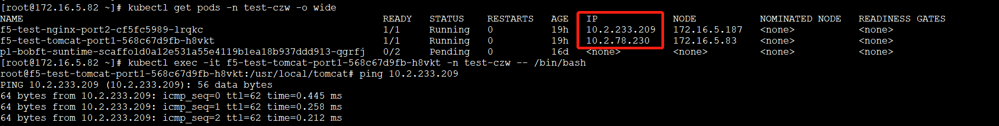
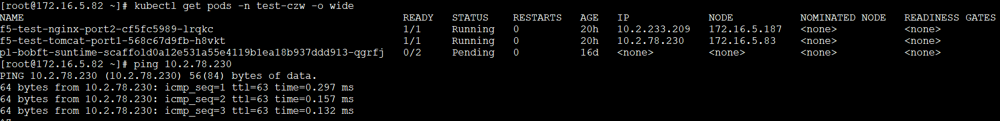
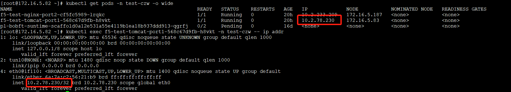

# Kubernetes

## 概念与术语

### 为什么需要kubernetes

Kubernetes 是一个可移植的、可扩展的开源平台，用于管理容器化的工作负载和服务，可促进声明式配置和自动化。 Kubernetes 拥有一个庞大且快速增长的生态系统。Kubernetes 的服务、支持和工具广泛可用。

Kubernetes 为你提供了一个可弹性运行分布式系统的框架。

+ **服务发现和负载均衡**

  Kubernetes 可以使用 DNS 名称或自己的 IP 地址公开容器，如果进入容器的流量很大， Kubernetes 可以负载均衡并分配网络流量，从而使部署稳定。

+ **存储编排**

  Kubernetes 允许你自动挂载你选择的存储系统，例如本地存储、公共云提供商等。

+ **自动部署和回滚**

  你可以使用 Kubernetes 描述已部署容器的所需状态，它可以以受控的速率将实际状态 更改为期望状态。例如，你可以自动化 Kubernetes 来为你的部署创建新容器， 删除现有容器并将它们的所有资源用于新容器。

+ **自动完成装箱计算**

  Kubernetes 允许你指定每个容器所需 CPU 和内存（RAM）。 当容器指定了资源请求时，Kubernetes 可以做出更好的决策来管理容器的资源。

+ **自我修复**

  Kubernetes 重新启动失败的容器、替换容器、杀死不响应用户定义的 运行状况检查的容器，并且在准备好服务之前不将其通告给客户端。

+ **密钥与配置管理**

  Kubernetes 允许你存储和管理敏感信息，例如密码、OAuth 令牌和 ssh 密钥。 你可以在不重建容器镜像的情况下部署和更新密钥和应用程序配置，也无需在堆栈配置中暴露密钥。

+ 

### kuberneters 组件

#### 节点（Node）组件

节点可以是一个虚拟机或者物理机器，取决于所在的集群配置。Kubernetes 通过将容器放入在节点（Node）上运行的 Pod 中来执行你的工作负载。每个节点包含运行 [Pods](https://kubernetes.io/docs/concepts/workloads/pods/pod-overview/) 所需的服务， 这些 Pods 由 [控制面板](https://kubernetes.io/zh/docs/reference/glossary/?all=true#term-control-plane) 负责管理。

##### 节点类型

+ **主节点master**：承载Kuberneters控制管理整个集群的系统的**控制面板**。
+ 工作节点：运行用户实际部署的应用。

##### 工作节点组件

+ [kubelet](https://kubernetes.io/docs/reference/generated/kubelet)

  kubelet 是在每个 Node 节点上运行的 “节点代理”，保证容器运行在Pod中。kubelet 是基于 PodSpec 来工作的。**每个 PodSpec 是一个描述 Pod 的 YAML 或 JSON 对象。** kubelet 接受通过各种机制（主要是通过 apiserver）提供的一组 PodSpec，并确保这些 PodSpec 中描述的容器处于运行状态且运行状况良好。kubelet 不管理不是由 Kubernetes 创建的容器。

  与apiserver 通信、管理所在节点的容器。

+ [容器运行时 container runtime](https://kubernetes.io/zh/docs/setup/production-environment/container-runtimes)

  pod运行在 ‘容器运行时’ 上，如docker

+  [kube-proxy](https://kubernetes.io/zh/docs/reference/command-line-tools-reference/kube-proxy/)

  集群中每个节点上运行的网络代理、负责组件之间的负载均衡网络流量，实现 Kubernetes [服务（Service）](https://kubernetes.io/zh/docs/concepts/services-networking/service/) （服务发现）概念的一部分。**kube-proxy 维护节点上的网络规则**。这些网络规则允许从集群内部或外部的网络会话与 Pod 进行网络通信。

  网络代理反映了每个节点上 Kubernetes API 中定义的服务，并且可以执行简单的 TCP、UDP 和 SCTP 流转发，或者在一组后端进行循环 TCP、UDP 和 SCTP 转发。

+ 1

##### 工作节点注册

+ 节点上的 `kubelet` 向控制面执行自注册；
+ 手动添加一个 Node 对象。

**Kubernetes 会在内部创建一个 Node 对象作为节点的表示**。Kubernetes 检查 `kubelet` 向 API 服务器注册节点时使用的 `metadata.name` 字段是否匹配。 如果节点是健康的（即所有必要的服务都在运行中），则该节点可以用来运行 Pod。 否则，直到该节点变为健康之前，所有的集群活动都会忽略该节点。

##### 工作节点状态

+ 地址 Addresses

  + HostName：由节点的内核设置。可以通过 kubelet 的 `--hostname-override` 参数覆盖。
  + ExternalIP：通常是节点的可外部路由（从集群外可访问）的 IP 地址。
  + InternalIP：通常是节点的仅可在集群内部路由的 IP 地址。

+ 状况 Conditions ：节点状态

  | `Ready`              | 如节点是健康的并已经准备好接收 Pod 则为 `True`；`False` 表示节点不健康而且不能接收 Pod；`Unknown` 表示节点控制器在最近 `node-monitor-grace-period` 期间（默认 40 秒）没有收到节点的消息 |
  | -------------------- | ------------------------------------------------------------ |
  | `DiskPressure`       | `True` 表示节点的空闲空间不足以用于添加新 Pod, 否则为 `False` |
  | `MemoryPressure`     | `True` 表示节点存在内存压力，即节点内存可用量低，否则为 `False` |
  | `PIDPressure`        | `True` 表示节点存在进程压力，即节点上进程过多；否则为 `False` |
  | `NetworkUnavailable` | `True` 表示节点网络配置不正确；否则为 `False`                |

  

+ 容量与可分配

  描述节点上的可用资源：CPU、内存和可以调度到节点上的 Pod 的个数上限。`capacity` 块中的字段标示节点拥有的资源总量。 `allocatable` 块指示节点上可供普通 Pod 消耗的资源量。

+ 信息

  关于节点的一般性信息，例如内核版本、Kubernetes 版本（`kubelet` 和 `kube-proxy` 版本）、 Docker 版本（如果使用了）和操作系统名称。这些信息由 `kubelet` 从节点上搜集而来。

+ 1

##### 心跳机制

Kubernetes 节点发送的心跳（Heartbeats）有助于确定节点的可用性。 心跳有两种形式：`NodeStatus` 和 [`Lease` 对象](https://kubernetes.io/docs/reference/generated/kubernetes-api/v1.21/#lease-v1-coordination-k8s-io)。 每个节点在 `kube-node-lease`[名字空间](https://kubernetes.io/zh/docs/concepts/overview/working-with-objects/namespaces/) 中都有一个与之关联的 `Lease` 对象。 `Lease` 是一种轻量级的资源，可在集群规模扩大时提高节点心跳机制的性能。

##### 节点容量

Node 对象会跟踪节点上资源的容量（例如可用内存和 CPU 数量）。 通过[自注册](https://kubernetes.io/zh/docs/concepts/architecture/nodes/#self-registration-of-nodes)机制生成的 Node 对象会在注册期间报告自身容量。 如果你[手动](https://kubernetes.io/zh/docs/concepts/architecture/nodes/#manual-node-administration)添加了 Node，你就需要在添加节点时 手动设置节点容量。

Kubernetes [调度器](https://kubernetes.io/docs/reference/generated/kube-scheduler/)保证节点上 有足够的资源供其上的所有 Pod 使用。它会检查节点上所有容器的请求的总和不会超过节点的容量。 总的请求包括由 kubelet 启动的所有容器，但不包括由容器运行时直接启动的容器， 也不包括不受 `kubelet` 控制的其他进程。

#### 控制面版（Control Plane Components）

控制面板运行于master节点、控制平面的组件对集群做出全局决策(比如调度)，以及检测和响应集群事件（例如，当不满足部署的 `replicas` 字段时，启动新的 [pod](https://kubernetes.io/docs/concepts/workloads/pods/pod-overview/)）。

注：控制平面组件可以在集群中的任何节点上运行。 然而，为了简单起见，**设置脚本通常会在同一个计算机上启动所有控制平面组件，并且不会在此计算机上运行用户容器。**此节点即为 master节点。

控制面板其中包含如下组件

##### [kube-apiserver](https://kubernetes.io/zh/docs/concepts/overview/components/#kube-apiserver)

API 服务器是 Kubernetes [控制面](https://kubernetes.io/zh/docs/reference/glossary/?all=true#term-control-plane)的组件， 该组件公开了 Kubernetes API。 API 服务器是 Kubernetes 控制面版的通信中心。

api服务器为控制面板的核心， API 服务器负责提供 HTTP API，以供用户、集群中的不同部分和集群外部组件相互通信。Kubernetes API 使你可以查询和操纵 Kubernetes API 中对象（例如：Pod、Namespace、ConfigMap 和 Event）的状态。

##### etcd

etcd 是兼具一致性和高可用性的键值数据库，可以作为保存 Kubernetes 所有集群数据的后台数据库。

##### [kube-scheduler](https://kubernetes.io/zh/docs/concepts/overview/components/#kube-scheduler)

负责监视新创建的、未指定运行[节点（node）](https://kubernetes.io/zh/docs/concepts/architecture/nodes/)的 [Pods](https://kubernetes.io/docs/concepts/workloads/pods/pod-overview/) ，选择节点让 Pod 在上面运行。即监听 apiserver 来获取 PodSpec.NodeName 为空的 pod，然后为每个这样的 pod 创建一个 binding 指示 pod 应该调度到哪个节点上。

调度决策考虑的因素包括单个 Pod 和 Pod 集合的资源需求、硬件/软件/策略约束、亲和性和反亲和性规范、数据位置、工作负载间的干扰和最后时限。

##### kube-controller-manager

Master节点上的控制器组合、控制集群级别的功能。

从逻辑上讲，每个[控制器](https://kubernetes.io/zh/docs/concepts/architecture/controller/)都是一个单独的进程， 但是为了降低复杂性，它们都被编译到同一个可执行文件，并在一个进程中运行。控制器如下：

- 节点控制器（Node Controller）: 负责在节点出现故障时进行通知和响应
- 任务控制器（Job controller）: 监测代表一次性任务的 Job 对象，然后创建 Pods 来运行这些任务直至完成
- 端点控制器（Endpoints Controller）: 填充端点(Endpoints)对象(即加入 Service 与 Pod)
- 服务帐户和令牌控制器（Service Account & Token Controllers）: 为新的命名空间创建默认帐户和 API 访问令牌

##### cloud-controller-manager

云控制器管理器是指嵌入特定云的控制逻辑的 控制平面组件。 云控制器管理器允许您链接聚合到云提供商的应用编程接口中， 并分离出相互作用的组件与您的集群交互的组件。

`cloud-controller-manager` 仅运行特定于云平台的控制回路。 如果你在自己的环境中运行 Kubernetes，或者在本地计算机中运行学习环境， 所部署的环境中不需要云控制器管理器。

#### 集群插件（Addons）

插件使用 Kubernetes 资源（[DaemonSet](https://kubernetes.io/zh/docs/concepts/workloads/controllers/daemonset/)、 [Deployment](https://kubernetes.io/zh/docs/concepts/workloads/controllers/deployment/)等）实现集群功能。 因为这些插件提供集群级别的功能，插件中命名空间域的资源属于 `kube-system` 命名空间。

+ DNS

  几乎所有 Kubernetes 集群都应该 有[集群 DNS](https://kubernetes.io/zh/docs/concepts/services-networking/dns-pod-service/)， 因为很多示例都需要 DNS 服务。集群 DNS 是一个 DNS 服务器，和环境中的其他 DNS 服务器一起工作，它为 Kubernetes 服务提供 DNS 记录。kubernetes启动的容器自动添加集群dns服务器包含在dns搜索列表中。

+ Web界面

  [Dashboard](https://kubernetes.io/zh/docs/tasks/access-application-cluster/web-ui-dashboard/) 是Kubernetes 集群的通用的、基于 Web 的用户界面。 它使用户可以**管理集群**中运行的应用程序以及集群本身并进行故障排除。

+ 容器资源监控

  [容器资源监控](https://kubernetes.io/zh/docs/tasks/debug-application-cluster/resource-usage-monitoring/) 将关于容器的一些常见的时间序列度量值保存到一个集中的数据库中，并提供用于浏览这些数据的界面。

+ 集群层面日志

  [集群层面日志](https://kubernetes.io/zh/docs/concepts/cluster-administration/logging/) 机制负责将容器的日志数据 保存到一个集中的日志存储中，该存储能够提供搜索和浏览接口。

### Kubernetes 对象

在 Kubernetes 系统中，*Kubernetes 对象* 是**持久化的实体**。 Kubernetes 使用这些实体去表示整个集群的状态。特别地，它们描述了如下信息：

- 哪些容器化应用在运行（以及在哪些节点上）
- 可以被应用使用的资源
- 关于应用运行时表现的策略，比如重启策略、升级策略，以及容错策略

Kubernetes 对象是 “目标性记录” —— 一旦创建对象，Kubernetes 系统将持续工作以确保对象存在。 通过创建对象，本质上是在告知 Kubernetes 系统，所需要的集群工作负载看起来是什么样子的， 这就是 Kubernetes 集群的 **期望状态（Desired State）**。

#### 对象规约（Spec）与状态（Status）

几乎每个 Kubernetes 对象包含两个嵌套的对象字段，它们负责管理对象的配置： 对象 *`spec`（规约）* 和 对象 *`status`（状态）* 。 对于具有 `spec` 的对象，你必须在创建对象时设置其内容，描述你希望对象所具有的特征： *期望状态（Desired State）* 。

`status` 描述了对象的 *当前状态（Current State）*，它是由 Kubernetes 系统和组件 设置并更新的。在任何时刻，Kubernetes [控制平面](https://kubernetes.io/zh/docs/reference/glossary/?all=true#term-control-plane) 都一直积极地管理着对象的实际状态，以使之与期望状态相匹配。

Kubernetes 中的 Deployment 对象能够表示运行在集群中的应用。 当创建 Deployment 时，设置 Deployment 的 `spec`，指定该应用需要有 3 个副本运行。 Kubernetes 系统读取 Deployment 规约，并启动我们所期望的应用的 3 个实例 —— **更新状态以与规约相匹配**。 如果这些实例中有的失败了（一种状态变更），Kubernetes 系统通过执行修正操作 来响应规约和状态间的不一致 —— 在这里意味着它会启动一个新的实例来替换。

##### Deployment对象

Deployment对象，顾名思义，是用于部署应用的对象。它使Kubernetes中最常用的一个对象，它为ReplicaSet和Pod的创建提供了一种声明式的定义方法，从而无需手动创建ReplicaSet和Pod对象（使用Deployment而不直接创建ReplicaSet是因为Deployment对象拥有许多ReplicaSet没有的特性，例如滚动升级和回滚）。

#### 对象名称和IDS

集群中的每一个对象都有一个[*名称*](https://kubernetes.io/zh/docs/concepts/overview/working-with-objects/names/#names) 来标识在同类资源中的唯一性。

每个 Kubernetes 对象也有一个[*UID*](https://kubernetes.io/zh/docs/concepts/overview/working-with-objects/names/#uids) 来标识在整个集群中的唯一性。

比如，在同一个[名字空间](https://kubernetes.io/zh/docs/concepts/overview/working-with-objects/namespaces/) 中有一个名为 `myapp-1234` 的 Pod, 但是可以命名一个 Pod 和一个 Deployment 同为 `myapp-1234`.

对于用户提供的非唯一性的属性，Kubernetes 提供了 [标签（Labels）](https://kubernetes.io/zh/docs/concepts/working-with-objects/labels)和 [注解（Annotation）](https://kubernetes.io/zh/docs/concepts/overview/working-with-objects/annotations/)机制。

#### 描述 Kubernetes 对象

创建 Kubernetes 对象时，必须提供对象的规约，用来描述该对象的期望状态， 以及关于对象的一些基本信息（例如名称）。 当使用 Kubernetes API 创建对象时（或者直接创建，或者基于`kubectl`）， API 请求必须在请求体中包含 JSON 格式的信息。 **大多数情况下，需要在 .yaml 文件中为 `kubectl` 提供这些信息**。 `kubectl` 在发起 API 请求时，将这些信息转换成 JSON 格式。

## Kubernetes Operators

### 基础概念

Kubernetes Operator概念是由CoreOS的工程师于2016年提出的，它是在Kubernetes集群上构建和驱动每个应用程序的高级原生方法，需要特定领域的知识。通过与Kubernetes API的密切合作，它提供了一种一致的方法来自动处理所有应用程序操作流程，而无需任何人工响应。换句话说，Operator是打包，运行和管理Kubernetes应用程序的一种方式。

## 存储

### 券

#### emptyDir

当 Pod 分派到某个 Node 上时，`emptyDir` 卷会被创建，node节点上的一目录、pod中的容器共享；并且在 Pod 在该节点上运行期间，卷一直存在。pod可选择挂载或不挂载。

#### hostPath

`hostPath` 卷能将主机节点文件系统上的文件或目录挂载到你的 Pod 中。

- 运行一个需要访问 Docker 内部机制的容器；可使用 `hostPath` 挂载 `/var/lib/docker` 路径。

- 在容器中运行 cAdvisor 时，以 `hostPath` 方式挂载 `/sys`。

- 允许 Pod 指定给定的 `hostPath` 在运行 Pod 之前是否应该存在，是否应该创建以及应该以什么方式存在。

- 具有相同配置（例如基于同一 PodTemplate 创建）的多个 Pod 会由于节点上文件的不同 而在不同节点上有不同的行为。

- 下层主机上创建的文件或目录只能由 root 用户写入。你需要在 [特权容器](https://kubernetes.io/zh/docs/tasks/configure-pod-container/security-context/) 中以 root 身份运行进程，或者修改主机上的文件权限以便容器能够写入 `hostPath` 卷。

  

#### local

`local` 卷所代表的是某个被挂载的本地存储设备，例如磁盘、分区或者目录。

`local` 卷只能用作静态创建的持久卷。尚不支持动态配置。

与 `hostPath` 卷相比，`local` 卷能够以持久和可移植的方式使用，而无需手动将 Pod 调度到节点。系统通过查看 PersistentVolume 的节点亲和性配置，就能了解卷的节点约束。

#### NFS

`nfs` 卷能将 NFS (网络文件系统) 挂载到你的 Pod 中。 不像 `emptyDir` 那样会在删除 Pod 的同时也会被删除，`nfs` 卷的内容在删除 Pod 时会被保存，卷只是被卸载。 这意味着 `nfs` 卷可以被预先填充数据，并且这些数据可以在 Pod 之间共享。

## 网络

### 网络模型

基本原则：每个pod都有一个独立的ip地址，并处于一个扁平的网络空间中，相互可以直接连通。

IP-per-Pod模型：一个pod内部的所有container都共享一个网络堆栈（相当于一个网络命名空间、所有容器的IP地址、网络设备、配置都是共享的），Pod内容器可通过localhost连接相互的port。**pod可认作为一台独立的虚拟机或物理机。**

#### **与Docker 动态端口映射不同**

Docker动态端口映射导致访问者看到的IP与PORT与服务提供者实际绑定的IP与PORT不同（通过NAT映射为新IP与PORT），这会引起应用配置的复杂化，服务注册与发现也会出现问题；外部应用也无法通过容器内的私有ip地址与port进行访问。

#### kubernetes网络模型特点

+ 集群中所有容器都可以不用NAT方式直接和其他容器通信

  

+ 所有节点可以不用NAT方式和所用容器通信

  

+ 容器的地址和外部看到的地址是同一个地址

  

+ 1

