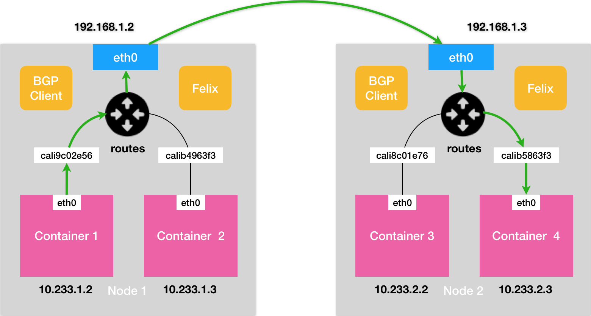

# 深入剖析 Kubernetes

## 基础概念

### 知识点

+ 金丝雀部署：

  优先发布一台或少量机器升级，等验证无误后再更新其他机器。优点是用户影响范围小，不足之处是要额外控制如何做自动更新。

+ 蓝绿部署：

  2组机器，蓝代表当前的V1版本，绿代表已经升级完成的V2版本。通过LB将流量全部导入V2完成升级部署。优点是切换快速，缺点是影响全部用户。

+ 声明式API：一次能处理多个写操作，并且具备 Merge 能力。

  声明式：想要什么；命令式：一步一步执行什么；越接近现实的表达就叫越“声明式”（declarative），越接近计算机的执行过程就叫越“命令式。

+ 1

### 云类型

+ 私有云

  私有云是专为单个组织运营的云基础架构，管理的模式有内部管理，第三方管理，亦或是内部或外部托管。私有云就是通过自建或者租用场地的形式建立服务器机房或者数据中心。服务是面向私有网络或者VPN专有网络。企业拥有对服务器、[数据硬盘](https://www.zhihu.com/search?q=数据硬盘&search_source=Entity&hybrid_search_source=Entity&hybrid_search_extra={"sourceType"%3A"answer"%2C"sourceId"%3A743669668})的完全控制。因此安全性很高。

+ 公有云

  公有云服务面向公开网络暴露，服务可能也是免费的。由于网络对外公布，因此从安全层面上也是大不相同的。常见的公有云有AWS，Microsoft Azure，阿里云等

+ 混合云

  混合云是两个或多个云（私有云，社区云或公共云）的组合，它们保持不同的实体但绑定在一起，提供多个部署模型的好处。 混合云还意味着能够使用云资源连接搭配，托管和/或专用服务。

  

### 云服务提供三种类型

- **IaaS**：基础设施服务，Infrastructure-as-a-service

  用户可以在云服务提供商提供的基础设施上部署和运行任何软件，包括[操作系统](https://www.zhihu.com/search?q=操作系统&search_source=Entity&hybrid_search_source=Entity&hybrid_search_extra={"sourceType"%3A"answer"%2C"sourceId"%3A743669668})和应用软件。用户没有权限管理和访问底层的基础设施，如**服务器、交换机、硬盘**等（不需要自己准备），但是有权管理操作系统、存储内容，可以安装管理应用程序，甚至是有权管理[网络组件](https://www.zhihu.com/search?q=网络组件&search_source=Entity&hybrid_search_source=Entity&hybrid_search_extra={"sourceType"%3A"answer"%2C"sourceId"%3A743669668})。简单的说用户使用IaaS，有权管理操作系统之上的一切功能。我们常见的IaaS服务有虚拟机、虚拟网络、以及存储。

  

- **PaaS**：平台服务，Platform-as-a-service

  PaaS给用户提供的能力是使用由云服务提供商支持的编程语言、库、服务以及开发工具来创建、开发[应用程序](https://www.zhihu.com/search?q=应用程序&search_source=Entity&hybrid_search_source=Entity&hybrid_search_extra={"sourceType"%3A"answer"%2C"sourceId"%3A743669668})并部署在相关的基础设施上。用户无需管理底层的基础设施，包括网络、服务器，操作系统或者存储。他们只能控制部署在基础设施中操作系统上的应用程序，配置应用程序所托管的环境的可配置参数。常见的PaaS服务有数据库服务、web应用以及容器服务。成熟的PaaS服务会简化开发人员，提供完备的PC端和移动端软件开发套件（SDK），拥有丰富的开发环境（Inteli、Eclipse、VS等），完全可托管的数据库服务，可配置式的应用程序构建，支持多语言的开发，**面向应用市场。**

  直接提供应用服务。


- **SaaS**：软件服务，Software-as-a-service

  SaaS给用户提供的能力是使用在云基础架构上运行的云服务提供商的应用程序。可以通过轻量的[客户端接口](https://www.zhihu.com/search?q=客户端接口&search_source=Entity&hybrid_search_source=Entity&hybrid_search_extra={"sourceType"%3A"answer"%2C"sourceId"%3A743669668})（诸如web浏览器（例如，基于web的电子邮件））或程序接口从各种客户端设备访问应用程序。 用户无需管理或控制底层云基础架构，包括网络，服务器，操作系统，存储甚至单独的应用程序功能，可能的例外是有限的用户特定应用程序配置设置。类似的服务有：各类的网盘(Dropbox、[百度网盘](https://www.zhihu.com/search?q=百度网盘&search_source=Entity&hybrid_search_source=Entity&hybrid_search_extra={"sourceType"%3A"answer"%2C"sourceId"%3A743669668})等)，JIRA，GitLab等服务。而这些应用的提供者不仅仅是云服务提供商，还有众多的第三方提供商（ISV: independent software provider）。

  如网盘服务、代码托管 gitlab、邮件服务 mail


## 容器

### 概念

+ 容器

  容器其实是一种沙盒技术。顾名思义，沙盒就是能够像一个集装箱一样，把你的应用“装”起来的技术。这样，应用与应用之间，就因为有了边界而不至于相互干扰；而被装进集装箱的应用，也可以被方便地搬来搬去。

+ 进程

  当编写的代码程序通过编译为二进制文件放在计算机中，一旦“程序”被执行起来，它就从磁盘上的二进制文件，变成了计算机内存中的数据、寄存器里的值、堆栈中的指令、被打开的文件，以及各种设备的状态信息的一个集合。像这样一个程序运行起来后的计算机执行环境的总和，就是我们今天的主角：进程。

+ 容器技术

  对于进程来说，它的静态表现就是程序，平常都安安静静地待在磁盘上；而一旦运行起来，它就变成了计算机里的数据和状态的总和，这就是它的动态表现。

  容器技术的核心功能，就是通过约束和修改进程的动态表现，从而为其创造出一个“边界”。

  Docker 等大多数 Linux 容器来说，**Cgroups 技术是用来制造约束的主要手段，而 Namespace 技术则是用来修改进程视图的主要方法。**

  **容器为一种特殊的进程。**

+  Docker 项目

  它最核心的原理实际上就是为待创建的用户进程

  启用 Linux Namespace 配置；

  设置指定的 Cgroups 参数；

  切换进程的根目录（Change Root）。


### 隔离与限制

+ **Namespace**

Namespace 技术实际上修改了应用进程看待整个计算机“视图”，即它的“视线”被操作系统做了限制，只能“看到”某些指定的内容。但对于宿主机来说，这些被“隔离”了的进程跟其他进程并没有太大区别。

**PID Namespace** ：

其实就是对被隔离应用的进程空间做了手脚，使得这些进程只能看到重新计算过的进程编号，比如 PID=1。可实际上，他们在宿主机的操作系统里，还是原来的第 100 号进程。

用 clone() 系统调用创建一个新进程时，就可以在参数中指定 CLONE_NEWPID 参数;

```
int pid = clone(main_function, stack_size, CLONE_NEWPID | SIGCHLD, NULL); 
```

新创建的这个进程将会“看到”一个全新的进程空间，在这个进程空间里，它的 PID 是 1。之所以说“看到”，是因为这只是一个“障眼法”，在宿主机真实的进程空间里，这个进程的 PID 还是真实的数值，比如 100。

Linux 操作系统还提供了 Mount、UTS、IPC、Network 和 User 这些 Namespace，用来对各种不同的进程上下文进行“障眼法”操作。比如，Mount Namespace，用于让被隔离进程只看到当前 Namespace 里的挂载点信息；Network Namespace，用于让被隔离进程看到当前 Namespace 里的网络设备和配置。

在创建容器进程时，**指定了这个进程所需要启用的一组 Namespace 参数。这样，容器就只能“看”到当前 Namespace 所限定的资源、文件、设备、状态，或者配置。而对于宿主机以及其他不相关的程序，它就完全看不到了。**


+ **Linux Cgroups**

Namespace 将100 号进程表面上被隔离了起来，但是它所能够使用到的资源（比如 CPU、内存），却是可以随时被宿主机上的其他进程（或者其他容器）占用的。当然，这个 100 号进程自己也可能把所有资源吃光。

Linux Cgroups 就是 Linux 内核中用来为进程设置资源限制的一个重要功能。**Linux Cgroups 的全称是 Linux Control Group。它最主要的作用，就是限制一个进程组能够使用的资源上限，包括 CPU、内存、磁盘、网络带宽等等。**

Linux Cgroups 的设计还是比较易用的，简单粗暴地理解呢，它就是一个子系统目录加上一组资源限制文件的组合。而对于 Docker 等 Linux 容器项目来说，它们只需要在每个子系统下面，为每个容器创建一个控制组（即创建一个新目录），然后在启动容器进程之后，把这个进程的 PID 填写到对应控制组的 tasks 文件中就可以了。


### 镜像

Mount Namespace

创建的新进程启用了 Mount Namespace，所以这次重新挂载的操作，只在容器进程的 Mount Namespace 中有效。容器进程启动之前重新挂载它的整个根目录“/”。而由于 Mount Namespace 的存在，这个挂载对宿主机不可见，所以容器进程就可以在里面随便折腾了。

chroot 命令可以帮助你在 shell 中方便地完成这个工作。顾名思义，它的作用就是帮你“change root file system”，即改变进程的根目录到你指定的位置。

为了能够让容器的这个根目录看起来更“真实”，我们一般会在这个容器的根目录下挂载一个完整操作系统的文件系统，比如 Ubuntu16.04 的 ISO。这样，在容器启动之后，我们在容器里通过执行 "ls /" 查看根目录下的内容，就是 Ubuntu 16.04 的所有目录和文件。而这个挂载在容器根目录上、用来为容器进程提供隔离后执行环境的文件系统，就是所谓的“**容器镜像**”。它还有一个更为专业的名字，叫作：rootfs（根文件系统）。

需要明确的是，rootfs 只是一个操作系统所包含的文件、配置和目录，并不包括操作系统内核。在 Linux 操作系统中，这两部分是分开存放的，操作系统只有在开机启动时才会加载指定版本的内核镜像。rootfs 只包括了操作系统的“躯壳”，并没有包括操作系统的“灵魂”。实际上，同一台机器上的所有容器，都共享宿主机操作系统的内核。


Docker 在镜像的设计中，引入了层（layer）的概念。也就是说，用户制作镜像的每一步操作，都会生成一个层，也就是一个增量 rootfs。联合文件系统（Union File System）的能力。


## 容器编码与Kubernetes作业管理


### Pod

#### 概念

逻辑概念，Kubernetes 真正处理的，还是宿主机操作系统上 Linux 容器的 Namespace 和 Cgroups，而并不存在一个所谓的 Pod 的边界或者隔离环境。


Pod 是 Kubernetes 里的原子调度单位。Kubernetes 项目的调度器，是统一按照 Pod 而非容器的资源需求进行计算的。

容器间紧密协作的超亲密关系：互相之间会发生直接的文件交换、使用 localhost 或者 Socket 文件进行本地通信、会发生非常频繁的远程调用、需要共享某些 Linux Namespace（比如，一个容器要加入另一个容器的 Network Namespace）等等。

Pod 里的所有容器，共享的是同一个 Network Namespace，并且可以声明共享同一个 Volume。Pod，其实是一组共享了某些资源的容器。

#### Infra容器

镜像：k8s.gcr.io/pause

Pod 的实现需要使用一个中间容器，这个容器叫作 Infra 容器。在这个 Pod 中，Infra 容器永远都是第一个被创建的容器，而其他用户定义的容器，则通过 Join Network Namespace 的方式，与 Infra 容器关联在一起


#### 作用

对于 Pod 里的容器 A 和容器 B 来说：

+ 它们可以直接使用 localhost 进行通信；
+ 它们看到的网络设备跟 Infra 容器看到的完全一样；
+ 一个 Pod 只有一个 IP 地址，也就是这个 Pod 的 Network Namespace 对应的 IP 地址；当然，其他的所有网络资源，都是一个 Pod 一份，并且被该 Pod 中的所有容器共享；
+ Pod 的生命周期只跟 Infra 容器一致，而与容器 A 和 B 无关。


#### Pod字段

凡是调度、网络、存储，以及安全相关的属性，基本上是 Pod 级别的。

这些属性的共同特征是，它们描述的是“机器”这个整体，而不是里面运行的“程序”。比如，配置这个“机器”的网卡（即：Pod 的网络定义），配置这个“机器”的磁盘（即：Pod 的存储定义），配置这个“机器”的防火墙（即：Pod 的安全定义）。更不用说，这台“机器”运行在哪个服务器之上（即：Pod 的调度）。


#### Pod 状态

pod.status.phase，就是 Pod 的当前状态：

+ Pending。这个状态意味着，Pod 的 YAML 文件已经提交给了 Kubernetes，API 对象已经被创建并保存在 Etcd 当中。但是，这个 Pod 里有些容器因为某种原因而不能被顺利创建。比如，调度不成功。

+ Running。这个状态下，Pod 已经调度成功，跟一个具体的节点绑定。它包含的容器都已经创建成功，并且至少有一个正在运行中。（只有一个容器是run）整个pod就是Running 体现. Pod字段 Ready 标识的正常容器的的个数。
+ Succeeded。这个状态意味着，Pod 里的所有容器都正常运行完毕，并且已经退出了。这种情况在运行一次性任务时最为常见。
+ Failed。这个状态下，Pod 里至少有一个容器以不正常的状态（非 0 的返回码）退出。这个状态的出现，意味着你得想办法 Debug 这个容器的应用，比如查看 Pod 的 Events 和日志。
+ Unknown。这是一个异常状态，意味着 Pod 的状态不能持续地被 kubelet 汇报给 kube-apiserver，这很有可能是主从节点（Master 和 Kubelet）间的通信出现了问题。

Pod 对象的 Status 字段，还可以再细分出一组 Conditions：PodScheduled、Ready、Initialized，以及 Unschedulable。它们主要用于描述造成当前 Status 的具体原因


#### 健康检查与恢复机制

Pod 里的容器定义一个健康检查“探针”（Probe）。**注意探针是容器级别的，pod中的每一个容器都需要各自设置探针**，kubelet 就会根据这个 Probe 的返回值决定这个容器的状态，而不是直接以容器镜像是否运行（来自 Docker 返回的信息）作为依据。这种机制，是生产环境中保证应用健康存活的重要手段。

针对运行中的容器，`kubelet` 可以选择是否执行以下三种探针，以及如何针对探测结果作出反应：

- `livenessProbe`：指示容器是否正在运行。如果存活态探测失败，则 kubelet 会杀死容器， 并且容器将根据其[重启策略](https://kubernetes.io/zh/docs/concepts/workloads/pods/pod-lifecycle/#restart-policy)决定未来。如果容器不提供存活探针， 则默认状态为 `Success`。**重建容器**
- `readinessProbe`：指示容器是否准备好为请求提供服务。如果就绪态探测失败， 端点控制器将从与 Pod 匹配的所有服务的端点列表中删除该 Pod 的 IP 地址。 初始延迟之前的就绪态的状态值默认为 `Failure`。 如果容器不提供就绪态探针，则默认状态为 `Success`。**重启容器**
- `startupProbe`: 指示容器中的应用是否已经启动。如果提供了启动探针，则所有其他探针都会被 禁用，直到此探针成功为止。如果启动探测失败，`kubelet` 将杀死容器，而容器依其 [重启策略](https://kubernetes.io/zh/docs/concepts/workloads/pods/pod-lifecycle/#restart-policy)进行重启。 如果容器没有提供启动探测，则默认状态为 `Success`。

健康探针可以为 

+ exec 执行命令

  ```
  ...
      livenessProbe:
        exec:
          command:
          - cat
          - /tmp/healthy
        initialDelaySeconds: 5
        periodSeconds: 5
  ```

+ httpGet http请求

  ```
  ...
  livenessProbe:
       httpGet:
         path: /healthz
         port: 8080
         httpHeaders:
         - name: X-Custom-Header
           value: Awesome
         initialDelaySeconds: 3
         periodSeconds: 3
  ```

  

+ tcpSocket tcp请求

  ```
      ...
      livenessProbe:
        tcpSocket:
          port: 8080
        initialDelaySeconds: 15
        periodSeconds: 20
  ```

  


##### restartPolicy

**当健康检查不通过时，就进行pod重启**， Kubernetes 里的 Pod 恢复机制，也叫 restartPolicy。它是 Pod 的 Spec 部分的一个标准字段（pod.spec.restartPolicy），默认值是 Always，即：任何时候这个容器发生了异常，它一定会被重新创建。

+ Always：在任何情况下，只要容器不在运行状态，就自动重启容器；
+ OnFailure: 只在容器 异常时才自动重启容器；
+ Never: 从来不重启容器。

注意：Pod 的恢复过程，永远都是发生在当前节点上，而不会跑到别的节点上去。事实上，一旦一个 Pod 与一个节点（Node）绑定，除非这个绑定发生了变化（pod.spec.node 字段被修改），否则它永远都不会离开这个节点。这也就意味着，如果这个宿主机宕机了，这个 Pod 也不会主动迁移到其他节点上去。

**若想让pod重新调度到其他node，则需要 工作负载（Deployment）的控制器。**


### 控制器

Pod 对象，其实就是容器的升级版。它对容器进行了组合，添加了更多的属性和字段。控制器直接操作Pod完成kuberneters 的操作。

Kubernetes 架构有一个叫作 kube-controller-manager 的组件。就是一系列控制器的集合。我们可以查看一下 Kubernetes 项目的 pkg/controller 目录：

```
$ cd kubernetes/pkg/controller/
$ ls -d */              
deployment/             job/                    podautoscaler/          
cloud/                  disruption/             namespace/              
replicaset/             serviceaccount/         volume/
cronjob/                garbagecollector/       nodelifecycle/          replication/            statefulset/            daemon/
...
```

**控制器遵循Kubernetes 项目中的一个通用编排模式：控制循环（control loop）**

```

for {
  实际状态 := 获取集群中对象X的实际状态（Actual State）
  期望状态 := 获取集群中对象X的期望状态（Desired State）
  if 实际状态 == 期望状态{
    什么都不做
  } else {
    执行编排动作，将实际状态调整为期望状态
  }
}
```

+ 实际状态：从kuberneters中获取实际状态
+ 期望状态：一般来自于用户提交的Yaml文件

类似 Deployment 这样的一个控制器，实际上都是由**上半部分的控制器定义（包括期望状态），加上下半部分的被控制对象的模板组成的。**


#### Deployment

Pod 的“水平扩展 / 收缩”（horizontal scaling out/in）； 滚动更新

实际上 Deployment 并不实质控制 pod, 而是通过ReplicaSet 控制，实际上是一种“层层控制”的关系。


##### 水平扩展 / 收缩

Deployment 同样通过“控制器模式”，来修改 ReplicaSet 的控制副本数。**ReplicaSet 负责通过“控制器模式”，保证系统中 Pod 的个数永远等于指定的个数**（比如，3 个）。这也正是 Deployment 只允许容器的 restartPolicy=Always 的主要原因：只有在容器能保证自己始终是 Running 状态的前提下，ReplicaSet 调整 Pod 的个数才有意义。

##### 滚动更新

Deployment 同样通过“控制器模式”，来操作 ReplicaSet 的个数 实现 “滚动更新”。**当pod的模板属性变化时，Deployment 会创建一个新的 ReplicaSet ，逐个替代旧 ReplicaSet 的pod. 将一个集群中正在运行的多个 Pod 版本，交替地逐一升级的过程，就是“滚动更新”。**

**保证服务的连续性**： Deployment Controller 还会确保，在任何时间窗口内，只有指定比例的 Pod 处于离线状态。同时，它也会确保，在任何时间窗口内，只有指定比例的新 Pod 被创建出来。这两个比例的值都是可以配置的，默认都是 DESIRED 值的 25%。


##### 回滚

kubectl rollout undo 命令，就能把整个 Deployment 回滚到上一个版本：

```
$ kubectl rollout undo deployment/nginx-deployment
deployment.extensions/nginx-deployment
```

若要回退更前的版本，我需要使用 kubectl rollout history 命令，查看每次 Deployment 变更对应的版本

```

$ kubectl rollout history deployment/nginx-deployment
deployments "nginx-deployment"
REVISION    CHANGE-CAUSE
1           kubectl create -f nginx-deployment.yaml --record
2           kubectl edit deployment/nginx-deployment
3           kubectl set image deployment/nginx-deployment nginx=nginx:1.91

# 指定版本回退

$ kubectl rollout undo deployment/nginx-deployment --to-revision=2
deployment.extensions/nginx-deployment
```


#### StatefulSet

StatefulSet: **有状态应用**

在分布式场景中，多个实例之间，往往有依赖关系，比如：主从关系、主备关系。或者数据存储类应用，它的多个实例，往往都会在本地磁盘上保存一份数据。而这些实例一旦被杀掉，即便重建出来，实例与数据之间的对应关系也已经丢失，从而导致应用失败。

这种实例之间有不对等关系，以及实例对外部数据有依赖关系的应用，就被称为“有状态应用”（Stateful Application）。	

##### 状态

+ 拓扑状态

  应用的多个实例之间不是完全对等的关系。这些应用实例，**必须按照某些顺序启动**，比如应用的主节点 A 要先于从节点 B 启动。而如果你把 A 和 B 两个 Pod 删除掉，它们再次被创建出来时也必须严格按照这个顺序才行。并且，新创建出来的 Pod，**必须和原来 Pod 的网络标识一样**，这样原先的访问者才能使用同样的方法，访问到这个新 Pod。

+ 存储状态

  **应用的多个实例分别绑定了不同的存储数据。**对于这些应用实例来说，**Pod A 第一次读取到的数据，和隔了十分钟之后再次读取到的数据，应该是同一份，哪怕在此期间 Pod A 被重新创建过。**这种情况最典型的例子，就是一个数据库应用的多个存储实例。

+ 1

**StatefulSet 的核心功能，就是通过某种方式记录这些状态，然后在 Pod 被重新创建时，能够为新 Pod 恢复这些状态。**


##### Headless Service

Service 是 Kubernetes 项目中用来将一组 Pod 暴露给外界访问的一种机制。用户访问Service,就可以访问到某个具体的 Pod。

+ Service VIP

  Virtual IP，即：虚拟 IP；当我访问 10.0.23.1 这个 Service 的 IP 地址时，10.0.23.1 其实就是一个 VIP，它会把请求转发到该 Service 所代理的某一个 Pod 上。

+ Service DNS

  只要我访问“my-svc.my-namespace.svc.cluster.local”这条 DNS 记录，就可以访问到名叫 my-svc 的 Service 所代理的某一个 Pod。

  + Normal Service

    Normal Service，访问“my-svc.my-namespace.svc.cluster.local”解析到的，正是 my-svc 这个 Service 的 VIP，后面的流程就跟 VIP 方式一致了。

  + Headless Service

    访问“my-svc.my-namespace.svc.cluster.local”解析到的，直接就是 my-svc 代理的某一个 Pod 的 IP 地址。可以看到，这里的区别在于，**Headless Service 不需要分配一个 VIP，而是可以直接以 DNS 记录的方式解析出被代理 Pod 的 IP 地址。**

    ```
    
    apiVersion: v1
    kind: Service
    metadata:
      name: nginx
      labels:
        app: nginx
    spec:
      ports:
      - port: 80
        name: web
      clusterIP: None
      selector:
        app: nginx
    ```

    **标准Service模板Yaml. 但 clusterIP 字段的值是：None**

    Headless 所代理的所有 Pod 的 IP 地址，都会被绑定一个这样格式的 DNS 记录。 只要你知道了一个 Pod 的名字，以及它对应的 Service 的名字，你就可以非常确定地通过这条 DNS 记录访问到 Pod 的 IP 地址。

    ```
    <pod-name>.<svc-name>.<namespace>.svc.cluster.local
    ```


##### 创建pod

StatefulSet 给它所管理的所有 Pod 的名字，进行了编号，编号规则是：

```
<statefulset name>-<ordinal index>
```

这些编号都是从 0 开始累加，与 StatefulSet 的每个 Pod 实例一一对应，绝不重复。

更重要的是，这些 Pod 的创建，也是**严格按照编号顺序进行的。比如，在 web-0 进入到 Running 状态、并且细分状态（Conditions）成为 Ready 之前，web-1 会一直处于 Pending 状态。**

Kubernetes 中的StatefulSet 就成功地将 **Pod 的拓扑状态（比如：哪个节点先启动，哪个节点后启动），按照 Pod 的“名字 + 编号”的方式固定了下来。**此外，Kubernetes 还为每一个 Pod 提供了一个固定并且唯一的访问入口，即：这个 Pod 对应的 DNS 记录。

这些状态，**在 StatefulSet 的整个生命周期里都会保持不变，绝不会因为对应 Pod 的删除或者重新创建而失效。需要新建或者删除 Pod 进行“调谐”的时候，它会严格按照这些 Pod 编号的顺序，逐一完成这些操作。**


##### 存储状态

```

apiVersion: apps/v1
kind: StatefulSet
metadata:
  name: web
spec:
  serviceName: "nginx"
  replicas: 2
  selector:
    matchLabels:
      app: nginx
  template:
    metadata:
      labels:
        app: nginx
    spec:
      containers:
      - name: nginx
        image: nginx:1.9.1
        ports:
        - containerPort: 80
          name: web
        volumeMounts:
        - name: www
          mountPath: /usr/share/nginx/html
  volumeClaimTemplates:
  - metadata:
      name: www
    spec:
      accessModes:
      - ReadWriteOnce
      resources:
        requests:
          storage: 1Gi
```

StatefulSet 额外添加了一个 volumeClaimTemplates 字段。被这个 StatefulSet 管理的 Pod，都会声明一个对应的 PVC；而这个 PVC 的定义，就来自于 volumeClaimTemplates 这个模板字段。更重要的是，这个 PVC 的名字，会被分配一个与这个 Pod 完全一致的编号。`<PVC 名字 >-<StatefulSet 名字 >-< 编号 >`

当StatefulSet 控制的pod 删除一个（web-0）后，新的 web-0 Pod 被创建出来之后，Kubernetes 为它查找名叫 www-web-0 的 PVC 时，就会直接找到旧 Pod 遗留下来的同名的 PVC，进而找到跟这个 PVC 绑定在一起的 PV。

**通过这种方式，Kubernetes 的 StatefulSet 就实现了对应用存储状态的管理。**

##### 总结

StatefulSet 的控制器直接管理的是 Pod。StatefulSet 里的不同 Pod 实例，不再像 ReplicaSet 中那样都是完全一样的，而是有了细微区别的。而 StatefulSet 区分这些实例的方式，就是通过在 Pod 的名字里加上事先约定好的编号。

**有了这个编号后，StatefulSet 就使用 Kubernetes 里的两个标准功能：Headless Service 和 PV/PVC，实现了对 Pod 的拓扑状态和存储状态的维护。**


#### DaemonSet

##### 特征

+ 这个 Pod 运行在 Kubernetes 集群里的每一个节点（Node）上；

+ 每个节点上只有一个这样的 Pod 实例；

+ 当有新的节点加入 Kubernetes 集群后，该 Pod 会自动地在新节点上被创建出来；而当旧节点被删除后，它上面的 Pod 也相应地会被回收掉。

适用一些插件：

+ 各种网络插件的 Agent 组件，都必须运行在每一个节点上，用来处理这个节点上的容器网络；

+ 各种存储插件的 Agent 组件，也必须运行在每一个节点上，用来在这个节点上挂载远程存储目录，操作容器的 Volume 目录；

+ 各种监控组件和日志组件，也必须运行在每一个节点上，负责这个节点上的监控信息和日志搜集。


##### DaemonSet Controller

从 Etcd 里获取所有的 Node 列表，然后遍历所有的 Node。这时，它就可以很容易地去检查，当前这个 Node 上是不是有一个携带了key=value 标签的 Pod 在运行。

+ 没有这种 Pod，那么就意味着要在这个 Node 上创建这样一个 Pod；
+ 有这种 Pod，但是数量大于 1，那就说明要把多余的 Pod 从这个 Node 上删除掉；
+ 正好只有一个这种 Pod，那说明这个节点是正常的。


如何在指定的node 上运行一个pod

+ nodeSelector 与 nodeName

```
nodeSelector:
    name: <Node名字>
```

+ nodeAffinity  与 Toleration

  ```
  
  apiVersion: v1
  kind: Pod
  metadata:
    name: with-node-affinity
  spec:
    affinity:
      nodeAffinity:
        requiredDuringSchedulingIgnoredDuringExecution:
          nodeSelectorTerms:
          - matchExpressions:
            - key: metadata.name
              operator: In
              values:
              - node-geektime
  ```

  ```
  
  apiVersion: v1
  kind: Pod
  metadata:
    name: with-toleration
  spec:
    tolerations:
    - key: node.kubernetes.io/unschedulable
      operator: Exists
      effect: NoSchedule
  ```


**节点亲和性**

DaemonSet Controller 会在创建 Pod 的时候，自动在这个 Pod 的 API 对象里，加上这样一个 nodeAffinity 定义。DaemonSet 并不需要修改用户提交的 YAML 文件里的 Pod 模板，而是在向 Kubernetes 发起请求之前，直接修改根据模板生成的 Pod 对象。

- requiredDuringSchedulingIgnoredDuringExecution

  硬需求，*必须*满足的规则与nodeSelector一致

  如果你指定了多个与 `nodeAffinity` 类型关联的 `nodeSelectorTerms`，则 **如果其中一个** `nodeSelectorTerms` 满足的话，pod将可以调度到节点上。

  如果你指定了多个与 `nodeSelectorTerms` 关联的 `matchExpressions`，则 **只有当所有** `matchExpressions` 满足的话，Pod 才会可以调度到节点上。

- preferredDuringSchedulingIgnoredDuringExecution

  调度器将尝试执行但不能保证的*偏好*，如果无法满足，可将pod调度到其他项目中去

  weight 范围是 1-100。 对于每个符合所有调度要求（资源请求、RequiredDuringScheduling 亲和性表达式等） 的节点，调度器将遍历该字段的元素来计算总和，并且如果节点匹配对应的 MatchExpressions，则添加“权重”到总和。 然后将这个评分与该节点的其他优先级函数的评分进行组合。 总分最高的节点是最优选的。

注： IgnoredDuringExecution 意味着已调度到node上后，node运行中发生改变，不再满足于pod的亲和性规则，pod可在该node上继续运行。


**污点与容忍度**

在 Kubernetes 项目中，当一个节点的网络插件尚未安装时，这个节点就会被自动加上名为node.kubernetes.io/network-unavailable的“污点”。而通过这样一个 Toleration，调度器在调度这个 Pod 的时候，就会忽略当前节点上的“污点”，从而成功地将网络插件的 Agent 组件调度到这台机器上启动起来。

[*节点亲和性*](https://kubernetes.io/zh/docs/concepts/scheduling-eviction/assign-pod-node/#affinity-and-anti-affinity) 是 [Pod](https://kubernetes.io/docs/concepts/workloads/pods/pod-overview/) 的一种属性，它使 Pod 被吸引到一类特定的[节点](https://kubernetes.io/zh/docs/concepts/architecture/nodes/) （这可能出于一种偏好，也可能是硬性要求）。 *污点*（Taint）则相反——它使节点能够排斥一类特定的 Pod。

容忍度（Toleration）是应用于 Pod 上的，允许（但并不要求）Pod 调度到带有与之匹配的污点的节点上。

污点和容忍度（Toleration）相互配合，可以用来避免 Pod 被分配到不合适的节点上。 每个节点上都可以应用一个或多个污点，这表示对于那些不能容忍这些污点的 Pod，是不会被该节点接受的。


#### Job 与 CronJob

Kuberneters 中两种作业

+ LRS（Long Running Service）长期运行的业务，如Deployment

+ Batch Jobs  离线业务，按次运行


##### Job

```

apiVersion: batch/v1
kind: Job
metadata:
  name: pi
spec:
  template:
    spec:
      containers:
      - name: pi
        image: resouer/ubuntu-bc 
        command: ["sh", "-c", "echo 'scale=10000; 4*a(1)' | bc -l "]
      restartPolicy: Never
  backoffLimit: 4
```

注：

+ **Job 创建的Pod被自动加上了一个 controller-uid=< 一个随机字符串 > 这样的 Label。而这个 Job 对象本身，则被自动加上了这个 Label 对应的 Selector，从而 保证了 Job 与它所管理的 Pod 之间的匹配关系。**
+ restartPolicy=Never 离线计算的 Pod 永远都不应该被重启，否则它们会再重新计算一遍。
+ 离线作业失败后 Job Controller 就会不断地尝试创建一个新 Pod. backoffLimit 指定了最大尝试次数。


**Job 并行作业**

+ spec.parallelism，它定义的是一个 Job 在任意时间最多可以启动多少个 Pod 同时运行；

+ spec.completions，它定义的是 Job 至少要完成的 Pod 数目，即 Job 的最小完成数。


##### CronJob

```

apiVersion: batch/v1beta1
kind: CronJob
metadata:
  name: hello
spec:
  schedule: "*/1 * * * *"
  jobTemplate:
    spec:
      template:
        spec:
          containers:
          - name: hello
            image: busybox
            args:
            - /bin/sh
            - -c
            - date; echo Hello from the Kubernetes cluster
          restartPolicy: OnFailure
```

+ jobTemplate CronJob 是一个 Job 对象的控制器（Controller）
+ schedule cron表达式 【分钟、小时、日、月、星期】
+  spec.concurrencyPolicy， 当任务为执行完，但下一周期到来的控制策略
  + concurrencyPolicy=Allow，这也是默认情况，这意味着这些 Job 可以同时存在；
  + concurrencyPolicy=Forbid，这意味着不会创建新的 Pod，该创建周期被跳过；
  + concurrencyPolicy=Replace，这意味着新产生的 Job 会替换旧的、没有执行完的 Job。
+ 1

CronJob 创建 Job 失败，spec.startingDeadlineSeconds 字段指定时间窗口，在时间窗口内失败次数到达100次，就停止创建


### RBAC

在 Kubernetes 项目中，负责完成授权（Authorization）工作的机制，就是 RBAC：基于角色的访问控制（Role-Based Access Control）。

+ Role：角色，它其实是一组规则，定义了一组对 Kubernetes API 对象的操作权限。
+ Subject：被作用者，既可以是“人”，也可以是“机器”，也可以是你在 Kubernetes 里定义的“用户”。
+ RoleBinding：定义了“被作用者”和“角色”的绑定关系。


#### Role 与 ClusterRole

namespace 级别，或者是Cluster 级别

```
kind: Role
apiVersion: rbac.authorization.k8s.io/v1
metadata:
  namespace: mynamespace
  name: example-role
rules:
- apiGroups: [""]
  resources: ["pods"]
  verbs: ["get", "watch", "list"]
```

```

kind: ClusterRole
apiVersion: rbac.authorization.k8s.io/v1
metadata:
  name: example-clusterrole
rules:
- apiGroups: [""]
  resources: ["pods"]
  resourceNames: [""] #指定资源名称
  verbs: ["get", "watch", "list"]
```


#### ServiceAccount

```
$ kubectl get sa -n mynamespace -o yaml
- apiVersion: v1
  kind: ServiceAccount
  metadata:
    creationTimestamp: 2018-09-08T12:59:17Z
    name: example-sa
    namespace: mynamespace
    resourceVersion: "409327"
    ...
  secrets:
  - name: example-sa-token-vmfg6
- apiVersion: v1
  kind: ServiceAccount
  metadata:
    creationTimestamp: 2018-09-08T12:59:17Z
    name: example-sa
    namespace: mynamespace
    resourceVersion: "409327"
    ...
  secrets:
  - name: example-sa-token-vmfg6
```

Kubernetes 会为一个 ServiceAccount 自动创建并分配一个 Secret 对象，即：上述 ServiceAcount 定义里最下面的 secrets 字段。这个 Secret，就是这个 ServiceAccount 对应的、用来跟 APIServer 进行交互的授权文件，我们一般称它为：Token。Token 文件的内容一般是证书或者密码，它以一个 Secret 对象的方式保存在 Etcd 当中。

**当pod 引用 ServiceAccount 后，该 ServiceAccount 的 token，也就是一个 Secret 对象，被 Kubernetes 自动挂载到了容器的 /var/run/secrets/kubernetes.io/serviceaccount 目录下。Pod中的容器可以通过此Token访问Kuberneters**

```
    - mountPath: /var/run/secrets/kubernetes.io/serviceaccount
      name: default-token-l65jl
      readOnly: true
```


## 存储

### PV

持久化存储数据卷。这个 API 对象主要定义的是一个持久化存储在宿主机上的目录，比如一个 NFS 的挂载目录。PV 对象是由运维人员事先创建在 Kubernetes 集群里待用的。(静态调用)

```
# 如下 创建nfs PV
apiVersion: v1
kind: PersistentVolume
metadata:
  name: nfs
spec:
  storageClassName: manual
  capacity:
    storage: 1Gi
  accessModes:
    - ReadWriteMany
  nfs:
    server: 10.244.1.4
    path: "/"
```

**注意：pv 创建出来后，在nfs上已经建立了对应的目录了**


### PVC

PVC 描述的，则是 Pod 所希望使用的持久化存储的属性。

pvc 与 pv 绑定需要满足两点

+ PV 和 PVC 的 spec 字段, storage 大小要满足
+ PV 和 PVC 的 storageClassName 字段必须一样 

```

apiVersion: v1
kind: PersistentVolumeClaim
metadata:
  name: nfs
spec:
  accessModes:
    - ReadWriteMany
  storageClassName: manual
  resources:
    requests:
      storage: 1Gi
```


pod 启动时，使用pvc 创建 `持久化` Volume,即宿主机持久化目录。

当一个pod一个 Pod 调度到一个节点上之后，kubelet 就要负责为这个 Pod 创建它的 Volume 目录。默认情况下，kubelet 为 Volume 创建的目录是如下所示的一个宿主机上的路径：

```
/var/lib/kubelet/pods/<Pod的ID>/volumes/kubernetes.io~<Volume类型>/<Volume名字>
```

**kubelet 需要作为 client，将远端 NFS 服务器的目录（比如：“/”目录），挂载到 Volume 的宿主机目录上，即相当于执行如下所示的命令：**

```
$ mount -t nfs <NFS服务器地址>:/ /var/lib/kubelet/pods/<Pod的ID>/volumes/kubernetes.io~<Volume类型>/<Volume名字> 
```

通过这个挂载操作，Volume 的宿主机目录就成为了一个远程 NFS 目录的挂载点，后面你在这个目录里写入的所有文件，都会被保存在远程 NFS 服务器上。所以，我们也就完成了对这个 Volume 宿主机目录的“持久化”。对应地，在删除一个 PV 的时候，Kubernetes 也需要 Unmount。


### StorageClass

Kubernwters 自动创建 PV 的机制，即：Dynamic Provisioning。而 StorageClass 对象的作用，其实就是创建 PV 的模板。

+ PV 的属性。比如，存储类型、Volume 的大小等等
+ 创建这种 PV 需要用到的存储插件。比如，NFS, NAS, Ceph 等等。

用户创建一个PVC找到对应的StorageClass （ PVC 里指定要使用的 StorageClass 名字）,   Kubernetes 就会调用该 StorageClass 声明的存储插件，创建出需要的 PV。

```
apiVersion: storage.k8s.io/v1
kind: StorageClass
metadata:
  name: storageclass-default
provisioner: nfs-provisioner
reclaimPolicy: Delete
volumeBindingMode: Immediate
```

nfs-provisioner : nfs的控制器，可以连接NFS服务器，并创建nfs远程目录

**需要注意的是，StorageClass 并不是专门为了 Dynamic Provisioning 而设计的。**


+ PVC 描述的，是 Pod 想要使用的持久化存储的属性，比如存储的大小、读写权限等。
+ PV 描述的，则是一个具体的 Volume 的属性，比如 Volume 的类型、挂载目录、远程存储服务器地址等。
+ StorageClass 的作用，则是充当 PV 的模板。并且，只有同属于一个 StorageClass 的 PV 和 PVC，才可以绑定在一起。StorageClass 的另一个重要作用，是指定 PV 的 Provisioner（存储插件）。


## 容器网络

### 网络栈

容器能看见的“网络栈”，实际上是被隔离在它自己的 Network Namespace 当中的。网络栈”，就包括了：网卡（Network Interface）、回环设备（Loopback Device）、路由表（Routing Table）和 iptables 规则。对于一个进程来说，这些要素，其实就构成了它发起和响应网络请求的基本环境。

**容器不开启network namespace 实际可以直接使用宿主机的网络栈（–net=host）**


#### 容器独立网络栈

在 Linux 中，能够起到虚拟交换机作用的网络设备，是网桥（Bridge）。它是一个工作在数据链路层（Data Link）的设备，主要功能是根据 MAC 地址学习来将数据包转发到网桥的不同端口（Port）上。

##### Docker 

Docker 项目会默认在宿主机上创建一个名叫 docker0 的网桥，凡是连接在 docker0 网桥上的容器，就可以通过它来进行通信。通过**创建 Veth Pair 设备**， Veth Pair 以两张虚拟网卡（Veth Peer）的形式成对出现的。并且，从其中一个“网卡”发出的数据包，可以直接出现在与它对应的另一张“网卡”上，哪怕这两个“网卡”在不同的 Network Namespace 里。

docker0 扮演二层交换机的角色，当容器veth0网卡发送ARP请求，会直接发送到docker0网桥上，docker0 把 ARP 广播转发到其他被“插”在 docker0 上的虚拟网卡上。这样，同样连接在 docker0 上的目标容器的网络协议栈就会收到这个 ARP 请求，从而将所对应的 MAC 地址回复给请求容器。


注： 在 Docker 的默认配置下，不同宿主机上的容器通过 IP 地址进行互相访问是根本做不到的。


#### 容器跨主机网络

##### UDP模式（已弃用）


Flannel UDP 模式提供的其实是一个三层的 Overlay 网络，

通过Flannel 的 flannel0设备首先对发出端的 IP 包进行 UDP 封装，目的地址为Node2 IP，源地址为 Node1 IP,端口为 flnanel0 设备监控端口。然后在Node2 的 Flannel0 为接收端进行解封装拿到原始的 IP 包，进而把这个 IP 包转发给目标容器。

Flannel 在不同宿主机上的两个容器之间打通了一条“隧道”，使得这两个容器可以直接使用 IP 地址进行通信，而无需关心容器和宿主机的分布情况。


##### VXLAN 模式

VXLAN，即 Virtual Extensible LAN（虚拟可扩展局域网），是 Linux 内核本身就支持的一种网络虚似化技术。所以说，VXLAN 可以完全在内核态实现上述封装和解封装的工作，从而通过与前面相似的“隧道”机制，构建出覆盖网络（Overlay Network）。

**注：与 Flannel UDP的区别，是将核心装换逻辑放入到内核态进行处理**

VXLAN 的覆盖网络的设计思想是：在现有的三层网络之上，“覆盖”一层虚拟的、由**内核 VXLAN 模块负责维护的二层网络（Mac地址层）**，使得连接在这个 VXLAN 二层网络上的“主机”（虚拟机或者容器都可以）之间，可以像在同一个局域网（LAN）里那样自由通信。


每台宿主机上名叫 flannel.1 的设备，就是 VXLAN 所需的 VTEP 设备，它既有 IP 地址，也有 MAC 地址。VTEP设备即为隧道的出入口。 

VTEP 设备之间，就需要想办法组成一个虚拟的二层网络，即：通过二层数据帧进行通信。

+ 当node 加入flannel设备时，node上会加入各个flannel网段对应node ip 的路由信息
+ 通过 ARP 消息根据 “目的 VTEP 设备”的 IP 地址， 获取mac地址

Linux 内核二层封包，添加步骤如下

+ 目的 VTEP 设备”的 MAC 地址、组建 VTEP设备 二层网络，但不可实际联通。称为 ‘内部数据帧’
+ 把“内部数据帧”进一步封装成为宿主机网络里的一个普通的数据帧，好让它“载着”“内部数据帧”，通过宿主机的 eth0 网卡进行传输。
+ Linux 内核会把这个数据帧封装进一个 UDP 包里发出去，flanneld 进程负责维护 mac地址 - 宿主机IP（目的地址）


VXLAN 模式组建的覆盖网络，其实就是一个由不同宿主机上的 VTEP 设备，也就是 flannel.1 设备组成的虚拟二层网络。对于 VTEP 设备来说，它发出的“内部数据帧”就仿佛是一直在这个**虚拟的二层网络上流动**。这，也正是覆盖网络的含义。


### Kuberneters 网络模型 与 网络插件


kuberneters 中的网络模型与 Flannel 项目一致，其使用的是 cni0 网桥，维护了一个单独的网桥来代替 docker0。


#### 网络插件

CNI 的设计思想，就是：Kubernetes 在启动 Infra 容器之后，就可以直接调用 CNI 网络插件，为这个 Infra 容器的 Network Namespace，配置符合预期的网络栈。cni 插件需配置 pod 的网络栈

通过实现 CRI（Container Runtime Interface，容器运行时接口）来完成对CNI的配置。对于 Docker 项目来说，它的 CRI 实现叫作 dockershim，你可以在 kubelet 的代码里找到它。

实现网络方案对应的CNI插件，即配置Infra容器的网络栈，并连到网桥上。整体流程是：

+ kubelet创建Pod

+ 创建Infra容器
+ 调用SetUpPod（）方法，该方法需要为CNI准备参数，然后调用CNI插件（flannel)为Infra配置网络；其中参数来源于1、dockershim设置的一组CNI环境变量；2、dockershim从CNI配置文件里（有flanneld启动后生成，类型为configmap）加载到的、默认插件的配置信息（network configuration)，这里对CNI插件的调用，实际是network configuration进行补充。参数准备好后，调用Flannel CNI
+ 调用CNI bridge（所需参数即为上面：设置的CNI环境变量和补充的network configuation）来执行具体的操作流程。


#### Kuberneters 网络模型

+ 所有容器都可以直接使用 IP 地址与其他容器通信，而无需使用 NAT。
+ 所有宿主机都可以直接使用 IP 地址与所有容器通信，而无需使用 NAT。反之亦然。
+ 容器自己“看到”的自己的 IP 地址，和别人（宿主机或者容器）看到的地址是完全一样的。


### Kuberneters 三层网络模型 - Calico

**纯三层的网络协议，即IP层，通过IP路由互通。**

#### Calico

Calico 项目提供的网络解决方案： **会在每台宿主机上，添加一个格式如下所示的路由规则**

```

<目的容器IP地址段> via <网关的IP地址> dev eth0
```

网关的 IP 地址，正是目的容器所在宿主机的 IP 地址。

**Calico 使用 BGP 来自动地在整个集群中分发路由信息**。BGP 的全称是 Border Gateway Protocol，即：边界网关协议。它是一个 Linux 内核原生就支持的、专门用在大规模数据中心里维护不同的“自治系统”之间路由信息的、无中心的路由协议。

通过BGP协议自动维护整个集群系统内的各个node上的路由表，pod的ip是实时变换的。可以认为，在每个边界网关上都会运行着一个小程序，它们会将各自的路由表信息，通过 TCP 传输给其他的边界网关。而其他边界网关上的这个小程序，则会对收到的这些数据进行分析，然后将需要的信息添加到自己的路由表里。

**BGP，就是在大规模网络中实现节点路由信息共享的一种协议。**	

Calico 组成

+ Calico 的 CNI 插件。这是 Calico 与 Kubernetes 对接的部分。我已经在上一篇文章中，和你详细分享了 CNI 插件的工作原理，这里就不再赘述了。
+ Felix。它是一个 DaemonSet，负责在宿主机上插入路由规则（即：写入 Linux 内核的 FIB 转发信息库），以及维护 Calico 所需的网络设备等工作。
+ BIRD。它就是 BGP 的客户端，专门负责在集群里分发路由规则信息。主动读取felix在host上设置的路由信息，然后通过BGP协议广播出去




Calico 的 CNI 插件会为每个容器设置一个 Veth Pair 设备，然后把其中的一端放置在宿主机上（它的名字以 cali 前缀开头）。由于 Calico 没有使用 CNI 的网桥模式，Calico 的 CNI 插件还需要在宿主机上为每个容器的 Veth Pair 设备配置一条路由规则，用于接收传入的 IP 包。

```
# 发往 10.233.2.3 的 IP 包，应该进入 cali5863f3 设备。
10.233.2.3 dev cali5863f3 scope link
```

容器发出的 IP 包就会经过 Veth Pair 设备出现在宿主机上。然后，宿主机网络栈就会根据路由规则的下一跳 IP 地址。这里最核心的“下一跳”路由规则，就是由 Calico 的 Felix 进程负责维护的。这些路由规则信息，则是通过 BGP Client 也就是 BIRD 组件，使用 BGP 协议传输而来的。BGP消息理解如下（非实际）：

```
[BGP消息]
我是宿主机192.168.1.3
10.233.2.0/24网段的容器都在我这里
这些容器的下一跳地址是我
```

Calico 维护的网络在默认配置下，是一个被称为“Node-to-Node Mesh”的模式。每台宿主机上的 BGP Client 都需要跟其他所有节点的 BGP Client 进行通信以便交换路由信息。这种规模在节点100以下。


#### IPIP模式

上述的模型是集群宿主机之间是二层连通的、若节点之间不连通需要开通 IPIP 模式。

有两台处于不同子网的宿主机 Node 1 和 Node 2，对应的 IP 地址分别是 192.168.1.2 和 192.168.2.2。这两台机器通过路由器实现了三层转发，所以这两个 IP 地址之间是可以相互通信的。


当Clico 添加规则

```
10.233.2.0/16 via 192.168.2.2 eth0
```

上面这条规则里的下一跳地址是 192.168.2.2，可是它对应的 Node 2 跟 Node 1 却根本不在一个子网里，没办法通过二层网络把 IP 包发送到下一跳地址。

网络中处于同一个子网内的主机才能直接互通，不同子网之间是不能直接通信的（但可通过路由器或网关进行）。注意：如10.233.1.2 直接到路由器（192.168.1.x）路由器不认该网段，会直接丢弃。

在 Calico 的 IPIP 模式下，Felix 进程在 Node 1 上添加的路由规则，会稍微不同，如下所示：

```
10.233.2.0/24 via 192.168.2.2 tunl0
```

尽管这条规则的下一跳地址仍然是 Node 2 的 IP 地址，但这一次，要负责将 IP 包发出去的设备，变成了 tunl0。Calico 使用的这个 tunl0 设备，是一个 IP 隧道（IP tunnel）设备。IP 包进入 IP 隧道设备之后，就会被 Linux 内核的 IPIP 驱动接管。IPIP 驱动会将这个 IP 包直接封装在一个宿主机网络的 IP 包中：


原先从容器到 Node 2 的 IP 包，就被伪装成了一个从 Node 1 到 Node 2 的 IP 包。由于宿主机之间已经使用路由器配置了三层转发，也就是设置了宿主机之间的“下一跳”。所以这个 IP 包在离开 Node 1 之后，就可以经过路由器，最终“跳”到 Node 2 上。

**注：  Calico 项目能够让宿主机之间的路由设备（也就是网关），也通过 BGP 协议“学习”。即可通过2次跳转到达目的Container.**


