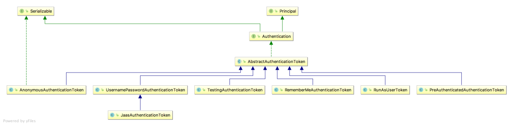

## Spring Security

#### 自定义认证逻辑

+ 自定义过滤器，放置于Security过滤链中
+ 自定义 AuthenticationProvider 替换Security已有逻辑


#### AuthenticationProvider 

```
public interface AuthenticationProvider {
   //authenticate 方法用来做验证，就是验证用户身份。
   Authentication authenticate(Authentication authentication)
   throws AuthenticationException;
   
   //supports 则用来判断当前的 AuthenticationProvider 是否支持对应的 Authentication。
   boolean supports(Class<?> authentication);
}
```


#### Authentication

在 Spring Security 中有一个非常重要的对象叫做 Authentication，我们可以在任何地方注入 Authentication 进而获取到当前登录用户信息，Authentication 本身是一个接口，它实际上对 java.security.Principal 做的进一步封装，我们来看下 Authentication 的定义：

```
public interface Authentication extends Principal, Serializable {
 // getAuthorities 方法用来获取用户的权限。
 Collection<? extends GrantedAuthority> getAuthorities();
 
 // getCredentials 方法用来获取用户凭证，一般来说就是密码。
 Object getCredentials();
 
 // getDetails 方法用来获取用户携带的详细信息，可能是当前请求之类的东西。
 Object getDetails();
 
 // getPrincipal 方法用来获取当前用户，可能是一个用户名，也可能是一个用户对象。认证通过后注入的对象
 Object getPrincipal();
 
 // isAuthenticated 当前用户是否认证成功。
 boolean isAuthenticated();
 void setAuthenticated(boolean isAuthenticated) throws IllegalArgumentException;
}
```

Authentication 作为一个接口，它定义了用户，或者说 Principal 的一些基本行为，它有很多实现类：



最常用的就是 UsernamePasswordAuthenticationToken 了，**而每一个 Authentication 都有适合它的 AuthenticationProvider 去处理校验。**例如处理 UsernamePasswordAuthenticationToken 的 AuthenticationProvider 是 DaoAuthenticationProvider。


#### 自定义AuthenticationProvider 替换DaoAuthenticationProvider


```

public class UserPwdAuthenticationProvider implements AuthenticationProvider {


    @Override
    public Authentication authenticate(Authentication authentication) throws AuthenticationException {
        // 自定义过滤器
        UsernamePasswordAuthenticationToken authenticationToken = (UsernamePasswordAuthenticationToken)authentication;
        String username = String.valueOf(authenticationToken.getPrincipal());
        String password = AES256Util.decrypt(String.valueOf(authenticationToken.getCredentials()));
        // TODO 认证逻辑
     }

    @Override
    public boolean supports(Class<?> authentication) {
        return authentication.equals(UsernamePasswordAuthenticationToken.class);
    }
}

```

构造一个**AuthenticationProvider**  supports **UsernamePasswordAuthenticationToken** ，则authenticate 中的authentication 即为**UsernamePasswordAuthenticationToken**  进行认证逻辑。

由谁调用自定义的 AuthenticationProvider 呢？ 需自定义一个Filter 去调用

