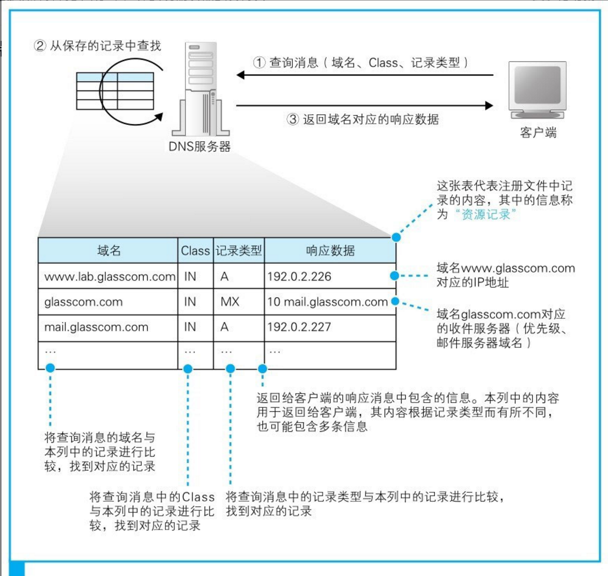

# Network

## 浏览器

### 输入网址-解析URL


协议: 告诉浏览器通信操作规则

+ http/https:
+ ftp:
+ file:

URI 与 URL

+ uri: 统一资源标识符（标识一个唯一资源）
+ url: 统一资源定位符（通过地址标识唯一资源，属于URI的子集）


浏览器生成**http请求头**消息，浏览器不具备发送消息的能力，委托给操作系统


### DNS域名转换IP

操作系统发送http消息是查询网址中服务器域名对应的IP地址。在委托操作系统发送消息时，必须要提供的不是通信对象的域名，而是它的IP地址。因此，在生成HTTP消息之后，下一个步骤就是根据域名查询IP地址。

#### IP的掩码表示法

IP地址是一串32比特的数字，按照8比特（1字节）为一组分成4组，分别用十进制表示然后再用圆点隔开。

其中由网络号与主机号组成


+ 主机号部分全部为0代表整个子网而不是子网中的某台设备
+ 主机号部分全部为1代表向子网上所有设备发送包，即广播

#### 什么是DNS

使用的方案是让人来使用名称，让路由器来使用IP地址。为了填补两者之间的障碍，需要有一个机制能够通过名称来查询IP地址，或者通过IP地址来查询名称，这样就能够在人和机器双方都不做出牺牲的前提下完美地解决问题。这个机制就是DNS。

如果我们不用IP地址而是改用名称会怎么样呢？

IP地址的长度为32比特，也就是4字节，相对地，域名最短也要几十个字节，最长甚至可以达到255字节。换句话说，使用IP地址只需要处理4字节的数字，而域名则需要处理几十个到255个字节的字符，这增加了路由器的负担，传送数据也会花费更长的时间

#### Socket库提供查询DNS入口

查询ip 需要向最近的DNS服务器查询、我们的计算机上一定有相应的DNS客户端，而相当于DNS客户端的部分称为DNS解析器，或者简称解析器。通过DNS查询IP地址的操作称为域名解析。

解析器实际上是一段程序，它包含在操作系统的Socket库中，

Socket库也是一种库，其中包含的程序组件可以让其他的应用程序调用操作系统的网络功能，Linux Socket 函数库是从Berkeley大学开发的BSD Linux系统中移植过来的。BSD Socket 接口在众多Unix系统中被广泛支持TCP/IP通信接口。而解析器就是这个库中的其中一种程序组件。

**注意：向发送DNS发送消息是委托给操作系统的`协议栈`来发送的。**服务器中的DNS地址是预先设置好的。


### DNS服务大接力

#### DNS服务器返回查询结果




+ 域名：服务器、邮件服务器（邮件地址中@后面的部分）的名称

+ Class

  在最早设计DNS方案时，DNS在互联网以外的其他网络中的应用也被考虑到了，而Class就是用来识别网络的信息。不过，如今除了互联网并没有其他的网络了，因此Class的值永远是代表互联网的IN

+ 记录类型

  当类型为A时，表示域名对应的是IP地址；当类型为MX时，表示域名对应的是邮件服务器。对于不同的记录类型，服务器向客户端返回的信息也会不同


#### 域名层次结构分层DNS服务器


#### 查找接力


注：DNS服务器有一个缓存[插图]功能，可以记住之前查询过的域名。如果要查询的域名和相关信息已经在缓存中，那么就可以直接返回响应。


### 委托协议栈发送消息

知道了IP地址之后，就可以委托操作系统内部的协议栈向这个目标IP地址，也就是我们要访问的Web服务器发送消息了。要发送给Web服务器的HTTP消息是一种数字信息（digital data）。

向操作系统内部的协议栈发出委托时，需要按照指定的顺序来调用Socket库中的程序组件。简单来说，收发数据的两台计算机之间连接了一条数据通道，数据沿着这条通道流动，最终到达目的地。两套接字之间的管道。


#### 管道

运营管道需要经历四个阶段：（1）创建套接字（创建套接字阶段）、（2）将管道连接到服务器端的套接字上（连接阶段）、（3）收发数据（通信阶段）、（4）断开管道并删除套接字（断开阶段）。


##### 创建套接字（创建套接字阶段）

客户端创建套接字的操作非常简单，只要调用Socket库中的socket程序组件[插图]就可以了。套接字创建完成后，协议栈会返回一个描述符，应用程序会将收到的描述符存放在内存中。描述符是用来识别不同的套接字的。


##### 将管道连接到服务器端的套接字上（连接阶段）

需要委托协议栈将客户端创建的套接字与服务器那边的套接字连接起来。应用程序通过调用Socket库中的名为connect的程序组件来完成这一操作。这里的要点是当调用connect时，需要指定描述符、服务器IP地址和端口号这3个参数。

+ 描述符：connect会将应用程序指定的描述符告知协议栈，然后协议栈根据这个描述符来判断到底使用哪一个套接字去和服务器端的套接字进行连接
+ ip: 通过DNS服务器查询得到的我们要访问的服务器的IP地址
+ port：知道了IP地址，我们就可以识别出网络上的某台计算机。但是，连接操作的对象是某个具体的套接字，因此必须要识别到具体的套接字才行。同时指定IP地址和端口号时，就可以明确识别出某台具体的计算机上的某个具体的套接字。


##### 收发数据（通信阶段）

只要将数据送入套接字，数据就会被发送到对方的套接字中。当然，应用程序无法直接控制套接字，因此还是要通过Socket库委托协议栈来完成这个操作。这个操作需要使用write这个程序组件。应用程序需要在内存中准备好要发送的数据、由于套接字中已经保存了已连接的通信对象的相关信息，所以只要通过描述符指定套接字，就可以识别出通信对象，并向其发送数据。接着，发送数据会通过网络到达我们要访问的服务器。

接收消息的操作是通过Socket库中的read程序组件委托协议栈来完成的。调用read时需要指定用于存放接收到的响应消息的内存地址，这一内存地址称为接收缓冲区。于是，当服务器返回响应消息时，read就会负责将接收到的响应消息存放到接收缓冲区中。由于**接收缓冲区是一块位于应用程序内部的内存空间，因此当消息被存放到接收缓冲区中时，就相当于已经转交给了应用程序。**


##### 断开管道并删除套接字（断开阶段）

调用Socket库的close程序组件进入断开阶段。最终，连接在套接字之间的管道会被断开，套接字本身也会被删除。


## 协议栈与网卡

### 协议栈

网络控制软件（协议栈）

协议栈的上半部分有两块，分别是负责用`TCP`协议收发数据的部分和负责用`UDP`协议收发数据的部分，它们会接受应用程序的委托执行收发数据的操作。（像浏览器、邮件等一般的应用程序都是使用TCP收发数据的，而像DNS查询等收发较短的控制数据的时候则使用UDP。）

下面一半是用IP协议控制网络包收发操作的部分。在互联网上传送数据时，数据会被切分成一个一个的网络包[插图]，而将网络包发送给通信对象的操作就是由IP来负责的。此外，IP中还包括ICMP[插图]协议和ARP[插图]协议。ICMP用于告知网络包传送过程中产生的错误以及各种控制消息，ARP用于根据IP地址查询相应的以太网MAC地址。

IP下面的网卡驱动程序负责控制网卡硬件,则负责完成实际的收发操作，也就是对网线中的信号执行发送和接收的操作。


### TCP的收发操作

#### 创建套接字

##### 套接字是什么

在协议栈内部有一块用于存放控制信息的内存空间，这里记录了用于控制通信操作的控制信息（ip,port,状态），套接字是一个概念，我们可以说这些**控制信息就是套接字的实体，或者说存放控制信息的内存空间就是套接字的实体。**

##### 套接字作用

协议栈是根据套接字中记录的控制信息来工作的。套接字中记录了用于控制通信操作的各种控制信息，协议栈则需要根据这些信息判断下一步的行动。信息如 通信对象的IP与端口、发送数据是否收到响应，多长时间


##### 创建套接字

应用程序调用socket申请创建套接字，协议栈根据应用程序的申请执行创建套接字的操作。

创建套接字时，首先分配一个套接字所需的内存空间，然后向其中写入初始状态。

```
描述符 = new socket(ipv4、port)
```

描述符相当于用来区分协议栈中的多个套接字的号码牌、协议栈通过描述符可确定套接字，进而知道通信信息。

#### 连接

##### 连接的作用

创建套接字后、会调用connect。协议栈会将本地的套接字与服务器的套接字进行连接、**连接实际上是通信双方交换控制信息，在套接字中记录这些必要信息并准备数据收发的一连串操作。**

+ 客户端获取到服务端IP与PORT
+ 服务端获取到客户端IP与PORT
+ 创建收发数据缓冲区

负责保存控制信息的头部，控制信息分为两类

+ 客户端和服务器相互联络时交换的控制信息、在整个通信过程中都需要、TCP规格中定义的控制信息。这些信息会被添加在客户端与服务器之间传递的网络包的开头。
+ 保存在套接字中，用来控制协议栈操作的信息、协议栈具体需要哪些信息”会根据协议栈本身的实现方式不同而不同。


##### 连接的实际操作 


三次握手

+ 客户端先创建一个包含表示开始数据收发操作的控制信息的头部。syn标志比特位设置为1（标识开始连接）、设置适当的**初始序号**（随机x）和窗口大小。

  包创建好后、委托IP模块发送到服务器端、根据TCP头中的IP、Port 找到服务端套接字

+ 服务端套接字收到连接时，将套接字中会写入相应的信息，并将状态改为正在连接。返回响应：ACK控制位设为1，ack=x+1, 设置服务端的**初始序号**（随机y）。

  响应包建好后。通过IP模块发送出去

+ 网络包就会返回到客户端，通过IP模块到达TCP模块，并通过TCP头部的信息确认连接服务器的操作是否成功。如果SYN为1则表示连接成功，这时会向套接字中写入服务器的IP地址、端口号等信息，同时还会将状态改为连接完毕。客户端也需要将ACK比特设置为1并发回服务器，告诉服务器刚才的响应包已经收到。当这个服务器收到这个返回包之后，连接操作才算全部完成。


#### 收发数据

当连接完成后，进入数据收发阶段了。数据收发操作是从应用程序调用write将要发送的数据交给协议栈开始的。

##### 网络包

协议栈并不是一收到数据就马上发送出去，而是会将数据存放在内部的发送缓冲区中，并等待应用程序的下一段数据。（避免发送过多小包）。通过以下两个要素决定是否发送网络包

+ 包大小

  + MTU：一个网络包的最大长度，以太网中一般为1500字节。
  + MSS：除去头部之后，一个网络包所能容纳的TCP数据的最大长度。

  当从应用程序收到的数据长度超过或者接近MSS时再发送出去，就可以避免发送大量小包的问题了。

+ 时间

  包大小不满足时，也不能等待时间过长。协议栈的内部有一个计时器，当经过一定时间之后，就会把网络包发送出去。


当数据过大时，需要拆分为多个网络包


##### 网络包ACK

TCP模块在拆分数据时，会先算好每一块数据相当于从头开始的第几个字节，接下来在发送这一块数据时，将算好的字节数写在TCP头部 `序号` 中。

TCP具备确认对方是否成功收到网络包，以及当对方没收到时进行重发的功能，因此在发送网络包之后，接下来还需要进行确认操作。


注： 初始序号是个随机值（不一定是1）、在连接时相互约定好初始值。

TCP数据收发是双向的，在客户端向服务器发送数据的同时，服务器也会向客户端发送数据。


##### 网络包重发

TCP采用这样的方式确认对方是否收到了数据，在得到对方确认之前，发送过的包都会保存在发送缓冲区中。如果对方没有返回某些包对应的ACK号，那么就重新发送这些包。

##### ACK等待时间

当网络传输繁忙时就会发生拥塞，ACK号的返回会变慢，这时我们就必须将等待时间设置得稍微长一点，否则可能会发生已经重传了包之后，前面的ACK号才姗姗来迟的情况。如果等待时间过长，那么包的重传就会出现很大的延迟，也会导致网络速度变慢。

**TCP采用了动态调整等待时间的方法，这个等待时间是根据ACK号返回所需的时间来判断的**。具体来说，TCP会在发送数据的过程中持续测量ACK号的返回时间，如果ACK号返回变慢，则相应延长等待时间；相对地，如果ACK号马上就能返回，则相应缩短等待时间。

##### 滑动窗口

滑动窗口，就是在发送一个包之后，不等待ACK号返回，而是直接发送后续的一系列包。这样一来，等待ACK号的这段时间就被有效利用起来了。


**滑动窗口大小避免接收方缓冲区溢出**

接收方将数据暂存到接收缓冲区中并执行接收操作。当接收操作完成后，接收缓冲区中的空间会被释放出来，也就可以接收更多的数据了，这时接收方会通过TCP头部中的窗口字段将自己能接收的数据量告知发送方。这样一来，发送方就不会发送过多的数据，导致超出接收方的处理能力了。

##### ACK与窗口合并

当需要连续发送多个ACK号时，也可以减少包的数量，这是因为ACK号表示的是已收到的数据量，只要发送最后一个ACK号就可以了，中间的可以全部省略。

当需要连续发送多个窗口更新时也可以减少包的数量，因为连续发生窗口更新说明应用程序连续请求了数据，接收缓冲区的剩余空间连续增加。这种情况和ACK号一样，可以省略中间过程，只要发送最终的结果就可以了。


#### 断开连接删除套接字

##### 断开连接

数据发送完毕的一方会发起断开过程、TCP允许双端都可以主动发起Close信号。

四次挥手


若服务端发起断开操作：服务器的协议栈会生成包含断开信息的TCP头部，具体来说就是将控制位中的FIN比特设为1。当客户端收到服务器发来的FIN为1的TCP头部时，客户端的协议栈会将自己的套接字标记为进入断开操作状态。然后客户端会向服务器返回一个ACK号。

**应用程序就会调用read来读取数据。这时，协议栈不会向应用程序传递数据，而是会告知应用程序（浏览器）来自服务器的数据已经全部收到了。**这时客户端会发起一个FIN信号关闭连接。一段时间之后，服务器就会返回ACK号，然后连接关闭

##### 删除套接字

连接关闭后，套接字并不会立即被删除，而是会等待一段时间之后再被删除。等待这段时间是为了防止误操作，如最后一个ACK丢失，要留给包重传的时间。


#### IP与以太网包收发操作

