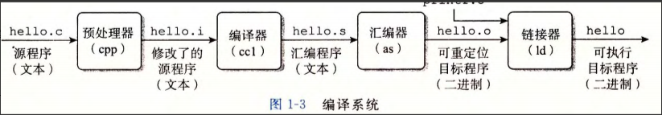
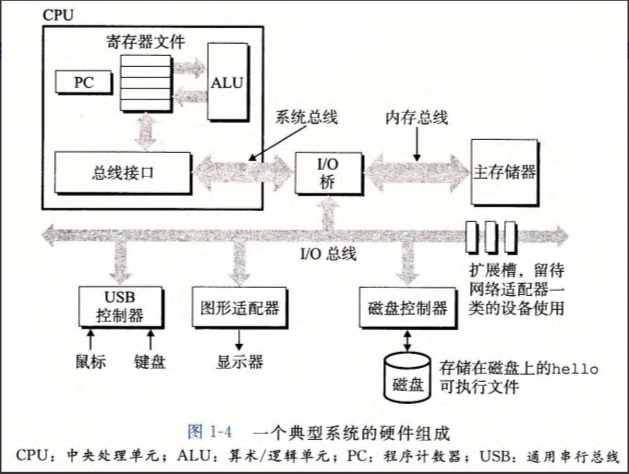

# 深入理解计算机系统

## 基础知识点汇总

### 概述

**1、计算机中的信息是什么**

系统中的所有信息（磁盘文件，内存程序，用户数据，网络传输数据）等，全是有一串比特表示的（0,1二进制） 。区分不同的数据对象的唯一方法是读取这些数据对象时的上下文。

**2、c语言编译为可执行目标文件的步骤**

+ 预处理阶段

  预处理器（cpp）根据以字符#开头的命令，修改原始的C程序，主要是将读取的系统头文件stdio.h中的内容插入到程序文本中。所得的另一个C程序以.i作为文件扩展名

+ 编译阶段

  编译器（cll）将hello.i程序翻译为汇编语言，翻译后的文件以.s作为文件扩展名。这里只放出main函数的汇编语言：汇编语言为不同的高级语言的不同编译器提供了通用的输出语言

+ 汇编阶段

  汇编器（as）将hello.s程序翻译为机器语言指令，并将其打包成**可重定位目标程序**的格式，并将结果保存在hello.o中。这是一个二进制文件

+ 链接阶段

  因为hello程序中调用了printf函数，这是标准C语言库中的一个函数，存在与一个名为printf.o的单独的预编译好了的文件中。为了调用此函数，就必须将这个文件以某种方式合并到我们的程序中，链接器（ld）就负责处理这种合并。最终得到的hello文件，就是一个可执行文件，可以被加载到内存中，由系统使用

3、系统的硬件组成

+ **总线**

  贯穿整个系统的一组点句子管道，携带信息字节并负责在各个部位间传递。通常被设计为传送定长的字节块。

  **字的长度是4字节32位 或8字节64位**，是重要的系统参数

+ **I/O 设备**

  I/O（输入/输出）设备时系统与外部世界的联系通道，如作为输入设备的键盘鼠标，作为输出设备的显示器等。**通过控制器与适配器与I/O总线相连**

+ **主存**

  一个临时存储设备，用于存放程序和程序处理的数据。由一组动态随机存取存储器芯片组成

+ **处理器**

  中央处理单元（CPU）简称处理器，是解释（或执行）存储在主存中指令的引擎

  处理器的核心是一个大小为一个字的存储设备（或寄存器），称为程序计数器（PC）。PC会一直指向主存中的某条机器语言指令，并进行执行

  CPU执行指令的过程围绕着主存，寄存器文件（register file）和算术/逻辑单元（ALU）进行。寄存器文件是一个小的存储设备，由一些单个字长的寄存器组成，且每个寄存器都有唯一的名字。ALU则计算新的数据和地址值

  CPU大致能够执行以下一些操作：

  + 加载：从主存复制一个字节或者一个字到寄存器，覆盖寄存器原来的内容
  + 存储：从寄存器复制一个字节或者一个字到主存中的某个位置，覆盖该位置上原本的内容
  + 操作：把两个寄存器的内容复制到ALU，ALU对这两个字做算术运算 ，并将结果存放到一个寄存器中
  + 跳转：从指令本身中抽取一个字，将这个字辅助到PC中，覆盖PC原本的值

## 存储

存储器系统是一个具有不同容量，成本和访问时间的存储设备次结构。

