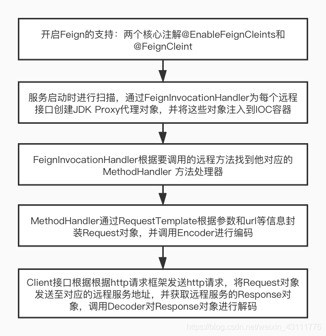
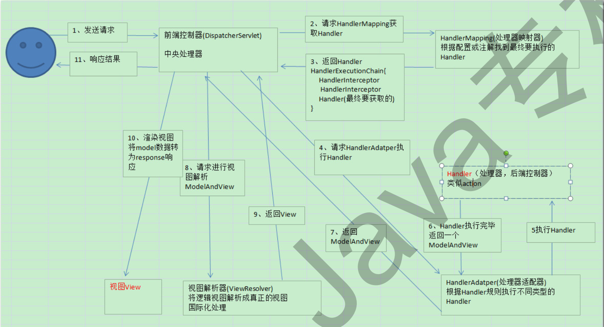
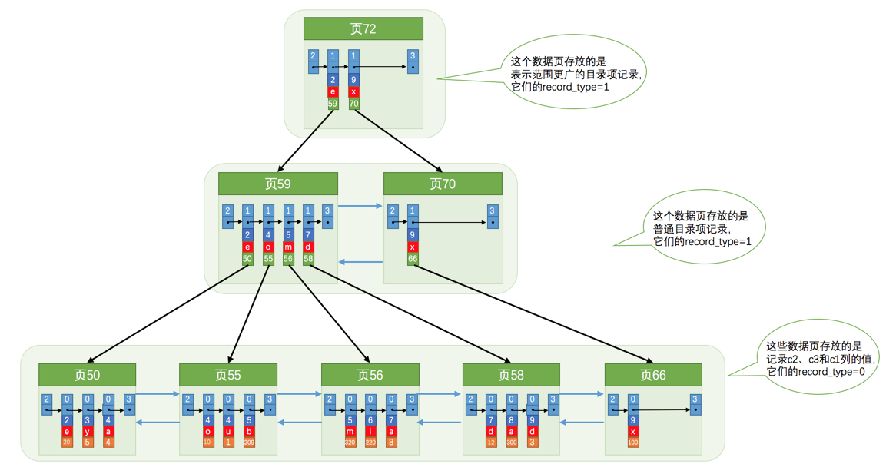
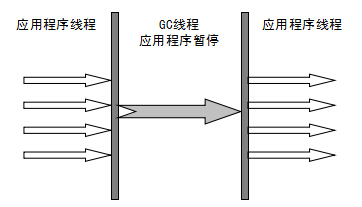
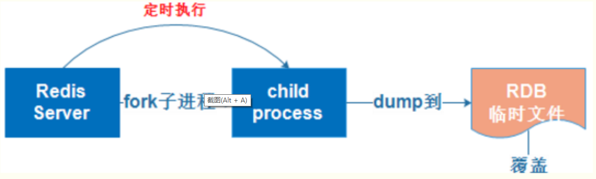
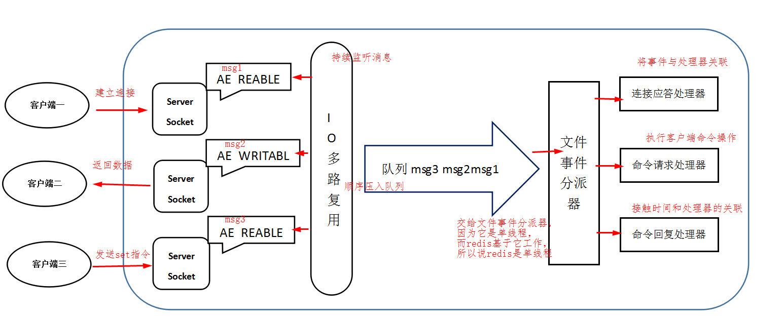
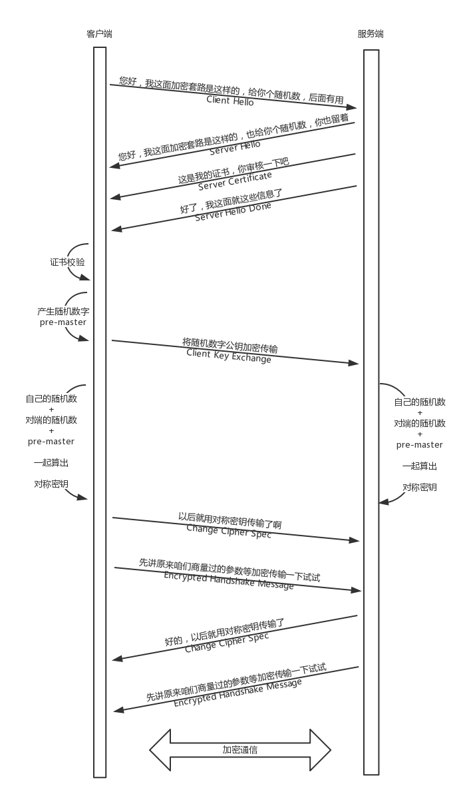

面试问题记录


## Java 基础

### Java集合

#### Collection + Map

##### 1、ArrayList,Vector,LinkedList的存储性能和特性是什么？

+ ArrayList :底层结构动态数组，可按下标随机查询与插入，删除与插入可能涉及数据搬运复制操作，扩容1.5倍。
+ Vector：底层结构动态数组，使用synchronized方法,线程安全但性能较差，扩容2倍。
+ LinkedList: 双向链表，顺序遍历，插入删除较快。


##### 2、ArrayList 的扩容机制 ?

添加元素时使用 ensureCapacityInternal() （size+1） 方法来保证容量足够，如果不够时，需要使用 grow() 方法进行扩容，新容量的大小为 `oldCapacity + (oldCapacity >> 1)`，也就是旧容量的 1.5 倍。**扩容时需要Arrays.copyOf() 把原数组整个复制到新数组中**


##### 3、ArrayList进行循环删除，会出现什么问题？

用下标删除时，会出现后续元素前移，可会导致逃逸一些本应该删除的元素（两个相连的要删除的元素）；

倒序删除即可解决


##### 4、什么是迭代器？

Iterator提供了遍历操作集合元素的统一接口, Collection接口实现Iterable接口, 
每个集合都通过实现Iterable接口中iterator()方法返回Iterator接口的实例, 然后对集合的元素进行迭代操作. 
有一点需要注意的是：在迭代元素的时候**不能通过集合的方法删除元素**, 否则会抛出ConcurrentModificationException 异常. 但是可以通过Iterator接口中的remove()方法进行删除.


##### 5、什么是快速失败（fail-fast）与 安全失败(fail-safe)？

+ 快速失败（fail-fast） 

  快速失败(fail-fast) 是 Java 集合的一种错误检测机制。在使用迭代器对集合进行遍历的时候，我们在多线程下操作非安全失败(fail-safe)的集合类可能就会触发 fail-fast 机制，导致抛出 ConcurrentModificationException 异常。 另外，在单线程下，如果在**遍历过程中对集合对象的内容进行了删除与修改的话也会触发 fail-fast 机制。**

  每当迭代器使用 `hashNext()`/`next()`遍历下一个元素之前，都会检测 `modCount` 变量是否为 `expectedModCount` 值，是的话就返回遍历；否则抛出异常，终止遍历。我们在集合被遍历期间对其进行修改的话，就会改变 `modCount` 的值，进而导致 `modCount != expectedModCount` ，进而抛出 `ConcurrentModificationException` 异常。

+  安全失败(fail-safe)

  采用安全失败机制的集合容器（一些线程安全的集合类），在遍历时不是直接在集合内容上访问的，而是先复制原有集合内容，在拷贝的集合上进行遍历。所以，在遍历过程中对原集合所作的修改并不能被迭代器检测到，故不会抛 `ConcurrentModificationException` 异常。


##### 6、HashSet、LinkedHashSet 和 TreeSet 三者的异同?

+ 有序性：HashSet 无序，LinkedHashSet 与 TreeSet 有序
+ 底层结构：HashSet 通过HashMap实现的，TreeSet 通过红黑树实现的，LinkedHashSet  通过LinkedHashMap实现
+ 存储null值：HashSet  与 LinkedHashSet 都可存储，TreeSet不可存储

##### 7、HashMap 与 HashTable 的区别？

+ HashMap 线程不安全，HashTable利用 synchronized 实现 线程安全（建议使用ConcurrentHashMap）
+ Null key 与 Null Value：HashMap 可以存储 null 的 key 和 value，但 null 作为键只能有一个，null 作为值可以有多个；HashTable 不允许有 null 键和 null 值，否则会抛出 NullPointerException。
+ 初始化大小与扩容机制不同：HashMap 默认16,扩容2n, Hashtable 默认 11，扩容 2n+1

##### 8、HashMap ，TreeMap，LinkedHashMap 三者的异同？

+ 有序性：HashMap 无序，TreeMap 通过搜索二叉树的形式保持有序性，LinkedHashMap 通过内部维护了一个双向链表，用来维护插入顺序或者 LRU 顺序。
+ 底层结构上，HashMap 为数组+链表+红黑树，TreeMap为红黑树，LinkedHashMap继承HashMap
+ TreeMap 实现 `NavigableMap` 接口让 `TreeMap` 有了对集合内元素的搜索的能力。实现`SortMap`接口让 `TreeMap` 有了对集合中的元素根据键排序的能力。

##### 9、如果hashMap的key是一个自定义的类，怎么办？

使用HashMap，如果key是自定义的类，就必须重写hashcode()和equals()。

##### 10、简单说一下HashMap的底层结构？

底层结构是 node节点数组+单链表+红黑树，当put时，通过 hash(`hashcode`) & (n-1) 计算数组下标。若发现hash冲突，使用拉链法解决冲突，jdk1.8后，链长大于8且数组长度大于64后，转化红黑树。

hashMap默认的容量为16，每次扩容为2*n, 这种2的倍数的好处是 

+ 2进制，方便进行移位操作
+ 方便利用取模算法 hash & (n-1)
+ 增加散列度，减少hash冲突

**hash算法** ：为hashcode 高16位 异或 低16位，可以更好的突显高位与低位的改变，增加散列度

**扩容**：实际节点数大于等于容量的四分之三（DEFAULT_LOAD_FACTOR = 0.75f），**左移1位,扩大2倍** 。扩容后数据排布，要么是原下标的位置，要么是原下标+原容量的位置。

用尾插法替换头插法原因：

+ 必须遍历链表，要知道阈值的大小，变化红黑树
+ 多线程链表闭环： 在扩容时候， 头插法会导致链表反转 比如 1->2 ,扩容后的结果是 2->1,单线程时没问题，多线程时可能会造成循环链表，1<->2; 尾插不会反转顺序，则不会有此问题

##### 11、ConcurrentHashMap 和 Hashtable 的区别

ConcurrentHashMap 和 Hashtable 的区别主要体现在实现线程安全的方式上不同。

- **底层数据结构：** JDK1.7的 ConcurrentHashMap 底层采用 **分段的数组+链表** 实现，JDK1.8 采用的数据结构跟HashMap1.8的结构一样，数组+链表/红黑二叉树。Hashtable 和 JDK1.8 之前的 HashMap 的底层数据结构类似都是采用 **数组+链表** 的形式，数组是 HashMap 的主体，链表则是主要为了解决哈希冲突而存在的；

- **实现线程安全的方式（重要）：** 

  +  **在JDK1.7的时候，ConcurrentHashMap（分段锁）** 对整个桶数组进行了分割分段(Segment)，每一把锁只锁容器其中一部分数据，多线程访问容器里不同数据段的数据，就不会存在锁竞争，提高并发访问率。 **到了 JDK1.8 的时候已经摒弃了Segment的概念，而是直接用 Node 数组+链表+红黑树的数据结构来实现，并发控制使用 synchronized 和 CAS 来操作。（JDK1.6以后 对 synchronized锁做了很多优化）** 整个看起来就像是优化过且线程安全的 HashMap，虽然在JDK1.8中还能看到 Segment 的数据结构，但是已经简化了属性，只是为了兼容旧版本；
  +  **Hashtable(同一把锁)** :使用 synchronized 来保证线程安全，效率非常低下。当一个线程访问同步方法时，其他线程也访问同步方法，可能会进入阻塞或轮询状态，如使用 put 添加元素，另一个线程不能使用 put 添加元素，也不能使用 get，竞争会越来越激烈效率越低

  **HashTable:**

  

  **JDK1.7的ConcurrentHashMap：**

  

  **JDK1.8的ConcurrentHashMap（TreeBin: 红黑二叉树节点 Node: 链表节点）：**

  


#### 基础

##### 1、句柄 与 直接引用

+ 句柄

  句柄通俗来讲就是指针的指针；会在JAVA堆中划出一部分[内存](https://so.csdn.net/so/search?q=内存&spm=1001.2101.3001.7020)作为句柄池，Java对象中reference中存储的就是对象的句柄地址，而句柄中包含了对象实例数据与类型数据的各自具体的地址信息；

  定位对象时需要两次定位，当对象被移动时（比如GC时），只需更改句柄中的实例数据指针，而reference不需要改变。

  

+ 直接指针

  对象的reference直接指向对象实例数据与类型数据的各自具体的地址信息，一次定位

  


#### Stream

##### 1、Stream 是什么？

Stream 不是集合元素，它不是数据结构并不保存数据，它是有关算法和计算的，它更像一个高级版本的
Iterator。 是对集合（Collection）对象功能的增强。

Stream 可以并行化操作 ，使用并行去遍历时，数据会被分成多个段，其中每一个都在不同的线程中处理，然后将结果一起输出。 Stream 的并行操作依赖于 Java7 中引入的 Fork/Join 框架来拆分任务和加速处理过程。 

Fork/Join框架是Java 7提供的一个用于并行执行任务的框架，是一个把大任务分割成若干个小任务，最终汇总每个小任务结果后得到大任务结果的框架。

获得Stream方式

+ Collection.stream() 
+ Collection.parallelStream() 
+ Arrays.stream(T array) 
+ Stream.of(T t) 


Stream 流的操作类型

+ 中间操作(Intermediate Operation)：一个流可以后面跟随零个或多个 intermediate 操作。其目的主
  要是打开流，做出某种程度的数据映射/过滤，然后返回一个新的流，交给下一个操作使用。这类
  操作都是惰性化的（lazy），就是说，仅仅调用到这类方法，并没有真正开始流的遍历。
+ 终止操作(Terminal Operation)：一个流只能有一个 terminal 操作，当这个操作执行后，流就被使
  用“光”了，无法再被操作。所以这必定是流的最后一个操作。 Terminal 操作的执行，才会真正开始
  流的遍历，并且会生成一个结果。

Intermediate Operation又可以分为两种类型：

+ 无状态操作(Stateless Operation)：操作是无状态的，不需要知道集合中其他元素的状态，每个元
  素之间是相互独立的，比如map()、 filter()等操作。
+ 有状态操作(Stateful Operation)：有状态操作，操作是需要知道集合中其他元素的状态才能进行
  的，比如sort()、 distinct()。 


#### IO

#####  1、Java 中 IO 流分为几种?

- 按照流的流向分，可以分为输入流和输出流；
- 按照操作单元划分，可以划分为字节流和字符流；
- 按照流的角色划分为节点流和处理流。

4 个抽象类基类中派生出来的。

- InputStream/Reader: 所有的输入流的基类，前者是字节输入流，后者是字符输入流。
- OutputStream/Writer: 所有输出流的基类，前者是字节输出流，后者是字符输出流。

##### 2、既然有了字节流,为什么还要有字符流?

字符流是由 Java 虚拟机将字节转换得到的，问题就出在这个过程还算是非常耗时，并且，如果我们不知道编码类型就很容易出现乱码问题。所以， I/O 流就干脆提供了一个直接操作字符的接口，方便我们平时对字符进行流操作。如果音频文件、图片等媒体文件用字节流比较好，如果涉及到字符的话使用字符流比较好。

##### 3、五种IO模型

+ 同步阻塞IO: 用户进程被阻塞，等待内核数据拷贝到用户空间进程缓存区结束
+ 同步非阻塞（轮询）：内核返回错误码，进程继续执行；需要定时轮询IO是否准备好（内核缓存区数据准备好），拷贝内核数据到用户空间
+ 多路复用同步非阻塞：单个进程通过select监控多个chanel（多个套接字）, 等待chanel事件（读事件
+ ），IO准备完成，即拷贝内核数据到用户空间
+ 信号驱动：进程使用sigaction 系统调用，内核立即返回，应用进程可以继续执行。内核在数据到达时向应用进程发送 SIGIO 信号，应用进程收到之后在信号处理程序中调用 recvfrom 将数据从内核复制到应用进程中。
+ 异步IO: 对于同步IO，异步IO不是顺序执行。用户进程进行aio_read系统调用之后，无论内核数据是否准备好，都会直接返回给用户进程，然后用户态进程可以去做别的事情。等到socket数据准备好了，内核直接复制数据给进程，然后从内核向进程发送通知。IO两个阶段，进程都是非阻塞的。

##### 3、BIO,NIO,AIO 有什么区别?

**BIO：** 

同步阻塞 I/O 模式，数据的读取写入必须阻塞在一个线程内等待其完成。面向流的方式。


**NIO (Non-blocking/New I/O):** 

NIO 是一种多路**复用同步非阻塞**的 I/O 模型，可以让单个进程具有处理多个 I/O 事件的能力。又被称为 Event Driven I/O，即事件驱动 I/O。

提供了 Channel , Selector，Buffer 等抽象。它支持面向缓冲的，基于通道的 I/O 操作方法。 NIO 提供了与传统 BIO 模型中的 `Socket` 和 `ServerSocket` 相对应的 `SocketChannel` 和 `ServerSocketChannel` 两种不同的套接字通道实现,两种通道都支持阻塞和非阻塞两种模式。

+ Channel 

  通道 Channel 是对原 I/O 包中的流的模拟，可以通过它读取和写入数据。通道是双向的，可以用于读、写或者同时用于读写. ServerSocketChannel 与 SocketChannel通过 TCP 读写网络中数据；FileChannel：从文件中读写数据；

+ Buffer-缓冲区

  发送给一个通道的所有数据都必须首先放到缓冲区中，同样地，从通道中读取的任何数据都要先读到缓冲区中。也就是说，不会直接对通道进行读写数据，而是要先经过缓冲区。

  缓冲区实质上是一个数组，但它不仅仅是一个数组。缓冲区提供了对数据的结构化访问，而且还可以跟踪系统的读/写进程。

+ Selector-选择器

  一个线程 Thread 使用一个选择器 Selector 通过轮询的方式去监听多个通道 Channel 上的事件，从而让一个线程就可以处理多个事件。

  通过配置监听的通道 Channel 为非阻塞，那么当 Channel 上的 IO 事件还未到达时，就不会进入阻塞状态一直等待，而是继续轮询其它 Channel，找到 IO 事件已经到达的 Channel 执行。

+ 1

NIO 与普通 I/O 的区别主要有以下两点：

- NIO 是非阻塞的；
- NIO 面向块，I/O 面向流。


**AIO (Asynchronous I/O):** 

是 NIO 的升级版本，提供了异步非堵塞的 IO 操作方式，所以人们叫它 AIO（Asynchronous IO），异步 IO 是基于事件和回调机制实现的，也就是应用操作之后会直接返回，不会堵塞在那里，当后台处理完成，操作系统会通知相应的线程进行后续的操作。


##### 4、什么是Socket?

Socket是应用层与TCP/IP协议族通信的中间软件抽象层，它是一组接口。它把复杂的TCP/IP协议族隐藏在Socket接口后面.socket起源于Unix，**而Unix/Linux基本哲学之一就是“一切皆文件”**，都可以用“打开open –> 读写write/read –> 关闭close”模式来操作。Socket就是该模式的一个实现。socket即是一种特殊的文件。

在建立网络chanel中**客户端IP:port + 服务端IP:port 4元组的一种抽象套接字。在操作系统上赋予了一个唯一独立的文件描述符（数字代表 出入IO），可读可写 。一些socket函数就是对其进行的操作（读/写IO、打开、关闭）**


##### 5、Linux IO 零拷贝

文件从磁盘传输到网络，磁盘文件 -> read 到内核空间缓存区 -> read 到用户空间缓存区 -> write 内核空间缓存区 -> write socket ; 共产生了四次数据拷贝,在用户态与内核态也发生了多次上下文切换，无疑也加重了CPU负担。


零拷贝主要的任务就是**避免**CPU将数据从一块存储拷贝到另外一块存储，主要就是利用各种零拷贝技术，避免让CPU做大量的数据拷贝任务，减少不必要的拷贝。

+ 使用 mmap 代替 read: 让数据传输不经过用户空间

  应用程序调用`mmap()`，磁盘上的数据会通过`DMA`被拷贝的内核缓冲区，接着操作系统会把这段内核缓冲区与应用程序共享，应用程序再调用`write()`,操作系统直接将内核缓冲区的内容拷贝到`socket`缓冲区中，这一切都发生在内核态

  

+ ##### sendfile  使`sendfile`只能将数据从文件传递到套接字上，反之则不行

  它可以替代前面的 read() 和 write() 这两个系统调用，这样就可以减少一次系统调用，也就减少了 2 次上下文切换的开销。该系统调用，可以直接把内核缓冲区里的数据拷贝到 socket 缓冲区里，不再拷贝到用户态，这样就只有 2 次上下文切换，和 3 次数据拷贝。

  使用`sendfile`不仅减少了数据拷贝的次数，还减少了上下文切换，数据传送始终只发生在`kernel space`。

  

+ 1


## Spring Boot + Spring Cloud 篇

### Spring Boot


#### 1、Spring boot 是什么？

Spring Boot 是提供spring框架整合环境（不在需要过多的xml配置），内置web服务器tomcat,用于快速搭建起来一套 Web 项目或者是构建一个单体微服务。

优缺点：

- 独立运行，不需要web服务器
- 简化配置，不用引用过多Maven包与xml配置
- 自动配置，开箱即用；Spring Boot能根据当前类路径下的类、jar包来自动配置bean 


#### **2、Spring Boot  常用注解**

- @SpringBootApplication 

  主线程启动类核心注解，包含@SpringBootConfiguation,实现配置文件的功能 ; @EnableAutoConfiguration：打开自动配置的功能 ; 加载stater下的 bean.factories文件

  @ComponentScan：Spring组件扫描 ;

- @Controller & @RestController

- @Service

- @Repository & @Mapper

- @Component


#### 3、Spring Cloud 与 Spring Boot 使用的版本？

```
    <properties>
        <spring-cloud.version>Finchley.RC1</spring-cloud.version>
    </properties>

    <parent>
        <groupId>org.springframework.boot</groupId>
        <artifactId>spring-boot-starter-parent</artifactId>
        <version>2.0.2.RELEASE</version>
        <relativePath/>
    </parent>
```

| Spring Cloud             | Spring Boot                                    |
| ------------------------ | ---------------------------------------------- |
| Angel版本                | 兼容Spring Boot 1.2.x                          |
| Brixton版本              | 兼容Spring Boot 1.3.x，也兼容Spring Boot 1.4.x |
| Camden版本               | 兼容Spring Boot 1.4.x，也兼容Spring Boot 1.5.x |
| Dalston版本、Edgware版本 | 兼容Spring Boot 1.5.x，不兼容Spring Boot 2.0.x |
| Finchley版本             | 兼容Spring Boot 2.0.x，不兼容Spring Boot 1.5.x |
| Greenwich版本            | 兼容Spring Boot 2.1.x                          |
| Hoxtonl版本              | 兼容Spring Boot 2.2.x                          |

#### 4、Spring Boot 全局统一异常实现

利用@ControllerAdvice / @RestControllerAdvice +  @ExceptionHandler


#### 5、Spring Boot 核心配置文件与区别？

Spring Boot 的核心配置文件是 application 和 bootstrap 配置文件。

application 配置文件这个容易理解，主要用于 Spring Boot 项目的自动化配置。
bootstrap 配置文件有以下几个应用场景。
使用 Spring Cloud Config 配置中心时，这时需要在 bootstrap 配置文件中添加连接到配置中心的
配置属性来加载外部配置中心的配置信息；
一些固定的不能被覆盖的属性；
一些加密/解密的场景； 


#### 6、Spring Boot 配置文件的加载顺序？

**Application属性文件，按优先级排序，相同参数已优先级高的为主**

1. 当前项目目录下的一个/config子目录
2. 当前项目目录
3. 项目的resources即一个classpath下的/config包
4. 项目的resources即classpath根路径（root）


### Spring Cloud


#### **1、Spring Cloud 是什么？**

SpringCloud是关注全局的微服务协调整理治理框架，它将SpringBoot开发的一个个单体微服务整合并且管理起来，为各个服务之间提供，配置管理、服务发现、断路器、路由、微代理、事件总线、全局锁、精选决策、分布式会话等集成服务。

优缺点：

+ 服务拆分粒度更细，有利于资源重复利用，有利于提高开发效率
+ 服务集群式部署+负载均衡，避免单点，或压力集中
+ 适于互联网时代，产品迭代周期更短
+ 微服务过多，治理成本高，不利于维护系统
+ 微服务之间通信，可能会带来网络问题，一致性问题等


#### **2、Spring Cloud  和 dubbo 区别**

 RPC 远程调用模型，包含网络通信，编解码等模块

+ 服务调用方式：dubbo是RPC ；springcloud Rest Api 
+ 注册中心：dubbo 是zookeeper ; springcloud是eureka，zookeeper , nacos, cosul
+ 


#### 3、Eureka 、Nacos 、Zookeeper 区别

##### Eureka

client 注册服务到 eureka 注册中心上， client 获取 eureka注册表

+ 服务续约：discory client  30s 心跳续约， 服务端 90s 未收到剔除实例
+ eureka自我保护：Eureka Server续约更新频率低于阈值则进入保护模式，Eureka Server不会剔除任何注册信息

##### Nacos

注册中心+配置中心

+ 服务注册：每个服务客户端通过rest方式向服务端进行注册自己的信息 
+ 服务心跳：每个服务客户端都会维护一个定时心跳，向服务到证明自己是健康的，默认5s， 
+ 服务健康检查：服务端注册服务后，维护一个定时任务，检查服务下的所有实例（心跳时间检查），设置实例状态或剔除
+ 服务同步：服务器集群之间相互进行通讯来保证服务信息的一致性同时提高注册中心的高可用 
+ 服务发现：客户端有一个定时任务，定时的去注册中心拉取各个服务的信息列表到本地 
+ 雪崩保护：通过给每个服务实例进行配置阈值，从而实现雪崩保护 
+ 临时实例：当服务宕机时，注册中心会进行删除注册的服务实例
+ 永久实例：即使服务宕机了，服务实例也不会被删除，和前面我们一起讨论的zookepper的持久性节点很像

##### zookeeper

zookepper=文件系统+监听通知机制

每个子目录项如 NameService 都被称作为 znode(目录节点)，和文件系统一样，我们能够自由的增加、删除znode，在一个znode下增加、删除子znode，唯一的不同在于znode是可以存储数据的

+ **PERSISTENT-持久化目录节点**: 不删除
+ **PERSISTENT_SEQUENTIAL-持久化顺序编号目录节点**： 创建持久性顺序节点，当第一个节点宕机之后，会按照顺序取下一个节点
+ **EPHEMERAL-临时目录节点**： 临时节点，服务宕机之后就会剔除服务，不会永久保留
+ **EPHEMERAL_SEQUENTIAL-临时顺序编号目录节点**

CAP: 一致性/可用性/分区容忍性


#### **4、Spring Cloud 常用注解**

**Spring Cloud** 

- @EnableDiscoveryClient    &&    @EnableEurekaClient

  @EnableDiscoveryClient基于spring-cloud-commons，@EnableEurekaClient基于spring-cloud-netflix，如果选用的注册中心是eureka，那么就推荐@EnableEurekaClient，如果是其他的注册中心，那么推荐使用@EnableDiscoveryClient。

- @EnableEurekaServer

  启动一个服务注册中心

- @LoadBalanced

  Spring Cloud的commons模块提供了一个@LoadBalanced注解，方便我们对RestTemplate添加一个LoadBalancerClient，以实现客户端负载均衡。通过源码可以发现这是一个标记注解,我们可以通过ribbon实现客户端的负载均衡功能。

- @EnableHystrix

  表示启动断路器，断路器依赖于服务注册和发现。

- @FeignClient

  springboot调用外部接口:声明接口之后，在代码中通过@Resource注入之后即可使用。@FeignClient标签的常用属性如下：name：指定FeignClient的名称，如果项目使用了Ribbon，name属性会作为微服务的名称，用于服务发现

- 


#### 5、Spring Cloud  Netiflux 关键组件简介与常用配置

##### Eureka

与 Consul,Nocas一样，为服务注册与发现组件，主要提供

- 服务注册： 服务单元向服务注册中心登记自己提供的服务，注册中心按服务名分类组织服务清单
- 服务发现： 服务调用方向服务注册中心咨询服务，获取该服务的注册清单，根据本身负载策略选择服务节点

###### Eureka Server

 高可用、强一致性、集群式、单片故障，自我保护模式

- IP 地址形式注册

  ```
  eureka:
    server:
      enable-self-preservation: true #自我保护
      eviction-interval-timer-in-ms: 10000 #健康检查 默认30s
    instance:
      #hostname: eureka-register-1
      lease-expiration-duration-in-seconds: 90 #服务失效剔除时间
      prefer-ip-address: true # ip地址形式注册
      ip-address: 192.168.0.1
      instance-id: ${eureka.instance.ip-address}:${server.port}  
    client:
      registerWithEureka: true # 服务注册 （eureka相互注册）
      fetchRegistry: true      # 服务发现 （获取注册表信息）
      serviceUrl:
        defaultZone: http://192.168.0.1:8761/eureka/
  ```

- 自我保护：统计心跳失败比例低于限定范围(15分钟内 85%) 的注册信息，保护起来，延迟过期

- 集群式 相互注册，服务同步

- 注册中心 双层Map 结构存储注册清单 第一层 key = service-name; 第二层 key = instanceid

  ```
  private final ConcurrentHashMap<String, Map<String, Lease<InstanceInfo>>> registry
              = new ConcurrentHashMap<String, Map<String, Lease<InstanceInfo>>>();
  ```

- 1

###### Eureka Client

 向注册中心中注册服务信息且周期性续约，并将注册清单缓存到本地进行周期性刷新；

 DiscoveryClient 启动后，会启动3个定时任务 ：服务注册、服务续约、服务发现

- IP地址形式注册

  ```
  eureka:
    client:
      serviceUrl:
        defaultZone: http://192.168.0.1:8761/eureka/
    instance:
      lease-renewal-interval-in-seconds: 30  #续约任务的间隔时间
      #health-check-url-path: /actuator/health #健康监测
      prefer-ip-address: true
      instance-id: ${spring.cloud.client.ip-address}:${spring.application.name}:${server.port}
  
  ```

- 服务续约 （renewal）- 服务单元向注册中心续约自身服务

  ```
  eureka:
    instance:
      lease-renewal-interval-in-seconds: 30  #续约任务的间隔时间 
  ```

- 服务获取 - 服务单元缓存清单更新

  ```
  eureka:
    client:
      registry-fetch-interval-seconds:30 #默认30s去注册中心取注册表并更新
  ```


##### Hystrix -断路器

熔断机制是应对雪崩效应的一种微服务链路保护机制。当某个微服务不可用或者响应时间太长时，会进
行服务降级，进而熔断该节点微服务的调用，快速返回“错误”的响应信息。当检测到该节点微服务调用
响应正常后恢复调用链路。 Hystrix会监控微服务间调用的状况，当失败的调用到一定阈值，缺省是5秒内调用20次，如果失败，就会启动熔断机制。 一段时间后（缺省5s）,处于半开状态，将一定数量的请求正常发送，若成功则关闭断路器。断路器上的状态

+ 打开状态：一段时间内 达到一定的次数无法调用 并且多次监测没有恢复的迹象 断路器完全打开 那么下次请求就不会请求到该服务
+ 半开状态：短时间内 有恢复迹象 断路器会将部分请求发给该服务，正常调用时 断路器关闭
+ 关闭状态：当服务一直处于正常状态 能正常调用 

**Ribbon 配合 Hystrix 使用**

```
@SpringBootApplication
@EnableEurekaClient
@EnableCircuitBreaker # 开启熔断
@EnableHystrix # 开启熔断
public class ServiceApplication 
```

```
@HystrixCommand(fallbackMethod = "getUserFallback")
public User getUser(@CacheKey Long id){
        return restTemplate.getForObject("http://SPCD-USER/user/{1}",User.class,id);
}
```

常用配置

```
hystrix.command.default.execution.timeout.enable=true //为false则超时控制有ribbon控制，为true则hystrix超时和ribbon超时都是用，但是谁小谁生效，默认为true
hystrix.command.default.execution.isolation.thread.timeoutInMilliseconds=3000//熔断器的超时时长默认1秒，最常修改的参数
circuitBreaker.requestVolumeThreshold=20 //触发熔断的最小请求次数，默认为20
circuitBreaker.sleepWindowInMilliseconds=5000 //休眠时长，默认为5秒
circuitBreaker.errorThresholdPercentage=50 //触发熔断的失败请求最小占比，默认50%
```


**Feign + Hystrix 使用**

```
@FeignClient(name="spcd-user",fallback = UserClientFallBack.class)
public interface UserClient {

    @GetMapping("/getDate")
    String getDate(@RequestParam("name") String name);

    @GetMapping("/user/{id}")
    User getUser(@PathVariable("id") Long id);
}


@Component
public class UserClientFallBack implements UserClient {

    @Override
    public String getDate(String name) {
        return "SPCD-USER get date fail";
    }

    @Override
    public User getUser(Long id) {
        return new User(-1,"-1","-1","-1");
    }
} 
```

```
feign:
  hystrix:
    enabled: true
  client:
    config:
      default:
        connectTimeout: 500
        readTimeout: 10000
```

**原理**

通过 Spring AOP 切面 HystrixCommandAspect 构造HystrixCommand对象，在 Command 的实现中包含对下游进行调用的逻辑，而每一次调用则会构建一个新的 Command 实例。Hystrix在运行过程中会向每个CommandKey对应的熔断器报告成功、失败、超时和拒绝的状态，熔断器维护并计算统计的数据，根据这些统计信息来确定是否打开。如果打开，后续的请求都会被截断（不再执行run方法里的内容，直接执行fallback方法里的内容）。然后隔一段时间（默认是5s），尝试半开，放一部分请求进来，相当于对依赖服务进行一次健康检查，如果服务没问题，熔断器关闭，随后完全恢复调用。


##### Ribbon

客户端负载均衡的Http工具，服务调用者通过被@LoadBalanced 注解修饰过的RestTemplate来实现面向服务的接口调用。

底层：**Ribbon使用discoveryClient从注册中心读取目标服务信息，对同一接口请求进行计数，使用%取余算法获取目标服务集群索引，返回获取到的目标服务信息。** 

```
    @Bean
	@LoadBalanced
	RestTemplate restTemplate() {
		return new RestTemplate();
	}
```

核心组件 RibbonLoadBalancerClient 负载均衡器，通过Eureka Client 找到服务注册表进行负载均衡。

继承 AbstractLoadBalancerRule 类 实现自定义负载均衡规则，且在配置文件中指定某服务使用该规则

```
public class MyRule extends AbstractLoadBalancerRule{
	public Server choose( Object arg0) {
		ILoadBalancer lb = this.getLoadBalancer();
		
		List<Server> upServerList = lb.getReachableServers(); //可用服务列表
		List<Server> allServerList = lb.getAllServers(); 
		
		return null;
	}
	@Override
	public void initWithNiwsConfig(IClientConfig arg0) {
		// TODO Auto-generated method stub
	}
 
}
```

在配置文件中指定某一服务

```
SERVICE-HI.ribbon.NFLoadBalancerRuleClassName=com.test.eurekaRibbon.rule.MyRule
```

 常用注解

```
ribbon.ReadTimeout=1000 //处理请求的超时时间，默认为1秒
ribbon.ConnectTimeout=1000 //连接建立的超时时长，默认1秒
ribbon.MaxAutoRetries=1 //同一台实例的最大重试次数，但是不包括首次调用，默认为1次
ribbon.MaxAutoRetriesNextServer=0 //重试负载均衡其他实例的最大重试次数，不包括首次调用，默认为0次
ribbon.OkToRetryOnAllOperations=false //是否对所有操作都重试，默认false
```

ribbon是有默认重试的，也是2个：统一实例的重试次数和负载均衡的不同实例的重试次数，默认为1次和0次

也就是说，在同一个实例上建立连接如果失败可以重试1次，处理请求如果失败可以重试1次，但是不包括首次调用，即：实际ribbon的超时时间是 1秒×2+1秒×2，即4秒

**Ribbon使用discoveryClient从注册中心读取目标服务信息，对同一接口请求进行计数，使用%取余算法获取目标服务集群索引，返回获取到的目标服务信息。** 


##### OpenFeign- 声明式服务调用

属于整合了 Ribbon 与 Hystix 的调用服务组件

Feign 声明

启用注解

```
@EnableFeignClients
@EnableDiscoveryClient
@SpringBootApplication
public class AppMain{

}
```

定义接口

```
@FeignClient(name="spcd-user",fallback = UserClientFallBack.class)
public interface UserClient {

    @GetMapping("/getDate")
    String getDate(@RequestParam("name") String name);

    @GetMapping("/user/{id}")
    User getUser(@PathVariable("id") Long id);
}

@Component
public class UserClientFallBack implements UserClient {

    @Override
    public String getDate(String name) {
        return "SPCD-USER get date fail";
    }

    @Override
    public User getUser(Long id) {
        return new User(-1,"-1","-1","-1");
    }
} 
```

常用配置

```
feign.hystrix.enabled=true //Feign是否启用断路器,默认为false
feign.client.config.default.connectTimeout=10000 //Feign的连接建立超时时间，默认为10秒
feign.client.config.default.readTimeout=60000 //Feign的请求处理超时时间，默认为60
feign.client.config.default.retryer=feign.Retryer.Default //Feign使用默认的超时配置，在该类源码中可见，默认单次请求最大时
```

在使用了Feign的情况下需先开启断路器支持，之后配置hystrix的timeoutInMillisecond大于ribbon的 ( ConnectTimeout + ReadTimeout ) × 2即可.




###### Fegin 与 OpenFegin 的区别


- Feign是Spring Cloud Netflix组件中的一个轻量级RESTFULL的http服务客户端，实现了负载均衡和Rest调用的开源框架，封装了Ribbon和RestTemplate，实现了webservice的面向接口编程，进一步降低了项目的耦合度。
- Feign本身并不支持SpringMVC的注解，它有一套自己的注解，为了更方便的使用，Spring Cloud孵化了OpenFeign。


##### Zuul

路由网关+负载均衡，zuul 中已集成 Hystrix 和 Ribbon，使用 @EnableZuulProxy 启动

+ 动态路由
+ 负载均衡
+ 过滤拦截

**ZuulFilter**

```
    public int filterOrder() ; // 过滤器执行顺序， 小优先

	public String filterType();

	public boolean shouldFilter(); // 是否执行
	
    public Object run(); // 执行逻辑
```

filterType 定义四种生命周期的过滤类型

- pre: 在请求被路由前调用

  - ServletDetectionFilter 标记处理servlet类型 -3

  - Servlet30WrapperFilter 将HttpServletRequest 包装为 Servlet30RequestWrapper 对象

  - FromBodyWrapperFilter 包装 Content-Type: application/x-www-from-urlencoded ，multipart/form-data(ServletDetectionFilter) 的请求

    还有 DebugFilter 和 PreDecorationFilter 为默认实现的 pre 的ZuulFilter

- routing: 在请求在路由时调用

  - RibbonRoutingFilter 对配置serviceId 的请求进行路由 （Ribbon）
  - SimpleHostRoutingFilter 对配置url的请求进行路由
  - SendForwardFilter 对forward.to 本地路由跳转

- post: 在请求路由返回响应后，或发生error后 调用

  - LocationRewriteFilter 重写位置头为zuul url
  - SendResponseFilter 响应客户端 oreder 1000
  - SendErrorFilter 错误信息 forward 到 zuul的/error接口产生错误响应

- error: 处理请求时发生错误时被调用


常用配置

```
zuul:
  ignoredServices: '*' # 禁止自动创建路由
  routes:
    user:
      path: /user/**
      serviceId: spcd-user
      stripPrefix: false
      
      
      
```


##### Config

用于分布式系统中基础设施和微服务应用提供集中化的外部配置支持，分为 Config Server 与 Config Client

**配置启用**

Config Server - @EnableConfigServer

```
spring:
  application:
    name: spcd-config
  cloud:
    config:
      server:
        git:
          basedir: E:\log # 本地仓库保存地址
          uri: https://github.com/ZeWeStar/spring-cloud-config
          search-paths: spcd-config # 目录
          username: xxxx
          password: xxxx
```


Config Client - 必须配置在 bootstrap.yml中

```
// bootstrap.yml 必须配置在 bootstrap中 Config First Bootstrap
spring:
  application:
    name: user #对应配置文件 {application}
  cloud:
    config:
      profile: dev #对应配置文件 {profile}
      label: master #对应配置文件 {label}
      uri: http://127.0.0.1:8711
      fail-fast: true # can not connect server fail startup
```


#### 6、Eureka 和 Zookeeper 区别

+ Zookeeper ，AP模式，是一个进程，选举过程中不提供服务
+ Eureka  CP 模式， 是一个工程，高可用集群（单节点即可提供服务） 


#### 7、Nocas 如何实现热跟新

+ 配置获取

  Nacos 采用 长轮询的 方式去 pull 请求，检查服务端配置是否更新，如果发生变化则将新值返回客户端。若无改变，服务端hold住请求，将其设置为一个延时任务 加入 allSubs队列中，延期29.5s返回

  + 延时29.5s 后执行检查机制，不管是否发生变化，将结果返回客户端
  + Server 配置修改后触发事件，事件遍历subs队列，找到对应的 ClientLongPull 返回新值

+ 热跟新

  + refreshScope

    Spring Cloud 新添加了一个refreshScope;  Scope是spring ioc容器的作用域; 在spring bean的生命周期管理中，所有经过@Scope注解装饰过的Bean实例都交由Scope自己创建，例如SessionScope是从Session中获取实例的，ThreadScope是从ThreadLocal中获取的，而RefreshScope是在内建缓存中获取的。

    **经过@RefreshScope注解修饰的bean，将被RefreshScope进行代理，用来实现配置、实例热加载，即当配置变更时可以在不重启应用的前提下刷新bean中相关的属性值。**

  + ContextRefresher.refresh() 

    **该方法会清空RefreshScope 中缓存的bean**, 有两个方法调用该方法

    + RefreshEndpoint：Http访问 http://localhost:8080/actuator/refresh这个EndPoint
    + RefreshEventListener：监听RefreshEvent事件

  + NacosContextRefresher

    Nacos里定义了NacosContextRefresher，该类中注册了Nacos监听器，当监听到配置变更，则发送RefreshEvent事件。

    ```
    NacosContextRefresher.this.applicationContext.publishEvent(new RefreshEvent(this, (Object)null, "Refresh Nacos config"));
    ```

  + scope.get()

    当scope 缓存没有值时，通过IOC容器重新生成bean(新配置)

  


## Spring Cloud Nacos

### 1、Gateway

+ Spring Cloud Gateway是Spring Cloud官方推出的第二代网关框架，取代Zuul网关。网关作为流量的，在微服务系统中有着非常作用，网关常见的功能有路由转发、权限校验、限流控制等作用。
+ 使用了一个RouteLocatorBuilder的bean去创建路由，除了创建路由RouteLocatorBuilder可以让你添加各种predicates和filters，predicates断言的意思，顾名思义就是根据具体的请求的规则，由具体的route去处理，filters是各种过滤器，用来对请求做各种判断和修改。 

```
spring:
  cloud:
    gateway:
      # 路由数组：指当请求满足什么样的断言时，转发到哪个服务上
      routes:
        # 路由标识，要求唯一，名称任意
        - id: gateway-provider_1
		  # 请求最终被转发到的目标地址
          uri: http://localhost:9024
          # 设置断言
          predicates:
            # Path Route Predicate Factory 断言，满足 /gateway/provider/** 路径的请求都会被路由到 http://localhost:9024 这个uri中
            - Path=/gateway/provider/**
            # Weight Route Predicate Factory 断言，同一分组按照权重进行分配流量，这里分配了80%
            # 第一个group1是分组名，第二个参数是权重
            - Weight=group1, 8
          # 配置过滤器（局部）
          filters:
            # StripPrefix：去除原始请求路径中的前1级路径，即/gateway
            - StripPrefix=1            
            
        - id: gateway-provider_2
          uri: http://localhost:9025
          # 设置断言
          predicates:
            - Path=/gateway/provider/**
            # Weight Route Predicate Factory，同一分组按照权重进行分配流量，这里分配了20%
            - Weight=group1, 2
		  # 配置过滤器（局部）
          filters:
            # StripPrefix：去除原始请求路径中的前1级路径，即/gateway
            - StripPrefix=1            

```

过滤器 filter：

Gateway 过滤器的生命周期：

+ PRE：这种过滤器在请求被路由之前调用。我们可利用这种过滤器实现身份验证、在集群中选择请求的微服务、记录调试信息等。
+ POST：这种过滤器在路由到微服务以后执行。这种过滤器可用来为响应添加标准的 HTTP Header、收集统计信息和指标、将响应从微服务发送给客户端等。

Gateway 过滤器从作用范围可分为两种:

+ GatewayFilter：应用到单个路由或者一个分组的路由上（需要在配置文件中配置）
+ GlobalFilter：应用到所有的路由上（无需配置，全局生效）


### 2、Sentienl 

Sentinel 以流量为切入点，从**流量控制**、**熔断降级**、**系统负载**保护等多个维度保护服务的稳定性。

- 核心库（Java 客户端）不依赖任何框架/库，能够运行于所有 Java 运行时环境，同时对 Dubbo / Spring Cloud 等框架也有较好的支持。
- 控制台（Dashboard）基于 Spring Boot 开发，打包后可以直接运行，不需要额外的 Tomcat 等应用容器。


定义资源

+ 编码式

```
// 1.5.0 版本开始可以利用 try-with-resources 特性
// 资源名可使用任意有业务语义的字符串，比如方法名、接口名或其它可唯一标识的字符串。
try (Entry entry = SphU.entry("resourceName")) {
  // 被保护的业务逻辑
  // do something here...
} catch (BlockException ex) {
  // 资源访问阻止，被限流或被降级
  // 在此处进行相应的处理操作
}
```

+ 注解

  ```
  // 原本的业务方法.
  @SentinelResource(blockHandler = "blockHandlerForGetUser")
  public User getUserById(String id) {
      throw new RuntimeException("getUserById command failed");
  }
  
  // blockHandler 函数，原方法调用被限流/降级/系统保护的时候调用
  public User blockHandlerForGetUser(String id, BlockException ex) {
      return new User("admin");
  }
  ```

  

##### 流量控制规则 (FlowRule)

|      Field      | 说明                                                         | 默认值                        |
| :-------------: | :----------------------------------------------------------- | :---------------------------- |
|    resource     | 资源名，资源名是限流规则的作用对象                           |                               |
|      count      | 限流阈值                                                     |                               |
|      grade      | 限流阈值类型，QPS 或线程数模式                               | QPS 模式                      |
|    limitApp     | 流控针对的调用来源                                           | `default`，代表不区分调用来源 |
|    strategy     | 调用关系限流策略：直接、链路、关联                           | 根据资源本身（直接）          |
| controlBehavior | 流控效果（直接拒绝 / 排队等待 / 慢启动模式），不支持按调用关系限流 | 直接拒绝                      |

##### 熔断降级规则 (DegradeRule)

|                    |                                                              |            |
| :----------------: | :----------------------------------------------------------- | :--------- |
|       Field        | 说明                                                         | 默认值     |
|      resource      | 资源名，即规则的作用对象                                     |            |
|       grade        | 熔断策略，支持慢调用比例/异常比例/异常数策略                 | 慢调用比例 |
|       count        | 慢调用比例模式下为慢调用临界 RT（超出该值计为慢调用）；异常比例/异常数模式下为对应的阈值 |            |
|     timeWindow     | 熔断时长，单位为 s                                           |            |
|  minRequestAmount  | 熔断触发的最小请求数，请求数小于该值时即使异常比率超出阈值也不会熔断（1.7.0 引入） | 5          |
|   statIntervalMs   | 统计时长（单位为 ms），如 60*1000 代表分钟级（1.8.0 引入）   | 1000 ms    |
| slowRatioThreshold | 慢调用比例阈值，仅慢调用比例模式有效（1.8.0 引入）           |            |


## 并发多线程篇

### **1、线程与进程是什么？**

进程为操作系统中运行的一个程序，它占用一部分操作系统的资源如CPU时间、内存、键盘IO等； 线程为进程中的最小运行单位，一个进程中包含多个线程，共享同一块内存空间和一组系统资源。


### **2、线程池是什么？**

一种对象池的思想，通过线程池来创建管理线程增减，内置队列管理运行中的任务。

优缺点

+ 线程复用，避免重复多次创建销毁线程，节省资源
+ 提高响应速度，任务到达直接分配线程进行执行
+ 可根据流量响应自动增减线程


### **3、什么是线程安全？**

线程安全就是说多线程访问同一代码，不会产生不确定的结果 。多线程执行后结果总是我们的逻辑期望结果，就是线程安全

通过锁机制，控制线程正确操作共享变量，来保证线程安全


### 4、什么是线程同步？

多个线程之间的协同配合，通过同步机制（锁）来保证对共享的内存进行前后有序的操作，同一时刻只允许一个线程进行操作，防止并发更改出现不确定的结果

同步：一个线程需要等待上一个线程执行完成，释放资源后，才可以进行执行。顺序性的

异步：一个线程调用一个异步方法，不必等到方法执行完毕，就可以继续向下执行。这个异步方法一般由另外一个线程执行。


### 5、锁概念？

乐观锁：访问的时候不加锁，等修改的时候才加锁；如CAS；适用于多读的情况。

悲观锁：访问数据时就上锁

独占锁：该锁一次只能被一个线程持有，如 synchronized,	ReentrantLock 

共享锁：共享锁则允许多个线程同时获取锁，并发访问 共享资源 ，如ReentrantReadWriteLock

死锁：多个线程环型等待他方占有的资源，一直僵持下去的局面


### 6、线程安全三要素，如何保证？

+ 原子性

  原子性操作就是指这些操作是不可中断的，要做一定做完，要么就没有执行。

  借助于`synchronized`和`Lock`来保证整块代码的原子性，线程在释放锁之前，其他线程不能取得锁，释放锁时必然会把`i`的值刷回到主存的。还有CAS算法

+ 可见性

  JMM中每一个线程都有自己的独立工作内存区，还有一个公共内存区(主内存)。线程执行时先把变量值从主内存拷贝到自己工作内存区中。可见性的目的就是保证一个线程改变了变量后，其他线程及时刷新自己的工作区内存获取最新值。

  关键字 volatile,当一个变量被volatile修饰时，对它的修改会立刻刷新到主存，并将其他线程缓存中的此变量清空，当其它线程需要读取该变量时，会去主内存中读取新值。

  通过锁保证，锁释放刷新到主内存中

+ 有序性-防止重排序

  lock/unlock, volatile关键字可以产生内存屏障，防止指令重排序，hapens-before,保证结果不能出现变化

  

### 7、线程的生命周期？


### 8、sleep 与 wait 区别？

- sleep()方法是属于 Thread 类中的。wait()方法属于Object 类。
- sleep()方法导致了程序暂停执行指定的时间，让出 cpu 该其他线程，但是他的监控状态依然
  保持者（锁不释放），当指定的时间到了又会自动恢复运行状态。
- 在调用 sleep()方法的过程中， 线程不会释放对象锁。而当调用 wait()方法的时候，线程会放弃对象锁，进入等待此对象的等待锁定池，只有针对此对象调用 notify()方法后本线程才进入对象锁定池准备获取对象锁进入运行状态。 


### 9、Java中synchronized 和 ReentrantLock 相同点与不同点？

相同点

+ 独占阻塞锁，排它锁
+ 都是可重入锁

不同点

+ ReentrantLock 需要显示的获取与释放锁，Synchronized 隐式获得释放锁 
+ ReentrantLock 可响应中断，Synchronized 等待的线程会一直等待下去，不能够响应中断。 
+ synchronized 在发生异常时，会自动释放线程占有的锁 , ReentrantLock  需要在在 finally 块中释放锁。 
+ Synchronized来说，它是java语言的关键字 ,是由jvm实现的，Synchronized进过编译，会在同步块的前后分别形成monitorenter和monitorexit这个两个字节码指令。 ReentrantLock  是由juc包下实现的。


### 10、有三个线程T1,T2,T3,如何保证顺序执行？ 

+ 利用Thread.join()
+ 利用CountDownLatch（线程计数器 ） 
+ newSingleThreadExecutor.submit 顺序加入


### 11、Java线程池中submit() 和 execute()方法有什么区别？

两个方法都可以向线程池提交任务，execute()方法的返回类型是void，它定义在Executor接口中, 而
submit()方法可以返回持有计算结果的Future对象，它定义在ExecutorService接口中，它扩展了
Executor接口，其它线程池类像ThreadPoolExecutor和ScheduledThreadPoolExecutor都有这些方
法。


### 12、线程池 ThreadPoolExecutor 构造参数？

```
public ThreadPoolExecutor(corePoolSize, maximumPoolSize, keepAliveTime, unit, workQueue,
Executors.defaultThreadFactory(), defaultHandler);

//corePoolSize：线程池数量
//maximumPoolSize: 最大线程数量
//keepAliveTime: 多余线程存活时间； TimeUnit：时间单位
//workQueue: 任务队列
//ThreadFactory: 创建线程的工厂
//defaultHandler: 拒绝策略
```

线程池实现原理：一个线程集合workerSet和一个阻塞队列workQueue。当用户向线程池提交一个任务(也就是线程)时，线程池会先将任务放入workQueue中。workerSet中的线程会不断的从workQueue中获取线程然后执行。当workQueue中没有任务的时候，worker就会阻塞，直到队列中有任务了就取出来继续执行。


### 13、Executors 创建四种常用线程池？

1、**newCachedThreadPool** 

创建一个可根据需要创建新线程的线程池 ，空闲线程可复用，当无空闲线程时，创建新线程；当空闲线程多时，终止并从缓存中移除那些已有 60 秒钟未被使用的线程 。使用 SynchronnousQueue 不存储元素的阻塞队列，通过建立新线程来使用。

2、**newFixedThreadPool** 

创建一个可重用固定线程数的线程池，以共享的无界队列方式来运行这些线程。 当无空闲线程时，任务保存在无界队列中。使用LinkedBlockingQueue基于链表的阻塞队列 ，FIFO原则

3、**newScheduledThreadPool**  `[ˈʃedjuːld] `

创建一个线程池，它可安排在给定延迟后运行命令或者定期地执行。 DelayQueue ：是一个支持延时获取元素的无界阻塞队列。

```
ScheduledExecutorService scheduledThreadPool= Executors.newScheduledThreadPool(3);
scheduledThreadPool.schedule(newRunnable(){
@Override
public void run() {
System.out.println("延迟三秒");
}
}, 3, TimeUnit.SECONDS);
scheduledThreadPool.scheduleAtFixedRate(newRunnable(){
@Override
public void run() {
System.out.println("延迟 1 秒后每三秒执行一次");
}
},1,3,TimeUnit.SECONDS);
```

4、**newSingleThreadExecutor** 

返回一个线程池（这个线程池只有一个线程） ,这个线程池可以在线程死后（或发生异常时）重新启动一个线程来替代原来的线程继续执行下去 。使用LinkedBlockingQueue基于链表的阻塞队列 ，FIFO原则


### 14、Executors 拒绝策略

线程池中的线程已经用完了，无法继续为新任务服务，同时，等待队列也已经排满了，再也塞不下新任务了。这时候我们就需要拒绝策略机制合理的处理这个问题。 

- **ThreadPoolExecutor.AbortPolicy**：抛出 `RejectedExecutionException`来拒绝新任务的处理。
- **ThreadPoolExecutor.CallerRunsPolicy**：调用执行自己的线程运行任务，也就是直接在调用`execute`方法的线程中运行(`run`)被拒绝的任务，如果执行程序已关闭，则会丢弃该任务。因此这种策略会降低对于新任务提交速度，影响程序的整体性能。另外，这个策略喜欢增加队列容量。如果您的应用程序可以承受此延迟并且你不能任务丢弃任何一个任务请求的话，你可以选择这个策略。
- **ThreadPoolExecutor.DiscardPolicy：** 不处理新任务，直接丢弃掉。
- **ThreadPoolExecutor.DiscardOldestPolicy：** 此策略将丢弃最早的未处理的任务请求。


### 15、任务队列


1、ArrayBlockingQueue ：由数组结构组成的有界阻塞队列，先进先出（FIFO）

2、LinkedBlockingQueue：基于链表的阻塞队列 ，FIFO原则。两个独立锁提高并发，对于生产者
端和消费者端分别采用了独立的锁来控制数据同步 ，默认容量：Integer.MAX_VALUE 

3、PriorityBlockingQueue ：是一个支持优先级的无界队列。默认情况下元素采取自然顺序升序排列。 可以自定义实现compareTo()方法来指定元素进行排序规则 。

4、DelayQueue ：是一个支持延时获取元素的无界阻塞队列。 队列中的元素必须实现 Delayed 接口，在创建元素时可以指定多久才能从队列中获取当前元素。只有在延迟期满时才能从队列中提取元素。 可用于 缓存失效，定时任务。

5、SynchronousQueue ：是一个不存储元素的阻塞队列。用于线程间传递数据，每一个 put 操作必须等待一个 take 操作，否则不能继续添加元素。


### 16、AQS 篇

#### 1、什么是AQS?

AQS ,AbstractQueuedSynchronizer 队列同步器, 用于构建锁或其他同步组件的基础框架，使用一个int值表示同步状态(用volatile修饰)，通过内置的FIFO队列为线程同步队列。主要使用方式为继承，子类通过实现其特定的抽象方法来管理同步状态。同步器提供的方法基本分为三类：独占式获取或释放同步状态、共享式获取或释放同步状态、查询同步队列中的等待线程情况。


#### 2、AQS 的思想是？

**AQS核心思想是，如果被请求的共享资源空闲，则将当前请求资源的线程设置为有效的工作线程，并且将共享资源设置为锁定状态。如果被请求的共享资源被占用，那么就需要一套线程阻塞等待以及被唤醒时锁分配的机制，这个机制AQS是用FIFO的双向队列锁实现的，即将暂时获取不到锁的线程加入到队列中。** AQS使用一个voliate int成员变量来表示同步状态，通过内置的FIFO队列来完成获取资源线程的排队工作。**AQS使用CAS对该同步状态进行原子操作实现对其值的修改。**


AQS是将每条请求共享资源的线程封装成一个CLH锁队列的一个结点(Node)来实现锁的分配。其中Sync queue，即同步队列，是双向链表，包括head结点和tail结点，head结点主要用作后续的调度。而Condition queue不是必须的，其是一个单向链表，只有当使用Condition时，才会存在此单向链表。并且可能会有多个Condition queue。

CAS:  Compare and Swap  比较并交换， 涉及3个操作值：内存值，预期值，新值 

是一条CPU的原子指令，其作用是让CPU先进行比较两个值是否相等，然后原子地更新某个位置的值，经过调查发现，其实现方式是基于硬件平台的汇编指令，就是说CAS是靠硬件实现的，JVM只是封装了汇编调用。

AQS框架借助于两个类：Unsafe(提供CAS操作)和LockSupport(提供park/unpark操作)

#### 

#### 3、公平锁与非公平锁的区别？

公平锁代表的是锁的获取顺序应该按照请求的时间顺序，而非公平锁则是抢占式的，线程进来就可以去尝试获取同步状态

公平锁在 tryAcquire中加入了当前同步队列中是否有前驱结点的判断。


#### 4、辅助类

##### CountDownLatch（线程计数器 ） 

用来控制一个或者多个线程等待多个线程。维护了一个计数器 cnt，每次调用 countDown() 方法会让计数器的值减 1，减到 0 的时候，那些因为调用 await() 方法而在等待的线程就会被唤醒。

```
CountDownLatch latch = latch = new CountDownLatch(size); //size 线程数量
latch.countDown(); // 完成一个 减去一个
latch.await(); // 等待10个进程完全结束，在进行主线程

```


##### CyclicBarrier（回环栅栏-等待至 barrier 状态再全部同时执行）  ` [ˈsaɪklɪk] [ˈbæriə(r)]`

用来控制多个线程互相等待，只有当多个线程都到达时，这些线程才会继续执行。

通过维护计数器来实现的。线程执行 await() 方法之后计数器会减 1，并进行等待，直到计数器为 0，所有调用 await() 方法而在等待的线程才能继续执行。实现让一组线程等待至某个状态之后再**全部同时执行。**

CyclicBarrier 和 CountdownLatch 的一个区别是，CyclicBarrier 的计数器通过调用 reset() 方法可以循环使用，所以它才叫做循环屏障。

CyclicBarrier 有两个构造函数，其中 parties 指示计数器的初始值，**barrierAction 在所有线程都到达屏障的时候会执行一次。**

```
public CyclicBarrier(int parties, Runnable barrierAction) {
    if (parties <= 0) throw new IllegalArgumentException();
    this.parties = parties;
    this.count = parties;
    this.barrierCommand = barrierAction;
}

public CyclicBarrier(int parties) {
    this(parties, null);
}
```

##### CountDownLatch 与 CyclicBarrier 区别

CountDown表示减法计数，Latch表示门闩的意思，计数为0的时候就可以打开门闩了。Cyclic Barrier表示循环的障碍物。两个类都含有这一个意思：**对应的线程都完成工作之后再进行下一步动作，也就是大家都准备好之后再进行下一步。**然而两者最大的区别是，进行下一步动作的动作实施者是不一样的。这里的“动作实施者”有两种，一种是主线程（即执行main函数），另一种是执行任务的其他线程，后面叫这种线程为“其他线程”，区分于主线程。对于CountDownLatch，当计数为0的时候，下一步的动作实施者是main函数；对于CyclicBarrier，下一步动作实施者是“其他线程”。

+ CountDownLatch 场景

  其他线程为游戏玩家，比如英雄联盟，主线程为控制游戏开始的线程。在所有的玩家都准备好之前，主线程是处于等待状态的，也就是游戏不能开始。当所有的玩家准备好之后，下一步的动作实施者为主线程，即开始游戏。

  ```
  public class CountDownLatchTest {
  
      public static void main(String[] args) throws InterruptedException {
          CountDownLatch latch = new CountDownLatch(4);
          for(int i = 0; i < latch.getCount(); i++){
              new Thread(new MyThread(latch), "player"+i).start();
          }
          System.out.println("正在等待所有玩家准备好");
          latch.await();  // 只阻挡main主线程
          System.out.println("开始游戏");
      }
  
      private static class MyThread implements Runnable{
          private CountDownLatch latch ;
  
          public MyThread(CountDownLatch latch){
              this.latch = latch;
          }
  
          @Override
          public void run() {
              try {
                  Random rand = new Random();
                  int randomNum = rand.nextInt((3000 - 1000) + 1) + 1000;//产生1000到3000之间的随机整数
                  Thread.sleep(randomNum);
                  System.out.println(Thread.currentThread().getName()+" 已经准备好了, 所使用的时间为 "+((double)randomNum/1000)+"s");
                  latch.countDown();
              } catch (InterruptedException e) {
                  e.printStackTrace();
              }
  
          }
      }
  }
  
  ```

  

+ CyclicBarrier

  假设有一家公司要全体员工进行团建活动，活动内容为翻越三个障碍物，每一个人翻越障碍物所用的时间是不一样的。但是公司要求所有人在翻越当前障碍物之后再开始翻越下一个障碍物，也就是所有人翻越第一个障碍物之后，才开始翻越第二个，以此类推。类比地，每一个员工都是一个“其他线程”。当所有人都翻越的所有的障碍物之后，程序才结束。而主线程可能早就结束了，这里我们不用管主线程。

  注意： **此时是可以循环使用的**

  ```
  public class CyclicBarrierTest {
      public static void main(String[] args) {
          CyclicBarrier barrier = new CyclicBarrier(3);
          for(int i = 0; i < barrier.getParties(); i++){
              new Thread(new MyRunnable(barrier), "队友"+i).start();
          }
          System.out.println("main function is finished."); // 主线程直接执行完毕
      }
  
  
      private static class MyRunnable implements Runnable{
          private CyclicBarrier barrier;
  
          public MyRunnable(CyclicBarrier barrier){
              this.barrier = barrier;
          }
  
          @Override
          public void run() {
              for(int i = 0; i < 3; i++) {
                  try {
                      Random rand = new Random();
                      int randomNum = rand.nextInt((3000 - 1000) + 1) + 1000;//产生1000到3000之间的随机整数
                      Thread.sleep(randomNum);
                      System.out.println(Thread.currentThread().getName() + ", 通过了第"+i+"个障碍物, 使用了 "+((double)randomNum/1000)+"s");
                      this.barrier.await(); // 阻挡工作线程
                  } catch (InterruptedException e) {
                      e.printStackTrace();
                  } catch (BrokenBarrierException e) {
                      e.printStackTrace();
                  }
              }
          }
      }
  }
  
  
  ————————————————
  main function is finished.
  队友1, 通过了第0个障碍物, 使用了 1.432s
  队友0, 通过了第0个障碍物, 使用了 1.465s
  队友2, 通过了第0个障碍物, 使用了 2.26s
  队友1, 通过了第1个障碍物, 使用了 1.542s
  队友0, 通过了第1个障碍物, 使用了 2.154s
  队友2, 通过了第1个障碍物, 使用了 2.556s
  队友1, 通过了第2个障碍物, 使用了 1.426s
  队友2, 通过了第2个障碍物, 使用了 2.603s
  队友0, 通过了第2个障碍物, 使用了 2.784s
  ```

  


##### Semaphore（信号量-控制同时访问的线程个数） 

Semaphore是一个计数信号量，它的本质是一个"共享锁"。

信号量维护了一个信号量许可集，Semaphore可以控同时访问的线程个数，线程可以通过调用acquire()来获取信号量的许可；当信号量中有可用的许可时，线程能获取该许可；否则线程必须等待，直到有可用的许可为止。 线程可以通过release()来释放它所持有的信号量许可。

```
// Semaphore(int permits, boolean fair) 创建具有给定的许可数和给定的公平设置的 Semaphore
Semaphore sem = new Semaphore(size); 

// 获取一个许可，未获取到之前线程阻塞; acquire(int permits) 获取指定数目许可 , tryAcquire() 不阻塞
sem.acquire(); 
// do something
sem.release(); // 释放一个许可，将其返回给信号量; release(int permits) 释放给定数目的许可，将其返回到信号量。
```

- CountDownLatch 和 CyclicBarrier 都能够实现线程之间的等待，只不过它们侧重点不同； CountDownLatch 一般用于某个线程 A 等待若干个其他线程执行完任务之后，它才执行； 而 CyclicBarrier 一般用于一组线程互相等待至某个状态，然后这一组线程再同时执行；另外， CountDownLatch 是不能够重用的，而 CyclicBarrier 是可以重用的。
- Semaphore 其实和锁有点类似，它一般用于控制对某组资源的访问权限。 


### 17、Future 、Callable、FutureTask 对象

Future<V>接口是用来获取异步计算结果的，说白了就是对具体的Runnable或者Callable对象任务执行的结果进行获取(get()),取消(cancel()),判断是否完成等操作


Callable  需要与 Future 搭配使用的， run 方法有返回值。 Ruanbale 接口run没有返回值

```
public interface Callable<V> { 
      V   call()   throws Exception; 
} 

```

+ submit提交一个实现Callable接口的任务，并且返回封装了异步计算结果的Future。
+ 第二个方法：submit提交一个实现Runnable接口的任务，并且指定了在调用Future的get方法时返回的result对象。
+ 第三个方法：submit提交一个实现Runnable接口的任务，并且返回封装了异步计算结果的Future。
  

FutureTask 为 Future 提供了基础实现，如获取任务执行结果(get)和取消任务(cancel)等。如果任务尚未完成，获取任务执行结果时将会阻塞。FutureTask 常用来封装 Callable 和 Runnable，也可以作为一个任务提交到线程池中执行。


### 18、volatile 作用

+ 可见性，通过volatile 修饰的共享变量会强制刷新到主内存，线程读取也强制读取主内存

+ 防重排序，编译器和处理器为了优化程序执行的性能而对指令序列进行重排，导致非原子操作指令排序顺序改变。volatile 修饰的共享变量会禁止重排序

+ volatile 实际是生成内存屏障指令，

  生成指令序列的适当位置会**插入内存屏障**指令来禁止特定类型的处理器重排序，保证共享变量操作的有序性。

  写操作的会让线程本地的共享内存变量写完**强制刷新到主存**。**读操作让本地线程变量无效，强制从主内存读取**，保证了共享内存变量的可见性。

懒汉单例模式

```
public class Singleton {
       private static volatile Singleton instance = null;
       private Singleton() {
       };
       public static synchronized Singleton getInstance() {
              if (instance == null) {
                     synchronized (instance) {
                           if (instance == null) {
                                  instance = new Singleton();
                           }
                     }
              }
              return instance;
       }
}
```

+ new Object 不是一个原子性操作，实际分为3步：1）分配堆内存空间  2）初始化对象  3）将内存空间的地址赋值给 singleton；
+ volatile 禁止指令从排序，2）和 3） 步骤会重排序，导致 singleton 指向未进行初始化的地址，多线程情况下会直接返回未进行初始化的singleton对象
+ synchronized ：new Object 不是一个原子性操作, 需要加锁确保一个线程完全生成了一个实例对象，再加上锁的前后double check  防止多线程并发时创建多个实例对象，


### 19、线程中断


+ 调用一个线程的 interrupt() 来中断该线程，如果该线程处于阻塞、限期等待或者无限期等待状态，会抛出InterruptedException 异常中断 ，如 Thread.sleep() 会抛出该异常，不能中断 I/O 阻塞和 synchronized 锁阻塞。

+ interrupted(), 若在run()方法内执行死循环，无可抛出InterruptedException 异常的代码端，使用interrupted()判断中断状态；调用一个线程的 interrupt() 来中断该线程时会标记中断状态

  ```
  private static class MyThread2 extends Thread {
          @Override
          public void run() {
              while (!interrupted()) {
                  // ..
              }
              System.out.println("Thread end");
          }
  }
  ```

  

+ Executor.shutdonNow(); 相当于调用每个线程的 interrupt() 方法。


### 20、ThreadLocal

线程变量，ThreadLocal变量在每个线程中都创建了一个副本，线程间相互独立；且该副本只能由当前 Thread 使用
不存在线程共享的问题，线程安全
Threadlocl是作为当前线程中属性ThreadLocalMap集合中的某一个Entry的key值Entry（threadlocl,value），
虽然不同的线程之间threadlocal这个key值是一样，但是不同的线程所拥有的ThreadLocalMap是独一无二的，
也就是不同的线程间同一个ThreadLocal（key）对应存储的值(value)不一样，从而到达了线程间变量隔离的目的，
但是在同一个线程中这个value变量地址是一样的。

Entry的key 与 ThreadLocal 为弱引用；防止 ThreadLocal 不被回收；因为对象的ThreadLocal不使用了，
但是线程存在，则ThreadLocalMap不会回收，ThreadLocalMap.Entry.key 不会回收；用弱引用就会回收
所以会出现 key=null 的Entry；

ThreadLocal进行get(), set(), remove()时会清除线程ThreadLocalMap里所有key为null的value。也需要在程序中手动remove()


## Spring 篇

### IOC

**Inversion of Control  控制反转**


- what: 什么叫控制反转？

  控制：java 对象，bean 的创建以及管理

  反转：给谁控制，控制权交给外部环境（Spring 框架、IoC 容器）

- why: 为什么这么做？优点

  1. 对象之间的耦合度或者说依赖程度降低；

     两个对象有依赖，可能需要在A对象中显示 new B对象，如果使用接口 interfaceB,需要显示指定一个实现类耦合性强，可以交给spring做 interfaceB 依赖注入（byType）,通过容器去管理这个bean

  2. 资源变的容易管理；比如你用 Spring 容器提供的话很容易就可以实现一个单例。

     管理对象的数量，实现一个单例

使用 IoC 的思想，我们将对象的控制权（创建、管理）交有 IoC 容器去管理，我们在使用的时候直接向 IoC 容器 “要” 就可以了，**IoC 容器是 Spring 用来实现 IoC 的载体， IoC 容器实际上就是个 Map（key，value）,Map 中存放的是各种对象。**IoC 最常见以及最合理的实现方式叫做依赖注入（Dependency Injection，简称 DI）。


### AOP

Aspect Oriented Programming  面向切面的编程

- what: AOP 是 OOP（面向对象编程）的一种延续。

  OOP提供了一种上下的层次结构，当我们需要将分散的对象引入公共行为，一种橫面左右结构，OOP就解决不了，比如方法计时日志，非核心业务功能，使用"横切"技术， AOP 把软件系统分为两个部分：核心关注点和横切关注点。业务处理的主要流程是核心关注点，与之关系不大的部分是横切关注点。 

  AOP，一般称为面向切面，作为面向对象oop的一种补充，OOP提供了一种上下的层次结构,一种橫面左右层次结构,用于将那些与业务无关，但却对多个对象产生影响的公共行为和逻辑，抽取并封装为一个可重用的模块，这个模块被命名为“切面”（Aspect），配置切入点，通过动态代理机制横切逻辑和业务编织在一起 ，生成代理类。减少系统中的重复代码，降低了模块间的耦合度。同时提高了系统的可维护性。可用于权限认证、日志、事务处理 。

- why:  横切逻辑代码 与业务无直接关系，大量重复的代码

  - 代码重复问题
  - 横切逻辑代码和业务代码混杂在一起，代码臃肿，不变维护

- how

  AOP 另辟蹊径，提出横向抽取机制，将横切逻辑代码和业务逻辑代码分离

  

​      通过上面的分析可以发现，AOP 主要用来解决：在不改变原有业务逻辑的情况下，增强横切逻辑代码，根本上解耦合，避免横切逻辑代码重复。

**AOP 两种代理方式**

Spring 提供了两种方式来生成代理对象: JDKProxy 和 Cglib ，具体使用哪种方式 生成由AopProxyFactory 根据 AdvisedSupport 对象的配置来决定。 默认的策略是如果目标类是接口，则使用 JDK 动态代理技术，否则使用 Cglib 来生成代理。

所谓的动态代理就是说AOP框架不会去修改字节码，而是每次运行
在内存中临时为方法生成一个AOP对象，这个AOP对象包含了目标对象的全部方法，并且在特定的切
点做了增强处理，并回调原对象的方法。 


JDK 动态接口代理-主要是利用反射

1. JDK 动态代理主要涉及到 java.lang.reflect 包中的两个类： Proxy 和 InvocationHandler。
   InvocationHandler 是一个接口，通过实现该接口 invoke 方法将  动态将横切逻辑和业务逻辑编制在一起，其中业务逻辑是通过反射来调用的，接着，Proxy 利用 InvocationHandler 动态创建一个符合某一接口的实例，生成目标类的代理对象。 **只能为接口创建代理实例**
   
   ```
   // 增强逻辑
   public class UserServiceInvocationHandler implements InvocationHandler {
   
       // 持有目标对象
       private Object target;
   
       public UserServiceInvocationHandler(Object target){
           this.target = target;
       }
   
       @Override
       public Object invoke(Object proxy, Method method, Object[] args) throws Throwable {
           System.out.println("invocation handler");
           // 通过反射调用目标对象的方法
           return method.invoke(target,args);
       }
   }
   
   // Proxy 实现代理类
   public class MainApplication {
   
       public static void main(String[] args) {
           // 指明一个类加载器，要操作class文件，怎么少得了类加载器呢
           ClassLoader classLoader = MainApplication.class.getClassLoader();
           // 为代理对象指定要是实现哪些接口，这里我们要为UserServiceImpl这个目标对象创建动态代理，所以需要为代理对象指定实现UserService接口
           Class[] classes = new Class[]{UserService.class};
           // 初始化一个InvocationHandler，并初始化InvocationHandler中的目标对象
           InvocationHandler invocationHandler = new UserServiceInvocationHandler(new UserServiceImpl());
           // 创建动态代理
           UserService userService = (UserService) Proxy.newProxyInstance(classLoader, classes, invocationHandler);
           // 执行代理对象的方法，通过观察控制台的结果，判断我们是否对目标对象(UserServiceImpl)的方法进行了增强
           userService.insert();
       }
   }
   
   ```
   
   $Proxy0类继承了Proxy类，同时实现了UserService接口。到这里，我们的问题一就能解释了，为什么JDK的动态代理只能基于接口实现，不能基于继承来实现？因为Java中不支持多继承，而JDK的动态代理在创建代理对象时，**默认让代理对象继承了Proxy类，所以JDK只能通过接口去实现动态代理。**
   

CGLib 动态代理

2. CGLib 全称为 Code Generation Library，是一个强大的高性能， 高质量的代码生成类库，
   可以在运行期扩展 Java 类与实现 Java 接口， CGLib 封装了 asm（java字节编辑类库），可以在运行时动态的生成指定类的一个子类对象，并覆盖其中特定方法并添加增强代码，从而实现AOP。CGLIB是通过继承的方式做的动态代理，因此如果某个类被标记为final，那么它是无法使用CGLIB做动态代理的 

区别：

1、jdk动态代理只能对实现了接口的类生成代理，不能针对类。Proxy利用 反射的机制创建一个符合某一接口的的实例, 生成目标类的代理对象。 

2、cglib 针对类实现代理，主要继承类生成一个子类，并覆盖其中特定方法并添加增强代码 ，最好不要写final方法。


使用注解

@AspectJ

@Pointcut 切入点

@Before, @After, @Around 通知


**AOP 核心概念**

- 切面（aspect） ： 类是对物体特征的抽象，切面就是对横切关注点的抽象
- 横切关注点： 对哪些方法进行拦截，拦截后怎么处理，这些关注点称之为横切关注点。
- 连接点（joinpoint） ： 被拦截到的点，因为 Spring 只支持方法类型的连接点，所以在 Spring
  中连接点指的就是被拦截到的方法，实际上连接点还可以是字段或者构造器。
- 切入点（pointcut） ： 对连接点进行拦截的定义
- 通知（advice） ： 所谓通知指的就是指拦截到连接点之后要执行的代码， 通知分为前置、后置、
  异常、最终、环绕通知五类。
- 目标对象： 代理的目标对象
- 织入（weave） ： 将切面应用到目标对象并导致代理对象创建的过程 
- 引入（introduction） ： 在不修改代码的前提下，引入可以在运行期为类动态地添加一些方法
  或字段。 
- 1

```
@Component
@Aspect
@Slf4j
public class ControllerAspect {

    @Autowired
    private SyncWriteLog syncWriteLog;

    @AfterReturning("execution(* cn.cslp.lsms.controller.*Controller.*(..))")
    public void logServiceAccess(JoinPoint joinPoint) {
        //log.info("Completed: " + joinPoint);
    }

    @Pointcut("execution(* cn.cslp.lsms.controller.*Controller.*(..))")
    private void pointCutMethod() {
    }


    @Around("pointCutMethod()")
    public Object doAround(ProceedingJoinPoint pjp) throws Throwable {
        
        // todo someing

        return obj;
    }
}
```


### 1、循环依赖

两个及以上的bean相互引用持有对方，最后形成一个环

- 构造循环依赖：无法解决
- setter循环依赖 ，通过spring容器提前暴露刚完成构造器但未完成其他步骤（如setter依赖）的bean 引用，即提前暴露一个单例工厂方法ObjectFactory （ApplicationContext.getBean()）可以注入未完全完成注入，但已经构造生成对象的引用, 使其他bean可以引用到该bean。

Spring为了解决单例的循环依赖问题，使用了三级缓存。

这三级缓存分别指： 

​       singletonObjects：单例对象的cache

​       earlySingletonObjects ：提前暴光的单例对象的Cache 

　　singletonFactories ： 单例对象工厂的cache 

　　

在创建bean的时候，首先想到的是从cache中获取这个单例的bean，这个缓存就是singletonObjects。如果获不到，并且对象正在创建中，就再从二级缓存earlySingletonObjects中获取。如果还是获取不到且允许singletonFactories通过getObject()获取，就从三级缓存singletonFactory.getObject()(三级缓存)获取，如果获取到了则：从singletonFactories中移除，并放入earlySingletonObjects中。其实也就是从三级缓存移动到了二级缓存。

注意：当bean进行无参构造完成后，就会存入三级缓存 singletonFactories， 可通过ObjectFactory.getObject（）拿到。


### **2、依赖注入有哪几种方式**

- 构造器注入
- setter方法注入
- 接口注入 依赖类必须要实现指定的接口，然后实现该接口中的一个函数，该函数就是用于依赖注入。该函数的参数就是要注入的对象。


### 3、Spring中Autowired和Resource关键字的区别？

+ Autowired 是有Spring 提供的注解，按照类型（byType）装配依赖对象，默认情况下它要求依赖对象必须存在，如果允许null值，可以设置它的required属性为false。

  如果我们想使用按照名称（byName）来装配，可以结合@Qualifier注解一起使用 。若有多个相同Type 则利用@Primary

  

+ @Resource 默认按照ByName自动注入，@Resource 可以通过name 与 type 属性进行配置


### 4、Spring Mvc 工作流程



1、 用户发送请求至前端控制器DispatcherServlet。
2、 DispatcherServlet收到请求调用HandlerMapping处理器映射器Handele(Controller)。处理器映射器找到具体的处理器(可以根据xml配置、注解进行查找)，生成处理器对象及处理器拦截器(如果有则生成)HandlerExecutionChain 对象一并返回给DispatcherServlet。
3、 DispatcherServlet调用HandlerAdapter处理器适配器执行 HandlerExecutionChain 。
4、 Controller执行完成返回ModelAndView，并重新回到DispatcherServlet 中。
5、 DispatcherServlet将ModelAndView传给ViewReslover视图解析器，ViewReslover解析后返回具体View。
6、DispatcherServlet根据View进行渲染视图（即将模型数据填充至视图中），响应给用户。

### 5、Mvc如何进行重定向和转发？

+ 转发：在返回值前面加"forward:"，譬如"forward:user.do?name=method4"

+ 重定向：在返回值前面加"redirect:"，譬如"redirect:http://www.baidu.com" 


### 6、SpringMVC常用的接收参数注解有哪些？ 

+ @RequestParam : 取form-data 与 url带参
+ @RequestBody : 主要用于Application/Json

### 7、Spring Bean 生命周期


Spring Bean 的生命周期主要包含以下六个阶段，其中穿插着扩展点

+ Spring 容器启动
+ 实例化
+ 属性填充
+ 初始化
+ 使用
+ 销毁

通用扩展点：用于所有 Bean 的扩展，单独定义类实现接口来扩展功能。

- BeanDefinitionPostProcessor扩展点 : 实例化之前，修改bean定义
- BeanFactoryPostProcessor扩展点：BeanDefinitionPostProcessor 是其子类
- `InstantiationAwareBeanPostProcessor` 接口 ： 实例化前后
- BeanPostProcessor 接口 ： 初始化前后
- `DestructionAwareBeanPostProcessor` 接口：销毁前

专用扩展点：用于单个 Bean 的扩展，定义 Bean 类时实现接口来扩展功能

+ Aware接口	注入依赖

  BeanNameAware	Bean 的名称
  BeanFactoryAware	当前上下文的 BeanFactory
  ApplicationContextAware	当前上下文的 ApplicationContext
  ApplicationEventPublisherAware	当前上下文的事件发布者 ApplicationEventPublisher
  BeanClassLoaderAware	加载 Bean 类的类加载器

+ InitializingBean 和 DisposableBean 接口

  初始化 与 销毁时接口
  


​	

Spring上下文中的Bean生命周期也类似，如下：
（1）实例化Bean：
对于BeanFactory容器，当客户向容器请求一个尚未初始化的bean时，或初始化bean的时候需要注入
另一个尚未初始化的依赖时，容器就会调用createBean进行实例化。对于ApplicationContext容器，当
容器启动结束后，通过获取BeanDefinition对象中的信息，实例化所有的bean。
（2）设置对象属性（依赖注入）：
实例化后的对象被封装在BeanWrapper对象中，紧接着，Spring根据BeanDefinition中的信息 以及 通
过BeanWrapper提供的设置属性的接口完成依赖注入。
（3）处理Aware接口： **实际是给bean 注入一些我们设定的值**

接着，Spring会检测该对象是否实现了xxxAware接口，并将相关的xxxAware实例注入给Bean：
①如果这个Bean已经实现了BeanNameAware接口，会调用它实现的setBeanName(String beanId)方
法，此处传递的就是Spring配置文件中Bean的id值；
②如果这个Bean已经实现了BeanFactoryAware接口，会调用它实现的setBeanFactory()方法，传递的
是Spring工厂自身。**注意：此时这个bean可以访问到spring 容器本身（beanFactroy）**
③如果这个Bean已经实现了ApplicationContextAware接口，会调用
setApplicationContext(ApplicationContext)方法，传入Spring上下文； **注意：此时这个bean可以访问到spring 容器本身（ApplicationContext）**
（4）BeanPostProcessor：
如果想对Bean进行一些自定义的处理，那么可以让Bean实现了BeanPostProcessor接口，那将会调用
postProcessBeforeInitialization(Object obj, String s)方法。
（5）InitializingBean 与 init-method：
如果Bean在Spring配置文件中配置了 init-method 属性，则会自动调用其配置的初始化方法。
（6）如果这个Bean实现了BeanPostProcessor接口，将会调用postProcessAfterInitialization(Object
obj, String s)方法；由于这个方法是在Bean初始化结束时调用的，所以可以被应用于内存或缓存技术；
以上几个步骤完成后，Bean就已经被正确创建了，之后就可以使用这个Bean了。
（7）DisposableBean：
当Bean不再需要时，会经过清理阶段，如果Bean实现了DisposableBean这个接口，会调用其实现的
destroy()方法；
（8）destroy-method：
最后，如果这个Bean的Spring配置中配置了destroy-method属性，会自动调用其配置的销毁方法 


### 8、BeanFactory 与 ApplicationContext 区别

BeanFactory：是Spring里面最底层的接口，提供了最简单的容器的功能，只提供了实例化对象和拿对象的功能。


ApplicationContext：应用上下文，继承BeanFactory接口，所以ApplicationContext包含BeanFactory的所有功能以及更多功能。

+ MessageSource：国际化
+ ResourceLoader：资源访问
+ 载入多个上下文
+ ApplicationEvent、ApplicationListener：事件机制（监听器）
+ AOP（拦截器）

装载Bean 也是有区别的

+ BeanFactory：**延迟实例化**。BeanFactory在启动的时候不会去实例化Bean，中有从容器中拿Bean的时候才会去实例化。应用启动的时候占用资源很少；对资源要求较高的应用，比较有优势；
+ ApplicationContext：**不延迟实例化**。ApplicationContext在启动的时候就把所有的Bean全部实例化了。它还可以为Bean配置lazy-init=true来让Bean延迟实例化。**系统真正运行时的速度快**；


ApplicationContext 实现方式

+ FileSystemXmlApplicationContext：从文件系统或者url指定的xml配置文件创建，参数为配置文件名或文件名数组
+ ClassPathXmlApplicationContext：从classpath的xml配置文件创建，可以从jar包中读取配置文件
+ WebApplicationContextUtils：从web应用的根目录读取配置文件，需要先在web.xml中配置，可以配置监听器或者servlet来实现


### 9、BeanPostProcessor 与 BeanFactoryPostProcessor 区别

BeanFactoryPostProcessor和BeanPostProcessor都是**spring初始化bean的扩展点**。两个接口非常相似。

#### BeanFactoryPostProcessor

**实现该接口，可以在spring的bean实例化之前，修改bean的定义属性。**

Spring允许BeanFactoryPostProcessor在容器实例化任何其它bean之前读取配置元数据，并可以根据需要进行修改，例如**可以把bean的scope从singleton改为prototype，也可以把property的值给修改掉。**

可以同时配置多个BeanFactoryPostProcessor，并通过设置'order'属性来控制各个BeanFactoryPostProcessor的执行次序。 注意：BeanFactoryPostProcessor是在spring容器加载了bean的定义文件之后，在bean实例化之前执行的。接口方法的入参是ConfigurrableListableBeanFactory，使用该参数，可以获取到相关bean的定义息。

```
// bean 注册
<bean id="myJavaBean" class="com.ali.caihj.postprocessor.MyJavaBean">
		<property name="desc" value="测试一下啦" />
		<property name="remark" value="这是备注信息啦啦啦" />
	</bean>
	<bean id="myBeanFactoryPostProcessor" class="com.ali.caihj.postprocessor.MyBeanFactoryPostProcessor" />

// BeanFactoryPostProcessor 扩展点
public class MyBeanFactoryPostProcessor implements BeanFactoryPostProcessor {
 
    public void postProcessBeanFactory(ConfigurableListableBeanFactory beanFactory) throws BeansException {
        System.out.println("调用MyBeanFactoryPostProcessor的postProcessBeanFactory");
        BeanDefinition bd = beanFactory.getBeanDefinition("myJavaBean");
        System.out.println("属性值============" + bd.getPropertyValues().toString());
        MutablePropertyValues pv =  bd.getPropertyValues();  
        if (pv.contains("remark")) {  
            pv.addPropertyValue("remark", "把备注信息修改一下");  
        }  
        bd.setScope(BeanDefinition.SCOPE_PROTOTYPE);
    }
 
}

```


#### BeanPostProcessor

BeanPostProcessor，可以在spring容器实例化bean之后，在执行bean的初始化方法前后，添加一些自己的处理逻辑。这里说的初始化方法，指的是下面两种：
1）bean实现了InitializingBean接口，对应的方法为afterPropertiesSet

2）在bean定义的时候，通过init-method设置的方法


**BeanPostProcessor是在spring容器加载了bean的定义文件并且实例化bean之后执行的。BeanPostProcessor的执行顺序是在BeanFactoryPostProcessor之后。**

```
public class MyBeanPostProcessor implements BeanPostProcessor {
 
    public Object postProcessBeforeInitialization(Object bean, String beanName) throws BeansException {
        System.out.println("BeanPostProcessor，对象" + beanName + "调用初始化方法之前的数据： " + bean.toString());
        return bean;
    }
    public Object postProcessAfterInitialization(Object bean, String beanName) throws BeansException {
        System.out.println("BeanPostProcessor，对象" + beanName + "调用初始化方法之后的数据：" + bean.toString());
        return bean;
    }
}


<bean id="myJavaBean" class="com.ali.caihj.postprocessor.MyJavaBean" init-method="initMethod">
		<property name="desc" value="原始的描述信息" />
		<property name="remark" value="原始的备注信息" />
	</bean>
	
	<bean id="myBeanPostProcessor" class="com.ali.caihj.postprocessor.MyBeanPostProcessor" />
	<bean id="myBeanFactoryPostProcessor" class="com.ali.caihj.postprocessor.MyBeanFactoryPostProcessor" />
```


### 8、Spring支持的几种bean的作用域 ？

Spring容器中的bean可以分为5个范围：
（1）singleton：默认，每个容器中只有一个bean的实例，单例的模式由BeanFactory自身来维护。
（2）prototype：为每一个bean请求提供一个实例。
（3）request：为每一个网络请求创建一个实例，在请求完成以后，bean会失效并被垃圾回收器回
收。
（4）session：与request范围类似，确保每个session中有一个bean的实例，在session过期后，bean
会随之失效。
（5）global-session：全局作用域 

bean 隔离

### 9、Spring框架中都用到了哪些设计模式？ 

+ 工厂模式：BeanFactory就是简单工厂模式的体现，用来创建对象的实例；
+ 单例模式：Bean默认为单例模式。
+ 代理模式：Spring的AOP功能用到了JDK的动态代理和CGLIB字节码生成技术；
+ 模板方法：用来解决代码重复的问题。比如. RestTemplate, JmsTemplate, JpaTemplate。 
+ **适配器模式** ：mvc 中的handle

### 10、Spring 中的单例 bean 的线程安全问题？

单例 bean 存在线程问题，主要是因为当多个线程操作同一个对象的时候，对这个对象的成员变量的写操作会存在线程安全问题。

解决方案：

+ 在Bean对象中尽量避免定义可变的成员变量（不太现实）。

+ 在类中定义一个ThreadLocal成员变量，将需要的可变成员变量保存在 ThreadLocal 中（推荐的一种方式）。

### 11、Spring 管理事务的方式有几种？

+ 编程式事务（代码编写的方式）

  通过 java.sql.Connection 控制事务 begin(), commit(), rollback() 

+ 声明式事务（配置文件或注解）

  注解 @Transactional 的声明式事务管理，在spring中开启事务管理器

  ```
      <!-- 事务管理器 -->
  	<bean id="tracnsactionManager" class="org.springframework.jdbc.datasource.DataSourceTransactionManager">
  		<property name="dataSource" ref="datasource"></property>
  	</bean>
  	
  	<!-- 启用事务注解 -->
  	<tx:annotation-driven transaction-manager="tracnsactionManager"/>
  	
  ```

  

+ Spring Boot 启用事务
  + @EnableTransactionManagement ：启动类注解
  + @Transactional : 方法上注解
+ 1


### 12、Spring 事务的特性、传播机制、隔离级别

**特性 - ACID**

- 原子性（Atomicity）：事务是一个原子操作，由一系列动作组成。事务的原子性确保动作要么全部完成，要么完全不起作用。

- 一致性（Consistency）：一旦事务完成（不管成功还是失败），系统必须确保它所建模的业务处于一致的状态，而不会是部分完成部分失败。在现实中的数据不应该被破坏。

- 隔离性（Isolation）：可能有许多事务会同时处理相同的数据，因此每个事务都应该与其他事务隔离开来，防止相互影响，防止数据损坏。

  

- 持久性（Durability）：一旦事务完成，无论发生什么系统错误，它的结果都不应该受到影响，这样就能从任何系统崩溃中恢复过来。通常情况下，事务的结果被写到持久化存储器中。


**传播机制**

- PROPAGATION_REQUIRED

  required：需要;依靠;依赖;

  Spring默认的传播机制，能满足绝大部分业务需求，如果外层有事务，则当前事务加入到外层事务，一块提交，一块回滚。如果外层没有事务，新建一个事务执行

- PROPAGATION_REQUES_NEW

  reques new ： 请求一个新的

  该事务传播机制是每次都会新开启一个事务，同时把**外层事务挂起**，当当前事务执行完毕，恢复上层事务的执行。如果外层没有事务，执行当前新开启的事务即可

- PROPAGATION_SUPPORT

  support : 支持 

  如果外层有事务，则加入外层事务，如果外层没有事务，则直接使用非事务方式执行。**完全依赖外层的事务**

- PROPAGATION_NOT_SUPPORT

  not support 不支持

  该传播机制不支持事务，如果外层存在事务则挂起，执行完当前代码，则恢复外层事务，无论是否异常都不会回滚当前的代码

- PROPAGATION_NEVER

  never 绝对不支持

  该传播机制不支持外层事务，即如果外层有事务就抛出异常

- PROPAGATION_MANDATORY

  mandatory 强制

  与NEVER相反，如果外层没有事务，则抛出异常

- PROPAGATION_NESTED
  该传播机制的特点是可以保存状态保存点，当前事务回滚到某一个点，从而避免所有的嵌套事务都回滚，即各自回滚各自的，如果子事务没有把异常吃掉，基本还是会引起全部回滚的。
  
  ```
  setSavepoint（）：设置保存点
  conn.rollback(savepoint1);
  ```
  
  


**隔离级别**

导致问题

1. 脏读（Dirty read）
   脏读发生在一个事务读取了被另一个事务改写但尚未提交的数据时。如果这些改变在稍后被回滚了，那么第一个事务读取的数据就会是无效的。
2. 不可重复读（Nonrepeatable read）
   不可重复读发生在一个事务执行相同的查询两次或两次以上，但每次查询结果都不相同时。这通常是由于另一个并发事务在两次查询之间更新了数据。**不可重复读重点在修改。**
3. 幻读（Phantom reads）
   幻读和不可重复读相似。当一个事务（T1）读取几行记录后，另一个并发事务（T2）插入了一些记录时，幻读就发生了。在后来的查询中，第一个事务（T1）就会发现一些原来没有的额外记录。**幻读重点在新增或删除。**


| 隔离级别                              | 含义                                                         |
| ------------------------------------- | ------------------------------------------------------------ |
| ISOLATION_DEFAULT                     | 使用后端数据库默认的隔离级别                                 |
| ISOLATION_READ_UNCOMMITTED(读未提交)  | 允许读取尚未提交的更改。可能导致脏读、幻读或不可重复读。     |
| ISOLATION_READ_COMMITTED（读已提交）  | （Oracle 默认级别）允许从已经提交的并发事务读取。可防止脏读，但**幻读和不可重复读**仍可能会发生。 |
| ISOLATION_REPEATABLE_READ（可重复读） | （MYSQL默认级别）对相同字段的多次读取的结果是一致的，除非数据被当前事务本身改变。可防止脏读和不可重复读，但**幻读**仍可能发生。 |
| ISOLATION_SERIALIZABLE（串行化）      | 完全服从ACID的隔离级别，确保不发生脏读、不可重复读和幻影读。这在所有隔离级别中也是最慢的，因为它通常是通过完全锁定当前事务所涉及的数据表来完成的。 |


### 13、Spring 注解校验接口参数？

1、spring利用hibernate的validator注解

+ 引入hibernate-validator

+ 在springmvc上配置一个注解validator校验器

  ```
   <mvc:annotation-driven validator="validator"/>
   <!--校验器-->
  <bean id="validator" class="org.springframework.validation.beanvalidation.LocalValidatorFactoryBean">
      <property name="providerClass" value="org.hibernate.validator.HibernateValidator"/>
      <property name="validationMessageSource" ref="messageSource"/>
  </bean>
  ```

+ 然后在使用`@Null`, `@NotNull`,`@NotBlank`,`@Length` 注解到参数上，然后在Controller的入参对象上@Valid 使用。

2、自定义spring 注解进行校验 如校验日期格式

+ 自定义一个日期校验的注解

  ```
  /**
   * 自定义日期格式校验
   *
   */
  @Target({ElementType.FIELD, ElementType.PARAMETER})
  @Retention(RetentionPolicy.RUNTIME)
  @Constraint(validatedBy = DateTimeValidator.class)
  public @interface DateTimeAnnotation {
      String message() default "格式错误";
  
      String format() default "yyyy-MM-dd";
  
      Class<?>[] groups() default {};
  
      Class<? extends Payload>[] payload() default {};
  }
  ```

  元注解：元注解就是在注解上的注解

  + @Retention 表示注解留到什么时候， （保留，保持）

    + @Retention(RetentionPolicy.SOURCE) 表示注解仅存在于源码中，在class字节码文件中不包含
    + @Retention(RetentionPolicy.CLASS) 表示 默认的保留策略，注解会在class字节码文件中存在，但运行时无法获得
    + @Retention(RetentionPolicy.RUNTIME) 表示注解会在class字节码文件中存在，在运行时可以通过反射获取到

  + @Target表示注解的作用目标是什么

    - @Target(ElementType.TYPE) 表示注解可以应用于接口、类、枚举、注解
    - @Target(ElementType.FIELD) 表示可以应用于字段、成员变量、枚举的常量等
    - @Target(ElementType.METHOD)表示可以作用于方法

  + @Document表示注解包含在javadoc中

  + @Inherited表示注解可以被继承

    

  @Constraint： 表示这个注解是一个验证注解，并且通过validatedBy指定自定义校验注解的关联类。 （约束+限制）

  

+ 编写关联类做实际的逻辑校验

  ```
  public class DateTimeValidator implements ConstraintValidator<DateTimeAnnotation, String> {
      private DateTimeAnnotation dateTime;
  
      @Override
      public void initialize(DateTimeAnnotation dateTime) {
          this.dateTime = dateTime;
      }
      @Override
      public boolean isValid(String value, ConstraintValidatorContext context) {
          if (value == null) {
              return true;
          }
          String format = dateTime.format();
  
          if (value.length() != format.length()) {
              return false;
          }
  
          SimpleDateFormat simpleDateFormat = new SimpleDateFormat(format);
  
          try {
              simpleDateFormat.parse(value);
          } catch (Exception e) {
              return false;
          }
          return true;
      }
  }
  ```

  

+ 在需要参数校验的param中打注解，即可校验

  ```
  @DateTimeAnnotation(format = "yyyy-MM-dd", message = "格式错误，正确格式为：yyyy-MM-dd")
  private String depReturnDate;
  ```

  

+ 1


### 14、同一类内部两事务方法相互调用，不同类内部调用?

+ 不同类之间的事务方法间调用

  A的方法a()调用类B的方法b()，这种情况事务是正常起作用的。只要方法a()或b()配置了事务，运行中就会开启事务，产生代理。

  若两个方法都配置了事务，两个事务具体以何种方式传播，取决于设置的事务传播特性。

+ 同一类之间的事务方法调用

  同一类内方法调用，无论被调用的b()方法是否配置了事务，此事务在被调用时都将不生效。

  与 a方法是否有事务无关

**原因：**

**事务的底层逻辑是，动态代理生成代理类，动态代理最终都是要调用原始对象的，而原始对象在去调用方法时，是不会再触发代理了, 相当于执行的this.method()。**

当从类外调用方法a()时，从spring容器获取到的serviceImpl对象实际是包装好的proxy对象，因此调用a()方法的对象是动态代理对象。而在类内部a()调用b()的过程中，实质执行的代码是this.b()，此处this对象是实际的serviceImpl对象而不是本该生成的代理对象，因此直接调用了b()方法。

**解决方案：**

使用 AopContext.currentProxy() 获取代理对象,但是需要配置exposeProxy=true

```
#springboot启动类加上注解
@EnableAspectJAutoProxy(exposeProxy = true)

B b = (B) AopContext.currentProxy();
b.method();

```


### 15、如何把自定义注解修饰的类注入到spring容器中

总共有3种方式

+ @Component ； 直接在自定义注解里面添加@Component注解

  ```
  @Documented
  @Inherited
  @Retention(RetentionPolicy.RUNTIME)
  @Target({ElementType.TYPE, ElementType.FIELD, ElementType.METHOD, ElementType.PARAMETER})
  @Component
  public @interface PersonalMapper {
  
  }
  ```

+ 实现BeanDefinitionRegistryPostProcessor接口

  `BeanDefinitionRegistryPostProcessor`，是spring给我们的一个拓展点，其自身继承自`BeanFactoryPostProcessor`接口。

  ```
  @Configuration
  public class DefinitionRegistryPostProcessor implements BeanDefinitionRegistryPostProcessor {
  
      @Override
      public void postProcessBeanDefinitionRegistry(BeanDefinitionRegistry beanDefinitionRegistry) throws BeansException {
          // 类是spring用于扫描bean的类 
          MyBeanDefinitionScanner scanner = new MyBeanDefinitionScanner(beanDefinitionRegistry, false);
          
          // 设置注解过滤器
          scanner.addIncludeFilter(new AnnotationTypeFilter(PersonalMapper.class));
          // 扫描包路径
          scanner.doScan("com.luca.annotation");
      }
  
      @Override
      public void postProcessBeanFactory(ConfigurableListableBeanFactory configurableListableBeanFactory) throws BeansException {
  
      }
  }
  
  public class MyBeanDefinitionScanner extends ClassPathBeanDefinitionScanner {
  
      public MyBeanDefinitionScanner(BeanDefinitionRegistry registry, boolean useDefaultFilters) {
          // 设置为false,不使用默认拦截器
          super(registry, useDefaultFilters);
      }
  
      @Override
      protected Set<BeanDefinitionHolder> doScan(String... basePackages) {
          return super.doScan(basePackages);
      }
      
      @Override
      public void registerDefaultFilters() {
          // 添加需扫描的Annotation-自定义注解 过滤器
          this.addIncludeFilter(new AnnotationTypeFilter(PersonalMapper.class));
      }
  }
  ```

  

+ 实现ImportBeanDefinitionRegistrar接口 + `@Import `注解

  这种方式其实和第二种方式类似，都是找到一个切入点，让spring扫描到被自定义注解修饰的类，完成bean的注入

  ```
  public class PersonalAutoConfigureRegistrar implements ImportBeanDefinitionRegistrar{
  
      @Override
      public void registerBeanDefinitions(AnnotationMetadata annotationMetadata, BeanDefinitionRegistry beanDefinitionRegistry) {
          MyBeanDefinitionScanner scanner = new MyBeanDefinitionScanner(beanDefinitionRegistry, false);
          // 设置注解过滤器
          scanner.addIncludeFilter(new AnnotationTypeFilter(PersonalMapper.class));
          // 扫描包路径
          scanner.doScan("com.luca.annotation");
      }
  }
  
  @Configuration
  @Import(PersonalAutoConfigureRegistrar.class)
  public class MyConfig {
  }
  
  ```

  

### 16、Spring 的父子容器

当一个容器中出现名字相同的bean时，或者引入的jar、自建脚手架的bean 需要隔离的情况，可利用父子容器来做.

#### 父子容器

ApplicationContext 是 Spring 的⾼级容器，⽬前我们使⽤的 SpringBoot 和 SpringMvc 等容器，使⽤的都是 ApplicationContext 的⼦类

spring中,父子容器不是继承关系，他们是通过组合关系完成的，即子容器通过setParent() 持有父容器的引⽤。

+ 父容器和子容器是相互隔离的，他们内部可以存在名称相同的bean

+ 子容器可以访问父容器中的bean，而父容器不能访问子容器中的bean

+ 调用子容器的getBean方法获取bean的时候，会沿着当前容器开始向上面的容器进行查找，直到找到对应的bean为止， 即当父子容器都存在一个bean时，子容器使用自身定义的bean

+ 子容器中可以通过任何注入方式注入父容器中的bean，而父容器中是无法注入子容器中的bean，原因是第2点

```
//创建父容器
AnnotationConfigApplicationContext parentContext = new AnnotationConfigApplicationContext();
//启动父容器
parentContext.refresh();

//创建子容器
AnnotationConfigApplicationContext childContext = new AnnotationConfigApplicationContext();
//给子容器设置父容器
childContext.setParent(parentContext);
//启动子容器
childContext.refresh();

```

在 Spring + SpringMVC 中， Spring作为父容器 负责service与dao层的bean管理，并支持事务、aop切面等。springMVC作为子容器，直接托管controller 层与web相关的代码。

#### 通用脚手架与Bean冲突

假设我们开发了一个 Zookeeper 的 starter，引入这个 starter 包，就会自动注入zookeeper 相关的配置，下面代码是脚手架 starter 中的配置类。

```
@Configuration
public class ZookeeperConfiguration {
  @Bean
  public ZookeeperClient zookeeperClient() {
    return new ZookeeperClient("From Starter.");
  }
}

@Target({ElementType.TYPE})
@Retention(RetentionPolicy.RUNTIME)
@Documented
@Inherited
@Import(ZookeeperConfiguration.class)
public @interface EnableZookeeper {
}
```

当我们引入此starter  时，我们的工程代码中也有一个自己的 zookeeper 的配置 bean时，就会报错

```
@Slf4j
@Configuration
public class ChildConfiguration {
  @Bean
  ZookeeperClient zookeeperClient() {
    return new ZookeeperClient("From Current Project");
  }
} 
```

```
The bean 'zookeeperClient', defined in com.maple.common.starter.ZookeeperConfiguration, could not be registered. A bean with that name has already been defined in class path resource [com/maple/spring/container/child/config/ChildConfiguration.class] and overriding is disabled.
```

将公共组件包(如 通用log、通用缓存)等里面的 Spring 配置信息通通由 父容器进行加载。

将当前工程上下文中的所有 Spring 配置由 子容器进行加载。

```
@Slf4j
@Configuration
//将 starter 中的 enable 注解放在父容器的 配置中
@EnableZookeeper // 加载自定义的注解
public class ParentSpringConfiguration {
}
```

自定义实现 SpringApplicationBuilder 类:

```
public class ChildSpringApplicationBuilder extends SpringApplicationBuilder {


  public ChildSpringApplicationBuilder(Class<?>... sources) {
    super(sources);
  }

  public ChildSpringApplicationBuilder functions() {
    //初始化父容器,class类为刚写的父配置文件 ParentSpringConfiguration
    GenericApplicationContext parent = new AnnotationConfigApplicationContext(ParentSpringConfiguration.class);
    this.parent(parent);
    return this;
  }

}
```

Main 线程创建自定义子容器 

```
@Slf4j
//@EnableZookeeper 此注解放到了 ParentConfiguration中。
@SpringBootApplication
public class ChildSpringServer {

  public static void main(String[] args) {
    ConfigurableApplicationContext applicationContext = new ChildSpringApplicationBuilder(ChildSpringServer.class)
        .functions()
        .run(args);

    log.info("applicationContext: {}", applicationContext);
  }
}
```

+ 主要作用是在启动 Springboot 子容器时，先根据父配置类 ParentSpringConfiguration 初始化父 容器 GenericApplicationContext。

+ 然后当前 SpringApplicationBuilder 上下文将 父容器设置为初始化的父容器，这样就完成了父子容器配置。

+ starter 中的 GsonBuilder 会在父容器中进行初始化。

本文则通过在 SpringBoot 的基础上通过 父子容器来实现 工程脚手架、starter 等 与 工程上下文的 bean 隔离，将父子容器的功能完美应用于上下文的隔离，继续发挥去潜在优势，避免不必要的 bean 冲突。


## MyBatis篇

### 1、什么是MyBatis?

Mybatis是一个半ORM（对象关系映射）框架，它内部封装了JDBC，开发时只需要关注SQL语句本身，不需要花费精力去处理加载驱动、创建连接、创建statement等繁杂的过程。程序员直接编写原生态sql，可以严格控制sql执行性能，灵活度高。 

MyBatis 可以使用 XML 或注解来配置和映射原生信息，将 POJO映射成数据库中的记录 。由mybatis框架执行sql并将结果映射为java对象并返回。 

优缺点：

+ 基于SQL语句编程，相当灵活 ，SQL写在XML里，解除sql与程序代码的耦合，便于统一管理 。
+ 消除了JDBC大量冗余的代码，不需要手动开关连接。
+ 很好的与各种数据库兼容 （JDBC）。
+ 支持对象与数据库的ORM字段关系映射 。
+ SQL语句的编写工作量较大 。
+ SQL语句依赖于数据库，导致数据库移植性差，不能随意更换数据库。 


### 2、#{} 与 ${} 的区别是什么？

#{}是预编译处理，${}是字符串替换。
Mybatis在处理#{}时，会将sql中的#{}替换为?号，调用PreparedStatement的set方法来赋值；
Mybatis在处理${}时，就是把${}替换成变量的值。
使用#{}可以有效的防止SQL注入，提高系统安全性 。


### 3、Mybatis 常用标签

+ insert, delete, select, update
+ `<resultMap>`、`<parameterMap>`、`<sql>`、`<include>`、`<selectKey>`，加上动态 sql 的 9 个标签，`trim|where|set|foreach|if|choose|when|otherwise|bind`等，其中为 sql 片段标签，通过`<include>`标签引入 sql 片段，`<selectKey>`为不支持自增的主键生成策略标签。
+ 1


### 4、MyBatis 分页

+ 通过RowBounds对象进行分页 ，对ResultSet结果集执行的内存分页，而非物理分页 。

  ```
  # mapper 接口层，传参时传入 RowBounds(int offset, int limit) 对象，即可完成分页
  List<Book> selectBookByName(Map<String, Object> map, RowBounds rowBounds);
  ```

+ 通过 sql 编写物理分页的参数来完成物理分页功能。

  ```
  #Mysql
  limit 0, 10;
  
  #Oracle
  rownum
  SELECT * FROM ( SELECT A.*, ROWNUM RN FROM (SELECT * FROM TABLE_NAME) A WHERE ROWNUM <= 40 ) WHERE RN >= 21
  ```

+ 通过分页插件 。如PageHelper,在插件的拦截方法内拦截待执行的sql，然后重写sql ,添加对应的物理分页语句和物理分页参数 .

+ 1


### 5、一个 Xml 映射文件，都会写一个 Dao 接口与之对应，Dao工作原理是什么？

Dao接口即Mapper接口与xml进行接口绑定，Mapper .xml文件的namespace属性必须配置为接口的全限定名称，接口方法与Mapper中的方法名字必须相同（映射文件中`MappedStatement`的 id 值），接口方法内的参数，就是传递给 sql 的参数，且接口方法的返回值类型必须与Mapper.xml配置的resultType一致。当调用接口方法时，接口全限名+方法名拼接字符串作为 key 值，可唯一定位一个`MappedStatement`

Dao 接口里的方法，是不能重载的，因为是全限名+方法名的保存和寻找策略。

Mapper.xml接口绑定本质是动态代理，Mybatis 运行时会使用 JDK 动态代理为 Dao 接口生成代理 proxy 对象，代理对象 proxy 会拦截接口方法，转而执行`MappedStatement`所代表的 sql，然后将 sql 执行结果返回。


### 6、接口绑定有几种实现方式,分别是怎么实现的? 

+ 注解绑定：就是在接口的方法上面@Select@Update等注解里面包含Sql语句来绑定
+ 另外一种就是通过xml里面写SQL来绑定,在这种情况下,要指定xml映射文件里面的namespace必须为接口的全路径名.


### 7、一对一，一对多

+ 联合查询是几个表联合查询,只查询一次，resultMap配合

  + 一对一， 使用association

    ```
    <!-- 一对一关联查询 -->
        <select id="listClasses" parameterType="int" resultMap="ClassesResultMap">
    		select * from classes c,teacher t where c.teacher_id=t.t_id and c.c_id=#{id}
    	</select>
    
        <resultMap type="com.jourwon.mybatis.pojo.Classes" id="ClassesResultMap">
            <!-- 实体类的字段名和数据表的字段名映射 -->
            <id property="id" column="c_id"/>
            <result property="name" column="c_name"/>
            <association property="teacher" javaType="com.jourwon.mybatis.pojo.Teacher">
                <id property="id" column="t_id"/>
                <result property="name" column="t_name"/>
            </association>
        </resultMap>
    ```

  + 一对多，使用collection 

    ```
    <!-- 一对多关联查询 -->
        <select id="listClasses2" parameterType="int" resultMap="ClassesResultMap2">
    		select * from classes c,teacher t,student s where c.teacher_id=t.t_id and c.c_id=s.class_id and c.c_id=#{id}
    	</select>
    
        <resultMap type="com.jourwon.mybatis.pojo.Classes" id="ClassesResultMap2">
            <id property="id" column="c_id"/>
            <result property="name" column="c_name"/>
            <association property="teacher" javaType="com.jourwon.mybatis.pojo.Teacher">
                <id property="id" column="t_id"/>
                <result property="name" column="t_name"/>
            </association>
            <collection property="studentList" ofType="com.jourwon.mybatis.pojo.Student">
                <id property="id" column="s_id"/>
                <result property="name" column="s_name"/>
            </collection>
        </resultMap>
    ```

    

+ 嵌套查询，先查一个表,根据这个表里面的结果的外键id,去再另外一个表里面查询数据，查询2次

  + 一对一，使用association中 select 属性指定一个查询

    ```
    <resultMap type="app.cmsg.entity.Emp" id="empMap">
    　　<association property="dept" column="f_deptno"  javaType="app.cmsg.entity.Dept"     select="findByDeptApp">
        </association>
    </resultMap>
    
    <select id="findById" parameterType="java.lang.Integer" resultMap="empMap">
    　　select * from t_emp t where t.f_empno = #{id}
    </select>
    
    
    <select id="findByDeptApp" parameterType="java.lang.Integer"  resultType="app.cmsg.entity.Dept">
    　　select * from t_dept t where t.f_deptno = #{f_deptno}
    </select>
    ```

  + 一对多，使用collection 中 select 属性指定一个查询


### 8、延迟加载

resultMap可以实现高级映射(使用association、collection实现一对一及一对多映射)，association、collection具备延迟加载功能。

延迟加载：先从单表查询，需要时再从关联表去关联查询，大大提高数据库性能，因为查询单表要比关联查询多张表速度要快。

```
// mybatis 配置文件
<settings>
      <!-- 打开延迟加载的开关  -->
      <setting name="lazyLoadingEnabled" value="true"/>
      <!-- 将积极加载改为消极加载即按需要加载 -->
      <setting name="aggressiveLazyLoading" value="false"/>
</settings>
```

原理：使用CGlib创建目标对象的代理对象，当调用目标方法时，进入拦截器方法，比如调a.getB().getName()，拦截器invoke()方法发现a.getB()是null值，那么就会单独发送事先保存好的查询关联B对象的sql，把B查询上来，然后调用a.setB(b)，于是a的对象b属性就有值了，接着完成a.getB().getName()方法的调用。这就是延迟加载的基本原理。


### 9、N+1 问题？ 如何解决？

N+1问题：

已嵌套select 语句实现一对一，一对多映射 association、collection时，首先有查询一方的Sql,然后根据一方的结果查询多的一方，可能会有N条sql; 这样就会造成N+1查询次数，会降低性能。

解决方案：

+ 使用懒加载机制，在Mybatis配置文件中开启配置（lazyLoadingEnable-开关,aggressiveLazyLoading-按需加载）
+ 使用联合查询，一次查询出来


### 10、缓存

**一级缓存：**

mybatis的一级缓存是SQLSession级别的缓存，在操作数据库时需要构造SqlSession对象，在对象中有一个HashMap用于存储缓存数据，不同的SqlSession之间缓存数据区域（HashMap）是互相不影响的。

一级缓存的作用域是SqlSession范围的，当在同一个SqlSession中执行两次相同的sql语句时，第一次执行完毕会将数据库中查询的数据写到缓存（内存）中，第二次查询时会从缓存中获取数据，不再去底层进行数据库查询，从而提高了查询效率。需要注意的是：如果SqlSession执行了DML操作（insert、update、delete），并执行commit操作，mybatis则会清空SqlSession中的一级缓存，这样做的目的是为了保证缓存数据中存储的是最新的信息，避免出现脏读现象。

当一个SqlSession结束后该SqlSession中的一级缓存也就不存在了，Mybatis默认开启一级缓存，不需要进行任何配置。

注意：Mybatis的缓存机制是基于id进行缓存，也就是说Mybatis在使用HashMap缓存数据时，是使用对象的id作为key，而对象作为value保存


**二级缓存：**

二级缓存是mapper级别的缓存，使用二级缓存时，多个SqlSession使用同一个Mapper的sql语句去操作数据库，得到的数据会存在二级缓存区域，它同样是使用HashMapper进行数据存储，相比一级缓存SqlSession，二级缓存的范围更大，多个SqlSession可以共用二级缓存，二级缓存是跨SqlSession的。

二级缓存是多个SqlSession共享的，其作用域是mapper的同一个namespace，不同的SqlSession两次执行相同的namespace下的sql语句，且向sql中传递的参数也相同，即最终执行相同的sql语句，则第一次执行完毕会将数据库中查询的数据写到缓存（内存），第二次查询时会从缓存中获取数据，不再去底层数据库查询，从而提高查询效率。

Mybatis默认没有开启二级缓存，需要在setting全局参数中配置开启二级缓存。

在MyBaitis配置文件 - cacheEnabled的value为true表示在此配置文件下开启二级缓存，该属性默认为false

```
<settings>          
    <setting name="cacheEnabled" value="true"/>  
</settings>  
```

在Mapper.xml 中配置

```
<!-- 开启当前mapper的namespace下的二级缓存 -->  
<cache eviction="LRU" flushInterval="60000" size="512" readOnly="true"/> 
```

以上配置创建了一个LRU缓存，并每隔60秒刷新，最大存储512个对象，而且返回的对象被认为是只读。 

**缓存更新**

缓存数据更新机制，当某一个作用域(一级缓存 Session/二级缓存Namespaces)的进行了C/U/D
操作后，默认该作用域下所有 select 中的缓存将被 clear 掉并重新更新，二级缓存可配置是否刷新。


### 11、mybatis 处理分表的情况？

1、${} 简单分表方案，通过在sql语句表的位置后面添加${},进行拼接表名。

2、构造拦截器，拦截相关表的sql,进行一些参数替换

MyBatis 允许你在已映射语句执行过程中的某一点进行拦截调用。默认情况下，MyBatis 允许使用插件来拦截的方法调用包括：

- ParameterHandler：处理SQL的参数对象
- ResultSetHandler：处理SQL的返回结果集
- StatementHandler：数据库的处理对象，用于执行SQL语句
- Executor：MyBatis的执行器，用于执行增删改查操作


```
// 1、拦截执行器的方法
Executor (update, query, flushStatements, commit, rollback, getTransaction, close, isClosed) 

// 2、拦截参数的处理
ParameterHandler (getParameterObject, setParameters)

// 3、拦截结果集的处理
ResultSetHandler (handleResultSets, handleOutputParameters)

// 4、sql语法构建的处理
StatementHandler (prepare, parameterize, batch, update, query)
```

拦截器接口 org.apache.ibatis.plugin.Interceptor 

```

public interface Interceptor {  
  //进行拦截的时候要执行的方法  
  Object intercept(Invocation invocation) throws Throwable;  
  //拦截器用于封装目标对象的，通过该方法我们可以返回目标对象本身，也可以返回一个它的代理。当返回的是代理的   //时候我们可以对其中的方法进行拦截来调用intercept方法  
  // 替换sql:当目标类是StatementHandler类型时，才包装目标类，否者直接返回目标本身,减少目标被代理的次数
  Object plugin(Object target);  
    
  void setProperties(Properties properties);  
    
}  
```


核心思想是 通过MyBatis 拦截器根据 设置的分表逻辑 去替换 sql 中的 基础表， 给基础表加后缀。

+ 注册拦截器

  + xml  注册

    ```
    <configuration>
        <plugins>
            <plugin interceptor="com.selicoco.sango.common.database.paginator.interceptor.ShardTableInterceptor">
            </plugin>
        </plugins>
    </configuration>
    ```

  + 注解注册： 拦截的合理时机选在StatementHandler中prepare

    ```
    @Intercepts({
            @Signature(
                    type = StatementHandler.class,
                    method = "prepare",
                    args = {Connection.class, Integer.class}
            )
    })
    public class ShardingInterceptor implements Interceptor {
    
         public Object intercept(Invocation invocation) throws Throwable {
             // TODO 分表逻辑
             // method 上可判断是否有注解，通过反射得到该注解
         }
    }
    ```

+ 自定义一个分表策略的注解，其中包含分表策略实现类，将这个注解写到 dao接口上，在拦截器中可以通过反射方法得到 该注解

  ```
  @Documented
  @Inherited
  @Target({ElementType.METHOD})
  @Retention(RetentionPolicy.RUNTIME)
  public @interface TablePrepare {
  
      /**
       * 启用自动建表,当表不存在的时候,是否创建表
       */
      boolean enableAutoCreateTable() default true;
  
      /**
       * 启用分表
       */
      boolean enableTableShard() default false;
  
      /**
       * 指定表，如果设置该值，则只会处理指定的表，没有则会处理sql中的所有表
       * 如果自己设置了基础表的名字,那么我们处理建表和分表的时候只会处理这些指定的表.
       * 如果没有设置基础表的时候,我们会自动去sql语句里面解析出所有的表名.做相应的建表和分表的逻辑
       */
      String[] appointTable() default {};
  
      /**
       * 表名策略，通过某种规则得到表名
       */
      Class<? extends ITableNameStrategy> strategy() default TableNameStrategyVoid.class;
  ```

  

+ 自定义一个分表依据注解， 设置在dao接口入参上，即指定那个入参为分表的依据： 在拦截器中可以通过反射方法得到 该注解

  ```
  /**
   * @name: TableShardParam
   * @author: tuacy.
   * @date: 2019/8/30.
   * @version: 1.0
   * @Description: 添加在参数上的注解, 一定要配置mybatis 的Param注解使用
   * <p>
   * 我们是这样考虑的,分表核心在于确定表的名字,表的名字怎么来,肯定是通过某个参数来获取到.
   * 所以,这里我们设计TableShardParam注解,用于添加在参数上,让我们方便的获取到通过那个参数来获取表名
   * 1. int insertItem(@TableShardParam(dependFieldName = "recTime") @Param("item") AccHour item);
   * -- 分表依据对应AccHour对象recTime属性对应的值
   * 2. int insertList(@TableShardParam(dependFieldName = "recTime") @Param("list") List<AccHour> list);
   * -- 分表依据对应list的第一个对象recTime属性对应的值
   * 3. List<AccHour> selectLIst(@TableShardParam() @Param("startTime") Long startTIme, @Param("endTime") Long endTime);
   * -- 分表依据对应endTime对应的值
   */
  @Documented
  @Inherited
  @Target({ElementType.PARAMETER})
  @Retention(RetentionPolicy.RUNTIME)
  public @interface TableShardParam {
  
      @AliasFor("dependFieldName")
      String value() default "";
  
      /**
       * dependFieldName取到我们需要的获取表名的依据
       */
      @AliasFor("value")
      String dependFieldName() default "";
  
  }
  ```

  

+ 在拦截器中获取到  分表策略+ 分表依据，根据策略生成实体表，替换sql中的基本表

  


### 12、Mybatis处理分库的情况？

1、AOP+多数据源，逻辑切换

+ 配置多个数据源（如 write / read 库）datasource

+ extends AbstractRoutingDataSource 构造动态数据源，动态数据源引入真实数据源（封装到Map里），通过调用此类中重写的 determineCurrentLookupKey() 按照规则分配的真实 DataSource。此处可使用ThreadLocal 保存当前的  分库键（可以用注解实现）
+ 构造动态数据源，提供给 SqlSessionFactory,
+ AOP设置Mapper层切面，通过Mapper接口上的注解 去 设置 线程ThreadLocal  内的分库键

2、@MapperScan(basePackages）指定mapper文件的位置，SqlSessionFactory中指定xml文件的位置， 进行接口层次上的分离。**注意：多数据源配置时，要指定一个数据源为主数据源并使用@Primary注解**


### 13、Insert 返回主键？

```
 <!--返回主键 形式1 -->
    <insert id="saveReturnPK1" parameterType="cn.lyn4ever.bean.User" useGeneratedKeys="true" keyProperty="id">
        INSERT INTO `test`.`tb_user`(`username`, age) VALUES(#{username}, #{age})
    </insert>

    	<!-- 返回主键 形式2 -->
    <insert id="saveReturnPK2" parameterType="cn.lyn4ever.bean.User">
        <selectKey keyProperty="id" resultType="int" order="AFTER">
            SELECT LAST_INSERT_ID()
        </selectKey>
        INSERT INTO `test`.`tb_user`(`username`, age) VALUES(#{username}, #{age})
    </insert>
```


### 14、MyBatis执行流程？


（1）读取MyBatis的配置文件。mybatis-config.xml为MyBatis的全局配置文件，用于配置数据库连接信息。

（2）加载映射文件。映射文件即SQL映射文件，该文件中配置了操作数据库的SQL语句，需要在MyBatis配置文件mybatis-config.xml中加载。mybatis-config.xml 文件可以加载多个映射文件，每个文件对应数据库中的一张表。

（3）构造会话工厂。通过MyBatis的环境配置信息构建会话工厂SqlSessionFactory。

（4）创建会话对象。由会话工厂创建SqlSession对象，该对象中包含了执行SQL语句的所有方法。

（5）Executor执行器。MyBatis底层定义了一个Executor接口来操作数据库，它将根据SqlSession传递的参数动态地生成需要执行的SQL语句，同时负责查询缓存的维护。

（6）StatementHandler+ MappedStatement对象。在Executor接口的执行方法中有一个MappedStatement类型的参数，该参数是对映射信息的封装，用于存储要映射的SQL语句的id、参数等信息。

（7）输入参数映射 ParameterHandler。输入参数类型可以是Map、List等集合类型，也可以是基本数据类型和POJO类型。输入参数映射过程类似于JDBC对preparedStatement对象设置参数的过程。

（8）输出结果映射 ResultSetHandler。输出结果类型可以是Map、List等集合类型，也可以是基本数据类型和POJO类型。输出结果映射过程类似于JDBC对结果集的解析过程。


### 15、常用的数据库连接池有哪些？

+ DBCP

   DBCP是一个依赖Jakarta commons-pool对象池机制的数据库连接池.DBCP可以直接的在应用程序中使用，Tomcat的数据源使用的就是DBCP

+ C3P0

  c3p0是一个开放源代码的JDBC连接池，它在lib目录中与Hibernate一起发布,包括了实现jdbc3和jdbc2扩展规范说明的Connection 和Statement 池的DataSources 对象。

+ Druid

  阿里出品，淘宝和支付宝专用数据库连接池，但它不仅仅是一个数据库连接池，它还包含一个ProxyDriver，一系列内置的JDBC组件库，一个SQL Parser。支持所有JDBC兼容的数据库，包括Oracle、MySql、Derby、Postgresql、SQL Server、H2等等。

+ #### HikariCP

  Spring Boot 内置数据库连接池

+ 1


### 16、MyBatis 插件拦截4大核心接口？

+ ParameterHandler：处理SQL的参数对象

+ ResultSetHandler：处理SQL的返回结果集

+ StatementHandler：数据库的处理对象，用于执行SQL语句

+ Executor：MyBatis的执行器，用于执行增删改查操作


### 17、MyBatis 批量插入 与 批量修改 ？

利用Mybatis <foreache> 标签

批量插入

```
<insert id="addPoliceGoods">
    INSERT INTO T_QZ_POLICE_GOODS
        (FGOODS_ID,FCASE_ID,FNAME,FTYPE,FUNIT,FNUMBER,FPRICE,FFEATURES,FIS_VALID,FCREATE_DT,FCREATE_USER)
    <foreach collection="list" item="item" open="("  close=")" separator="union">
        select
            #{item.goodsId},#{item.caseId},#{item.name},#{item.type},#{item.unit},#{item.number},#{item.price},
            #{item.features},#{item.isValid},#{item.createDT},#{item.createUser}
        from
            dual
    </foreach>
</insert>
```

批量修改

```
<update id="update" parameterType="Object[]">
   UPDATE  表名 SET status='1'
     WHERE productID in
   <foreach index="index" item="productIDs" collection="array" separator="," open="(" close=")" >#{productIDs}</foreach>
   
   
```

动态修改

```
<update id="update" parameterType="实体对象">

UPDATE 表名

<trim prefix="set" suffixOverrides=",">

<if test="srcId!=null">SRC_ID=#{srcId},</if>

<if test="srcType!=null">SRC_TYPE=#{srcType},</if>

</trim>

WHERE id=#{id}

</update>
```


## 数据库篇

### 基础问题

#### 1、drop 、truncate、delete 三者区别？

+ drop 删除表数据+表结构，不可回滚
+ truncate 删除表数据，不可回滚
+ delete 删除表数据，可回滚


#### 2、三大范式

+ 列不可再分
+ 行可以唯一区分，主键约束 
+ 表的非主属性不能依赖与其他表的非主属性 外键约束 


#### 3、什么是内联接、左外联接、右外联接？ 

+ 内连接：匹配2张表中相关联的记录 

+ 左外：除了匹配2张表中相关联的记录外，还会匹配左表中剩余的记录，右表中未匹配到的字段用NULL表示 

+ 右外：除了匹配2张表中相关联的记录外，还会匹配右表中剩余的记录，左表中未匹配到的字段用NULL表示

   

### SQL汇总

#### 基础sql语法

```
select            #查询结果    如: [学号,平均成绩：组函数avg(成绩)]
from              #从哪张表中查找数据   如:[涉及到成绩：成绩表score]
where             #查询条件    如:[b.课程号='0003' and b.成绩>80]

group by          #分组

distinct(),count(),sum(),avg(),min(),max() #分组函数

having            #对分组结果指定条件    如:[小于2000分]
-- SELECT Customer,SUM(OrderPrice) FROM Orders GROUP BY Customer HAVING SUM(OrderPrice)<2000

order by          #对查询结果排序    如:[增序: 成绩  ASC / 降序: 成绩 DESC];

limit             #分页 limit 0,10; 从0索引开始读取10个
```


#### sql 优化示例

**1、子查询转换为连接查询**

```
select a1,a2 from A a where a.a1 in (select b1 from B b where b.b2=?)
select a1,a2 from A a,B b where a.a1=b.b1 and b.b2=?
```

**2、用exists 代替 in** 

```
select num from a where num in(select num from b)  
select num from a where exists(select 1 from b where num=a.num) 
```

**3、去掉一些 select * ，或者利用覆盖索引进行查询**

**4、确保你的索引生效，不要使用可能使索引失效的语法**

+ 索引字段类型不匹配， char 用 String
+ 看看in 与 not in 会否可转为 between and
+ 尽量避免使用！= ，<> 类似的操作，否则将引擎放弃使用索引而进行全表扫描。
+ 尽量避免 索引列进行一些函数操作与表达式操作
+ like '% xxxx'
+ 尽量使用数字型字段，若只含数值信息的字段尽量不要设计为字符型，这会降低查询和连接的性能，并会增加存储开销。这是因为引擎在处理查询和连接时会逐个比较字符串中每一个字符，而对于数字型而言只需要比较一次就够了。  
+ 保证order 联合索引的 序向保持一致
+ 应尽量避免在 where 子句中对字段进行 null 值判断，否则将导致引擎放弃使用索引而进行全表扫描，如： select id from t where num is null 可以在num上设置默认值0，确保表中num列没有null值，然后这样查询： select id from t where num=0


### 经典SQL 场景

#### 1、拥有id、name 两列的表，name有重复，删除多余name的行

```
DELETE from stu_tab where id not in (
select tt.id from (select min(id) id from stu_tab GROUP BY stu_name) tt
);
```

#### 2、查询平均成绩大于60分的学号与平均分

```
select 
  st.stu_no,
  avg(st.score) score
from score_tab st 
group by st.student_no
having avg(st.score) >= 60 
```


### 索引

#### 1、什么是索引？

索引就是加快检索表中数据的方法。数据库的索引类似于书籍的索引。通过一定得比较规则进行排序成一种数据结构体，可通过算法快速查询。主要分为 聚簇索引，二级索引，联合索引等。

#### 2、创建索引一些注意事项？

- 只为用于搜索、排序或分组的列创建索引

- 为列的基数大的列创建索引

- 索引列的类型尽量小

- 可以只对字符串值的前缀建立索引

- 只有索引列在比较表达式中单独出现才可以适用索引

- 为了尽可能少的让`聚簇索引`发生页面分裂和记录移位的情况，建议让主键拥有`AUTO_INCREMENT`属性。

- 定位并删除表中的重复和冗余索引

- 尽量使用`覆盖索引`进行查询，避免`回表`带来的性能损耗。

  需要回表的记录越多，使用二级索引的性能就越低，甚至让某些查询宁愿使用全表扫描也不使用`二级索引`。建议：最好在查询列表里只包含索引列,即覆盖索引

- 1


#### 3、Explan 主要看那些指标？

+ select_type : 查询类型
  + simple :简单查询，不包含子查询与union
  + PRIMARY  : 包含子查询或union, 最左边的查询（主表）
  + UNION：union 与 union all
  + DERIVED : 子查询的派生表
+ type: 查询的方法
  + system ： 只有一条记录的查询
  + const ： 常量，主键或唯一索引
  + eq_ref： 连接查询时，如果被驱动表是通过主键或者唯一二级索引列等值匹配的方式进行访问
  + ref ：普通的二级索引列与常量进行等值匹配时来查询
  + range：使用索引获取某些`范围区间`的记录，可能使用 in
  + index : 索引覆盖的方式
  + all : 全表
+ rows (or cost): 预计需要扫描的行数
+ Extra: 说明一些额外信息

 

#### 4、执行计划中Extra 字段？

+ useing  index: 是指用到了索引覆盖,效率非常高
+ using where 是指光靠索引定位不了,还得where判断一下
+ Using index condition: 索引下推，没有用到索引
+ **Using filesort**：根据现有索引没法排序，得在内存或文件中额外排一次，加索引。
+ **Using temporary** :为了解决查询,MySQL需要创建一个临时表来容纳结果。


#### 5、联合索引 a,b,c 以下执行情况是否会执行索引？

##### 联合索引



如图所示，我们需要注意一下几点：

- 每条`目录项记录`都由`c2`、`c3`、`页号`这三个部分组成，各条记录先按照`c2`列的值进行排序，如果记录的`c2`列相同，则按照`c3`列的值进行排序。
- `B+`树叶子节点处的用户记录由`c2`、`c3`和主键`c1`列组成。

千万要注意一点，以c2和c3列的大小为排序规则建立的B+树称为联合索引，本质上也是一个二级索引。它的意思与分别为c2和c3列分别建立索引的表述是不同的，不同点如下：

- 建立`联合索引`只会建立如上图一样的1棵`B+`树。
- 为c2和c3列分别建立索引会分别以`c2`和`c3`列的大小为排序规则建立2棵`B+`树。

```
select a,b from test where a=? and b=? and c=? # abc索引
select a,b from test where a=? and ( b=? or c=? ) # abc 中 a 索引
select a,b from teat where a=? and ( b between ? and ?) # abc 中 ab

select a,b from test where a between ? and ? and b = ? # abc 中 a, b 不会走索引 ，只走a索引知道第一个范围值

select a,b from test where a like 10% and b = ? # abc 中 a, b 不会走索引 ，只走a索引找到第一个满足值


select a,b from test order by a desc, b asc; # 不走索引
```

+ 当最左位a为精确行值时，才可能把索引传递给 b. （精确匹配某一列并范围匹配另外一列）
+ 当最左位a为一确定范围时，则只能走 a 索引。（匹配范围值）
+ 联合索引排序时，需要序向一致


### 存储引擎

#### 1、MySql常用的存储引擎？

+ MYISAM：全表锁，拥有较高的执行速度，不支持事务，不支持外键，并发性能差，占用空间相对
  较小，对事务完整性没有要求，以select、insert为主的应用基本上可以使用这引擎（读，插入为主）
+ Innodb:行级锁，提供了具有提交、回滚和崩溃回复能力的事务安全，支持自动增长列，支持外键
  约束，并发能力强，占用空间是MYISAM的2.5倍，处理效率相对会差一些
+ Memory:全表锁，存储在内容中，速度快，但会占用和数据量成正比的内存空间且数据在mysql重
  启时会丢失，默认使用HASH索引，检索效率非常高，但不适用于精确查找，主要用于那些内容变
  化不频繁的代码表
+ MERGE：是一组MYISAM表的组合 

#### 2、Innodb 与 MyISAM 区别？

+ InnoDB支持事务，MyISAM不支持，对于InnoDB每一条SQL语言都默认封装成事务，自动提交，
  这样会影响速度，所以最好把多条SQL语言放在begin和commit之间，组成一个事务； 

+ InnoDB支持外键，而MyISAM不支持。对一个包含外键的InnoDB表转为MYISAM会失败； 

+ 存储上：InnoDB是聚集索引，数据文件是和索引绑在一起的，**必须要有唯一索引（可以为主键）**，通过主键索引效率很高。但是辅助索引需要两次查询，先查询到主键，然后再通过主键查询到数据。因此，主键不应该过大，因为主键太大，其他索引也都会很大。（独立表空间下有 表名.ibd）
  
  而MyISAM是非聚集索引，数据文件是分离的，索引保存的是数据文件的指针。主键索引和辅助索引是独立的。 数据库子目录下根据表名创建test.frm，test.MYD，test.MYI 其中`test.MYD`代表表的数据文件，也就是我们插入的用户记录；`test.MYI`代表表的索引文件，我们为该表创建的索引都会放到这个文件中。

+  **InnoDB支持表、行(默认)级锁，而MyISAM支持表级锁** 。 InnoDB的行锁是实现在索引上的，而不是锁在物理行记录上。潜台词是，如果访问没有命中索引，也无法使用行锁，将要退化为表锁。

+ InnoDB表必须有唯一索引，可以是主键（用户没有指定的话会自己找或生产一个行主键），而Myisam可以没有

+ Innodb存储文件有frm、ibd，而Myisam是frm、MYD、MYI

  + Innodb：frm是表定义文件，ibd是数据文件

  + Myisam：frm是表定义文件，myd是数据文件，myi是索引文件

+ 1


#### 3、B Tree 与 B + Tree 的区别？

+ B tree 
  + 平衡多路查找树, 分多岔路
  + 节点关键字增序排列，左小右大原则
  + 所有的叶子节点在同一层，自平衡
  + 所有的节点都存储数值，（可以不经历到最低层）
+ B + tree
  + 非叶子节点不保存数据，只保存索引，则可以存储更多的索引，树高度进一步的被压缩（优点）
  + 所有的数据必须到叶子节点才能够查到，经历的层数是一致的。
  + B+树叶子节点的关键字从小到大有序排列，且节点与节点之间存在指针，是一个有序链表（类似跳表结构）
  + 磁盘页读入，可以读入更多的索引 (优点)
+ 适用场景
  + B tree 适用文件系统
  + B+ Mysql 


#### 4、B tree树的每一页的数据是由什么决定的？

每一页的结构体都有一些通用的部分，每一页中都有一个 `File header` 部分，其中有个字段`FIL_PAGE_TYPE` 代表当前页的类型，主要有 系统页、索引页、系统页等等。

区分目录节点与数据节点

+ 数据节点都为叶子节点，目录节点都为非叶子节点，
+ 每一页的的记录行格式中记录头中有一个 `recode_type` 字段来表明这行的类型
  + 0 ：普通记录即数据记录
  + 1 ：B+树非叶子节点记录、记录目录
  + 2： 表示最小记录
  + 3：表示最大记录

##### **知识补充 Innodb 页结构 与 某一行结构**

**页格式：**

页是`InnoDB`管理存储空间的基本单位，一个页的大小一般是`16KB`。`InnoDB`为了不同的目的而设计了许多种不同类型的`页。以下为索引页结构


|         名称         |       中文名       | 占用空间大小 |                           简单描述                           |
| :------------------: | :----------------: | :----------: | :----------------------------------------------------------: |
|    `File Header`     |      文件头部      |   `38`字节   |                       页的一些通用信息                       |
|    `Page Header`     |      页面头部      |   `56`字节   |                     数据页专有的一些信息                     |
| `Infimum + Supremum` | 最小记录和最大记录 |   `26`字节   | 两个虚拟的伪记录，分别表示页中的最小和最大记录，占固定的`26`个字节。 |
|    `User Records`    |      用户记录      |    不确定    | 实际存储的行记录内容，真实存储我们插入的记录的部分，大小不固定。 |
|     `Free Space`     |      空闲空间      |    不确定    |                      页中尚未使用的空间                      |
|   `Page Directory`   |      页面目录      |    不确定    | 页中的某些记录相对位置，也就是各个槽在页面中的地址偏移量，大小不固定，插入的记录越多，这个部分占用的空间越多。 |
|    `File Trailer`    |      文件尾部      |   `8`字节    | 用于检验页是否完整的部分，占用固定的8个字节。与`File Header`中检验位 相比较 |


**行记录格式：**

行格式大约有四种 `Compact` （契约）、`Redundant` （冗余）、`Dynamic` （动态的）、`Compressed`（压缩的）

以下主讲：compact 


|      名称      | 大小（单位：bit） |                             描述                             |
| :------------: | :---------------: | :----------------------------------------------------------: |
|   `预留位1`    |        `1`        |                           没有使用                           |
|   `预留位2`    |        `1`        |                           没有使用                           |
| `delete_mask`  |        `1`        |                     标记该记录是否被删除                     |
| `min_rec_mask` |        `1`        |        B+树的每层非叶子节点中的最小记录都会添加该标记        |
|   `n_owned`    |        `4`        |                   表示当前记录拥有的记录数                   |
|   `heap_no`    |       `13`        |                表示当前记录在记录堆的位置信息                |
| `record_type`  |        `3`        | 表示当前记录的类型，`0`表示普通记录，`1`表示B+树非叶子节点记录，`2`表示最小记录，`3`表示最大记录 |
| `next_record`  |       `16`        |                   表示下一条记录的相对位置                   |

注意点 唯一索引+2个隐藏列

|       列名       | 是否必须 | 占用空间 |          描述          |
| :--------------: | :------: | :------: | :--------------------: |
|     `row_id`     |    否    | `6`字节  | 行ID，唯一标识一条记录 |
| `transaction_id` |    是    | `6`字节  |         事务ID         |
|  `roll_pointer`  |    是    | `7`字节  |        回滚指针        |

若用户没有指定主键与唯一索引，innodb 默认添加一个row_id 作为主键。


#### 5、B + Tree 索引构建与查询过程？

**构建过程：聚簇索引为例**

1、首先找到聚簇索引的位置，判断是目录页还是数据页。

2、若是数据页且数据未满则，已规定的行格式插入 页中的链表中，以主键排序；若满了要做页分裂，生成目录root 页 和 数据叶子节点，将数据插入叶子节点中。

3、若为目录页则，根据插入的主键值查询下一层页的具体位置（找属于哪个范围内）

4、跳到下一层后，判断是否为叶子节点页，若是则插入该页链表的合适位置上，若不是则继续往下一层查。

5、注意当某一页已满，但按照排序逻辑还需要插入，则会出现页分裂的情况。

**查询过程：二级联合索引为例**

1、数据引擎分析sql ，采用二级联合索引，首先找到该索引的 root 页。

2、在目录页中是 按照 联合索引的 排序规则组成的链表，查找对应的查询值范围，跳到下一层。

3、在下一层中继续寻找，直到找到该记录后，得到主键ID。

4、回表，通过主键ID 到聚簇索引中查询具体内容。

 

#### 6、主键用uuid和自增有什么区别？

使用 Innodb 时，聚簇索引是根据主键来进行顺序排序的，以数据页的组成了链表，当使用自增时则完美契合聚簇索引的存储，一直会在最后一个页面进行插入；但uuid 无法保证这一点，会造成大量的页分裂，影响效率。


#### 7、sql 从 client 到 server 经历流程？


首先执行器根据 MySQL 的执行计划来查询数据，先是从缓存池中查询数据，如果没有就会去数据库中查询，如果查询到了就将其放到缓存池中

在数据被缓存到缓存池的同时，会写入 undo log 日志文件

更新的动作是在 BufferPool 中完成的，同时会将更新后的数据添加到 redo log buffer 中

完成以后就可以提交事务，在提交的同时会做以下三件事 

- 将redo log buffer中的数据刷入到 redo log 文件中
- 将本次操作记录写入到 bin log文件中
- 将 bin log 文件名字和更新内容在 bin log 中的位置记录到redo log中，同时在 redo log 最后添加 commit 标记


#### 8、MySQL 的 日志

主要包含：错误日志、查询日志、慢查询日志、事务日志、二进制日志；主要记录3大日志 binlog、redolog、undolog。

##### binlog

binlog 则是在 Server 层进行操作的日志，**不属于任何引擎**，主要记录用户对数据库操作的SQL语句（除了查询语句），所以称为归档日志。以二进制的形式保存在磁盘中，binlog是通过追加的方式进行写入的，可以通过max_binlog_size参数设置每个binlog文件的大小，当文件大小达到给定值之后，会生成新的文件来保存日志。

使用场景：

- 主从复制：在Master端开启binlog，然后将binlog发送到各个Slave端，Slave端重放binlog从而达到主从数据一致。
- 数据恢复：通过使用mysqlbinlog工具来恢复数据。

binlog 刷盘时机：

- 0：不去强制要求，由系统自行判断何时写入磁盘；
- 1：每次commit的时候都要将binlog写入磁盘；
- N：每N个事务，才会将binlog写入磁盘。

binlog 日志格式：

- statment:每一条会修改数据的sql语句会记录到binlog中; 优点是不需要记录每一行的变化，减少了binlog日志量。缺点是某些sql中的函数无法使用，比如sysdate()，在同步过程中会出现无法同步到问题。

- row:基于行的复制(row-based replication, RBR)，binlog中仅仅记录哪一条记录被修改，不记录dml的sql语句，会详细记录每一row的更改细节，不会出现无法复制的问题。造成大量日志。

- mixed

  statment 与 row 混合使用


##### redolog

redolog 属于innodb 引擎

当innodb改动数据时，是一个整页读取-修改-刷盘，有时**只需要修改其中的一个字节，刷新一个完成的数据页太过浪费** ，所以修改 是首先记录到 redolog 中，然后在写入内存（redo log buffer）中。注意此时还没有落盘。`InnoDB` 存储引擎为 `redo log` 的刷盘策略提供了 `innodb_flush_log_at_trx_commit` 参数，它支持三种策略：

+ **0** ：设置为 0 的时候，表示每次事务提交时不进行刷盘操作
+ **1** ：设置为 1 的时候，表示每次事务提交时都将进行刷盘操作（默认值）
+ **2** ：设置为 2 的时候，表示每次事务提交时都只把 redo log buffer 内容写入 page cache

Redo Log的写入**并不是直接写入磁盘**，Innodb引擎会在写入Redo Log的时候**先写入Redo log buffer**，之后以**一定的频率**刷入到真正的**redo log file**中。这里的一定频率就是接下来的**刷盘策略**。


另外，`InnoDB` 存储引擎有一个后台线程，每隔`1` 秒，就会把 `redo log buffer` 中的内容写到文件系统缓存（`page cache`），然后调用 `fsync` 刷盘。

redo log 主要记录事务对数据页做了哪些修改。减少数据页的刷盘（减少随机IO）。**Redo Log记录的是新改动数据的备份**。在事务提交前，只要将Redo Log持久化即可，不需要将数据持久化到数据页上。当奔溃发生时也可以通过redolog 查询回来。

redo log实现上采用了大小固定，循环写入的方式，当写到结尾时，会回到开头循环写日志。

**而数据库会在合适的时候将 redo 日志更新的内容刷新进磁盘，这通常是在数据库空闲的时候进行。**


##### undo log 

undo log 用于事务的回滚，简单地说就是保存数据的历史版本，好使得事务执行失败回滚的时候，可以恢复之前的样子，所以修改数据的时候会不仅会生成 redo log ，还会生成 undo log，与 redo log不同的是，undo log 是逻辑日志，主要记录了数据的逻辑变化**，比如一条INSERT语句，对应一条DELETE的**undo log**，对于每个UPDATE语句，对应一条相反的UPDATE的undo log，这样在发生错误时，就能回滚到事务之前的数据状态。undo log也是MVCC(多版本并发控制)实现的关键。


### 9、binlog 与 redolog 的一致性

binlog 属于server层的归档日志，会影响从库的数据；redolog 是 innodb 独有的 新改动数据的备份

**redolog 的两阶段提交**

当一条数据修改来临时，首先记录redolog 中 标记为 prepare 态，再记录到 binlog， 再标记redolog 为 commit 态，注意此commit 不代表刷到数据盘中，redolog 需要再合适的时机进行刷盘，redolog的二阶段提交主要保证 与 binlog的一致性；

**崩溃恢复**

崩溃恢复肯定使用 redolog，binlog 是归档日志。已写入b+树中的 db崩溃了也不会被影响，影响的是未刷入页的。这部分是放置在redolog里的。 说的二阶段提交也是 写redolog(prepare) -> 写binlog 记录 -> redolog(commit)； **commit 的一定要刷回页中。 prepare 为了和 binlog 保持一致， binlog有记录就刷入页中，没有就回滚**


### 事务

#### 1、什么是事务？

多条sql语句，要么全部成功，要么全部失败 

#### 2、事务特性 - ACID

+ 原子性（Atomic）:组成一个事务的多个数据库操作看作一个整体单元，只有所有事务都成功，才会提交事务。
+ 一致性（Consistency）：事务操作成功后，数据与业务规则是一致的，全部数据都符合业务的逻辑约束。
+ 隔离性：事务并发时，不同的事务都有各自的数据空间，各自的操作不会对彼此产生干扰
+ 持久性：事务提交后，所有的数据更改都要持久化到数据库中

#### 3、事务的状态


+ 活动的（active）：事务对应的数据库操作正在执行过程中时，我们就说该事务处在`活动的`状态。
+ 部分提交的（partially committed）：当事务中的最后一个操作执行完成，但由于操作都在内存中执行，所造成的影响并没有刷新到磁盘时，我们就说该事务处在`部分提交的`状态。
+ 提交的（committed）：当一个处在`部分提交的`状态的事务将修改过的数据都同步到磁盘上之后，我们就可以说该事务处在了`提交的`状态。
+ 失败的（failed）：当事务处在`活动的`或者`部分提交的`状态时，可能遇到了某些错误（数据库自身的错误、操作系统错误或者直接断电等）而无法继续执行，或者人为的停止当前事务的执行，我们就说该事务处在`失败的`状态。
+ 中止的（aborted）：如果事务执行了半截而变为`失败的`状态，要撤销失败事务对当前数据库造成的影响。书面一点的话，我们把这个撤销的过程称之为`回滚`。当`回滚`操作执行完毕时，也就是数据库恢复到了执行事务之前的状态，我们就说该事务处在了`中止的`状态。

只有当事务处于提交的或者中止的状态时，一个事务的生命周期才算是结束了。

#### 4、事务的语法

+ 开启事务

  ```
  # BEGIN语句代表开启一个事务，后边的单词WORK可有可无。
  BEGIN [WORK];
  
  #START TRANSACTION语句和BEGIN语句有着相同的功效，都标志着开启一个事务，后可加修饰符 
  START TRANSACTION;
  START TRANSACTION READ ONLY; #只读事务
  START TRANSACTION READ WRITE; #读写事务
  
  ```

  

+ 提交事务

  ```
  COMMIT [WORK]
  ```

  

+ 手动终止事务（回滚）

  ```
  ROLLBACK;
  ```

  

+ 1

+ 


#### 5、Mysql 默认隔离级别？

可重复读，Innodb 在 可重复读级别下 采用 next-key 锁，可保证不会产生幻读，可以完全保证事务隔离性的要求。

InnoDB 存储引擎在 分布式事务 的情况下一般会用到 SERIALIZABLE(可串行化) 隔离级别。


#### 6、不可重复读与幻读的区别？

造成脏读，不可重复读，幻读主要原因在于不同事务之间的相互影响。概念上来说，不可重复读是指同一事务中两次读取同一个值但结果是不一样（肯定是有其他事务修改了该值，注重修改）。幻读可能更注重于新增与删除，导致两次查询会多行或者少行。

mysql在实际中有MVCC 多版本控制的机制，相当于根据你的隔离级别提供不同层次的ReadView快照读的方式，比如读已提交每一次进行普通SELECT操作前都会生成一个ReadView，而可重复读为第一次普通的select 生成一个ReadView。


### Mysql 锁

#### 1、MySql 锁 是什么？

MySql不同引擎使用的锁是不一致的，InnoDB支持表级别锁+行锁，MyISAM 与Merrary 使用的是表级别锁。

##### InnoDB 提供的行锁

首先有两个概念：

- 共享锁：`Shared Locks`，简称`S锁`。在事务要读取一条记录时，需要先获取该记录的`S锁`。允许别的事务获取S锁，不允许获取X锁。

  ```
  SELECT ... LOCK IN SHARE MODE;
  ```

- `独占锁`，也常称`排他锁`，英文名：`Exclusive Locks`，简称`X锁`。在事务要改动一条记录时，需要先获取该记录的`X锁`。

  ```
  SELECT ... FOR UPDATE;
  ```

**持S锁的事务允许其他事务读取行，不允许获取X锁。**

**X锁允许当前持有该锁的事务更新或删除行。不允许其他事务获取X锁**

MySQL 提供的行锁

+ Record Locks - 记录锁，包含S锁与X锁 ， 锁记录行

+ Gap Locks 间隙锁， `gap锁`的作用是为了防止插入幻影记录, 解决幻读

  

  为`number`值为`8`的记录加了`gap锁`，意味着不允许别的事务在`number`值为`8`的记录前边的`间隙`插入新记录，其实就是`number`列的值`(3, 8)`这个区间的新记录是不允许立即插入的。

+ Next-Key Locks : 间隙锁+记录锁； 锁住行与其前间隙

+ insert Intention Locks 插入意向锁，获取事务失败

  

+ 2


##### **InnoDB 提供的表锁**

+ 表级别的共享锁（S锁），独占锁（X锁），一般少用

+ 意向锁

  - 意向共享锁，英文名：`Intention Shared Lock`，简称`IS锁`。当事务准备在某条记录上加`S锁`时，需要先在表级别加一个`IS锁`。
  - 意向独占锁，英文名：`Intention Exclusive Lock`，简称`IX锁`。当事务准备在某条记录上加`X锁`时，需要先在表级别加一个`IX锁`。

+ 自增锁 `AUTO-INC锁`

  表的某个列添加`AUTO_INCREMENT`属性，采用`AUTO-INC`锁，也就是在执行插入语句时就在表级别加一个`AUTO-INC`锁，然后为每条待插入记录的`AUTO_INCREMENT`修饰的列分配递增的值，在该语句执行结束后，再把`AUTO-INC`锁释放掉。这样一个事务在持有`AUTO-INC`锁的过程中，其他事务的插入语句都要被阻塞，可以保证一个语句中分配的递增值是连续的。

+ 1

  

#### 2、Mysql 具体提供的行锁有哪些？

**Record锁**

Record Lock是对索引记录的锁定。S模式和X模式，记录锁始终只锁定索引。即使表没有建立索引，InnoDB也会创建一个隐藏的聚簇索引(隐藏的递增主键索引)，并使用此索引进行记录锁定。

**Gap 间隙锁**

也包含S模式和X模式，功能性差不多，比如在某一个行上加上间隙锁，则该行**与前一行之间，与后一行之间**都不能在插入行数据，主要是为了防止插入幻影记录而提出的，并不会限制其他事务对这条记录加`正经记录锁`或者继续加`gap锁`。当需要锁定最后一行记录与页尾时，会在页数据中的页面中最大的记录Supremum 加上间隙锁。

| number | 1    | 2    | 3    | 4    | 5    | 6    | 6    | 6    | 11   |
| ------ | ---- | ---- | ---- | ---- | ---- | ---- | ---- | ---- | ---- |
| id     | 1    | 3    | 5    | 7    | 9    | 10   | 11   | 12   | 23   |

select * from t where number=6;那么间隙锁锁定的间隙为：（5，11），所以你再想插入5到11之间的数就会被阻塞。

**唯一索引可以锁定一行，所以不需要间隙锁锁定。如果列没有索引或者具有非唯一索引，该语句会锁定当前索引前的间隙。**


**Next-key锁**

有时候我们既想锁住某条记录，又想阻止其他事务在该记录前边的`间隙`插入新记录。`next-key锁`的本质就是一个`Record锁`和一个`gap锁`的合体，它既能保护该条记录，又能阻止别的事务将新记录插入被保护记录前边的`间隙`。

**插入意向锁**

一个事务在插入一条记录时需要判断一下插入位置是不是被别的事务加了所谓的`gap锁`，如果有的话，插入操作需要等待，直到拥有`gap锁`的那个事务提交。在等待过程中也会放入一个意向锁的结构


3、Mysql中乐观锁，悲观锁，MVCC(多版本并发控制)？

乐观锁与悲观锁是**一种锁的设计思想**，不是一种具体的锁。使用的概念很广泛。

+ 悲观锁

  悲观并发控制**（PCC）是一种并发控制的方法; 悲观锁指的是采用一种持悲观消极的态度，默认数据被外界访问时，必然会产生冲突，所以在数据处理的整个过程中都采用加锁的状态，保证同一时间，只有一个线程可以访问到数据，实现数据的排他性。数据库的悲观锁是利用数据库本身提供的锁机制去实现的。

  使用与读多，少并发的情况。

+ 乐观锁

  **乐观并发控制**（又名“乐观锁”，`Optimistic Concurrency Control`，缩写`“OCC”`）是一种并发控制的方法；乐观锁（ `Optimistic Locking` ） 是相对悲观锁而言，乐观锁是假设认为即使在并发环境中，外界对数据的操作一般是不会造成冲突，所以并不会去加锁(**所以乐观锁不是一把锁**)，而是在数据进行提交更新的时候，才会正式对数据的冲突与否进行检测，如果发现冲突了，则让返回冲突信息，让用户决定如何去做下一步，比如说重试，直至成功为止；数据库的乐观锁，并不是利用数据库本身的锁去实现的，可能是利用某种实现逻辑去实现做到乐观锁的思想。

  **CAS设计2种方案**

  + 使用数据版本（`version`）实现，cas 比较版本是否符合预期。
  + 使用时间戳(`timestamp`)实现。表中加一个时间戳字段，cas比较时间戳

+ 

  

#### 3、MVCC(多版本并发控制)

在Mysql的InnoDB引擎中就是指在已提交读(READ COMMITTD)和可重复读(REPEATABLE READ)这两种隔离级别下的事务对于SELECT操作会访问版本链中的记录的过程。

这就使得别的事务可以修改这条记录，反正每次修改都会在版本链中记录。SELECT可以去版本链中拿记录，这就实现了读-写，写-读的并发执行，提升了系统的性能。


**MVCC**在**MySQL InnoDB**中的实现主要是为了提高数据库并发性能，用更好的方式去处理读-写冲突，做到即使有读写冲突时，也能做到不加锁，非阻塞并发读

指的就是在使用`READ COMMITTD`、`REPEATABLE READ`这两种隔离级别的事务在执行普通的`SELECT`操作时访问记录的版本链的过程，这样子可以使不同事务的`读-写`、`写-读`操作并发执行，从而提升系统性能。`READ COMMITTD`、`REPEATABLE READ`这两个隔离级别的一个很大不同就是：生成ReadView的时机不同，READ COMMITTD在每一次进行普通SELECT操作前都会生成一个ReadView，而REPEATABLE READ只在第一次进行普通SELECT操作前生成一个ReadView，之后的查询操作都重复使用这个ReadView就好了。

具体实现是 使用 undo 版本链的方式，当执行一个事务就会为这个事务操作记录一条undo日志


什么是MySQL InnoDB下的`当前读`和`快照读`?

- **当前读**
  像select lock in share mode(`共享锁`), select for update ; update, insert ,delete(`排他锁`)这些操作都是一种当前读，为什么叫当前读？就是它读取的是记录的最新版本，读取时还要保证其他并发事务不能修改当前记录，会对读取的记录进行加锁
- **快照读**
  像`不加锁`的select操作就是快照读，即不加锁的非阻塞读；快照读的前提是隔离级别不是串行级别，串行级别下的快照读会退化成当前读；之所以出现快照读的情况，是基于提高并发性能的考虑，快照读的实现是基于多版本并发控制，即MVCC,可以认为MVCC是行锁的一个变种，但它在很多情况下，避免了加锁操作，降低了开销；既然是基于多版本，即快照读可能读到的并不一定是数据的最新版本，而有可能是之前的历史版本


实际上 InnoDB 不会真的存储了多个版本的数据，只是借助 undolog 记录每次写操作的反向操作，所以索引上对应的记录只会有一个版本，即最新版本。只不过可以根据 undolog 中的记录反向操作得到数据的历史版本，所以看起来是多个版本。


事务对**表中记录进行改动**的时候（如 UpDate），才会为这个事务分配一个唯一的事务 ID，这个事务 ID 是一个递增的数字，未被分配事务 ID 的事务默认为 0， 聚簇索引记录中有一个 **trx_id 隐藏列**，**它代表对这个聚簇索引记录进行改动的语句所在的事务对应的事务 ID。（在 undo 在 mvcc 中的应用中会用到）**


undolog 中 也保存了 old trx_id、old roll_pointer 串成一个版本链


### 场景篇

#### 1、Mysql 引起CPU消耗过大，如何排查与优化？

一般造成的原因

+ 大量sql 中含有大量的计算逻辑，如函数，或者自定义函数。
+ 有大量慢查询在累积或排队

**排查：**

1、首先登录root 用户，执行 `show full processlist` 查询当前线程情况快照

2、找到 `time` 过长的线程，确定 `info` 项中执行的 sql语句。

3、紧急情况下可以通过 kill 命令 把这些查询 kill 掉。

**优化：**

1、若找到 慢查询语句，进行sql层次的优化

+ 索引
+ 去除过多的计算逻辑，移到项目中

2、加缓存热数据，减小直接查db的数量

3、升级CPU


#### 2、慢查询SQL 如何优化

+ 首先分析SQL 是否加载了不必要的字段/数据  (大字段)
+ 分析 SQL 执行计划（explain extended） ， 思考可能的优化点， 是否命中索引等 ，或添加适当的索引
+ 如果 SQL 很复杂， 优化 SQL 结构 
+ 如果表数据量太大， 考虑分表 


#### 3、分页查询使用limit 越到后查询越慢，如何优化sql?

1、利用覆盖索引，只查询索引字段（覆盖索引查快）

2、利用主键，先分页查询出主键，然后再根据查询出的主键集结果在查询(使用主键覆盖索引)

```
select * from test id >= (select id from test limit 100000, 10);

select a.* from test a inner join (select id from test limit 100000, 10) b where a.id = b.id;
```


#### 4、若有一张订单表，通过用户ID 分表，但想通过订单ID查询（跨表查询）？

1、设计一个冗余表，存用户ID,订单ID,位于那种分表等，先查冗余表，再查询分表

2、通过分个表中查询结果集（如前10），再在内存中排序处理


#### 5、Mysql 突然down机后，如何恢复？

如果Mysql 开启的binlog日志，则可以通过 binlog2sql工具，生成sql进行数据恢复。


#### 6、Mysql 简单主从配置

##### MySql 配置

主从复制原理： 主库将变更写入 binlog 日志， 然后从库连接到主库之后， 从库有一个IO 线程， 将主库的 binlog 日志拷贝到自己本地， 写入一个 relay 中继日志中。 接着从库中有一个 SQL 线程会从中继日志读取 binlog， 然后执行 binlog 日志中的内容， 也就是在自己本地再次执行一遍 SQL。 

主从延迟：

+ 主库的从库太多
+  从库硬件配置比主库差
+ 慢 SQL 语句过多
+ 主从库之间的网络延迟
+ 主库读写压力大 

配置：

+ master 配置

  + 配置文件my.cnf ，打开binlog, 设置server-id

  + 创建用于同步的账号

    ```
    mysql> CREATE USER 'repl'@'123.57.44.85' IDENTIFIED BY 'slavepass';#创建用户
    mysql> GRANT REPLICATION SLAVE ON *.* TO 'repl'@'123.57.44.85';#分配权限
    mysql>flush privileges;   #刷新权限
    ```

  + 查看master状态，记录二进制文件名(mysql-bin.000003)和位置(73)，后需从库要用

+ slave

  + my.cnf配置文件，添加server-id

  + 执行同步sql语句 change master to

    ```
    mysql> CHANGE MASTER TO
        ->     MASTER_HOST='182.92.172.80',
        ->     MASTER_USER='rep1',
        ->     MASTER_PASSWORD='slavepass',
        ->     MASTER_LOG_FILE='mysql-bin.000003',
        ->     MASTER_LOG_POS=73;
    ```

  + 启动slave同步进程

    ```
    mysql>start slave;
    ```

  + 查看slave状态

+ 1

##### Spring Boot 配置

利用数据库连接池配置多数据源，重写datasource (根据线程传入key进行读写库切分)

+ 数据源配置

  ```
  spring:
    datasource:
      master:
        username: root
        password: 123456
        driver-class-name: com.mysql.jdbc.Driver
        jdbc-url: jdbc:mysql://centosA:3306/baizhi?useUnicode=true&characterEncoding=UTF8&serverTimezone=UTC&useSSL=false
      slave1:
        username: root
        password: 123456
        driver-class-name: com.mysql.jdbc.Driver
        jdbc-url: jdbc:mysql://centosB:3306/baizhi?useUnicode=true&characterEncoding=UTF8&serverTimezone=UTC&useSSL=false
      slave2:
        username: root
        password: 123456
        driver-class-name: com.mysql.jdbc.Driver
        jdbc-url: jdbc:mysql://centosC:3306/baizhi?useUnicode=true&characterEncoding=UTF8&serverTimezone=UTC&useSSL=false
  
  ```

+ 自定义代理数据源 extends AbstractRoutingDataSource 实现选key 策略

  ```
  package com.baizhi.datasource;
  
  import org.slf4j.Logger;
  import org.slf4j.LoggerFactory;
  import org.springframework.jdbc.datasource.lookup.AbstractRoutingDataSource;
  
  import java.util.Arrays;
  import java.util.List;
  import java.util.concurrent.atomic.AtomicInteger;
  
  public class DataSourceProxy extends AbstractRoutingDataSource {
      private static final Logger LOGGER = LoggerFactory.getLogger(DataSourceProxy.class);
  
      private String masterDBKey = "master";
      private List<String> slaveDBKeys = Arrays.asList("slave-01", "slave-02");
      private static final AtomicInteger round = new AtomicInteger(0);//从0开始递增的数
  
      @Override
      protected Object determineCurrentLookupKey() {
          String dbKey = null;
          // 注意：实际上是放到 ThreadLocal 中的
          OperType operType = OperTypeContextHolder.getOperType();//通过工具类获取aop传过来的线程局部变量，传输事务类型
          if (operType.equals(OperType.WRIRTE)) {//判断事务是否是写操作，写操作使用master数据源
              dbKey = masterDBKey;
          } else {
              int value = round.getAndIncrement();//开始前自增并获取自增后的值
              if (value < 0) {//判断是否小于0，因为当自增到最大的int后在自增1会变成负数
                  round.set(0);//小于0后回复为0
              }
              Integer index = round.get() % slaveDBKeys.size();//读操作轮询
              dbKey = slaveDBKeys.get(index);//读操作轮询
          }
          return dbKey;
      }
  }
  
  ```

  

+ 注意先构造3个实体数据源，实现代理数据源

  ```
  package com.baizhi.datasource;
  
  import org.apache.ibatis.session.ExecutorType;
  import org.apache.ibatis.session.SqlSessionFactory;
  import org.mybatis.spring.SqlSessionFactoryBean;
  import org.mybatis.spring.SqlSessionTemplate;
  import org.springframework.beans.factory.annotation.Qualifier;
  import org.springframework.boot.context.properties.ConfigurationProperties;
  import org.springframework.boot.jdbc.DataSourceBuilder;
  import org.springframework.context.annotation.Bean;
  import org.springframework.context.annotation.Configuration;
  import org.springframework.core.io.support.PathMatchingResourcePatternResolver;
  import org.springframework.jdbc.datasource.DataSourceTransactionManager;
  import org.springframework.transaction.PlatformTransactionManager;
  
  import javax.sql.DataSource;
  import java.util.HashMap;
  import java.util.Map;
  
  @Configuration
  public class UserDefineDatasourceConfig {
      
      
      @Bean
      //读取前缀为spring.datasource.master的配置创建数据源并交给工厂，类名为方法名
      @ConfigurationProperties("spring.datasource.master")
      public DataSource masterDataSource() {
          return DataSourceBuilder.create().build();
      }
  
      @Bean
      //读取前缀为spring.datasource.slave1的配置创建数据源并交给工厂，类名为方法名
      @ConfigurationProperties("spring.datasource.slave1")
      public DataSource slave1DataSource() {
          return DataSourceBuilder.create().build();
      }
  
      @Bean
      //读取前缀为spring.datasource.slave2的配置创建数据源并交给工厂，类名为方法名
      @ConfigurationProperties("spring.datasource.slave2")
      public DataSource slave2DataSource() {
          return DataSourceBuilder.create().build();
      }
      /**
      * 注意：此步 创建代理数据源，并注入真实数据源
      * 注册数据源，并交给工厂
      * @Qualifier根据类名注入
      */
      @Bean
      public DataSource proxyDataSource(@Qualifier("masterDataSource") DataSource masterDataSource,
                                        @Qualifier("slave1DataSource") DataSource slave1DataSource,
                                        @Qualifier("slave2DataSource") DataSource slave2DataSource) {
          //DataSourceProxy类在使用数据源时根据DataSourceProxy的determineCurrentLookupKey方法返回值作为key从Map中获取数据源
          DataSourceProxy proxy=new DataSourceProxy();
          proxy.setDefaultTargetDataSource(masterDataSource);//设置默认数据源
          Map<Object,Object>mappedDataSource=new HashMap<>();
          mappedDataSource.put("master",masterDataSource);
          mappedDataSource.put("slave-01",slave1DataSource);
          mappedDataSource.put("slave-02",slave2DataSource);
          proxy.setTargetDataSources(mappedDataSource);//设置所有的数据源
          return proxy;
  
      }
      /**
       * 当自定义数据源，用户必须覆盖SqlSessionFactory创建
       * @param dataSource
       * @return
       * @throws Exception
       */
      @Bean
      public SqlSessionFactory sqlSessionFactory(@Qualifier("proxyDataSource") DataSource dataSource) throws Exception {
          SqlSessionFactoryBean sqlSessionFactoryBean=new SqlSessionFactoryBean();
          sqlSessionFactoryBean.setDataSource(dataSource);
          sqlSessionFactoryBean.setTypeAliasesPackage("com.baizhi.entities");//设置实体类包
          sqlSessionFactoryBean.setMapperLocations(new PathMatchingResourcePatternResolver().getResources("classpath*:mappers/*.xml"));//设置dao的mapper文件
  
          return  sqlSessionFactoryBean.getObject();
      }
      /**
       * 当自定义数据源，用户必须覆盖SqlSessionTemplate,开启BATCH处理模式
       * @param sqlSessionFactory
       * @return
       */
      @Bean
      public SqlSessionTemplate sqlSessionTemplate(@Qualifier("sqlSessionFactory") SqlSessionFactory sqlSessionFactory) {
          return new SqlSessionTemplate(sqlSessionFactory, ExecutorType.BATCH);
  
      }
  
      /***
       * 当自定义数据源，用户必须注入，否则事务控制不生效
       * @param dataSource
       * @return
       */
      @Bean
      public PlatformTransactionManager platformTransactionManager(@Qualifier("proxyDataSource") DataSource dataSource) {
          return new DataSourceTransactionManager(dataSource);
      }
  }
  
  ```

  

+ 通过AOP 自定义注解 READ，WRITE， 去标记读写方法，AOP中获取到后放到 TheadLocal 中

  ```
  package com.baizhi.service.imp;
  
  import com.baizhi.dao.IUserDAO;
  import com.baizhi.datasource.SlaveDB;
  import com.baizhi.entities.User;
  import com.baizhi.service.IUserService;
  import org.springframework.beans.factory.annotation.Autowired;
  import org.springframework.stereotype.Service;
  import org.springframework.transaction.annotation.Propagation;
  import org.springframework.transaction.annotation.Transactional;
  
  import java.util.List;
  
  @Service
  @Transactional(propagation = Propagation.SUPPORTS)
  public class IUserServiceImpl implements IUserService {
      @Autowired
      private IUserDAO userDAO;
  
      @Override
      @Transactional
      //写操作不使用@SlaveDB注解
      public void saveUser(User user) {
          userDAO.saveUser(user);
      }
  
      @Override
      @SlaveDB//读操作使用注解
      public User queryUserByNameAndPassword(User user) {
          return userDAO.queryUserByNameAndPassword(user);
      }
  
      @Override
      @SlaveDB//读操作使用注解
      public List<User> queryUserByPage(Integer pageNow, Integer pageSize, String column, Object value) {
          return userDAO.queryUserByPage(pageNow, pageSize, column, value);
      }
  }
  ```

  

+ 1


#### 7、分库分表

##### 为何分库分表

分表：当单表数据量很大时，可以考虑水平分表，表结构相同，按照不同逻辑去分散数据量到分表中；

分库：一个库一般我们经验而言，最多支撑到并发 2000，一定要扩容了，而且一个健康的单库并发值你最好保持在每秒 1000 左右，不要太大。那么你可以将一个库的数据拆分到多个库中，访问的时候就访问一个库好了。 

##### 分库分表中间件

+ Sharding-jdbc 

  当当开源的 分库分表 jar 包工具，定位为轻量级Java框架，在Java的JDBC层提供的额外服务。 它使用客户端直连数据库，以jar包形式提供服务，无需额外部署和依赖，可理解为增强版的JDBC驱动，完全兼容JDBC和各种ORM框架。

+ Mycat

  MyCat 是目前最流行的`基于 java` 语言编写的`数据库中间件`，是一个实现了 MySQL 协议的服务器，前端用户可以把它看作是一个数据库代理，用 MySQL 客户端工具和命令行访问，而其后端可以用 MySQL 原生协议与多个 MySQL 服务器通信，也可以用 JDBC 协议与大多数主流数据库服务器通信，其核心功能是`分库分表`。配合数据库的主从模式还可实现`读写分离`。


##### 分库分表平滑迁移

+ 停机迁移

  提前写好倒库工具，选择一个维护时间点，将数据从旧库导入到新库新表中（分表）

+ 新旧库双写

  修改业务代码，涉及到增删改，也添加上对新库的增散改（注意不可影响业务）；再使用倒库工具进行数据迁移，注意时间对比，不允许用老数据覆盖新数据 。


##### 动态缩扩容的分库分表方案

第一次就分成 32库*32表，刚开始为逻辑库，建在一个数据库上的，就是一个 MySQL 服务器可能建了 n 个库，比如 32 个库。后面如果要拆分，就是不断在库和 MySQL 服务器之间做迁移就可以了。然后系统配合改一下配置即可 。

##### 分库分表 ID

+ uuid: UUID 不具有有序性，会导致 B+ 树索引在写的时候有过多的随机写操作 
+ snowflake 算法：开源的分布式 id 生成算法，采用 Scala 语言实现，是把一个 64 位的long 型的 id，1 个 bit 是不用的，用其中的 41 bits 作为毫秒数，用 10 bits 作为工作机器 id，12bits 作为序列号。 
+ 


## JVM 篇

### 什么是JVM

java虚拟机(java virtual machine，JVM)，一种能够运行java字节码的虚拟机。作为一种编程语言的虚拟机，实际上不只是专用于Java语言，只要生成的编译文件匹配JVM对加载编译文件格式要求，任何语言都可以由JVM编译运行。比如kotlin、scala等。
jvm有很多，不只是Hotspot，还有JRockit、J9等等 


### 运行数据区

#### 1、什么是运行数据区？


1、虚拟机栈

线程私有，与线程生命周期相同；为JVM执行方法的内存模型，一个方法相当于一个栈帧，方法执行则为栈帧出栈入栈的过程。其中包含局部变量表、操作数栈（栈结构进加减法时操作）、动态链接（指向运行时常量池的方法引用）、方法出口等。

+ 根据不同的虚拟机栈的大小是可设置，或者可动态扩展的
+ StackOverFlowError、OutOfMemoryError
+ -Xss 设置栈大小

2、本地方法栈

与虚拟机栈一致，线程私有，不过为本地方法（native）的内存模型。

一个 Native Method 就是一个 Java 调用非 Java 代码的接口。我们知道的 Unsafe 类就有很多本地方法。

3、程序计数器

线程私有、记录虚拟机执行字节码指令的地址（当前指令的地址），若native则为空，可以看线程执行字节码的行号指示器。无OOM

多线程在一个特定的时间段内只会执行其中某一个线程方法，CPU会不停的做任务切换，这样必然会导致经常中断或恢复。为了能够准确的记录各个线程正在执行的当前字节码指令地址，所以为每个线程都分配了一个PC寄存器，每个线程都独立计算，不会互相影响。


4、堆

线程共享的一块内存区域，内存区域的唯一目的就是存放new的对象实例和数组，是java收集器收集垃圾的重要区域，现有的分代理论将堆划分为新生代（Eden区、From Survivor区、To Survivor区）和老年代。

+ 新生代与老年代比例 = 1/3 : 2/3
+ Eden : from : to = 8:1:1

5、方法区

线程共享

方法区（method area）只是 **JVM 规范**中定义的一个概念，用于存放被虚拟机加载的类的元数据信息，静态变量+常量+类信息（构造方法/接口定义）+运行时常量池都存在方法区中、JIT编译后的代码等数据

不同的厂商有不同的实现。而**永久代（PermGen）是 Hotspot虚拟机特有的概念， Java8 的时候又被元空间**取代了，永久代和元空间都可以理解为方法区的落地实现；区别在于元数据区不在虚拟机当中，而是用的本地内存，永久代在虚拟机当中，永久代逻辑结构上也属于堆，但是物理上不属于。 


#### 2、什么情况下会发生OOM异常？

+ 当一个大对象过来后，发现新生代与老年代都没有足够的空间存储，触发一次full GC后，仍然无足够空间。java.lang.OutOfMemoryError: Java heap space 
+ 方法区中，系统中要加载的类、反射的类和调用的方法较多时，Permanet Generation可能会被占满 ，如果经过Full GC仍然回收不了  java.lang.OutOfMemoryError: PermGen space 


#### 3、递归方法造成死循环后，出现什么异常？

StackOverFlowError， Java 方法模型在运行区中为一个`栈帧` 的概念，方法执行就是 `栈帧` 在虚拟机栈入栈与出栈的过程，递归死循环就会造成一直入栈的情况，栈空间耗尽时抛出。

可以在写递归时，加递归深度校验。


#### 4、一个对象实例化的过程？

+ 根据 new 参数定位方法区的常量池的一个类的符号引用，检查这个符号引用代表的类是否已被加载、解析和初始化过。如果没有，进行类加载机制。

+ 类加载检查通过，虚拟机为对象分配内存，对象所需内存的大小在类加载完成后便可完全确定。

  + 内存规整的 ：指针碰撞，可用内存中移动指针
  + 内存不规整的：空闲列表

+ 初始化零值

  对象的内存分配完成后，还需要将对象的内存空间都初**始化为零值**，这样能**保证对象即使没有赋初值，也可以直接使用**

+ 对对象头进行设置

  **对象所属的类，类的元数据信息，MarkWord中（对象的hashcode，GC分代年龄，线程ID）**等信息

+ 执行init方法

  上述步骤进行完后，JVM层面的对象已创建完毕，init 按照对象按照程序员的意愿进行初始化，这样一个真正可用的对象才算完全产生出来。

  Java 在编译之后会在字节码文件中生成 init 方法，称之为实例构造器，该实例构造器会将语句块，变量初始化，调用构造器等操作收敛到init这个方法中

+ 虚拟机引用指向新构造的对象


#### 5、JVM中的非堆内存？

Java 虚拟机管理堆之外的内存（称为非堆内存）

+ 方法区（元空间）

  线程共享的，用于存放被虚拟机加载的类的元数据信息，静态变量+常量+类信息（构造方法/接口定义）+运行时常量池都存在方法区中 。

  -XX:MetaspaceSize:设置元空间大小

+ 直接内存

  JVM运行区域外的内存，受物理机内存限制，可以使用Native库直接操作这部分内存，避免了Native堆 与 Java堆之间来回的数据复制

  零拷贝：消除了从内核空间到用户空间的来回复制。数据应该可以直接从内核缓冲区直接送入Socket缓冲区。
  
  

#### 6、类生命周期过程？

+ 加载

  查找并加载类的二进制数据，在Java **方法区** 中也创建一个java.lang.Class类的对象

+ 连接

  连接又包含三块内容：验证、准备、解析。 

  + 验证，文件格式、元数据、字节码、符号引用验证； 
  + 准备，为类的静态变量分配内存，并将其初始化为默认值；
  + 解析，把类中的符号引用（JVM中的符号字面量）转换为直接引用（可以直接指向目标的指针）；

+ 初始化，为类的静态变量赋予正确的初始值

+ 使用，new出对象程序中使用。

+ 卸载，执行垃圾回收 


#### 7、Java对象访问流程？

在线程的java虚拟机栈中通过局部变量表找到一个引用，指向到了堆内存中实际对象的地址，对象中包含对象类类型的地址，指向方法区中。

对象访问定位有两种

+ 句柄池：句柄访问指向句柄池，句柄池中包含指向堆中对象实际内容地址与指向方法区中类型地址；**定位两次**
+ 直接引用：直接指向堆中对象实际内容地址，其中对象头中包含方法区中类型地址，**定位一次**


#### 8、Java 的4种引用方式？

无论是通过引用计算算法判断对象的引用数量，还是通过可达性分析算法判断对象是否可达，判定对象是否可被回收都与引用有关。

+ 强引用： new Object(), Jvm不会回收

+ 软引用（SoftReference）,有用非必须，内存不够时GC 会回收

  ```
  Object obj = new Object();
  SoftReference<Object> sf = new SoftReference<Object>(obj);
  obj = null;  // 使对象只被软引用关联
  ```

+ 弱引用（WeakReference）,比软引用更弱，下一次GC一定会被回收

  ```
  Object obj = new Object();
  WeakReference<Object> wf = new WeakReference<Object>(obj);
  obj = null;
  ```

+ 虚引用（PhantomReference）,用处不大，无法通过虚引用访问，GC有个系统通知。


#### 9、Java对象的内存布局？

内存布局3个部分：对象头,对象体，对齐字节。


1.对象头中的Mark Word（标记字）主要用来表示对象的线程锁状态，另外还可以用来配合GC、存放该对象的hashCode；

2.Klass Word是一个指向方法区中Class信息的指针，意味着该对象可随时知道自己是哪个Class的实例；

3.数组长度也是占用64位（8字节）的空间，这是可选的，只有当本对象是一个数组对象时才会有这个部分；

4.对象体是用于保存对象属性和值的主体部分，占用内存空间取决于对象的属性数量和类型；

5.对齐字是为了减少堆内存的碎片空间（不一定准确）。


#### 10、类加载器 与 类加载机制？

四种类加载器

+ BootStrap ClassLoader 启动类加载器

  负责加载JRE的核心类库，如JRE目标下的rt.jar，charsets.jar等 

+ Extension ClassLoader 扩展类加载器
  负责加载JRE扩展目录ext中jar类包 

+ Application ClassLoader 应用程序类加载器

  负责加载ClassPath路径下的类包 

+ User ClassLoader 用户自定义类加载器

  负责加载用户自定义路径下的类包 

两种类加载机制

+ 全盘委托机制

  当一个ClassLoader加载一个类的时候，除非显示的使用另一个ClassLoader，该类所依赖和引用的类也由这个ClassLoader载入 

+ 双亲委派机制

  先向上委托给父加载器，直到到达BootStrap 顶层类加载器，然后判断自己是否能加载，若不能在向下委托给子类加载器。

  + 沙箱安全：避免核心类库被篡改
  + 避免重复加载：当父ClassLoader已经加载了该类的时候，就不需要子CJlassLoader再加载一次 

#### 11、如何打破双亲委派机制？

1. 自定义类加载器，重写loadClass方法；

   用户去继承java.lang.ClassLoader的唯一目的就是为了重写loadClass()方法，因为虚拟机在进行类加载的时候会调用加载器的私有方法loadClassInternal()，而这个方法唯一逻辑就是去调用自己的loadClass()。

2. 使用线程上下文类加载器；

   线程上下文类加载器(Thread Context ClassLoader)。这个类加载器可以通过java.lang.Thread类的setContextClassLoader()方法进行设置，如果创建线程时还未设置，他将会从父线程中继承一个，如果在应用程序的全局范围内都没有设置过的话，那这个类加载器默认就是应用程序类加载器。


#### 12、类重新加载 ？

Java内建的类加载器在加载类之前总会检查类是否已被加载。因此，使用Java的内置类加载器不可能重新加载类。重新加载一个类你必须实现自己的`ClassLoader`子类。
即使使用类加载器的自定义子类，也会遇到挑战。所有已被加载的类都需要被链接。这个方法是final的，因此不能被你的`ClassLoader`子类重载。`resolve()`方法不允许`ClassLoader`实例链接一个类2次。因此，每当你需要重新加载类时，你必须重新创建一个`ClassLoader`类的实例。

Java程序中加载的每一个类都以其全限定名（包名+类名）标识，并且由`ClassLoader`实例加载。这意味着，类`MyObject`由类加载器A加载，是和由类加载器B加载的同一个类`MyObject`不相同。

他们被视为不同的类，尽管他们拥有相同的全限定名。尝试强转一个object的类为另一个类的引用将抛出`ClassCastException`。


#### 13、什么是 TLAB （Thread Local Allocation Buffer）?

- 从内存模型而不是垃圾回收的角度，对 Eden 区域继续进行划分，JVM 为每个线程分配了一个私有缓存区域，它包含在 Eden 空间内
- 堆区是线程共享的，任何线程都可以访问到堆区中的共享数据，多线程同时分配内存时，使用 TLAB 可以避免一系列的非线程安全问题，同时还能提升内存分配的吞吐量，因此我们可以将这种内存分配方式称为**快速分配策略**
- 由于对象实例的创建在 JVM 中非常频繁，因此在并发环境下从堆区中划分内存空间是线程不安全的, 避免多个线程操作同一地址，需要使用加锁等机制，进而影响分配速度
- OpenJDK 衍生出来的 JVM 大都提供了 TLAB 设计

尽管不是所有的对象实例都能够在 TLAB 中成功分配内存，但 JVM 确实是将 TLAB 作为内存分配的首选。

在程序中，可以通过 `-XX:UseTLAB` 设置是否开启 TLAB 空间。默认占有整个 Eden 空间的 1%


### GC垃圾收集器

#### 1、怎样判定为垃圾？

+ 引用计数法

  给对象添加一个引用计数器，每当有一个地方引用它，计数器就+1,；当引用失效时，计数器
  就-1；任何时刻计数器都为0的对象就是不能再被使用的。

  会造成循环引用问题 

+ 可达性分析

  **通过 GC Roots 作为起始点进行搜索，能够到达到的对象都是存活的，不可达的对象可被回收。**
  

GC Roots根节点：

+ 虚拟机栈的本地变量表
  + 本地方法栈中的变量
  + 方法区中 static 引用，常量引用，常量池
  + Thread 锁对象

#### 2、GC垃圾收集算法？

##### **分代收集理论**

一般将java堆分为新生代和老年代，这样我们就可以根据**各个年代的特点选择合适的垃圾收集算法**。

 新生代(Eden 区、 From Survivor 区和 To Survivor 区)和老年代。 


针对 HotSpot VM 的实现，它里面的 GC 按照回收区域又分为两大类：部分收集（Partial GC），整堆收集（Full GC）

- 部分收集：不是完整收集整个 Java 堆的垃圾收集。其中又分为： 
  - 新生代收集（Minor GC/Young GC）：只是新生代的垃圾收集
  - 老年代收集（Major GC/Old GC）：只是老年代的垃圾收集 
    - 目前，只有 CMS GC 会有单独收集老年代的行为
    - 很多时候 Major GC 会和 Full GC 混合使用，需要具体分辨是老年代回收还是整堆回收
  - 混合收集（Mixed GC）：收集整个新生代以及部分老年代的垃圾收集 
    - 目前只有 G1 GC 会有这种行为
- 整堆收集（Full GC）：收集整个 Java 堆和方法区的垃圾


##### **GC垃圾收集算法**

+ 标记-清除

分为标记和清除两个阶段。首先标记出所有需要回收的对象，在标记完成后统一回收被标记的对象 。

产生大量内存碎片。

+ 复制算法

将可用内存按容量划分为大小相等的两块，每次只使用其中一块。当这一块的内存用完了，就将存活着的对象复制到另一块上面，然后再把已经使用过的内存空间一次清理掉。 

将内存缩小为原来的一半。在对象存活率较高时，需要执行较多的复制操作，效率会变低。 

+ 标记-整理

不是直接对可回收对象进行清理，而是让所有存活的对象向一端移动，然后直接清理掉边界以外的内存。 

+ 分带收集算法
  - 新生代使用: 复制算法
  - 老年代使用: 标记 - 清除 或者 标记 - 整理 算法


#### 什么时候进行full GC

+ System.gc(), 建议虚拟机执行 Full GC，但是虚拟机不一定真正去执行。不建议使用这种方式，而是让虚拟机管理内存。
+ 老年代空间不足，大对象进入 、 长期存活对象升老年代、采用复制算法时Survivor空间不足，老年代担保、发现老年代空间不足触发full gc
+ JDK 1.7 及以前的永久代空间不足


#### 3、经典垃圾收集器

**Serial 垃圾收集器（单线程、 复制算法）**

Serial（英文连续） 是最基本垃圾收集器，使用复制算法，曾经是 JDK1.3.1 之前新生代唯一的垃圾收集器。 Serial 是一个单线程的收集器，它不但**只会使用一个 CPU 或一条线程去完成垃圾收集工作**，并且在进行垃圾收集的同时，必须**暂停其他所有的工作线程**，直到垃圾收集结束。
Serial 垃圾收集器虽然在收集垃圾过程中需要暂停所有其他的工作线程，但是它简单高效，对于限定单个 CPU 环境来说，没有线程交互的开销，可以获得最高的单线程垃圾收集效率，因此 Serial垃圾收集器依然是 java 虚拟机运行在 Client 模式下默认的新生代垃圾收集器。 




**ParNew 垃圾收集器（Serial+多线程, 复制算法）**

ParNew 垃圾收集器其实是 Serial 收集器的多线程版本，也使用复制算法，除了使用多线程进行垃圾收集之外，其余的行为和 Serial 收集器完全一样， ParNew 垃圾收集器在垃圾收集过程中同样也要暂停所有其他的工作线程。 

ParNew 收集器默认开启和 CPU 数目相同的线程数，可以通过-XX:ParallelGCThreads 参数来限制垃圾收集器的线程数。 【Parallel：平行的】
ParNew 虽然是除了多线程外和 Serial 收集器几乎完全一样，但是 ParNew垃圾收集器是很多 java虚拟机运行在 Server 模式下新生代的默认垃圾收集器。 


**Parallel Scavenge 收集器（多线程复制算法、高效）**

Parallel Scavenge 收集器也是一个新生代垃圾收集器，同样使用复制算法，也是一个多线程的垃圾收集器， 它重点关注的是**程序达到一个可控制的吞吐量**（Thoughput， CPU 用于运行用户代码的时间/CPU 总消耗时间，即吞吐量=运行用户代码时间/(运行用户代码时间+垃圾收集时间)），高吞吐量可以最高效率地利用 CPU 时间，尽快地完成程序的运算任务，主要适用于在后台运算而不需要太多交互的任务。 自适应调节策略也是 ParallelScavenge 收集器与 ParNew 收集器的一个重要区别。 

收集时也需要暂停其他线程运行


**Serial Old 收集器（单线程标记整理算法 ）**

Serial Old 是 Serial 垃圾收集器年老代版本，它同样是个单线程的收集器，使用标记-整理算法，这个收集器也主要是运行在 Client 默认的 java 虚拟机默认的年老代垃圾收集器。 

收集也需要暂停所有用户线程


**Parallel Old 收集器（多线程标记整理算法）**

Parallel Old 收集器是 Parallel Scavenge的年老代版本，使用多线程的标记-整理算法，在 JDK1.6才开始提供。
在 JDK1.6 之前，新生代使用 ParallelScavenge 收集器只能搭配年老代的 Serial Old 收集器，只能保证新生代的吞吐量优先，无法保证整体的吞吐量， Parallel Old 正是为了在年老代同样提供吞吐量优先的垃圾收集器， 如果系统对吞吐量要求比较高，可以优先考虑新生代 Parallel Scavenge和年老代 Parallel Old 收集器的搭配策略。 


**CMS 收集器（多线程标记清除算法）**

Concurrent mark sweep(CMS)收集器是一种年老代垃圾收集器，其最主要目标是获取最短垃圾回收停顿时间， 和其他年老代使用标记-整理算法不同，它使用多线程的标记-清除算法。最短的垃圾收集停顿时间可以为交互比较高的程序提高用户体验。CMS 工作机制相比其他的垃圾收集器来说更复杂，整个过程分为以下 4 个阶段： 

- 初始标记
  只是标记一下 GC Roots 能直接关联的对象，速度很快，仍然需要暂停所有的工作线程。 
- 并发标记
  进行 GC Roots 跟踪的过程，和用户线程一起工作，不需要暂停工作线程。 
- 重新标记
  为了修正在并发标记期间，因用户程序继续运行而导致标记产生变动的那一部分对象的标记
  记录，仍然需要暂停所有的工作线程。 
- 并发清除
  清除 GC Roots 不可达对象，和用户线程一起工作，不需要暂停工作线程。由于耗时最长的并
  发标记和并发清除过程中，垃圾收集线程可以和用户现在一起并发工作， 所以总体上来看
  CMS 收集器的内存回收和用户线程是一起并发地执行


解决内存锁片的方案：

+ UseCMS-CompactAtFullCollection: 进行full GC 进行一次合并整理


**G1 收集器**

Garbage first 垃圾收集器是目前垃圾收集器理论发展的最前沿成果，相比与 CMS 收集器， G1 收集器两个最突出的改进是：

1. 基于标记-整理算法，不产生内存碎片。
2. 可以非常精确控制停顿时间，在不牺牲吞吐量前提下，实现低停顿垃圾回收。

G1 收集器避免全区域垃圾收集，它把堆内存划分为大小固定的几个独立区域，并且跟踪这些区域的垃圾收集进度，同时在后台维护一个优先级列表，每次根据所允许的收集时间， 优先回收垃圾最多的区域。区域划分和优先级区域回收机制，确保 G1 收集器可以在有限时间获得最高的垃圾收集效率。

G1收集器的运作大致分为以下几个步骤：

- 初始标记
- 并发标记
- 最终标记
- 筛选回收

G1收集器在后台维护了一个优先列表，每次根据允许的收集时间，优先选择回收价值最大的Region(这也就是它的名字Garbage-First的由来)。这种使用Region划分内存空间以及有优先级的区域回收方式，保证了GF收集器在有限时间内可以尽可能高的收集效率（把内存化整为零）。


#### 4、新生代与老年代垃圾回收器配合？

| 名称              | 特点                                                | 垃圾收集算法 | 场景                        | 新生代     | 老年代       | 备注              |
| ----------------- | --------------------------------------------------- | ------------ | --------------------------- | ---------- | ------------ | ----------------- |
| Serial            | 串行，单线程                                        | 标记-复制    | 单核，内存较小              | 位于新生代 | Serial Old   |                   |
| ParNew            | 多线程版本的Serial                                  | 标记-复制    | 与CMS进行配合               | 位于新生代 | CMS          |                   |
| Parallel Scavenge | 多线程，可控制CPU时间吞吐量                         | 标记-复制    | 后台重运算，高效利用cpu资源 | 位于新生代 | Parallel Old | jdk 1.8 默认      |
| CMS               | 多线程，追求最短回收停顿时间                        | 标记-清除    | 用户交互频繁，注重响应时间  | ParNew     | 位于老年代   | 浮动垃圾+内存碎片 |
| G1                | Region 块的内存布局，优先收集列表，精确控制停顿时间 | 标记整理     | 用户交互频繁，注重响应时间  | 可用       | 可用         | jdk1.9            |
|                   |                                                     |              |                             |            |              |                   |


#### 5、JVM 配置回收器配置以及各配置参数？

+ -XX:+UseSerialGC:设置串行收集器

+ -XX:+UseParallelGC:设置并行收集器
  + -XX:ParallelGCThreads:设置并行收集器收集时使用的CPU数。并行收集线程数。
  + -XX:MaxGCPauseMillis:设置并行收集最大暂停时间
  + -XX:GCTimeRatio:设置垃圾回收时间占程序运行时间的百分比。公式为1/(1+n)

+ -XX:+UseParallelOldGC:老年代使用并行回收收集器

+ -XX:+UseParNewGC:在新生代使用并行收集器

+ -XX:+UseParalledlOldGC:设置并行老年代收集器

+ -XX:+UseConcMarkSweepGC:设置CMS并发收集器
  + -XX:CMSFullGCsBeforeCompaction:设定进行多少次CMS垃圾回收后，进行一次内存压缩
  + -XX:UseCMSInitiatingOccupancyOnly:表示只在到达阀值的时候，才进行CMS回收
  + -XX:ParallelCMSThreads:设定CMS的线程数量
  + -XX:CMSInitiatingOccupancyFraction:设置CMS收集器在老年代空间被使用多少后触发

+ -XX:+UseG1GC:设置G1收集器
  + -XX:ParallelGCThreads:指定GC工作的线程数量
  + -XX:MaxGCPauseMillis:目标暂停时间(默认200ms)
  + -XX:GCTimeRatio:吞吐量大小，0-100的整数(默认9)，值为n则系统将花费不超过1/(1+n)的时间用于垃圾收集

+ -XX:ParallelGCThreads:设置用于垃圾回收的线程数


```
1 # JVM启动参数不换行
2 # 设置堆内存
3 ‐Xmx4g ‐Xms4g
4 # 指定GC算法
5 ‐XX:+UseG1GC ‐XX:MaxGCPauseMillis=50
6 # 指定GC并行线程数
7 ‐XX:ParallelGCThreads=4
8 # 打印GC日志
9 ‐XX:+PrintGCDetails ‐XX:+PrintGCDateStamps
10 # 指定GC日志文件
11 ‐Xloggc:gc.log
12 # 指定Meta区的最大值
13 ‐XX:MaxMetaspaceSize=2g
14 # 设置单个线程栈的大小
15 ‐Xss1m
16 # 指定堆内存溢出时自动进行Dump
17 ‐XX:+HeapDumpOnOutOfMemoryError
18 ‐XX:HeapDumpPath=/usr/local/
```

**注意：设置xmx 一般为虚拟机或容器内存的 70%-80%**


#### 6、java对象从新生代晋升到老年代的方式

+ 新生代 Survivor 空间不足时，老年代担保机制，直接进入老年代

+ 大对象直接进入老年代, 用户设定参数指定大对象byte

  ```
  -XX:PretenureSizeThreshold=对象大小(单位：byte)
  ```

  **这个参数的默认值为0，也就是说，所有的对象创建出来之后默认都是分配到新生代的**，当我们指定了大小之后，只要创建出来的对象超过设定值，那么这个对像就会直接晋升到老年代；参数只对Serial和ParNew两款收集器有效

+ 长期存活的对象

  期存活的对象进入老年代。在堆中分配内存的对象，其内存布局的对象头中（Header）包含了 GC 分代年龄标记信息。如果对象在 eden 区出生，那么它的 GC 分代年龄会初始值为 1，每熬过一次 Minor GC 而不被回收，这个值就会增加 1 岁。当它的年龄到达一定的数值时（jdk1.7 默认是 15 岁，以为4字节最大长度限制，最大值也是15），就会晋升到老年代中。

  ```
  # 年龄阈值可调整
  -XX:MaxTenuringThreshold=10
  ```

  

+ 动态对象年龄判

  动态对象年龄判定。当 Survivor 空间中相同年龄所有对象的大小总和大于 Survivor 空间的一半，年龄大于或等于该年龄的对象就可以直接进入老年代，而不需要达到默认的分代年龄。

#### 7、深拷贝与浅拷贝

浅拷贝是对对象中的数据成员的进行简单赋值，若果存在动态成员或者指针则不会赋值、

深拷贝就是对象中存在的动态成员或指针重新开辟内存空间

#### 8、JVM的永久代中是否会发生垃圾回收

full GC 时会回收永久代的垃圾回收

#### 9、内存泄漏与内存溢出

+ 内存泄漏： 本无用的对象没有被回收，继续占用内存
+ 内存溢出： 可用内存不足，报错内存溢出

#### 10、Jdk 8 使用的垃圾回收器

jdk8 是Hotspot JVM, 默认使用并行垃圾回收器（Parallel GC）, JDK9 以上使用G1


#### 11、为什么要自定义类加载器

+ 隔离加载类
  模块隔离,把类加载到不同的应用选中。比如tomcat这类web应用服务器，内部自定义了好几中类加载
  器，用于隔离web应用服务器上的不同应用程序。

+ 修改类加载方式
  除了Bootstrap加载器外，其他的加载并非一定要引入。根据实际情况在某个时间点按需进行动态加载。

+ 扩展加载源
  比如还可以从数据库、网络、或其他终端上加载

+ 防止源码泄漏
  java代码容易被编译和篡改，可以进行编译加密，类加载需要自定义还原加密字节码。 


### JVM 调优

#### 1、行命令

Sun JDK监控和故障处理命令有jps jstat jmap jhat jstack jinfo

+ jps，JVM Process Status Tool,显示指定系统内所有的HotSpot虚拟机进程。查看java进程pid,代替ps

  ```
  jps -l #显示进程id,显示主类全名或jar路径
  jps -m #输出main参数
  ```

  

+ jstat，JVM statistics Monitoring是用于监视虚拟机运行时状态信息的命令，它可以显示出虚拟机
  进程中的类装载、内存、垃圾收集、JIT编译等运行数据。

  ```
  # 垃圾回收统计 11666为pid，每隔1000毫秒打印一次，打印3次
  jstat -gcutil 11666 1000 3
  
  S0 S1 E O M CCS YGC YGCT FGC FGCT GCT
  6.17 0.00 6.39 33.72 93.42 90.57 976 57.014 68 53.153 110.168
  6.17 0.00 6.39 33.72 93.42 90.57 976 57.014 68 53.153 110.168
  6.17 0.00 6.39 33.72 93.42 90.57 976 57.014 68 53.153 110.168
  
  S0 survivor0使用百分比
  S1 survivor1使用百分比
  E Eden区使用百分比
  O 老年代使用百分比
  M 元数据区使用百分比
  CCS 压缩使用百分比
  YGC 年轻代垃圾回收次数
  YGCT 年轻代垃圾回收消耗时间
  FGC Full GC垃圾回收次数
  FGCT Full GC垃圾回收消耗时间
  GCT 垃圾回收消耗总时间
  
  ```
  
  ​	
  
+ jmap，JVM Memory Map命令用于生成heap dump文件
  jhat，JVM Heap Analysis Tool命令是与jmap搭配使用，用来分析jmap生成的dump，jhat内置了
  一个微型的HTTP/HTML服务器，生成dump的分析结果后，可以在浏览器中查看

  **获取JVM的dump文件的两种方式**　　

  　　1. JVM启动时增加两个参数:

  ```
  #出现 OOME 时生成堆 dump: 
  -XX:+HeapDumpOnOutOfMemoryError
  #生成堆文件地址：
  -XX:HeapDumpPath=/home/liuke/jvmlogs/
  ```

  　　2. 发现程序异常前通过执行指令，直接生成当前JVM的dmp文件，6214是指JVM的进程号

  ```
  jmap -dump:format=b,file=/home/admin/logs/heap.hprof 6214
  ```

  　　

+ jstack，用于生成java虚拟机当前时刻的线程快照。
  
```
  
```

  

+ 打印GC日志 

  GC 日志参数

  | 参数                   | 说明                               |
  | ---------------------- | ---------------------------------- |
  | -XX:+PrintGC           | 打印简单GC日志。 类似：-verbose:gc |
  | -XX:+PrintGCDetails    | 打印GC详细信息                     |
  | -XX:+PrintGCTimeStamps | 输出GC的时间戳（以基准时间的形式） |
  | -XX:+PrintGCDateStamps | 输出GC的时间戳（以日期的形式）     |
  | -XX:+PrintHeapAtGC     | 在进行GC的前后打印出堆的信息       |
  | -Xloggc:../logs/gc.log | 指定输出路径收集日志到日志文件     |

  ```
  -XX:+PrintGCDetails -XX:+PrintGCTimeStamps -XX:+PrintGCDateStamps -Xloggc:./gc.log 
  ```

+ 1


#### 2、JVM调优过程

1、第一种可以分为参数调优，在启动前配置合理的参数，如jvm堆栈设置

以下堆栈设置常用参数

- -Xss:每个线程的栈大小
- -Xms:初始堆大小，默认物理内存的1/64
- -Xmx:最大堆大小，默认物理内存的1/4
- -Xmn:新生代大小
  -XX:NewSize:设置新生代初始大小
- -XX:NewRatio:默认2表示新生代占年老代的1/2，占整个堆内存的1/3。
- -XX:SurvivorRatio:默认8表示一个survivor区占用1/8的Eden内存，即1/10的新生代内存。
- -XX:MetaspaceSize:设置元空间大小
- -XX:MaxMetaspaceSize:设置元空间最大允许大小，默认不受限制，JVM Metaspace会进行动态扩展

2、第二种运行中根据 dump日志进行调优

方式：

+ 直接通过jmap -dump 命令

  发现程序异常前通过执行指令，直接生成当前JVM的dmp文件，6214是指JVM的进程号

  ```
  jmap -dump:format=b,file=/home/admin/logs/heap.hprof 6214
  ```

+ 启动时添加 oom 生成dump文件参数

  ```
  #出现 OOME 时生成堆 dump: 
  -XX:+HeapDumpOnOutOfMemoryError
  #生成堆文件地址：
  -XX:HeapDumpPath=/home/liuke/jvmlogs/
  ```

+ 1

拿到dump 文件后，可以通过 Jdk自带VisualVM 工具、gceasy网站分析，例如元空间过小，导致频繁Full GC,就调大这个参数。

第一次调优，设置Metaspace大小：增大元空间大小-XX:MetaspaceSize=64M -XX:MaxMetaspaceSize=64M
第二次调优，添加吞吐量和停顿时间参数：-XX:GCTimeRatio=99 -XX:MaxGCPauseMillis=10 


3、JVM调优主要就是调整下面两个指标

+ 停顿时间：垃圾收集器做垃圾回收中断应用执行的时间。-XX:MaxGCPauseMillis
+ 吞吐量：垃圾收集的时间和总时间的占比：1/(1+n),吞吐量为1-1/(1+n)。-XX:GCTimeRatio=n 


   

#### 3、查询cpu 居高不下, 如何排查

首先需要通过不同的工具类收集信息（示例 Java 进程）

+ 收集不同的指标（CPU， 内存， 磁盘IO， 网络等等）

  ```
  top # 查询cpu 高的进程， 内存
  
  free -h # 查看内存
  ```

+ 分析应用日志

  ```
  tail -f xxx.log # 实时查看
  
  cat xxx.log |grep '关键字' # 查看日志
  
  less 命令查询日志
  less xxx.log # 进入vim 模式 
  shift + G 命令到文件尾部 然后输入 ？加上你要搜索的关键字例如 ？1213
  按 n 向上查找关键字
  shift+n 反向查找关键字
  ```

+ 分析GC日志

  取-Xloggc：../logs/gc.log 输出的文件

  ```
  [GC (Allocation Failure) [ParNew: 6146K->753K(9216K), 0.0065877 secs] 6146K->4849K(19456K),
  0.0092108 secs] [Times: user=0.06 sys=0.00, real=0.01 secs]
  Heap
  par new generation total 9216K, used 7220K [0x00000000fec00000, 0x00000000ff600000,
  0x00000000ff600000)
  eden space 8192K, 78% used [0x00000000fec00000, 0x00000000ff250ea0, 0x00000000ff400000)
  from space 1024K, 73% used [0x00000000ff500000, 0x00000000ff5bc488, 0x00000000ff600000)
  to space 1024K, 0% used [0x00000000ff400000, 0x00000000ff400000, 0x00000000ff500000)
  tenured generation total 10240K, used 4096K [0x00000000ff600000, 0x0000000100000000,
  0x0000000100000000)
  the space 10240K, 40% used [0x00000000ff600000, 0x00000000ffa00020, 0x00000000ffa00200,
  0x0000000100000000)
  Metaspace used 3362K, capacity 4496K, committed 4864K, reserved 1056768K
  class space used 369K, capacity 388K, committed 512K, reserved 1048576K
  Java HotSpot(TM) 64-Bit Server VM warning: Using the ParNew young collector with the Serial old
  collector is deprecated and will likely be removed in a future release
  ```

  通过上面的GC日志我们可以看出一开始出现了 MinorGC, 引起GC的原因是 内存分配失败 ，因为分配allocation的时候，Eden区已经没有足够的区域来分配了，所以发生来本次 MinorGC ，经过 MinorGC 之后新生代的已使用容量从6146K->753K，然而整个堆的内存总量却几乎没有减少，原因就是，由于发现新生代没有可以回收的对象，所以不得不使用内存担保将allocation1～3 三个对象提前转移到老年代。此时再在 Eden 区域为 allocation 分配 4MB 的空间，因此最后我们发现 Eden 区域占用了 4MB，老年代占用了 6MB 

+ 获取线程转储并分析 jstack

  jstack是用来查看JVM线程快照的命令，线程快照是当前JVM线程正在执行的方法堆栈集合。使用jstack命令可以定位线程出现长时间卡顿的原因，例如死锁，死循环等。jstack还可以查看程序崩溃时生成的core文件中的stack信息。 

  + jps 中找到cpu 占用率过高的线程

  + 线程id转换成16进制 

  + 使用jstack -l 查看进程的线程快照 

    ```
    jstack 进程id | grep 线程ID
    ```

  + 线程快照中找到指定线程,并分析代码 

+ 获取堆转储来进行分析 

  jmp dump 日志； 拿到dump 文件后，可以通过 Jdk自带VisualVM 工具、gceasy网站分析，例如元空间过小，导致频繁Full GC,就调大这个参数。

  第一次调优，设置Metaspace大小：增大元空间大小-XX:MetaspaceSize=64M -XX:MaxMetaspaceSize=64M
  第二次调优，添加吞吐量和停顿时间参数：-XX:GCTimeRatio=99 -XX:MaxGCPauseMillis=10 


#### 4、MetaSpace OOM 异常

OOM 异常：MetaSpace
+ MetaSpace 大小设置不足
+ metaspace存放的都是创建的类信息，常量池，注解，方法计数器，大概率就是创建了大量的类且没有被回收

​    

1）查看 JVisualVM： MetaSpace 视图每隔一定时间上一个台阶，不回收

2）jmap 获取 dump 文件，查看gc日志，发现Full GC 中 MetaSpace 回收内存根本没有减少

```
jmap -dump:live,format=b,file=m.hprof 18071 ；
```

```
   35406.969: [Full GC (Ergonomics) [PSYoungGen: 452036K->0K(4116480K)] [ParOldGen: 8378221K->706275K(8388608K)] 8373957K->706275K(12505088K), [Metaspace: 155472K->155472K(1185792K)], 1.3947156 secs] [Times: user=3.73 sys=0.21, real=1.39 secs]

```

3）jmap命令将内存dump出来后，利用mat工具打开，发现其classLoader数量特别多

- groovyClassLoader - groovy升级到2.5

```
jmap -histo pid|head -n 10 查看前10位
jmap -histo pid | sort -k 2 -g -r 查看对象数最多的对象，按降序输出
jmap -histo pid | sort -k 3 -g -r 查看内存的对象，按降序输出
```


4）调大MetaSpace=512M

## Tomcat 篇

### 1、Tomcat服务配置多少并发如何设置？

```
<Connector port="8080" protocol="HTTP/1.1"   minSpareThreads="100"   maxSpareThreads="500"      maxThreads="1000"   acceptCount="700" 

               connectionTimeout="20000"

               redirectPort="8443" />
```

```
# 等待队列长度，默认100。队列也做缓冲池用，但也不能无限长，不但消耗内存，而且出队入队也消耗CPU
server.tomcat.accept-count=1000 
# 最大工作线程数，默认200。（4核8g内存，线程数800，一般是核数*200。操作系统做线程之间的切换调度是有系统开销的，所以不是越多越好。）
server.tomcat.max-threads=800
# 最小工作空闲线程数，默认10。（适当增大一些，以便应对突然增长的访问量）
server.tomcat.min-spare-threads=100
#最大连接数，默认为10000 
server.tomcat.max-connections=10000              
```


## Redis篇


### 1、什么是 redisObject 对象

Redis 的 key 是 String 类型，但 value 可以是很多类型（String/List/Hash/Set/ZSet等），所以 Redis 要想存储多种数据类型，就要设计一个通用的对象进行封装，这个对象就是 redisObject。

```
// server.h 
typedef struct redisObject { 
   unsigned type:4; 
   unsigned encoding:4; 
   unsigned lru:LRU_BITS; 
   int refcount; 
   void *ptr; 
} robj; 
```

- type：面向用户的数据类型：REDIS_STRING(字符串)、REDIS_LIST (列表)、REDIS_HASH(哈希)，REDIS_SET(集合)、REDIS_ZSET(有序集合)。 
- encoding：每一种数据类型，可以对应不同的底层数据结构来实现（SDS/ziplist/intset/hashtable/skiplist等） 例如 String，可以用 embstr（嵌入式字符串，redisObject 和 SDS 一起分配内存），也可以用 rawstr（redisObject 和 SDS 分开存储）实现。 又或者，当用户写入的是一个「数字」时，底层会转成 long 来存储，节省内存。 同理，Hash/Set/ZSet 在数据量少时，采用 ziplist 存储，否则就转为 hashtable 来存。 

redisObject 的作用在于： 

+ 为多种数据类型提供统一的表示方式 

+ 同一种数据类型，底层可以对应不同实现，节省内存 

+ 支持对象共享和引用计数，共享对象存储一份，可多次使用，节省内存 redisObject 更像是连接「上层数据类型」和「底层数据结构」之间的桥梁。 


### 2、Redis 底层数据结构

###### 字符串结构 String 通过结构SDS

```
struct sdshdr{
     //记录buf数组中已使用字节的数量
     //等于 SDS 保存字符串的长度
     int len;
     //记录 buf 数组中未使用字节的数量
     int free;
     //字节数组，用于保存字符串
     char buf[]; // 以一个空字符串结尾
}
```

- 常数复杂度获取字符串长度 O(1)
- 杜绝缓冲区溢出,可提前判断是否足够，扩容
- 减少修改字符串的内存重新分配次数， 有free位
- 二进制安全：SDS 提供api 操作二进制

关于 String 类型的实现，底层对应 3 种数据结构： 

- embstr：小于 44 字节，**嵌入式存储**，redisObject 和 SDS 一起分配内存，只分配 1 次内存 

- rawstr：大于 44 字节，redisObject 和 SDS 分开存储，需分配 2 次内存 

- long：整数存储（小于 10000，使用共享对象池存储，但有个前提：Redis 没有设置淘汰策略，详见 object.c 的 tryObjectEncoding 函数

  

###### 跳跃表

**跳表是一个多层的有序链表，每一层也是由多个结点通过指针连接起来的**

跳跃表是有序集合（sorted-set）的底层实现，效率高，实现简单。将有序链表中的部分节点分层，每一层都是一个有序链表 。在查找时优先从最高层开始向后查找，当到达某个节点时，如果next节点值大于要查找的值或next指针指向null，则从当前节点下降一层继续向后查找。 


```
typedef struct zskiplist {
    struct zskiplistNode *header, *tail;
    unsigned long length;
    int level;
} zskiplist;


typedef struct zskiplistNode {
    //Sorted Set中的元素
    sds ele;
    //元素权重值
    double score;
    //后向指针
    struct zskiplistNode *backward;
    //节点的level数组，保存每层上的前向指针和跨度
    struct zskiplistLevel {
        struct zskiplistNode *forward;
        unsigned long span;
    } level[];
} zskiplistNode;
```

- sds 类型的元素值
- double 类型的分值
- 指向前一个节点的指针 backward
- zskiplistLevel 结构体类型的 level 数组，每一个元素对应了一个 zskiplistLevel 结构体，也对应了跳表的一层。结构体定义了一个指向下一结点的前向指针（`*forward），这就使得结点可以在某一层上和后续结点连接起来。同时，zskiplistLevel 结构体中还定义了跨度，这是用来记录结点在某一层上的*forward指针和该指针指向的结点之间，跨越了 level0 上的几个结点。

  

###### 字典  （hash表）

字典dict又称散列表（hash），是用来存储键值对的一种数据结构。 Redis整个数据库是用字典来存储的。（K-V结构） 

一种hash表的结构 节点数组+链表（采用链地址法解决hash冲突）； 经典链表Hash结构

```
typedef struct dictht {
    dictEntry **table; //二维数组
    unsigned long size; //Hash表大小
    unsigned long sizemask;
    unsigned long used;
} dictht;


typedef struct dictEntry {
    void *key;
    union {
        void *val;
        uint64_t u64;
        int64_t s64;
        double d;
    } v;
    struct dictEntry *next;
} dictEntry;
```

 注意：键值对的值是由一个联合体 v 定义的。这个联合体 v 中包含了指向实际值的指针 *val，还包含了无符号的 64 位整数、有符号的 64 位整数，以及 double 类的值。因为当值为整数或双精度浮点数时，由于其本身就是 64 位，就可以不用指针指向了，而是可以直接存在键值对的结构体中，这样就避免了再用一个指针，从而节省了内存空间。以 O(1) 的时间复杂度查找成员的分值，通过跳表维持排序。


###### 压缩列表 ziplist

压缩列表（ziplist）是由一系列特殊编码的**连续内存块**组成的顺序型数据结构 ,是一个字节数组，可以包含多个节点（entry）。每个节点可以保存一个字节数组或一个整数。 开头以10个字节做记录， 结尾以1个字节结尾 255


prevlen 前一项的长度：**该属性根据前一个节点的大小不同可以是1个字节或者5个字节。**

+ 前一个节点的长度小于254个字节，那么previous_entry_length的大小为1个字节
+ 前一个节点的长度大于等于254个字节，那么previous_entry_length的大小为5个字节
+ 由于压缩列表中的数据以一种不规则的方式进行紧邻，无法通过后退指针来找到上一个元素，而通过保存上一个节点的长度，用当前的地址减去这个长度，就可以很容易的获取到了上一个节点的位置，通过一个一个节点向前回溯，来达到**从表尾往表头遍历**的操作

encoding : 记录了长度和编码，**可以根据长度与编码 从头到尾遍历**

List、Hash、Set、ZSet 底层都用到了 ziplist。


###### 整数集合 Intset

整数集合(intset)是一个有序的（整数升序）、存储整数的连续存储结构。 可以保存类型为int16_t、int32_t 或者int64_t 的整数值，并且保证集合中不会出现重复元素。 **intset 在存储时是有序的**

```
typedef struct intset{
//编码方式
uint32_t encoding;
//集合包含的元素数量
uint32_t length;
//保存元素的数组
int8_t contents[];
}intset;
```


###### 快速列表 quicklist 

快速列表（quicklist）是Redis底层重要的数据结构。是列表的底层实现。（在Redis3.2之前，Redis采用双向链表（adlist）和压缩列表（ziplist）实现。）在Redis3.2以后结合adlist和ziplist的优势Redis设计出了quicklist。 

quicklist 的设计，其实是结合了链表和 ziplist 各自的优势。简单来说，**一个 quicklist 就是一个链表，而链表中的每个元素又是一个 ziplist。**

```
typedef struct quicklistNode {
    struct quicklistNode *prev;     //前一个quicklistNode
    struct quicklistNode *next;     //后一个quicklistNode
    unsigned char *zl;              //quicklistNode指向的ziplist
    unsigned int sz;                //ziplist的字节大小
    unsigned int count : 16;        //ziplist中的元素个数 
    unsigned int encoding : 2;   //编码格式，原生字节数组或压缩存储
    unsigned int container : 2;  //存储方式
    unsigned int recompress : 1; //数据是否被压缩
    unsigned int attempted_compress : 1; //数据能否被压缩
    unsigned int extra : 10; //预留的bit位
} quicklistNode;
```


当插入一个新的元素时，quicklist 首先就会检查插入位置的 ziplist 是否能容纳该元素，即单个 ziplist 是否不超过 8KB，或是单个 ziplist 里的元素个数是否满足要求。只要这里面的一个条件能满足，quicklist 就可以在当前的 quicklistNode 中插入新元素，否则 quicklist 就会新建一个 quicklistNode，以此来保存新插入的元素。quicklist 通过控制每个 quicklistNode 中，ziplist 的大小或是元素个数，就有效减少了在 ziplist 中新增或修改元素后，发生连锁更新的情况，从而提供了更好的访问性能。


###### 流对象

Redis 从 5.0 版本开始支持提供 Stream 数据类型，它可以用来保存消息数据，进而能帮助我们实现一个带有消息读写基本功能的消息队列

采用了 Radix Tree 和 listpack 两种数据结构来保存消息。

+ 一条消息由一个或多个键值对组成；
+ 每插入一条消息，这条消息都会对应一个消息 ID。

消息 ID 是作为 Radix Tree 中的 key，消息具体数据是使用 listpack 保存，并作为 value 和消息 ID 一起保存到 Radix Tree 中。

**Radix Tree 是属于前缀树的一种类型。前缀树也称为 Trie Tree，它的特点是，保存在树上的每个 key 会被拆分成单字符，然后逐一保存在树上的节点中。当我们把从根节点到当前节点的路径上的字符拼接在一起时，就可以得到相应 key 的值了。**


Stream 保存的消息数据，按照 key-value 形式来看的话，消息 ID 就相当于 key，而消息内容相当于是 value。也就是说，Stream 会使用 Radix Tree 来保存消息 ID，然后将消息内容保存在 listpack 中，并作为消息 ID 的 value，用 raxNode 的 value 指针指向对应的 listpack。


### 3、5+2种数据结构详解

###### String 

 一个key 对应一个value, String 二进制安全的。意思是 redis 的 string 可以包含任何数据。如数字，字符串，jpg图片或者序列化的对象。

**常用命令**：

+ set、get、del、exists、strlen、append
+ expire key timeout 设置过期时间
+ ttl key 返回过期时间
+ setex key seconds value : 将值 value 关联到 key ，并将 key 的过期时间设为 seconds (以秒为单位)。
+ setnx 当key 为空时，设置value; key存在时，不进行操作。
+ incr 将 key 中储存的数字值增一，decr 将key中存储的数值减一
  + 计数:Redis单线程的特点，我们不用考虑并发造成计数不准问题
  + 限制次数：登录次数校验，错误超过三次5分钟内就不让登录了，每次登录设置key自增一次，并设置该key的过期时间为5分钟后，每次登录检查一下该key的值来进行限制登录。
+ 1

**底层结构**

SDS 抽象类型

关于 String 类型的实现，底层对应 3 种数据结构： 

- embstr：小于 44 字节，嵌入式存储，redisObject 和 SDS 一起分配内存，只分配 1 次内存 
- rawstr：大于 44 字节，redisObject 和 SDS 分开存储，需分配 2 次内存 
- long：整数存储（小于 10000，使用共享对象池存储，但有个前提：Redis 没有设置淘汰策略，详见 object.c 的 tryObjectEncoding 函数

​       

###### Hash

是一个Map，指值本身又是一种键值对结构，类比于 Java里面的 Map<String,Map<String,Object>> 集合。

**常用命令**：

+ hset,hget,hdel,hexits,hlen：设置值，取值，存在，长度
+ hmset,hmget : 原子设置多值，取多值
+ hsetnx : filed 值不存在时，才进行设置
+ 

**使用场景**：用于缓存对象， O(1)

**底层结构：**

元素个数少且是小整数或短字符串 的时候使用 ziplist; 

 数据多的时候使用 hash


###### List

链表（redis 使用双端链表实现的 List），按照插入顺序排序，value可以重复，可以通过下标取出对应的value值，左右两边都能进行插入和删除数据。

**常用命令**：

```
BLPOP 阻塞式移出并获取列表的第一个元素
BRPOP 阻塞式移出并获取列表的最后一个元素
LINDEX key index  #索引获取

LPUSH + LPOP # 头部添加,移除
RPUSH + RPOP # 尾部添加，移除
LTRIM #对列表进行修剪，让列表返回指定区间元素，区间外元素被移除
```

  **使用场景**：

​        栈：LPUSH + LPOP

​        队列：LPUSH + RPOP

​        消息队列：lpush+brpop

**底层结构：**

快速列表（quicklist）是Redis底层重要的数据结构。是列表的底层实现。（在Redis3.2之前，Redis采用双向链表（adlist）和压缩列表（ziplist）实现。）在Redis3.2以后结合adlist和ziplist的优势Redis设计出了quicklist。


###### Set 集合

无序、唯一元素 

```
sadd myset hao hao1 xiaohao hao
spop key # 随机移除并返回
SMEMBERS myset # 列出所有字段值
scard myset #集合成员数
sdiff key1 key2 #两集合差异
sinter key1 key2 #两集合交集
```

**使用场景**：
利用集合的交并集特性，比如在社交领域，我们可以很方便的求出多个用户的共同好友，共同感兴
趣的领域等。
**底层结构**：

intSet; ziplist

与字典作为底层实现，字典的每个键都是一个字符串对象，这里的每个字符串对象就是一个集合中的
元素，而字典的值则全部设置为 null。 


###### ZSET 有序集合

元素本身是无序不重复的 ，每个元素关联一个分数(score)，可按分数排序，分数可重复 

**常用命令：**

```
ZADD key score1 member1
zcard key #集合成员数
zrange key s_core e_score #通过索引区间返回有序集合指定区间内的成员，索引按分数正序排序 
zrem key member #移除一个或多个成员
ZRANGEBYSCORE key min max # 通过分数返回有序集合指定区间内的成员
```

**使用场景：**

有序，类似排行榜类的功能 

**底层结构：**
zet 结构作为底层实现，一个 zset 结构同时包含一个Hash表和一个跳跃表

```
typedef struct zset {
    dict *dict;
    zskiplist *zsl;
} zset;
```

以 O(1) 的时间复杂度查找成员的分值，通过跳表维持排序。

Sorted Set 使用跳表进行分值排序和储存元素值，还将元素保存在了哈希表中，作为哈希表的 key，同时将 value 指向元素在跳表中的权重（通过指针）。使用了哈希表后，Sorted Set 可以通过哈希计算直接查找到某个元素及其权重值，相较于通过跳表查找单个元素，使用哈希表就有效提升了查询效率。

 

###### bitmap 位图

通过一个bit位来表示某个元素对应的值或者状态,其中的key就是对应元素本身。 bitmap本身会极大的节省储存空间。 

```
setbit key offset value # 设置key在offset处的bit值(只能是0或者
1)
getbit key offset # 获得key在offset处的bit值

```

**应用场景**

用户每月签到，用户id为key ， 日期作为偏移量 1表示签到
统计活跃用户, 日期为key，用户id为偏移量 1表示活跃
查询用户在线状态， 日期为key，用户id为偏移量 1表示在线  


###### geo 地理位置类型

geo是Redis用来处理位置信息的。在Redis3.2中正式使用。主要是利用了Z阶曲线、Base32编码和
geohash算法 


###### Stream 数据流类型

stream是Redis5.0后新增的数据结构，用于可持久化的消息队列。几乎满足了消息队列具备的全部内容，包括：

+ 消息ID的序列化生成
+ 消息遍历
+ 消息的阻塞和非阻塞读取
+ 消息的分组消费
+ 未完成消息的处理
+ 消息队列监控

每个Stream都有唯一的名称，它就是Redis的key，首次使用 xadd 指令追加消息时自动创建。 

| 结构类型             | 结构存储的值                                                 | 结构的读写能力                                               | 底层          |
| -------------------- | ------------------------------------------------------------ | ------------------------------------------------------------ | ------------- |
| String字符串         | 可以是字符串、整数或浮点数                                   | 对整个字符串或字符串的一部分进行操作；对整数或浮点数进行自增或自减操作； | sds、         |
| **List列表**         | 一个链表，链表上的每个节点都包含一个字符串                   | 对链表的两端进行push和pop操作，读取单个或多个元素；根据值查找或删除元素； | QuickList     |
| **Set集合**          | 包含字符串的无序集合                                         | 字符串的集合，包含基础的方法有看是否存在添加、获取、删除；还包含计算交集、并集、差集等 | intset、hash  |
| **Hash散列**         | 包含键值对的无序散列表                                       | 包含方法有添加、获取、删除单个元素                           | hash、ziplist |
| **Zset有序集合**     | 和散列一样，用于存储键值对                                   | 字符串成员与浮点数分数之间的有序映射；元素的排列顺序由分数的大小决定；包含方法有添加、获取、删除单个元素以及根据分值范围或成员来获取元素 | skiplist+hash |
| Bitmaps (位图)       | 一个bit位来表示某个元素对应的值或者状态,其中的key就是对应元素本身。 bitmap本身会极大的节省储存空间。 |                                                              |               |
| geospatial(地理位置) |                                                              |                                                              |               |


### 4、Redis 过期时间 key 的底层结构？

Redis中的expires字典中保存了数据库中所有键的过期时间，所以叫过期字典。

+ 过期字典的key是一个指针，指向键空间的某个键对象（就是数据库键）
+ 过期字典的value是一个long类型的整数，这个整数保存了键所指向的数据库键的过期时间，一个
  毫秒精度的UNIX时间戳


### 5、Redis 持久化策略

+ RDB - 默认开启
  RDB持久化是指在指定的时间间隔内将内存中的数据集快照写入磁盘实际操作过程是fork一个子进
  程，先将数据集写入临时文件，写入成功后，再替换之前的文件，用二进制压缩存储。然后释放子
  进程。 

  

  配置文件中设置 save 

  ```
  save 900 1 #在900秒(15分钟)之后，如果至少有1个key发生变化，则dump内存
  快照。
  save 300 10 #在300秒(5分钟)之后，如果至少有10个key发生变化，则dump内存快
  照。
  save 60 10000 #在60秒(1分钟)之后，如果至少有10000个key发生变化，则dump内存快
  照。
  ```

  

+ AOF

  AOF持久化以日志的形式记录服务器所处理的每一个写、删除操作，查询操作不会记录，以文本
  append的方式记录，可以打开文件看到详细的操作记录。 注意：主线程写，会影响效率

  ```
  # 三种同步方式
  appendfsync always #每次有数据修改发生时都会写入AOF文件。
  appendfsync everysec #每秒钟同步一次，该策略为AOF的缺省策略。
  appendfsync no #从不同步。高效但是数据不会被持久化。
  ```

  

+ RDB-AOF混合持久化 

  主进程先fork出子进程将现有内存副本全量以RDB方式写入aof文件中，然后将缓冲区（fork后时间段）中的增量命令以AOF方式写入aof文件中，写入完成后通知主进程更新相关信息，并将新的含有 RDB和AOF两种格式的aof文件替换旧的aof文件。简单来说，一个新的AOF文件前半段是RDB格式的全量数据后半段是AOF格式的增量数据。 

  这种方式结合了RDB和AOF的优点，既能快速加载又能避免丢失过多的数据。 


##### RDB 与 AOF 之间的区别

+ RBD 异步全量生成快照，不影响主进程；单个文件恢复快照简单； 快照设定间隔时间可能会导致数据丢失

+ AOF 更高的数据安全，日志append形式不会破坏日志文件中已经存在的内容 ; 可记录所有的操作；
+ AOF文件通常要大于RDB文件。RDB 在恢复大数据集时的速度比 AOF 的恢复速度要快。 	


##### Redis 数据恢复

将RBD文件和AOF文件移动到Redis 安装目录，并重启。


### 6、Redis 过期策略与内存淘汰机制

##### 过期策略

redis采用的是定期删除+惰性删除策略。

+ 定期删除
  
  redis默认每个100ms检查，会扫描一定数量的数据库的expires字典中一定数量的key，并清除其中已过期的key。 
  
  需要说明的是，redis不是每个100ms将所有的key检查一次，而是随机抽取进行检查(如果每隔100ms,全部key进行检查，redis岂不是卡死) 。
  
+ 惰性删除
  获取某个key的时候，redis会检查一下，这个key如果设置了过期时间那么是否过期了？如果过期
  了此时就会删除。


##### 内存淘汰机制

内存淘汰机制，防止过期数据大批量占用内存，在配置文件中配置

```
maxmemory-policy volatile-lru
```

+ volatile-lru ：从已设置过期时间的数据集（server.db[i].expires）中挑选最近最少使用的数据淘
  汰 。
+ allkeys-lru 利用LRU算法移除任何key （和上一个相比，删除的key包括设置过期时间和不设置
  过期时间的）。通常使用该方式。
+ volatile-ttl：从已设置过期时间的数据集（server.db[i].expires）中挑选将要过期的数据淘汰 。
+ volatile-random 移除设置过过期时间的随机key 。
+ allkeys-random 无差别的随机移除。
+ noeviction 不移除任何key，只是返回一个写错误 ，默认选项，一般不会选用。 


### 7、缓存穿透、缓存击穿，缓存雪崩

##### 缓存穿透

**key对应的数据在数据源并不存在**，每次针对此key的请求从缓存获取不到，请求都会到数据源，从而可能压垮数据源。比如用一个不存在的用户id获取用户信息，不论缓存还是数据库都没有，若黑客利用此漏洞进行攻击可能压垮数据库。
解决方案：

+ 设置过期时间的NULL值
+ 布隆过滤器 ：布隆过滤器：
  一种数据结构，是由一串很长的二进制向量组成，可以将其看成一个二进制数组。既然是二进制，那么
  里面存放的不是0，就是1，但是初始默认值都是0。当要向布隆过滤器中添加一个元素key时，我们通过
  多个hash函数，算出多个值，然后将这些值所在的方格置为1。
  优点：优点很明显，二进制组成的数组，占用内存极少，并且插入和查询速度都足够快。
  缺点：随着数据的增加，误判率会增加；还有无法判断数据一定存在；另外还有一个重要缺点，无法删
  除数据。 

##### 缓存击穿

**key对应的数据存在，但在redis中过期**，此时若有大量并发请求过来，这些请求发现缓存过期一般都会从后端DB加载数据并回设到缓存，这个时候大并发的请求可能会瞬间把后端DB压垮。 

解决方案：

+ 使用互斥锁（stetnx）+ 自旋获取；一个获取锁的线程从DB刷新数据到redis中，其他请求自旋等待 


##### 缓存雪崩

当缓存服务器重启或者大量缓存集中在某一个时间段失效，这样在失效的时候，也会给后端系统(比如DB)带来很大压力
解决方案：

+ 缓存失效时间分散，一个设定范围的随机值
+ 异步构建缓存，设置逻辑失效时间与redis失效时间（逻辑失效时间<redis失效时间）,当到达
  逻辑失效时间时，实际Redis缓存是未失效的可取到返回，启动一个线程异步进行刷新。
+ 自建一个同步服务，进行定时db到redis的增量同步，与全量同步 


### 8、DB 与 Redis 数据一致性

##### 弱一致性

+ 延时双删策略

  ```
  public void write(String key,Object data){
    redis.delKey(key); // 删除缓存
    db.updateData(data); // 修改db
    Thread.sleep(500);  // 延时
    redis.delKey(key); // 再删除
  }
  ```

  

+ 设置缓存过期时间

  ```
  public void write(String key,Object data){
    redis.expire(key, 3); // 设置过期时间
    db.updateData(data); // 修改db
    redis.delKey(key); // 再删除
  }
  ```

  删除未生效也可由过期策略

+ 异步更新缓存

  + 同步服务（增量刷新，全量刷新）
  + MySQL binglog 推送到MQ, 再刷新到Redis中

  

### 9、Redis 为何采取单线程 

+ 纯内存操作
+ 单线程操作，避免了频繁的上下文切换
+ 采用了非阻塞I/O多路复用机制 

因为Redis是基于内存的操作，CPU不是Redis的瓶颈，Redis的瓶颈最有可能是机器内存的大小或者网
络带宽。既然单线程容易实现，而且CPU不会成为瓶颈，那就顺理成章地采用单线程的方案了（毕竟采
用多线程会有很多麻烦！）Redis利用队列技术将并发访问变为串行访问

+ 绝大部分请求是纯粹的内存操作（非常快速）
+ 采用单线程,避免了不必要的上下文切换和竞争条件 


### 10、Redis 高可用、高并发 架构

##### 主从（读写分离）- 高并发

单机的 Redis，能够承载的 QPS 大概就在上万到几万不等。对于缓存来说，一般都是用来支撑读高并发的。因此架构做成主从(master-slave)架构，一主多从，**主负责写**，并且将数据复制到其它的 slave 节点，**从节点负责读**。所有的读请求全部走从节点。这样也可以很轻松实现水平扩容，支撑读高并发 

###### 配置

+ 主无需配置 （可设置密码）
+ 从 配置 redis.conf

```
replicaof 192.168.0.104 8000 #指定master ip port
masterauth 123456 # 主机密码
```

slave node 初次连接到 master node 会触发一次 全量同步, master 启动后台线程生成RDB文件传送给Slave; slave 先将RDB文件落入磁盘，在加载到内存中；后续 Master将缓存中的数据以写命令同步给Slove;注意断网重连后也是增量同步


###### **心跳**

主从节点互相都会发送 heartbeat 信息，master 默认每隔 10秒 发送一次 heartbeat，slave node 每隔 1秒 发送一个 heartbeat。 


##### 哨兵模式 - 高可用 - 故障转移

一个或多个sentinel实例组成sentinel集群可以监视一个或多个主服务器和多个从服务器 ；当主服务器进入下线状态时，sentinel可以将该主服务器下的某一从服务器升级为主服务器继续提供服务并构建新的主从关系，从而保证redis的高可用性。 

###### 配置

+ Redis 实例配置主从关系 

+ 配置 sentinel.conf 文件 

  ```
  #配置端口
  port 26379
  #以守护进程模式启动
  daemonize yes
  #日志文件名
  logfile "sentinel_26379.log"
  #存放备份文件以及日志等文件的目录
  dir "/opt/redis/data"
  #监控的IP 端口号 名称 sentinel通过投票后认为mater宕机的数量，此处为至少2个
  sentinel monitor mymaster 192.168.14.101 6379 2
  #30秒ping不通主节点的信息，主观认为master宕机
  sentinel down-after-milliseconds mymaster 30000
  #故障转移后重新主从复制，1表示串行，>1并行
  sentinel parallel-syncs mymaster 1
  #故障转移开始，三分钟内没有完成，则认为转移失败
  sentinel failover-timeout mymaster 180000
  # 注意配置密码
  sentinel auth-pass mymaster 123
  ```

+ 启动哨兵

  ```
  redis-sentinel sentinel.conf
  ```

###### 哨兵工作原理

+ 三个定时任务

  + sentinel 向主从发送命令连接: 每10秒每个 sentinel 对master 和 slave 执行info 命令:该命令第一个是用来发现slave节点,第二个是确定主从关系 

  + sentinel向主从发送订阅连接：每2秒每个 sentinel 向主从发送 hello 订阅连接， 并通过 master 节点的 channel(名称为sentinel:hello) 交换信息(pub/sub)用来交互对节点的看法(后面会介绍的节点主观下线和客观下线)以及自身信息.

    ```
    subscribe —sentinel—:hello
    ```

  + 每1秒每个 sentinel 对其他 sentinel 和 redis 执行 ping 命令,用于心跳检测,作为节点存活的
    判断依据 

+ 主观下线与客观下线

  + 主观下线-SDOWN：主观失效,即当前sentinel实例认为某个redis服务为”不可用”状态. 
  + 客观下线-ODOWN：客观失效,即多个sentinel实例都认为master处于”主观下线-SDOWN”状
    态,那么此时master将处于ODOWN,master已经被集群确定为”不可用”,将会开启故障转移机
    制 


###### 故障转移

当一个主服务器被判定为客观下线后，监视这个主服务器的所有Sentinel会通过选举算法（raft），选出一个Leader Sentinel去执行failover（故障转移）操作；

+ 将失效 Master 的其中一个 Slave 升级为新的 Master , 并让失效 Master 的其他 Slave 改为复制新的 Master 

+ 当客户端试图连接失效的 Master 时，集群也会向客户端返回新 Master 的地址，使得集群可以使用现在的 Master 替换失效 Master 。

+ Master 和 Slave 服务器切换后， Master 的 redis.conf 、 Slave 的 redis.conf 和 sentinel.conf 的配置文件的内容都会发生相应的改变，即， Master 主服务器的 redis.conf配置文件中会多一行 replicaof 的配置， sentinel.conf 的监控目标会随之调换。  


##### Redis Cluster

Redis Cluster是一种服务端Sharding技术，3.0版本开始正式提供。Redis Cluster并没有使用一致性hash，而是采用slot(槽)的概念，一共分成16384个槽。将请求发送到任意节点，接收到请求的节点会将查询请求发送到正确的节点上执行 

Redis cluster 支撑 N 个 Redis master node，每个 master node 都可以挂载多个 slave node。 主要是针对海量数据+高并发+高可用的场景 。

+ 通过哈希的方式，将数据分片，每个节点均分存储一定哈希槽(哈希值)区间的数据，默认分配了
  16384 个槽位 

+ 自动将数据进行分片，每个 master 上放一部分数据
+ 每份数据分片会存储在多个互为主从的多节点上 ， 注意 master 和 slave 分片数据不强制保存一致性
+ 数据写入先写主节点，再同步到从节点(支持配置为阻塞同步) 
+ 读取数据时，当客户端操作的key没有分配在该节点上时，redis会返回转向指令，指向正确的节点 
+ 扩容时时需要需要把旧节点的数据迁移一部分到新节点 
+ 提供内置的高可用支持，部分 master 不可用时，还是可以继续工作的 


###### 分区算法

+ hash 算法 ：计算 key 的hash值 并进行节点数取模。缺点若一个节点down 会导致 大量缓存重建 。

+ 一致性hash算法

  一致性hash是对2^32（4 294 967 296）取模。我们把2^32想象成一个圆 ，将节点通过Hash算法 取模后确定其在环上的位置。当key进行Hash计算取模后确定此数据在环上的位置，从此位置沿环顺时针“行走”，遇到的第一个 master 节点就是 key 所在位置。 

+ hash soft 

  redis cluster 有固定的 16384 个 hash slot，Redis cluster 中每个 master 都会持有部分 slot ；对每个 key 计算 CRC16 值，然后对 16384取模，可以获取 key 对应的 hash slot。 从而找到其中的节点

###### 主备切换

**主节点下线**

如果一个节点认为另外一个节点宕机，那么就是 pfail ，主观宕机。如果半数以上的节点都认为另外一个节点宕机了，那么就是 fail ，客观宕机，跟哨兵的原理几乎一样，sdown，odown。 

**从节点过滤**

对宕机的 master node，从其所有的 slave node 中，选择一个切换成 master node。检查每个 slave node 与 master node 断开连接的时间，如果超过了 cluster-node-timeout * cluster-slave-validity-factor ，那么就没有资格切换成 master 。 

**从节点选举**

每个从节点，都根据自己对 master 复制数据的 owset，来设置一个选举时间，owset 越大（复制数据越多）的从节点，选举时间越靠前，优先进行选举。 

所有的 master node 开始 slave 选举投票，给要进行选举的 slave 进行投票，如果大部分 master node （N/2 + 1） 都投票给了某个从节点，那么选举通过，那个从节点可以切换成 master。 


### 11、Redis 性能查询命令

使用 info 命令

+  info memory 查询内存

  ```
  used_memory #已使用内存
  used_memory_rss #已经分配的内存总量
  ```

  内存碎片率计算 = used_memory_rss/used_memory; 大于1表明有碎片 

+ info stats  

  ```
  total_commands_processed #命令处理数
  ```

+ 查询连接数  

  ```
  CONFIG GET maxclients # 设置最大连接数
  connected_clients # 服务端当前连接数
  ```

  

### 12、Redis 客户端哨兵配置-读写分离、Cluster配置

##### 哨兵配置-读写分离

```
spring.redis.client-type=LETTUCE
spring.redis.sentinel.master=mymaster
spring.redis.sentinel.nodes=10.1.1.200:26379,10.1.1.201:26379,10.1.1.202:26379
```

读写分离

+ 客户端Jedis: 通过构建代码构建两个RedisTemplate

  ```
  //主redis对应的配置类
  @Configuration
  public class MasterRedisConfig {
      //Redis连接池配置
      @Bean
      public JedisPoolConfig jedisPoolConfig(){
          JedisPoolConfig masterConfig=new JedisPoolConfig();
          masterConfig.setMaxTotal(1000);
          masterConfig.setMaxIdle(1000);
          masterConfig.setMaxWaitMillis(3000);
          return masterConfig;
      }
      //redis主连接工厂
      @Bean("masterRedisFactory")
      @Primary
      public JedisConnectionFactory masterJedisConnectionFactory(JedisPoolConfig jedisPoolConfig){
          JedisConnectionFactory masterFactory=new JedisConnectionFactory();
          masterFactory.setPort(6381);
          masterFactory.setHostName("192.168.199.128");
          masterFactory.setPoolConfig(jedisPoolConfig);
          masterFactory.setTimeout(3000);
          return masterFactory;
      }
      //构造redis主对应的Template
      @Bean("masterRedisTemplate")
      @Primary
      public RedisTemplate masterRedisTemplate(@Qualifier("masterRedisFactory") JedisConnectionFactory jedisConnectionFactory){
          RedisTemplate masterRedisTemplate=new RedisTemplate();
          masterRedisTemplate.setConnectionFactory(jedisConnectionFactory);
          masterRedisTemplate.setKeySerializer(new StringRedisSerializer());
          masterRedisTemplate.setValueSerializer(new JdkSerializationRedisSerializer());
          return masterRedisTemplate;
      }
      
      @Bean("slaveRedisFactory")
      public JedisConnectionFactory slaveJedisConnectionFactory(JedisPoolConfig jedisPoolConfig){
          JedisConnectionFactory slaveFactory=new JedisConnectionFactory();
          slaveFactory.setPort(6379);
          slaveFactory.setHostName("192.168.199.128");
          slaveFactory.setPoolConfig(jedisPoolConfig);
          slaveFactory.setTimeout(3000);
          return slaveFactory;
      }
  
      @Bean("slaveRedisTemplate")
      public RedisTemplate slaveRedisTemplate(@Qualifier("slaveRedisFactory") JedisConnectionFactory jedisConnectionFactory){
          RedisTemplate slaveRedisTemplate=new RedisTemplate();
          slaveRedisTemplate.setConnectionFactory(jedisConnectionFactory);
          slaveRedisTemplate.setKeySerializer(new StringRedisSerializer());
          slaveRedisTemplate.setValueSerializer(new JdkSerializationRedisSerializer());
          return slaveRedisTemplate;
      }
  }
  
  ```

  

+ 客户端  Lettuce

  @SpringBootApplication 或者任意 Configuration 中，声明一个LettuceClientConfigurationBuilderCustomizer Bean，把 readFrom 策略改成 REPLICA 即可

  ```
  @Bean
  public LettuceClientConfigurationBuilderCustomizer lettuceClientConfigurationBuilderCustomizer() {
  	return builder -> builder.readFrom(ReadFrom.REPLICA);
  }
  
  ```

##### Cluster 配置

```
spring:  
  redis:
    cluster:
      nodes: 192.168.1.251:7001,192.168.1.251:7002,192.168.1.252:7001,192.168.1.252:7002,192.168.1.253:7001,192.168.1.253:7002
    password: 123456
    database: 1
    timeout: 10000
    jedis:
      pool:
        max-active: 200
        max-wait: -1
        max-idle: 10
        min-idle: 0
```

使用Lettuce 的 RedisClusterClient 客户端直接使用


### 13、Redis 事务

Redis事务功能是通过MULTI、EXEC、DISCARD和WATCH 四个原语实现的 

MULTI命令用于开启一个事务，它总是返回OK。 MULTI执行之后，客户端可以继续向服务器发送任意多条命令，这些命令不会立即被执行，而是被放到一个队列中，当EXEC命令被调用时，所有队列中的命令才会被执行 。

EXEC：执行所有事务块内的命令。返回事务块内所有命令的返回值，按命令执行的先后顺序排列。当操作被打断时，返回空值 nil 

通过调用DISCARD，客户端可以清空事务队列，并放弃执行事务， 并且客户端会从事务状态中退出。 

WATCH 命令可以为 Redis 事务提供 check-and-set （CAS）行为。 可以监控一个或多个键，一旦其中有一个键被修改（或删除），之后的事务就不会执行，监控一直持续到EXEC命令。 


### 14、Redis 性能优化策略

+ 为了主从复制的速度和连接的稳定性， Master 和 Slave 最好在同一个局域网内 
+ 尽量避免在压力很大的主库上增加从库 
+ 主从复制不要用图状结构，用单向链表结构更为稳定，即： Master <- Slave1 <- Slave2 <-Slave3


### 15、Redis 最多能存多少key

理论上个数最多为2^32-1个， 实际上也得看分配的内存有多少


### 16、Redis 热点key 问题

指一段时间内某个key的访问量远远超过其他的key，导致大量访问流量落在某一个redis实例中；或者是带宽使用率集中在特定的key。

如何判定热点key

+ 根据业务经验，预估哪些是热key
+ proxy层收集。有些服务在请求redis之前会请求一个proxy服务，这种场景可以使用在proxy层收集热key数据，收集机制类似于在客户端收集。
+ redis 4.0版本之后热点key发现功能。执行redis-cli时加上`–-hotkeys`选项即可。

如何解决热点key

+ 本地二级缓存： 热key统计可以使用LFU数据结构并结合上面的发现方法，将最热topN的key进行统计，然后在client端使用本地缓存，从而降低redis集群对热key的访问量
+ 


### 17、大数据量中查询相同前缀 key

+ keys xxx*

  redis中key数量越大，keys 命令执行越慢，而且最重要的会阻塞服务器, 不可取

+ scan

  scan是一个增量迭代式的命令，这意味着每次调用这个命令都会返回一个[游标](https://so.csdn.net/so/search?q=游标&spm=1001.2101.3001.7020)cursor，该游标用于下次查询。查询开始时，cursor值为0；当查询结束时，cursor的值也回归到0。

  ```
  # scan用法 count 默认10
  SCAN cursor [MATCH pattern] [COUNT count]
  
  # 查找key中包含11的键，因为这里没有指定count，所以默认为10
  redis 127.0.0.1:6379> scan 0 MATCH *11*
  1) "288"
  2) 1) "key:911"
  # 在这次调用中，count为10，起始cursor为288，返回的结果中并没有满足*11*条件的key
  redis 127.0.0.1:6379> scan 288 MATCH *11*
  1) "224"
  2) (empty list or set)
  redis 127.0.0.1:6379> scan 224 MATCH *11*
  1) "80"
  2) (empty list or set)
  redis 127.0.0.1:6379> scan 80 MATCH *11*
  1) "176"
  2) (empty list or set)
  # count指定为1000，找到了。
  redis 127.0.0.1:6379> scan 176 MATCH *11* COUNT 1000
  1) "0"
  2)  1) "key:611"
      2) "key:711"
      3) "key:118"
      4) "key:117"
      5) "key:311"
      6) "key:112"
      7) "key:111"
      8) "key:110"
      9) "key:113"
     10) "key:211"
     11) "key:411"
     12) "key:115"
     13) "key:116"
     14) "key:114"
     15) "key:119"
     16) "key:811"
     17) "key:511"
     18) "key:11"
  redis 127.0.0.1:6379>
  
  
  ```

  - 无法提供完整的快照遍历，也就是中间如果有数据修改，可能有些涉及改动的数据遍历不到（所以遍历之后你会发现还会剩余一部分数据）；
  - 返回的数据可能有重复，应用层必须能够处理重入逻辑；上面的示例代码中，redisTemplate.execute方法是个Set，相当于已经对于返回的key去重
  - count是每次扫描的key个数，并不是结果集个数。

+ 1


### 18、Redis 做延迟队列

利用Zset做延时队列

生产者: 利用当前时间+延时作为 score , value 为值

```
zadd topic time()+1000 value
```

消费者 使用 zrangebyscore 去取分数区间的 key 值， 再通过 zrem value 移除、、

```
# 取当前时间（包含）之前的value
List values = zrangebyscore topic 0 time()
# 使用 zrem 移除延迟队列
zrem topic value
```


### 19、LRU算法实现

+ 构造双向链表
+ 新数据放在表头，刚使用的数据移动到表头
+ 当表满时，从表尾部开始淘汰
+ 构建一个Hash 表 进行O(1)定位

LinkedHashMap : HashMap + 双向链表


### 20、Redis 的线程模型

Redis基于Reactor模式开发了网络事件处理器，这个处理器被称为文件事件处理器（file eventhandler）。它的组成结构为4部分：

+ 多个套接字、
+ IO多路复用程序、
+ 文件事件分派器、
+ 事件处理器



**因为文件事件分派器队列的消费是单线程的，所以Redis才叫单线程模型**。文件事件处理器使用 I/O 多路复用（multiplexing）程序来同时监听多个套接字， 并根据套接字目前执行的任务来为套接字关联不同的事件处理器。当被监听的套接字准备好执行连接应答（accept）、读取（read）、写入（write）、关闭（close）等操作时， 与操作相对应的文件事件就会产生， 这时文件事件处理器就会调用套接字之前关联好的事件处理器来处理这些事件。

虽然文件事件处理器以单线程方式运行， 但通过使用 I/O 多路复用程序来监听多个套接字。文件事件处理器既实现了高性能的网络通信模型， 又可以很好地与 redis 服务器中其他同样以单线程方式运行的块进行对接， 这保持了 Redis 内部单线程设计的简单性 。


#### 21、Redis一个字符串类型的值能存储最大容量是多少？

512M


## MQ篇

### 1、项目中为何使用MQ

**重点：解耦、异步、削峰**

#### 解耦

A系统在某个业务场景中生产数据需要**推向**多个系统时，若采用A系统调用其他系统接口时耦合性过高。采用MQ即可不关注消费端。A系统将消息生产到MQ中即可，消费者通过订阅MQ获取消息

#### 异步

当A系统处理业务关联系统过多时，采用同步调用时可能耗时过长，特别是一些不需要确认返回值的场景，通过MQ做异步消息

#### 削峰

将大并发消息存储在MQ中，平缓流量


### 2、MQ带来的问题

+ 系统复杂性提高、维护MQ、保证消息不丢失、不重复消费

+ 数据一致性问题

  

### 3、MQ选型

**Kafka、ActiveMQ、RabbitMQ、RocketMQ  对比**


### 3、MQ 高可用性 -（Kafka、RocketMQ）

#### Kafka


Kafka 一个最基本的架构认识：由多个 broker 组成，每个 broker 是一个节点；你创建一个 topic，这个 topic 可以划分为多个 partition，每个 partition 可以存在于不同的 broker 上，每个 partition 就放一部分数据。这就是天然的分布式消息队列，就是说一个 topic 的数据，是分散放在多个机器上的，每个机器就放一部分数据。Kafka 0.8 以后，提供了 HA 机制，就是 replica（复制品） 副本机制。每个partition 的数据都会同步到其它机器上，形成自己的多个 replica 副本。所有 replica 会选举一个leader 出来，那么生产和消费都跟这个 leader 打交道，然后其他 replica 就是 follower。 


### 4、保证消息可靠性传输不丢失（例Kafka）

从生产者、Broker、消费者的三部分出发

+ 生产者

  生产者保证消息不丢失、设置提交消息ack=all : 代表所有副本都写入成功，否则就重试

+ Broker

  Brocker 通过多副本机制保障数据持久化与高可用。当leader副本down后，follow副本选举为leader提供服务，**基本上某一分区的副本也需要均匀的分布在broker上**。

  设定 topic 副本 >= 2, 至少有两个副本

  ```
  replication.factor=2 
  ```

  设定 follower 最小同步数：Kafka [ISR](https://so.csdn.net/so/search?q=ISR&spm=1001.2101.3001.7020) 列表中最小同步副本数：设置最少有两个副本未失联

  ```
  min.insync.replicas=2 #默认为1
  ```

+ 消费者

  手动提交位移；接受到消息后处理完消息后再手动提交消息；异步提交出现问题后，无法进行重试，一般与同步提交结合起来

  ```
  int cnt = 0
  while (true) { 
     ConsumerRecords<String, String> records = consumer.poll(3_000); 
     process(records); // 处理消息 
     consumer.commitAsync((offsets, exception) -> { 
        if (exception != null) { 
           handle(exception); 
        } }); 
     cnt ++;
     if(cnt >= 5){
        // 提交 offset ; 同步操作
        consumer.commitSync(); 
        cnt = 0;
     }
  }
  ```

  

### 5、如何保证不重复消费消息

已经消费了数据，但是offset没提交(kafka没有或者不知道该数据已经被消费)。 这种情况下只可以在消费端进行去重处理

+ 消费端维护去重列表：在消息中加入唯一标识符如消息id等。在消费端，我们可以保存最近的1000条消息id到redis或mysql表中，配置max.poll.records的值小于1000。在消费消息时先通过前置表去重后再进行消息的处理。 


### 6、如何保持消费顺序性

#### 全局消息顺序

设置一个 Topic 内部只能有一个队列（分区），在队列中消息肯定是有序的

#### 局部消息顺序

通过业务key值按照策略发送到固定的队列里，在每个队列对应一个单线程处理的消费者。这样即完成了部分有序的需求，又可以通过队列数量的并发来提高消息处理效率。 

如Kafka 设定自定义分区策略


### 7、大量消息积压采取的策略

+ 先修复 consumer 的问题，确保其恢复消费速度，然后将现有 consumer 都停掉。
+ 新建一个 topic，partition 是原来的 10 倍，临时建立好原先 10 倍的 queue 数量。
+ 然后写一个临时的分发数据的 consumer 程序，这个程序部署上去消费积压的数据，消费之
  后不做耗时的处理，直接均匀轮询写入临时建立好的 10 倍数量的 queue。
+ 接着临时征用 10 倍的机器来部署 consumer，每一批 consumer 消费一个临时 queue 的数
  据。这种做法相当于是临时将 queue 资源和 consumer 资源扩大 10 倍，以正常的 10 倍速度
  来消费数据。
+ 等快速消费完积压数据之后，得恢复原先部署的架构，重新用原先的 consumer 机器来消
  费消息。 


### 8、Mq中的消息大量过期

**批量重倒**，根据日志或者其他手段确认过期的消息，再写程序查找出来导入Mq中


### 9、如何设计一个MQ

+ 伸缩性 - 可扩容， 如 kafka - topic - partion
+ 持久化： 消息需要落盘
+ 高可用：分布式集群，副本机制


### 10、Kafka 常用命令

```
#启动 zookeeper
zkServer.sh start

#启动 kafka
kafka-server-start.sh -daemon config/server.properties

# 创建 topic
kafka-topics.sh --zookeeper localhost:2181/myKafka --create --topic topic_1 --partitions 1 --replication-factor 1

# 删除 topic
kafka-topics.sh --zookeeper localhost:2181/myKafka --delete --topic topic_1

# list 列表；describe 详情
kafka-topics.sh --list --zookeeper localhost:2181/myKafka
kafka-topics.sh --zookeeper localhost:2181/myKafka -- describe --topic topic_1

# 开启生产者
kafka-console-producer.sh --topic topic_1 --broker-list localhost:9020
# 开启消费者
kafka-console-consumer.sh --bootstrap-server localhost:9092 --topic topic_1
```


### 11、Kafka 分区与消费者，消费者组关系？

同一时刻，一条消息只能被组中的一个消费者实例消费，一个消费者组订阅一个topic, 一个topic 多个分区分配在不同的broker上。

消费者组订阅这个主题，意味着主题下的所有分区都会被组中的消费者消费到，如果按照从属关系来说的话就是，主题下的每个分区只从属于组中的一个消费者，不可能出现组中的两个消费者负责同一个分区。


### 12、Kafka 分区与副本

在kafka中，每个主题可以有多个分区，每个分区又可以有多个副本。这多个副本中，只有一个是leader，而其他的都是follower副本。仅有leader副本可以对外提供服务。

多个follower副本通常存放在和leader副本不同的broker中。通过这样的机制实现了高可用，当某台机器挂掉后，其他follower副本也能迅速”转正“，开始对外提供服务。

通过zookeeper 的 In-sync（ISR）副本集合 实现选举leader ,kafka会将与leader副本保持同步的副本放到ISR副本集合中,当然，leader副本是一直存在于ISR副本集合中的，在某些特殊情况下，ISR副本中甚至只有leader一个副本。

- 设置unclean.leader.election.enable参数为true,可以从 非 ISR 集合中选择，则消息会丢失

- replica.lag.time.max.ms

  follower副本的任务，就是从leader副本拉取消息，如果持续拉取速度慢于leader副本写入速度，慢于时间超过replica.lag.time.max.ms后，它就变成“非同步”副本，就会被踢出ISR副本集合中。但后面如何follower副本的速度慢慢提上来，那就又可能会重新加入ISR副本集合中了。


### 13、kafka 分区设计目的与自定分区

为了实现系统的高伸缩性（Scalability）。不同的分区能够被放置到不同节点的机器上，而数据的读写操作也都是针对分区这个粒度而进行的，这样每个节点的机器都能独立地执行各自分区的读写请求处理。

Kafka 允许为每条消息定义消息键，简称为 Key。这个 Key 的作用非常大，它可以是一个有着明确业务含义的字符串，比如客户代码、部门编号或是业务 ID 等；也可以用来表征消息元数据。

- 如果key 为 null,采用轮询策略分布到 topic 的可用 partition 中。
- 如果key不为null,默认的分区器,对 key 取 hash 值，使用 hash 值与 partition 数量取模，从而确定发送到哪个分区。

自定义分区

- 继承 org.apache.kafka.clients.producer.Partitioner 接口,实现partition 方法

  ```
  @Override
      public int partition(String topic, Object key, byte[] keyBytes,
              Object value, byte[] valueBytes, Cluster cluster) {
          List<PartitionInfo> partitions = cluster.partitionsForTopic(topic);
          int numPartitions = partitions.size();
          /**
           *由于我们按key分区，在这里我们规定：key值不允许为null。在实际项目中，key为null的消息*，可以发送到同一个分区。
           */
          if(keyBytes == null) {
              throw new InvalidRecordException("key cannot be null");
          }
          if(((String)key).equals("1")) {
              return 1;
          }
          //如果消息的key值不为1，那么使用hash值取模，确定分区。
          return Utils.toPositive(Utils.murmur2(keyBytes)) % numPartitions;
      }
  ```

- kafka 配置参数中 设置分区类 partitioner.class

  ```
  //设置自定义分区
  kafkaProps.put("partitioner.class", "com.chb.partitioner.MyPartitioner");
  ```


### 14、kafka 简单使用

引入依赖

```
<dependency>
	<groupId>org.springframework.kafka</groupId>
	<artifactId>spring-kafka</artifactId>
</dependency>
```


1、通过KafkaProducer与 KafkaConsumer

```
#生产者
Properties props = new Properties ();
props.put(“参数1”, “参数1的值”)；
props.put(“参数2”, “参数2的值”)；
try (Producer<String, String> producer = new KafkaProducer<>(props)) {
    producer.send(new ProducerRecord<String, String>(……), callback); 
}
// ... close

#消费者
KafkaConsumer consumer = new KafkaConsumer<String, String>(configs);
consumer.subscribe(Arrays.asList(MQDict.CONSUMER_TOPIC));

ConsumerRecords<String, String> records = consumer.poll(MQDict.CONSUMER_POLL_TIME_OUT); 
records.forEach((ConsumerRecord<String, String> record) -> {
				
				log.info( partition:"+record.partition()+" 收到消息: key ===" + record.key() + " value ====" + record.value() + " topic ==="
						+ record.topic());
});

```

2、与SpringBoot 整合， KafkaTemplate  与 @KafkaListener

配置生产者KafkaTemplate  

- 配置注解 @EnableKafka、@Configuration
- 重要配置参数
  - `bootstrap.servers`：broker集群地址，可以设置一到多个，建议至少设置为2个
  - `retries`：配置生产者重试次。
  - `retry.backoff.ms` 用来设定两次重试之间的时间间隔，默认值100。
  - `batch.size`：ProducerBatch可以复用内存区域的大小,通过ProducerBatch 批量发送
  - acks:用来指定必须要多少个副本收到这条消息 >1 ,或者all
    - acks为0：这意味着producer发送数据后，不会等待broker确认，直接发送下一条数据，性能最快
    - acks为1：为1意味着producer发送数据后，需要等待leader副本确认接收后，才会发送下一条数据，性能中等
    - acks为-1：这个代表的是all，**意味着发送的消息写入所有的ISR集合中的副本（注意不是全部副本）后，才会发送下一条数据，性能最慢，但可靠性最强**
- kafkaTemplate.send，返回值添加成功回调，和错误回调

```
/**
 * kafka生产者配置
 */
@EnableKafka
@Configuration
public class KafkaProducerConfig {
	
	@Value("${spring.kafka.bootstrap-servers}")
	private String servers;
	@Value("${spring.kafka.producer.retries}")
	private int retries;
	@Value("${spring.kafka.producer.batch-size}")
	private int batchSize;
	@Value("${spring.kafka.producer.buffer-memory}")
	private int bufferMemory;
	
	public Map<String, Object> producerConfigs() {
		Map<String, Object> props = new HashMap<>();
		props.put(ProducerConfig.BOOTSTRAP_SERVERS_CONFIG, servers);
		props.put(ProducerConfig.RETRIES_CONFIG, retries);
		props.put(ProducerConfig.BATCH_SIZE_CONFIG, batchSize);
		props.put(ProducerConfig.BUFFER_MEMORY_CONFIG, bufferMemory);
		props.put(ProducerConfig.KEY_SERIALIZER_CLASS_CONFIG, StringSerializer.class);
		props.put(ProducerConfig.VALUE_SERIALIZER_CLASS_CONFIG, StringSerializer.class);
		return props;
	}
	
	@Bean
	public KafkaTemplate<String, String> kafkaTemplate() {
		return new KafkaTemplate(producerFactory());
	}
	
	public ProducerFactory<String, String> producerFactory() {
		return new DefaultKafkaProducerFactory<>(producerConfigs());
	}
}

//
    /**
	 * 发消息
	 * @author hecj
	 */
	@RequestMapping("/api/test/push")
	public Result testPush() {
		
		ListenableFuture listenableFuture = kafkaTemplate.send("GroupQueue", UUID.randomUUID().toString(),"发送一条新消息");
		//发送成功后回调
		SuccessCallback successCallback = new SuccessCallback() {
			@Override
			public void onSuccess(Object result) {
				System.out.println("发送成功");
			}
		};
		//发送失败回调
		FailureCallback failureCallback = new FailureCallback() {
			@Override
			public void onFailure(Throwable ex) {
				System.out.println("发送失败");
			}
		};
		
		listenableFuture.addCallback(successCallback,failureCallback);
		return new Result(Result.CODE.SUCCESS);
	}
```

配置监听

- 主要注解 @EnableKafka、@Configuration、@KafkaListener
- 重要配置参数
  - `group.id` 消费组
  - `enable.auto.commit ` 设置为false ,手动提交偏移量
  - `session.timeout.ms`当消费者被认为已经挂掉之前可以与服务器断开连接的时间。默认是3s,心跳机制
  - `auto.offset.reset` 消费者持有的偏移量无效时，默认值是latest，也就是从最新记录读取数据，另一个值是earliest，意思是`在偏移量无效的情况下，消费者从起始位置开始读取数据`。
  - `max.poll.records` 控制单次调用call方法能够返回的记录数量，帮助控制在轮询里需要处理的数据量。
- 使用

```
# 消费者配置
@Configuration
@EnableKafka
public class KafkaConsumerConfig {
 
    @Bean
    public KafkaListenerContainerFactory<ConcurrentMessageListenerContainer<String, String>> kafkaListenerContainerFactory() {
        ConcurrentKafkaListenerContainerFactory<String, String> factory = new ConcurrentKafkaListenerContainerFactory<String, String>();
        factory.setConsumerFactory(consumerFactory());

      //设置消费者ack模式为手动，看需求设置     factory.getContainerProperties().setAckMode(AbstractMessageListenerContainer.AckMode.MANUAL_IMMEDIATE);
        //设置可批量拉取消息消费，拉取数量一次3，看需求设置
        factory.setConcurrency(3);
        factory.setBatchListener(true);
        factory.getContainerProperties().setPollTimeout(4000);
        return factory;
    }
 
 
    public ConsumerFactory<String, String> consumerFactory() {
        Map<String, Object> properties = new HashMap<String, Object>();
        properties.put(ConsumerConfig.BOOTSTRAP_SERVERS_CONFIG, "IP:PORT");//注意这里修改为kafka的具体配置项目，我这里只是为了开发演示方便
        properties.put(ConsumerConfig.ENABLE_AUTO_COMMIT_CONFIG, false);
        properties.put(ConsumerConfig.AUTO_COMMIT_INTERVAL_MS_CONFIG, "100");
        properties.put(ConsumerConfig.SESSION_TIMEOUT_MS_CONFIG, "15000");
        properties.put(ConsumerConfig.KEY_DESERIALIZER_CLASS_CONFIG, StringDeserializer.class);
        properties.put(ConsumerConfig.VALUE_DESERIALIZER_CLASS_CONFIG, StringDeserializer.class);
        properties.put(ConsumerConfig.GROUP_ID_CONFIG, "test-group");
        properties.put(ConsumerConfig.AUTO_OFFSET_RESET_CONFIG, "latest");
        return new DefaultKafkaConsumerFactory<String, String>(properties);
    }
 
    @Bean
    public KafkaListeners kafkaListeners() {
        return new KafkaListeners();
    }
 
}

#监听
@Component
@Slf4j
public class KafkaMessageReceiver {
  
    /**
     * listenerContainerFactory设置了批量拉取消息，因此参数是List<ConsumerRecord<Integer, String>>，否则是ConsumerRecord
     * @param integerStringConsumerRecords
     * @param acknowledgment
     */
    @KafkaListener(topics = {"test"}, containerFactory = "listenerContainerFactory")
    public void registryReceiver(List<ConsumerRecord<Integer, String>> integerStringConsumerRecords, Acknowledgment acknowledgment) {
        Iterator<ConsumerRecord<Integer, String>> it = integerStringConsumerRecords.iterator();
        while (it.hasNext()){
            ConsumerRecord<Integer, String> consumerRecords = it.next();
            //dosome
             acknowledgment.acknowledge();
        }
    }

 
}
```

监听指定分区 @TopicPartition

```
@KafkaListener(id = "batchWithPartition",clientIdPrefix = "bwp",containerFactory = "batchContainerFactory",
        topicPartitions = {
            @TopicPartition(topic = "topic.quick.batch.partition",partitions = {"1","3"}),
            @TopicPartition(topic = "topic.quick.batch.partition",partitions = {"0","4"},
                    partitionOffsets = @PartitionOffset(partition = "2",initialOffset = "100"))
        }
    )
```


### 15、kafka 储存设计

##### partition 的数据文件（offset， MessageSize， data） 

partition 中的每条 Message 包含了以下三个属性： offset， MessageSize， data， 其中 offset 表示 Message 在这个 partition 中的偏移量， offset 不是该 Message 在 partition 数据文件中的实 际存储位置，而是逻辑上一个值，它唯一确定了 partition 中的一条 Message，可以认为 offset 是partition 中 Message 的 id； MessageSize 表示消息内容 data 的大小； data 为 Message 的具体内容。 

##### 数据文件分段 segment（顺序读写、分段命令、二分查找） 

partition 物理上由多个 segment 文件组成，每个 segment 大小相等，顺序读写。每个 segment
数据文件以该段中最小的 offset 命名，文件扩展名为.log。这样在查找指定 offset 的 Message 的
时候，用二分查找就可以定位到该 Message 在哪个 segment 数据文件中。 

##### 数据文件索引（分段索引、 稀疏存储） 

Kafka 为每个分段后的数据文件建立了索引文件，文件名与数据文件的名字是一样的，只是文件扩
展名为.index。 index 文件中并没有为数据文件中的每条 Message 建立索引，而是采用了稀疏存
储的方式，每隔一定字节的数据建立一条索引。这样避免了索引文件占用过多的空间，从而可以
将索引文件保留在内存中。 


### 16、Kafka 与 Zookeeper 关系

Zookeeper 主要用于在集群中不同节点之间进行通信，在 Kafka 中，它被用于提交偏移量（2.x以后使用 topic 记录偏移量）；还用来 leader 检测、分布式同步、配置管理、识别新节点何时离开或连接、集群、节点实时状态等等。

2.x 以后 offset 记录在特殊 topic  `__consumer_offsets` 中


### 17、Kafka ACK 确认

+ 0 ： 不确认
+ 1 ： leader 记录到日志，不关系副本
+ all : leader等待所有同步的 ISR集合-副本确认该消息。保证了只要有 一个同步副本存在，消息就不会丢失。这是最强的可用性保证


### 18、Kafka 日志清理 与 日志删除

Kafka 提供两种日志清理策略：

+ 日志删除：按照一定的删除策略，将不满足条件的数据进行数据删除：基于时间和大小进行删除

  ```
  # 按照时间 默认7day
  log.retention.hours/log.retention.minutes/log.retention.ms
  # 按照大小
  log.retention.bytes
  ```

  

+ 日志压缩：针对每个消息的 Key 进行整合，对于有相同 Key 的不同 Value 值，只保留最后一个版本。 

  ```
  log.cleanup.policy=compact
  ```


### 19、Kafka 事务

**场景**

+ producer发的多条消息组成一个事务这些消息需要对consumer同时可见或者同时不可见 
+ producer可能会给多个topic，多个partition发消息，这些消息也需要能放在一个事务里面，这就形成了一个典型的分布式事务 
+ kafka的应用场景经常是应用先消费一个topic，然后做处理再发到另一个topic，这个 consume-transform-produce过程需要放到一个事务里面，比如在消息处理或者发送的过程中如果失败了，消费偏移量也不能提交 

Kafka 采用的2PC事务策略，其中部分Broker作为 事务协调者协调二级段提交策略

producer 指定 transactional.id 确保使用该Id的producer 只有一个活跃。生产者配置

```
producer 配置
# 开启幂等
enable.idempotence
# 事务超时时间
transaction.timeout.ms
# 事务ID
transactional.id

// 初始化事务
producer.initTransactions();
// 开启事务
producer.beginTransaction();
try {
   // 发送多条消息
   producer.send(new ProducerRecord<>("tp_tx_01", "tx_msg_01"));
   producer.send(new ProducerRecord<>("tp_tx_01", "tx_msg_02"));
   producer.send(new ProducerRecord<>("tp_tx_01", "tx_msg_03"));
   
   producer.commitTransaction();
} catch (Exception ex) {
   // 中止事务
   producer.abortTransaction();
} finally {
   // 关闭生产者
   producer.close();
}
```

consumer 配置

```
isolation.level

- read_uncommitted:以偏移顺序使用已提交和未提交的消息。

- read_committed:仅以偏移量顺序使用非事务性消息或已提交事务性消息。为了维护偏移排序，这个设置意味着我们必须在使用者中缓冲消息，直到看到给定事务中的所有消息。
```


## 网络篇

### 1、网络分层架构 ？

**OSI7层参考协议**


**实际应用5层 - TCP/IP协议**


- 应用层

  应用层是最靠近用户的OSI层。这一层为用户的应用程序（例如电子邮件、文件传输和终端仿真）提供网络服务。 
  协议有：HTTP FTP TFTP SMTP SNMP DNS TELNET HTTPS POP3 DHCP等。 **用户开发软件直接使用的协议**

- 传输控制层

  主要提供应用进程之间的逻辑通信。建立连接，维护包序等。定义了一些传输数据的协议和端口号 。

  协议有：TCP UDP等，数据包一旦离开网卡即进入网络传输层。

  - TCP：（**面向连接，可靠的传输协议**，用于传输可靠性要求高，数据量大的数据）

    面向连接是指首先建立连接并通过某些策略维护客户端与服务端连接的协议，TCP通过3次握手进行建立连接，通过心跳机制keepalive,通过4次挥手关闭连接，通过消息重发+确认机制保障可靠性。

  - UDP：（用户数据报协议，用于传输可靠性要求不高，数据量小的数据，如QQ聊天）

    主要是将从下层接收的数据进行分段和传输，到达目的地址后再进行重组。常常把这一层数据叫做段。

- 网络层

  IP层、主要将从下层接收到的数据进行 IP 地址（例 192.168.0.1)的封装与解封装 。主要设备路由器，数据称为数据包。

- 数据链路层

  MAC地址层 、主要将接收的数据进行 MAC 地址（网卡的地址）的封装与解封装。 主要设备为交换机、网卡。数据称为帧

- 物理层 

  定义物理设备标准，如网线的接口类型、光纤的接口类型、各种传输介质的传输速率等。 数据bit。

- 4


### 2、访问一个url，具体经历那些过程？

+ 浏览器解析 url ，并生成http消息(header body)

+ 若url使用域名，则需要访问DNS服务解析域名获取IP（socket库提供方法）；操作系统的网络栈需要IP才可以发消息

+ 委托协议栈发送消息（TCP 模块阶段）

  + 协议栈通过socket库 创建套接字，会分配临时数据缓冲区
  + 协议栈通过3次握手机制 与 服务器端的socket 套接字建立连接关系， 连接实际上是双端的TCP模块交换控制信息 （ip, 端口，ack, seq 等字段）
  + 数据通信： TCP模块添加 TCP头放置在网络包前，委托 以太网/IP模块 进行收发消息
  + TCP 模块断开连接，删除套接字

+ 数据通信 （IP模块阶段 ）

  IP模块负载添加两个头部

  IP头部：包含IP协议规定、根据IP地址发往目的地所需的控制信息，整个网络中 源IP与目的IP是不变的（NAT会变）
  MAC头部：包含通过以太网协的局域网传输至最近的路由器的控制信息；**同一个广播域传输过程中是不变**的，在**跨越广播域的时候会发生改变**

  + IP模块通过 路由表 找到下一跳的IP 
  + IP模块封装数据包（添加IP头）
  + 包需要通过集线器，交换机转发到路由器，集线器，交换机是根据以太网协议栈工作的（其中有MAC路由表）IP模块通过 ARP广播获取下一跳路由器的 mac地址 
  + IP模块封装 mac 头（接收方和发送方的mac地址）

+ 数据通信 - 网卡

  IP模块封装好的包 通过 硬件网卡 转化成电信号传输到光纤上，网络包通过 集线器，交换机，路由器传入互联网； 网卡的ROM中保存着全世界唯一的MAC地址，这是在生产网卡时写入的。

+ 数据通信 - 集线器，交换机（以太网协议-处理Mac 寻址）
  当信号到达集线器，交换机时，会根据以太网协议将包转发到所有的设备，注意是全部转发； 接收方通过mac地址匹配，不匹配直接丢弃，

+ 数据通信 - 路由器 （IP寻址）
  通过集线器，交换机后到达路由器，路由器通过接收包的IP头部记录的接收方IP地址 ，通过查看路由表，转发到目标端口上。 路由器的各个端口都具有MAC地址和IP地址

+ 数据通信 - 互联网 （运营商）
  运行商的大型路由器层层接力; (各运行商的路由器相互学习路由表)

+ 数据接收 - 服务端防火墙
  网络包会先接受服务中心的防火墙的检查，放行之后再到达服务器。
+ 数据接收 - 服务器-网卡
  网卡的MAC模块将网络包从信号还原为数字信息，校验FCS并存入缓冲区。网卡驱动会根据MAC头部判断协议类型，并将包交给相应的协议栈。
+ 数据接收 - 服务器IP模块
  当网络包转交到协议栈时，IP模块会首先开始工作，检查IP头部信息，然后检查接收方IP地址，是否是自己接收；当不是会像路由器一样根据路由表对包进行转发；
  若是自己接收，检查网络包是否被分片，暂存组装为完整包；将包转发给 UDP模块
+ 数据接收- 服务器TCP/UDP模块
  根据收到的包的发送方IP地址、发送方端口号、接收方IP地址、接收方端口号找到相对应的套接字；将数据块拼合起来并保存在接收缓冲区中；向客户端返回ACK。
+ 数据接收-服务器读取HTTP消息
+ 数据接收-服务响应


### 3、DNS 与 CDN?

**DNS**

DNS 是网络世界的地址簿，可以通过域名查地址，因为域名服务器是按照树状结构组织的，因而域名查找是使用递归的方法，并通过缓存的方式增强性能；

在域名和 IP 的映射过程中，给了应用基于域名做负载均衡的机会，可以是简单的负载均衡，也可以根据地址和运营商做全局的负载均衡。

寻址

- 根 DNS 服务器 ：返回顶级域 DNS 服务器的 IP 地址
- 顶级域 DNS 服务器：返回权威 DNS 服务器的 IP 地址
- 权威 DNS 服务器 ：返回相应主机的 IP 地址


**CDN**

全球有这么多的数据中心，无论在哪里上网，临近不远的地方基本上都有数据中心。是不是可以在这些数据中心里部署几台机器，形成一个缓存的集群来缓存部分数据,这些分布在各个地方的各个数据中心的节点，就称为**边缘节点**。

本地向 DNS 服务器请求域名解析。会返回一个CDN缓存服务器 IP 地址，然后将 IP 返回给客户端，客户端去访问这个边缘节点，下载资源。缓存服务器响应用户请求，将用户所需内容传送到用户终端。如果这台缓存服务器上并没有用户想要的内容，那么这台服务器就要向它的上一级缓存服务器请求内容，直至追溯到网站的源服务器将内容拉到本地。


### 4、HTTP 是什么，协议头有哪些？

#### 超文本传输协议

- 超文本，不仅仅可传输文本，还可以传输二进制的图片与音频等。
- 属于应用层的网络协议，直面开发者


#### 报文格式

- 起始行

  
  ```
  GET /test/index.html HTTP/1.1
  ```

  响应头： `协议版本 状态码 状态描述`

  ```
  HTTP/1.1 200 OK
  ```

- 头部字段  `key: value` 形式

  - 通用头部字段
    - Cache-Control : no-cache
    - Collection : keep-alive
    - Date : 时间
    - Content-Type: application/json
    - Content-Length: 100
    - 
  - 请求表头
    - Accept: text/html . 告知服务器客户端接受的报文主体格式
    - Accept-Charset: utf-8. 告知服务器客户端接受的字符编码
    - Accept-Encoding: gzip. 告知服务器客户端希望接受的内容编码
    - Host: www.baidu.com. 服务器的域名
    - Cookie: xxx
  - 响应头
    - Accept-Ranges：服务器所支持的内容范围
    - Age：响应对象在代理缓存中存在的时间，以秒为单位
    - 

- 消息正文

#### HTTP状态码

| 状态码 | 含义                                                         | 备注 |
| ------ | ------------------------------------------------------------ | ---- |
| 200    | （成功） 服务器已成功处理了请求。                            |      |
| 201    | （已创建） 请求成功并且服务器创建了新的资源。                |      |
| 202    | （已接受） 服务器已接受请求，但尚未处理。                    |      |
| 204    | （无内容） 服务器成功处理了请求，但没有返回任何内容。        |      |
| 300    | （多种选择） 针对请求，服务器可执行多种操作。                |      |
| 301    | （永久移动） 请求的网页已永久移动到新位置。                  |      |
| 305    | （使用代理） 请求者只能使用代理访问请求的网页。              |      |
| 307    | （临时重定向） 服务器目前从不同位置的网页响应请求，但请求者应继续使用原有位置来进行以后的请求。 |      |
| 400    | （错误请求） 服务器不理解请求的语法。                        |      |
| 403    | （禁止） 服务器拒绝请求。                                    |      |
| 404    | （未找到） 服务器找不到请求的网页。                          |      |
| 500    | （服务器内部错误） 服务器遇到错误，无法完成请求。            |      |
| 502    | （错误网关） 服务器作为网关或代理，从上游服务器收到无效响应。 |      |
| 503    | （服务不可用） 服务器目前无法使用（由于超载或停机维护）。 通常，这只是暂时状态。 |      |
|        |                                                              |      |
|        |                                                              |      |


### 5、三次握手与四次挥手

注：ACK、SYN和FIN这些大写的单词表示标志位，其值要么是1，要么是0；ack、seq小写的单词表示序号。

确认ACK：占1位，仅当ACK=1时，确认号字段才有效。ACK=0时，确认号无效。

同步SYN：连接建立时用于同步序号。当SYN=1，ACK=0时表示：这是一个连接请求报文段。若同意连接，则在响应报文段中使得SYN=1，ACK=1。因此，SYN=1表示这是一个连接请求，或连接接受报文。SYN这个标志位只有在TCP建产连接时才会被置1，握手完成后SYN标志位被置0。

终止FIN：用来释放一个连接。FIN=1表示：此报文段的发送方的数据已经发送完毕，并要求释放运输连接。


一开始，客户端和服务端都处于 CLOSED 状态。先是服务端主动监听某个端口，处于 LISTEN 状态。

- 客户端主动发起连接 SYN，之后处于 SYN-SENT 状态。

- 服务端收到发起的连接，返回 SYN ACK，并且 ACK 客户端的 SYN，之后处于 SYN-RCVD 状态。

- 客户端收到服务端发送的 SYN 和 ACK 之后，发送 ACK 的 ACK，之后处于 ESTABLISHED 状态

  


- client 发送 FIN 就进入 FIN_WAIT_1 的状态, server 收到 FIN后回一个ACK 就进入 CLOSE_WAIT 的状态,client 收到 server ACK 后 进入 FIN_WAIT_2 的状态，如果后续收不到server的信息，这linux等待超时时间（tcp_fin_timeout 这个参数，设置一个超时时间）

- server 发送FIN,ACK 进入LAST-ACK 状态，client 收到 FIN,ACK 后 发送 ACK ,然后从 FIN_WAIT_2 状态结束。按说 client 可以跑路了，但是最后的这个 ACK 万一 server 收不到呢？

  因而 TCP 协议要求 client 最后等待一段时间 TIME_WAIT，这个时间要足够长，长到如果 server 没收到 ACK 的话，server会重发的，client 会重新发一个 ACK 并且足够时间到达 server。

  防止client使用的端口被新应用占用，要上一个双保险，防止产生混乱，因而也需要等足够长的时间，等到原来 server 发送的所有的包都死翘翘，再空出端口来。

  等待的时间设为 2MSL，**MSL**是**Maximum Segment Lifetime**，**报文最大生存时间**，它是任何报文在网络上存在的最长时间，超过这个时间报文将被丢弃。因为 TCP 报文基于是 IP 协议的，而 IP 头中有一个 TTL 域，是 IP 数据报可以经过的最大路由数，每经过一个处理他的路由器此值就减 1，当此值为 0 则数据报将被丢弃，同时发送 ICMP 报文通知源主机。协议规定 MSL 为 2 分钟，实际应用中常用的是 30 秒，1 分钟和 2 分钟等。

  若超过2MSL时间后，client 收到 serverFIN 后直接发送RST，后面就不管了

- **超时重试**+快速超时重试

  有一个可以快速重传的机制，当接收方收到一个序号大于下一个所期望的报文段时，就检测到了数据流中的一个间格，于是发送三个冗余的 ACK，客户端收到后，就在定时器过期之前，重传丢失的报文段。

  例如，接收方发现 6、8、9 都已经接收了，就是 7 没来，那肯定是丢了，于是发送三个 6 的 ACK，要求下一个是 7。客户端收到 3 个，就会发现 7 的确又丢了，不等超时，马上重发。

- 


### 6、为什么建立连接是三次握手，而关闭连接却是四次挥手呢？

**建立连接**

因为服务端在LISTEN状态下，收到建立连接请求的SYN报文后，把ACK和SYN放在一个报文里发送给客户端。

**关闭连接**

当收到对方的FIN报文时，仅表示对方不再发送数据但还能接收收据，我们也未必把全部数据都发给了对方，所以我们可以立即close，也可以发送一些数据给对方后，再发送FIN报文给对方表示同意关闭连接。因此我们的ACK和FIN一般会分开发送。

### **7、为什么需要TIME_WAIT状态**

- 可靠的终止TCP连接 

  若最后一个ack 丢失，保留一次重试的时间。定义这个连接的插口(客户的IP地址和端口号，服务器的IP地址和端口号)不能再被使用。这个连接只能在2MSL结束后才能再被使用。

- 保证让迟来的TCP报文段有足够的时间被识别并丢弃

  防止上一次连接中的包，迷路后重新出现，影响新连接（经过2MSL，上一次连接中所有的重复包都会消失）

  为使旧的数据包在网络因过期而消失,每个具体TCP实现必须选择一个报文段最大生存时间MSL。它是任何报文段被丢弃前在网络内的最长时间。


### 8、TCP 滑动窗口 - 流量控制

TCP 通过 Sequence Number 和滑动窗口，解决重传和回复的问题。

顺序问题、丢包问题、流量控制都是通过滑动窗口来解决的。相当于客户端与服务端的工作备忘录，布置过的工作要有编号，干完了有反馈，活不能派太多，也不能太少；在对于包的确认中，同时会携带一个窗口的大小。

我们先假设窗口不变的情况，窗口始终为 9。4 的确认来的时候，会右移一个，这个时候第 13 个包也可以发送了。


这个时候，假设发送端发送过猛，会将第三部分的 10、11、12、13 全部发送完毕，之后就停止发送了，未发送可发送部分为 0。


当对于包 5 的确认到达的时候，在客户端相当于窗口再滑动了一格，这个时候，才可以有更多的包可以发送了，例如第 14 个包才可以发送。


在 TCP 协议中，**接收端的窗口的起始点是下一个要接收并且 ACK 的包，即便后来的包都到了，放在缓存里面，窗口也不能右移，因为 TCP 的 ACK 机制是基于序列号的累计应答，一旦 ACK 了一个系列号，就说明前面的都到了，所以只要前面的没到，后面的到了也不能 ACK**，就会导致后面的到了，也有可能超时重传，浪费带宽。


### 9、TCP 拥塞窗口 - 拥塞控制

拥塞窗口解决的是网络拥塞问题。

拥塞控制是通过拥塞窗口来解决的，相当于往管道里面倒水，快了容易溢出，慢了浪费带宽，要摸着石头过河，找到最优值。

如果我们设置发送窗口，**使得发送但未确认的包为为通道的容量，就能够撑满整个管道。对于到网络上，通道的容量 = 带宽 × 往返延迟。**


TCP 的拥塞控制主要来避免两种现象，**包丢失**和**超时重传**。一旦出现了这些现象就说明，发送速度太快了，要慢一点。

**第一个问题**是丢包并不代表着通道满了，也可能是管子本来就漏水。例如公网上带宽不满也会丢包，这个时候就认为拥塞了，退缩了，其实是不对的。

**第二个问题**是 TCP 的拥塞控制要等到将中间设备都填充满了，才发生丢包，从而降低速度，这时候已经晚了。其实 TCP 只要填满管道就可以了，不应该接着填，直到连缓存也填满。

为了优化这两个问题，后来有了**TCP BBR 拥塞算法**。它企图找到一个平衡点，就是通过不断的加快发送速度，将管道填满，但是不要填满中间设备的缓存，因为这样时延会增加，在这个平衡点可以很好的达到高带宽和低时延的平衡。

**TCP的四种拥塞控制算法**

- 慢开始
- 拥塞控制
- 快重传
- 快恢复

以TCP报文段的个数为讨论问题的单位，而不是以字节为单位。


### 10、服务出现了大量Timewait和closewait的链接应该怎么排查？

TIME_WAIT

通过四次挥手协议可知，TIME_WAIT是主动关闭连接的一方保持的状态（接收对方的 Fin ACK后发送ACK 保持的 2msl）.持续的到达一定量的高并发短连接会造成大量端口被TIME_WAIT 。

修改配置 让服务器能够快速回收和重用那些TIME_WAIT的资源。

```
#表示开启重用。允许将TIME-WAIT sockets重新用于新的TCP连接，默认为0，表示关闭

net.ipv4.tcp_tw_reuse = 1

#表示开启TCP连接中TIME-WAIT sockets的快速回收，默认为0，表示关闭

net.ipv4.tcp_tw_recycle = 1
```

CLOSE_WAIT

close_wait 就是作为被动关闭方，接收到了FIN 然后发送ack后，进入 CLOSE_WAIT 状态，然后就不主动发送 FIN了，导致一直处于 CLOSE_WAIT的状态。无法最终进入 **CLOSED** 状态。

- 找到链接流向，是否为主动发送方大量主动断开连接（超时）
- 服务本身是否有错误，导致不释放连接


检查手段：

检查就是本机的网络连接

```
netstat -anop tcp
```


### 11、HTTPS

HTTPS 协议（Hyper Text Transfer Protocol Secure），是 HTTP 的加强安全版本。HTTPS 是基于 HTTP 的，也是用 TCP 作为底层协议，并额外使用 SSL/TLS 协议用作加密和安全认证。默认端口号是 443.

HTTPS 协议中，SSL 通道通常使用基于密钥的加密算法，密钥长度通常是 40 比特或 128 比特。SSL 3.0 新版本被命名为 TLS 1.0, 通常把 HTTPS 中的核心加密协议混成为 SSL/TLS。

- 加密分对称加密和非对称加密。对称加密效率高，但是解决不了密钥传输问题；非对称加密可以解决这个问题，但是效率不高。
- 非对称加密需要通过证书和权威机构来验证公钥的合法性。
- HTTPS 是综合了对称加密和非对称加密算法的 HTTP 协议。既保证传输安全，也保证传输效率。


##### SSL/TLS 原理

SSL/TLS 的核心要素是**非对称加密**。非对称加密采用两个密钥——一个公钥，一个私钥。在通信时，私钥仅由解密者保存，公钥由任何一个想与解密者通信的发送者（加密者）所知。非对称加密的公钥和私钥需要采用一种复杂的数学机制生成（密码学认为，为了较高的安全性，尽量不要自己创造加密方案）。公私钥对的生成算法依赖于单向陷门函数。

非对称加密安全，但计算多，效率低，所以 HTTPS 采用的方案是使用 **使用非对称加密，对对称加密的密钥进行加密，保护该密钥不在网络信道中被窃听。这样，通信双方只需要一次非对称加密，交换对称加密的密钥，在之后的信息通信中，使用绝对安全的密钥，对信息进行对称加密，即可保证传输消息的保密性。**


##### 公钥传输的信赖性

客户端 C 和服务器 S 想要使用 SSL/TLS 通信，由上述 SSL/TLS 通信原理，C 需要先知道 S 的公钥，而 S 公钥的唯一获取途径，就是把 S 公钥在网络信道中传输。要注意网络信道通信中有几个前提：

1. 任何人都可以捕获通信包
2. 通信包的保密性由发送者设计
3. 保密算法设计方案默认为公开，而（解密）密钥默认是安全的

**此时就会有一个缺陷，攻击者截取客户端请求伪 公钥发送给 客户端。为了公钥传输的信赖性问题，第三方机构应运而生——证书颁发机构（CA，Certificate Authority）。CA 默认是受信任的第三方。CA 会给各个服务器颁发证书，证书存储在服务器上，并附有 CA 的电子签名**


1. S 信任 CA，CA 是知道 S 公钥的，CA 向 S 颁发证书。并附上 CA 私钥对消息摘要的加密签名。
2. S 获得 CA 颁发的证书，将该证书传递给 C。
3. C 获得 S 的证书，信任 CA 并知晓 CA 公钥，使用 CA 公钥对 S 证书上的签名解密，同时对消息进行散列处理，得到摘要。比较摘要，验证 S 证书的真实性。
4. 如果 C 验证 S 证书是真实的，则信任 S 的公钥（在 S 证书中）


**公钥私钥主要用于传输对称加密的秘钥，而真正的双方大数据量的通信都是通过对称加密进行的。**



- Client hello

  Client 首先发送本地的 TLS 版本、支持的加密算法套件，并且生成一个随机数 R1 。

- Server hello

  - Server 端确认 TLS 版本号。从 Client 端支持的加密套件中选取一个，并生成一个随机数 R2 一起发送给 Client。
  - Server 向 Client 发动自己的CA证书(包含公钥)、证书签名。

- 证书校验

  Client 判断证书签名与CA证书是否合法有效

+ Client 生成随机数 Pre-Master ，并使用第二步中的公钥对 Pre-Master 进行加密，将加密后的 Pre-Master 送给服务器
  这一步结束后，Client 与 Server 就都有 R1、R2、Pre-Master 了，两端便可以使用这 3 个随机数独立生成对称加密会话密钥了,避免了对称加密密钥的传输,同时可以根据会话密钥生成 6 个密钥（P1~P6）用作后续身份验证

- client 握手结束通知
  - Client 使用 P1 将之前的握手信息的 hash 值加密并发送给 Server
  - Client 发送握手结束消息
- Server 握手结束通知
  - Server 计算之前的握手信息的 hash 值，并与 P1 解密客户端发送的握手信息的 hash 对比校验
  - 验证通过后，使用 P2 将之前的握手信息的 hash 值加密并发送给 Client
- 对称加密通信


## 分布式

### 1、CAP ，BASE 理论

#### CAP

+ ⼀致性(Consistency) ： 客户端知道⼀系列的操作都会同时发⽣(⽣效)
+ 可⽤性(Availability) ： 每个操作都必须以可预期的响应结束；非故障的节点在合理的时间内返回合理的响应（不是错误或者超时的响应）。
+ 分区容错性(Partition tolerance) ： 分布式系统出现网络分区的时候，仍然能够对外提供服务。分布式系统中，多个节点之前的网络本来是连通的，但是因为某些故障（比如部分节点网络出了问题）某些节点之间不连通了，整个网络就分成了几块区域，这就叫网络分区。

**CAP 理论中分区容错性 P 是一定要满足的，在此基础上，只能满足可用性 A 或者一致性 C。**

#### BASE

CAP是分布式系统设计理论，BASE是CAP理论中AP⽅案的延伸，对于C我们采⽤的⽅式和策略就是保证最终⼀致性；核⼼思想是即使⽆法做到强⼀致性（StrongConsistency，CAP的⼀致性就是强⼀致性），但应⽤可以采⽤适合的⽅式达到最终⼀致性（EventualConsitency）。

+ BASE是Basically Available（基本可⽤）
+ Soft state（软状态）: 允许系统中的数据存在中间状态
+ Eventually consistent（最终⼀致性）：最终一致性强调的是系统中所有的数据副本，在经过一段时间的同步后，最终能够达到一个一致的状态。
  + 因果⼀致性: 程A在更新完数据后通知进程B，那么之后进程B对该项数据的范围都是进程A更新后的最新值,因果前后一致
  + 读⼰之所写
  + 会话⼀致性
  + 单调读⼀致性
  + 单调写⼀致性: ⼀个系统需要保证来⾃同⼀个进程的写操作被顺序执⾏。


### 2、分布式事务

分布式⼀致性问题的解决思路有两种，**⼀种是分布式事务，⼀种是尽量通过业务流程避免分布式事务**。分布式事务是直接解决问题，⽽业务规避其实通过解决出问题的地⽅。其实在真实业务场景中，如果业务规避不是很麻烦的前提，最优雅的解决⽅案就是业务规避。

分布式事务

+ 刚性事务满足CP理论
+ 柔性事务满⾜BASE理论（基本可⽤，最终⼀致）
  + 补偿性事务： TCC、Sago 
  + 通知型事务 :  MQ 事务、最大努力通知型;  适用异步事务，实时性要求低


### 3、分布式协议

#### 2PC


2阶段提交，需要一个事务协调者与事务参与者相互配合

+ 准备阶段：事务参与者执行本地数据库事务，但不提交，执行完毕后告知 事务协调者
+ 提交阶段：事务协调者接收到事务参与者的执行消息后，判断提交还是回滚。

提交阶段过后，事务一定会结束

#### 3PC


3阶段提交， 作为2PC的改进版， 3PC将原有的两阶段过程，重新划分为CanCommit、PreCommit和do Commit三个阶段。 	

+ 事务询问：协调者向参与者发送包含事务内容的CanCommit的请求，询问是否可以执行事务，参与者ack响应
+ 预提交阶段：
  + 参与者all ack yes, 协调者发送PreCommit 预提交命令，参与者执行事务，但不提交，参与者ack响应
  + 参与者 ack no 或超时, 协调者中断事务 
+ 提交阶段：
  + 参与者 all ack yes ,协调者发送doCommit 命令，参与者提交事务
  + 参与者 ack no 或超时，协调者 中断事务，参与者回滚

#### TCC-补偿事务

TCC 分为 try 、confirm、cancel 三个阶段

+ try： 尝试阶段，尝试执行，完成业务检查，预留好资源
+ confirm : 确认阶段， 如果try成功后，执行真正的扣资源操作, 注意 幂等操作
+ cancel : 取消 ,释放 try阶段预留的资源 ， 注意 幂等操作

当 confirm 或 cancel 执行失败时，可重试； 一般就业务代码组成，使用起来与业务耦合度很高


#### MQ事务

##### MQ 组件

 最大通知类型的最终一致性方案，需要MQ支持半消息模式，事务允许事件流应用将消费，处理，生产消息整个过程定义为一个原子操作。


+ MQ 发送方（比如物流服务）在消息队列上开启一个事务，然后发送一个“半消息”给 MQ Server/Broker。事务提交之前，半消息对于 MQ 订阅方/消费者（比如第三方通知服务）不可见
+ 半消息”发送成功的话，MQ 发送方就开始执行本地事务。
+ MQ 发送方的本地事务执行成功的话，“半消息”变成正常消息，可以正常被消费。MQ 发送方的本地事务执行失败的话，会直接回滚。

从上面的流程中可以看出，MQ 的事务消息使用的是两阶段提交（2PC），简单来说就是咱先发送半消息，等本地事务执行成功之后，半消息才变为正常消息。  


##### **本地事务表** + MQ 组件

核⼼思想就是将分布式事务拆分成本地事务进⾏处理。 


**需要借助数据库两张表， t_local_msg 本地消息表（记录消息状态）， t_check_repeat 消息去重表（记录消息是否去重 - 幂等）；**


order-service  - 生产消息方

+ 业务操作 入库+ 消息入库 属于同一个本地事务
+ 后台任务扫描 消息表 ，根据状态发送至MQ中，当MQ ack 后修改状态 （已发送） ；不断的重试
+ 

repo-service - 消息消费方

+ 判断消息是否消费，根据去重表

+ 业务操作 入库+ 消息去重表入库 属于同一个本地事务

+ 业务失败后，记录失败log

  

对账服务

+ 单独进程每日对账，本地消息表与消息去重表进行对账


#### saga

Saga 属于长事务解决方案，其核心思想史将长事务拆分为多个本地短事务（本地短事务序列）。


+ 长事务 —> T1,T2 ~ Tn 个本地短事务
+ 每个短事务都有一个补偿动作 —> C1,C2 ~ Cn

如果 T1,T2 ~ Tn 这些短事务都能顺利完成的话，整个事务也就顺利结束，否则，将采取恢复模式。

**反向恢复** ：

如果 Ti 短事务提交失败，则补偿所有已完成的事务（一直执行 Ci 对 Ti 进行补偿）。
执行顺序：T1，T2，…，Ti（失败），Ci（补偿），…，C2，C1。

**正向恢复 ：**

如果 Ti 短事务提交失败，则一直对 Ti 进行重试，直至成功为止。
执行顺序：T1，T2，…，Ti（失败），Ti（重试）…，Ti+1，…，Tn。

**和 TCC 类似，Saga 正向操作与补偿操作都需要业务开发者自己实现，因此也属于 侵入业务代码 的一种分布式解决方案。和 TCC 很大的一点不同是 Saga 没有“Try” 动作，它的本地事务 Ti 直接被提交。因此，性能非常高！**

[Seata](https://seata.io/zh-cn/index.html) :Seata 是一款开源的分布式事务解决方案，致力于在微服务架构下提供高性能和简单易用的分布式事务服务。


## 架构设计

### 1、设计一个秒杀系统

秒杀系统的业务逻辑非常简单，一般就是下订单减库存，难点在于我们如何保障秒杀能够顺利进行。

+ 秒杀开始的时候，会有大量用户同时参与进来，因此秒杀系统一定要满足 **高并发** 和 **高性能** 。
+ 为了保证秒杀整个流程的顺利进行，整个秒杀系统必须要满足 **高可用** 。
+   除此之外，由于商品的库存有限，在面对大量订单的情况下，一定不能超卖，我们还需要保证 **一致性** 。

需要保证上述3点 才是一个合格的秒杀系统。

**秒杀系统需要关注的点**

+ 参与秒杀的商品属于热点数据，如何处理热点数据
+ 商品的库存有限，防止超卖
+ 保证高并发与高性能 使用MQ , 则保证消息可靠性
+ 项目压测

**秒杀业务特点**

+ 瞬时并发量高
+ 读多写少
+ 限时，时间短

秒杀业务一般分为3个阶段。准备阶段、秒杀阶段、结算阶段


#### 高并发 & 高性能 & 一致性

##### 准备阶段

阶段也叫作系统预热阶段，此时会提前预热秒杀系统的业务数据，往往这个时候，用户会不断刷新秒杀页面，来查看秒杀活动是否已经开始。

###### 动静分离

商品详情等静态页面数据放置到静态服务器中，最好可以缓存到用户浏览器里、CDN（CDN 的二级 Cache） 上。

###### 热点数据

+ 可预测的业务热点数据，如参与秒杀活动需要商品先报名； 将报名通过的商品数据提前预热到独立的缓存集群里

###### 置灰按钮

秒杀活动未到，不可以秒杀

##### 秒杀阶段

这个阶段主要是秒杀活动的过程，会产生瞬时的高并发流量，对系统资源会造成巨大的冲击，所以，在秒杀阶段一定要做好系统防护。

###### 验证码防刷+ URL 刷新

预准备静态验证码数据，秒杀开始时重置秒杀提交URL


###### 网关前置限流

负载均衡 网关阶段可添加限流规则

###### 流量削峰

用户的秒杀请求通过前面的验证后，我们就可以将用户的请求参数等信息发送到MQ中进行异步处理，同时，向用户响应结果信息。

**注意此时在前置端就引入MQ, 在用户发起秒杀请求阶段对用户的请求进行了限流操作，可以说，系统的限流操作是非常前置的。**

在用户发起秒杀请求时进行了限流，系统的高峰流量已经被平滑解决了，再往后走，其实系统的并发量和系统流量并不是非常高了。

###### 异步扣减-缓存

消费MQ中消息，**通过redis lua 脚本原子化**，判断是否已卖完、是否黑名单、下单减库存成功后，生成Token（秒杀成功）。

客户端轮询查询秒杀结果。

##### 结算阶段

验证秒杀Token、订单入库、删除实际内存

#### 高可用

保证秒杀系统高可用，组件需要采用集群化 。 Nginx 集群、Kafka 集群、Redis 集群。


### 2、如何设计一个排行榜

+ 数据库排序

  数据量少的时候，直接使用数据库做排行榜

+ Redis Zset

  ```
  # ZRANGE (从小到大排序) / ZREVRANGE （从大到小排序）
  # 查询所有用户的排名
  ZREVRANGE sort_set 0 -1
  
  # 查询前3名
  ZREVRANGE sort_set 0 2
  
  # 查询用户分与排名
  ZSCORE sort_set "user1"
  ZREVRANK sort_set "user3"
  
  # 查询分数范围
  ZRANGEBYSCOPE sort_set 100 120
  
  # 增减
  ZINCRBY sort_set +2 "user1"
  ZINCRBY sort_set -1 "user1"
  
  ```

  

### 3、大文件上传

采用分片上传的机制，前端分片编号seq 与 大文件唯一md5值，好处如下

+ 断点续传 ：上传文件中途暂停或失败（比如遇到网络问题）之后，不需要重新上传，只需要上传那些未成功上传的文件分片即可。所以，分片上传是断点续传的基础。

+ 多线程上传 ：我们可以通过多线程同时对一个文件的多个文件分片进行上传，这样的话就大大加快的文件上传的速度。


### 4、大数据量查询高频词

有一个 1GB 大小的文件，文件里每一行是一个词，每个词的大小不超过 16B，内存大小限制是
1MB，要求返回频数最高的 100 个词(Top 100)。 

采用分治的思路

+ 将1G文件切换为1M 的小文件，读取大文件行值 ，按照hash/5000 分别写入小文件中
+ 统计每个小文件top100 高频词-次数 记录到文件中，可采用HashMap
+ 整合所有小文件的top100 高频词-次数，构造一个小顶堆，取top100


### 5、如何在大数据中是否存在某一个数

+ 分治法：将大数据量分片为小数据量
+ 位图法：就是用一个或多个 bit 来标记某个元素对应的值，而键就是该元素。采用位作为单位来
  存储数据，可以大大节省存储空间。 


### 6、分布式锁实现

分布式锁实现要点

+ 加解锁，避免出现死锁问题，锁要有过期时间
+ 抢占失败策略：直接失败、挂起、重试
+ 1


#### Redis 分布式锁

+ set ex px nx + 校验唯一随机值 

  ```
  // 加锁
  // EX second ：设置键的过期时间为second秒。
  // PX millisecond ：设置键的过期时间为millisecond毫秒。
  // NX ：只在键不存在时，才对键进行设置操作。
  // SET key value [EX seconds] [PX milliseconds] [NX|XX]
  if(jedis.set(key, uni_request_id, "NX", "EX", 100s) == 1）{ //加锁 }
  
  
  -------------------------------------------------------------------------------------
  // 解锁 lua 脚本， jedis.eval()
  if redis.call('get',KEYS[1]) == ARGV[1] then 
     return redis.call('del',KEYS[1]) 
  else
     return 0
  end;
   
  ```

  注意：可能会出现 **锁过期释放，业务没执行完**的问题

+ Redisson

  只要线程一加锁成功，就会启动一个`watch dog`看门狗，它是一个后台线程，会每隔10秒检查一下，如果线程1还持有锁，那么就会不断的延长锁key的生存时间。因此，Redisson就是使用`watch dog`解决了**锁过期释放，业务没执行完问题**。

  

  ```
  String lockKey = "product001";
  RLock lock = redisson.getLock(lockKey); 
  
  lock.lock(30, TimeUnit.SECONDS); // 阻塞
  lock.tryLock(); // 尝试获取锁
  lock.unlock(); // 释放锁
  ```

  


## 项目

行程卡 2.0 改造

+ gateway网关+ sentinel 限流；解密jettoken验证（对称）; 登录国标 sm4

  用户短信登录，生成专属token, 对称密钥 通过短信服务获取

+ 服务分离（资源分配）

  聚合服务，移动服务，联通服务，电信服务 ； 3：1：1 资源分配 20台 （需要计算1000qps）

+ springboot 内置tomcat 参数调整

  ```
  # Tomcat线程池参数调节 SpringBoot 版本不同Tomcat的参数名也不同  (具体参考源码) 
  server:
    tomcat:
      # 最大连接数
      max-connections:  10000
      # 等待队列长度，默认100队列也做缓冲池用
      accept-count: 100
      #　链接超时时间
      connection-timeout: 5000ms
      # 最大线程数
      max-threads: 400
      # 最小线程空闲数据
      min-spare-threads: 30
  
  ```

+ 运营商接口超时时间、sentinel 熔断快速失败

+ 取消mysql 查询中高风险编码，修改为 nocas 动态配置

+ es 缓存 （3台节点 64G）

  + 数据量估算 ：主要存3个字段 手机号、城市码、刷新时间戳 ； 3 * 32 < 100个字节， 10亿条数据 100G 左右
  + 6个主分片 +6个副本分片
  + 64G filesystem cache 足够

+ 后续，定时 - 预热 数据

  

2、


## 容器云

### 日志系统-Elk


日志系统分为云上ELK与 云下 EL  组成


#### 组件

- filebeat (7.6.1)
- Kafaka（2.1.2_5.3.0）
- Kabana(7.6.1)
- Elasticsearch (7.6.1)
- Logstash（7.6.1）


#### filebeat

##### 概述

Filebeat 是使用 Golang 实现的轻量型日志采集器，也是 Elasticsearch stack 里面的一员。本质上是一个 agent ，可以安装在各个节点上，根据配置读取对应位置的日志，并上报到相应的地方去。可以单独使用Filebeat进行日志的上报和搜集。filebeat 内置了常用的 Output 组件, 例如 kafka、ElasticSearch、redis 等


- Crawler：负责管理和启动各个 Input
- Input：负责管理和解析输入源的信息，以及为每个文件启动 Harvester。可由配置文件指定输入源信息。
- Harvester: Harvester 负责读取一个文件的信息。
- Pipeline: 负责管理缓存、Harvester 的信息写入以及 Output 的消费等，是 Filebeat 最核心的组件。
- Output: 输出源，可由配置文件指定输出源信息。
- Registrar：管理记录每个文件处理状态，包括偏移量、文件名等信息。当 Filebeat 启动时，会从 Registrar 恢复文件处理状态。

filebeat 的整个生命周期，几个组件共同协作，完成了日志从采集到上报的整个过程。

**配置参数**


- **paths**:定义了日志文件路径，可以采用模糊匹配模式，如`*.log`
- **fields**：**topic 对应的消息字段或自定义增加的字段**。
- **output.kafka**：filebeat 支持多种输出，支持向 kafka，logstash，elasticsearch 输出数据，此处设置数据输出到 kafka。
- **enabled**：这个启动这个模块。
- **topic**：指定要发送数据给 kafka 集群的哪个 topic，若指定的 topic 不存在，则会自动创建此 topic。
- **version**：指定 kafka 的版本。
- **drop_fields**：舍弃字段，filebeat 会 json 日志信息，适当舍弃无用字段节省空间资源。
- **name**：收集日志中对应主机的名字，**建议 name 这里设置为 IP**，便于区分多台主机的日志信息。

以上参数信息，需要用户个性化修改的主要是：paths，hosts，topic，version 和 name。


##### 配置使用

**filebeat 通过边车模式进入Pod , 共享pod 上的 emptyDir valumes ； 应用容器将日志挂载到 valume中； filebeat 通过 filebeat.yml 设置采集类型，路径，输出（注意用环境变量的形式）**

```
filebeat.prospectors:
- input_type: log
  paths: '${CCE_FILE_PATHS}'
  fields: 
   cluster_uuid: '${CCE_CLUSTER_UUID}'
   cluster_name: '${CCE_CLUSTER_NAME}'
   namespace_name: '${CCE_NAMESPACE_NAME}'
   workload_name: '${CCE_WORKLOAD_NAME}'
   pod_name: '${CCE_POD_NAME}'
   container_name: '${CCE_CONTAINER_NAME}'
   log_type: 'logfile'
  fields_under_root: true
  document_type: '${CCE_PROJECT_TYPE}'
  multiline.pattern: '${CCE_MULTILINE_PATTERN}'
  multiline.negate: true
  multiline.match: after
output.kafka:
  hosts: '${CCE_KAFKA_HOSTS}'
  topic: '${CCE_KAFKA_TOPIC}'
```

**边车模式**

```
apiVersion: apps/v1
kind: StatefulSet
metadata:
  name: test-statefulset
  namespace: zewe82-ns1
spec:
  podManagementPolicy: OrderedReady
  replicas: 1
  revisionHistoryLimit: 10
  selector:
    matchLabels:
      cn.com.bobfintech.cce.workload_workloadselector: statefulset-zewe82-ns1-test-statefulset
  serviceName: test-statefulset
  template:
    metadata:
      annotations:
        cn.com.bobfintech.cce.workload_timestamp: '2022-05-17T16:55:35.404'
      labels:
        cn.com.bobfintech.cce.workload_workloadselector: statefulset-zewe82-ns1-test-statefulset
    spec:
      affinity:
        nodeAffinity: {}
      containers:
      - image: 172.16.5.67/library/nginx:1.17.2
        imagePullPolicy: IfNotPresent
        name: test-statefulset
        resources: {}
        securityContext: {}
        stdin: true
        terminationMessagePath: /dev/termination-log
        terminationMessagePolicy: File
        tty: true
        volumeMounts:
        - mountPath: /logs
          name: cce-log-vol-0
      - env:
        - name: CCE_FILE_PATHS
          value: '["/cce-logs/logs/info-*.log"]'
        - name: CCE_CLUSTER_UUID
          value: bca3eb18f4d8410c8509d42031a2770d
        - name: CCE_CLUSTER_NAME
          value: testcluster-82
        - name: CCE_WORKLOAD_NAME
          value: test-statefulset
        - name: CCE_CONTAINER_NAME
          value: test-statefulset
        - name: CCE_PROJECT_TYPE
          value: java
        - name: CCE_MULTILINE_PATTERN
          value: ^\d{4}-\d{2}-\d{2}
        - name: CCE_KAFKA_HOSTS
          value: '["172.16.5.44:30011","172.16.5.44:30012","172.16.5.44:30013"]'
        - name: CCE_KAFKA_TOPIC
          value: bobft-sidecar-topic
        - name: CCE_NAMESPACE_NAME
          valueFrom:
            fieldRef:
              apiVersion: v1
              fieldPath: metadata.namespace
        - name: CCE_POD_NAME
          valueFrom:
            fieldRef:
              apiVersion: v1
              fieldPath: metadata.name
        image: 172.16.5.67/library/elastic/filebeat:7.6.1
        imagePullPolicy: IfNotPresent
        name: cce-filebeat-sidecar
        resources: {}
        terminationMessagePath: /dev/termination-log
        terminationMessagePolicy: File
        volumeMounts:
        - mountPath: /cce-logs/logs
          name: cce-log-vol-0
        - mountPath: /etc/filebeat/
          name: cce-filebeat-config-vol
      dnsPolicy: ClusterFirst
      restartPolicy: Always
      schedulerName: default-scheduler
      securityContext: {}
      terminationGracePeriodSeconds: 30
      volumes:
      - emptyDir: {}
        name: cce-log-vol-0
      - configMap:
          defaultMode: 420
          name: cce-filebeat-configmap
          optional: false
        name: cce-filebeat-config-vol
  updateStrategy:
    type: RollingUpdate
```


#### Kafka

kafka 其中充当消息引擎，filebeat 做消息生产者，云上LK 与 云下LK 分为两个消费者组。记录日志信息


#### Logstash

##### 概述

logstash就是一根具备实时数据传输能力的管道，负责将数据信息从管道的输入端传输到管道的输出端；与此同时这根管道还可以让你根据自己的需求在中间加上滤网，Logstash提供里很多功能强大的滤网以满足你的各种应用场景。**主要是提取过滤场景， 可以同时从多个数据源中提取数据，发送到一个输出流中**


- inpust：必须，负责产生收集输入事件（Inputs generate events），常用：File、syslog、redis、beats（如：Filebeats）

  数据往往以各种各样的形式，或分散或集中地存在于很多系统中。Logstash 支持各种输入选择 ，可以在同一时间从众多常用来源捕捉事件。能够以连续的流式传输方式，轻松地从您的日志、指标、Web 应用、数据存储以及各种 AWS 服务采集数据。

- filters：可选，负责数据处理与转换（filters modify them），常用：grok、mutate、drop、clone、geoip

  用于在将event通过output发出之前对其实现某些处理功能。grok。 grok：用于分析结构化文本数据。目前 是logstash中将非结构化数据日志数据转化为结构化的可查询数据的不二之选

- outpus：必须，负责数据输出（outputs ship them elsewhere），常用：elasticsearch、file、graphite、statsd

##### 配置使用

在云上构建好 Logstack 与 Es 集群(StatefulSet) ,通过 ConfigMap 挂载配置到 Logstack 券中，input 设置kafka, output 是 es,  filter 对kafka消息体进行过滤

```
input{
  kafka {
     bootstrap_servers => "${CONSUMER_SERVER}"
     topics => "${CONSUMER_TOPIC}"
     group_id => "${CONSUMER_GROUPID}"
     auto_offset_reset => "latest"
     codec => "json"
  }
}
filter {
  if [type] == "java" {
    grok {
      match => ["message","^(?m)%{TIMESTAMP_ISO8601:log_time}\ \[%{NOTSPACE}\]\ %{LOGLEVEL:log_level}"]
    }
    mutate {
      remove_field => ["input_type","offset","beat","@version"]
      rename => ["message", "log_data"]
      add_field => {
        "collect_time" => "%{@timestamp}"
      }
    }
  } else if [type] == "shuntian" or [document_type] == "shuntian" {
    # 兼容6.8以后的filebeat版本，因为不再提供document_type方式，故filebeat需要静态添加一个名为document_type的field
    grok {
      #将message字段匹配成如下正则方式
      #DATA .*? 字段 具体值  DATA:字段=字段名:字段值
      match => ["message","^(?m)\[%{DATA:bob_logtime}\] %{DATA:bob_loglevel} \[%{DATA:bob_system},%{DATA:bob_service},%{DATA:bob_group},%{DATA:bob_instance}\]\[%{DATA:bob_thread}\]\[%{DATA:bob_flowId}\]\[%{DATA:bob_traceId}\]\[%{DATA:bob_spanId}\]\[%{DATA:bob_extend}\] %{DATA:bob_class} - %{JAVALOGMESSAGE:bob_mydata}$"]
    }
    #过滤插件：帮助修改制定字段内容 含有coerce rename update replace convert gsub uppercase capitalize lowercase strip remove split join merge copy等插件
    mutate {
      #添加字段
      add_field => {
        "streams" => ["69696969696363652d6c6f67"]
      }
    }
    #存在日志级别【stdlog+monitorlog】 屏蔽time错误
    if [bob_loglevel] {
      #日期插件 规则：一个date只能有一个match和target；
      date {
        #match+add_field=match+target 将bob_logtime的值转换为新的格式时间。
        match => ["bob_logtime", "yyyy-MM-dd HH:mm:ss.SSS"]
        target => "timestamp"
      }
      mutate{
        add_field => {"log_level" => "%{bob_loglevel}"}
      }
      #ruby插件 规则：通过event事件进行解析不完整的日期或者修改时区或者扩展日期解析结果。
      #含有init(logstah启动时执行的任何代码)、code(每个事件执行的代码)、add-field=>{} remove-field=>{} add-tag=>{} remove-tag=>{} periodic-flush=>"false"等插件
      ruby {
        #将timestamp字段值添加8小时时间
        code => "event.set('timestamp', (event.get('timestamp').time.localtime - 8 * 60 * 60).strftime('%Y-%m-%d %H:%M:%S.%L'))"
      }
      #不存在bob_extend字段
      if ![bob_extend] {
        #添加字段bob_logtype的值为【stdlog】
        mutate{
          add_field => {"bob_logtype" => "stdlog"}
        }
      #存在bob_extend字段 
      } else {
        #将bob_extend字段转为json格式
        json{
          source => "bob_extend"
        }
        #添加字段bob_logtype的值为【monitorlog】
        mutate{
          add_field => {"bob_logtype" => "monitorlog"}
        }
      }
    #不存在日志级别【tracelog】
    } else {
      #json转换：将message字段转换为json格式
      json{
        source => "message"
      }
      #添加字段bob_logtype为tracelog 添加字段trace_time为具体时间的值
      mutate {
        add_field => {"bob_logtype" => "tracelog"}
      }
      mutate {
	      add_field => {"trace_time" => "%{time}"}
      }
      #对trace_time进行时间处理，由string转为date类型
      date {
        match => ["trace_time", "yyyy-MM-dd HH:mm:ss.SSS"]
        target => "tracetime"
      } 
			#修改tracetime的时间格式为年-月-日	
      ruby{
        code => "
          time2 = event.get('tracetime')
          if time2.nil?
            time2 = event.get('@timestamp')
						if time2.nil?
							event.set('bob_trace_time', Time.new.localtime.strftime('%Y-%m-%d %H:%M:%S.%L'))
						else
							event.set('bob_trace_time', (time2.time.localtime).strftime('%Y-%m-%d %H:%M:%S.%L'))
						end
          else
            event.set('bob_trace_time', (time2.time.localtime).strftime('%Y-%m-%d %H:%M:%S.%L'))
          end
        "
      }
      mutate{
	      remove_field => ["tracetime"]
      }
    }
    ruby {
      #修改@timestamp字段时间格式，并改为上海时区
      code => "event.set('_time', (event.get('@timestamp').time.localtime).strftime('%Y-%m-%d %H:%M:%S.%L'))"
    }
    #过滤插件：帮助修改制定字段内容 含有coerce rename update replace convert gsub uppercase capitalize lowercase strip remove split join merge copy等插件
    mutate{
      #字段bob_system和bob_service转换小写
      lowercase => ["bob_system","bob_service"]
      remove_field => ["input_type","offset","beat","@version"]
      rename => ["message", "log_data"]
      add_field => {"collect_time" => "%{@timestamp}"}
    } 
  } else {
    mutate {
        remove_field => ["input_type","offset","beat","@version"]
        rename => ["message", "log_data"]
        add_field => {
          "collect_time" => "%{@timestamp}"
        }
      } 
  }
}
output {
  elasticsearch {
    hosts => ["10.160.112.177:9200"]
    index => "cce-log_deflector"
  }
}
```


#### Elasticsearch 

Es 做为日志持久化手段，保留30天日志，与 Kabana 搭配使用。

- Xms和Xmx为--->>> 3G
- memory limit和request为--->>> 4G
- cpu limit和request为 --->>> 2C


### 监控系统

为何建立有效的监控机制

+ 长期趋势分析 ：通过对监控样本数据的持续收集和统计，对监控指标进行长期趋势分析。例如，通过对磁盘空间增长率的判断，我们可以提前预测在未来什么时间节点上需要对资源进行扩容。
+ 数据可视化 ：通过可视化仪表盘能够直接获取系统的运行状态、资源使用情况、以及服务运行状态等直观的信息。
+ 预知故障和告警 : 当系统出现或者即将出现故障时，监控系统需要迅速反应并通知管理员，从而能够对问题进行快速的处理或者提前预防问题的发生，避免出现对业务的影响。
+ 辅助定位故障、性能调优、容量规划以及自动化运维
+ 建立完善的故障处理流程：收到故障告警后，一定要有相应的处理流程和 oncall 机制，让故障及时被跟进处理。

**监控的对象和指标**

+ 硬件监控 ：电源状态、CPU 状态、机器温度、风扇状态、物理磁盘、raid 状态、内存状态、网卡状态
+ 服务器基础监控 ：CPU、内存、磁盘、网络
+ 数据库监控 ：数据库连接数、QPS、TPS、并行处理的会话数、缓存命中率、主从延时、锁状态、慢查询
+ 中间件监控 ： 
  + Nginx：活跃连接数、等待连接数、丢弃连接数、请求量、耗时、5XX 错误率
  + Tomcat：最大线程数、当前线程数、请求量、耗时、错误量、堆内存使用情况、GC 次数和耗时
  + 缓存 ：成功连接数、阻塞连接数、已使用内存、内存碎片率、请求量、耗时、缓存命中率
  + 消息队列：连接数、队列数、生产速率、消费速率、消息堆积量
+ 应用监控 ： 
  + HTTP 接口：URL 存活、请求量、耗时、异常量
  + RPC 接口：请求量、耗时、超时量、拒绝量
  + JVM ：GC 次数、GC 耗时、各个内存区域的大小、当前线程数、死锁线程数
  + 线程池：活跃线程数、任务队列大小、任务执行耗时、拒绝任务数
  + 连接池：总连接数、活跃连接数
  + 日志监控：访问日志、错误日志
  + 业务指标：视业务来定，比如 PV、订单量等

#### Prometheus

##### 概述

介绍 ：Prometheus 受启发于 Google 的 Brogmon 监控系统，由前 Google 员工 2015 年正式发布。截止到 2021 年 9 月 2 日，Prometheus 在 Github 上已经收获了 38.5k+ Star，600+位 Contributors。 Github 地址：https://github.com/prometheus 。
开发语言 ：Go
数据存储 ： Prometheus 自研一套高性能的时序数据库，并且还支持外接时序数据库。
数据采集方式 : Prometheus 的基本原理是通过 HTTP 协议周期性抓取被监控组件的状态，任意组件只要提供对应的 HTTP 接口就可以接入监控。Prometheus 在收集数据时，采用的 Pull 模型（服务端主动去客户端拉取数据）
数据展示 ：自带展示界面，也可以对接 Grafana。
评价 ：目前国内外使用最广泛的一个监控系统，生态也非常好，成熟稳定！

##### 组件

容器云使用 **Prometheus** 体系做监控， 包含 prometheus-k8s(server)、Alertmanager、exporters(被监控体-metrics)、grafana


###### Prometheus Server

核心组件，用于收集、存储监控数据。它同时支持静态配置和通过 Service Discovery 动态发现来管理监控目标，并从监控目标中获取数据。此外，Prometheus Server 也是一个时序数据库，它将监控数据保存在本地磁盘中，并对外提供自定义的 PromQL 语言实现对数据的查询和分析。

###### Exporter

用来采集数据，作用类似于 agent，区别在于 Prometheus 是基于 Pull 方式拉取采集数据的，因此，Exporter 通过 HTTP 服务的形式将监控数据按照标准格式暴露给 Prometheus Server，社区中已经有大量现成的 Exporter 可以直接使用，用户也可以使用各种语言的 client library 自定义实现。

一般节点上需要安装 node-exporter 采集 CPU, 内存，磁盘等信息。注意部署好export 后，还需要修改 prometheus 的 target 配置

```
scrape_configs:
  - job_name: 'prometheus'
    static_configs:
      - targets: ['localhost:9090']
  # 采集node exporter监控数据
  - job_name: 'node'
    static_configs:
      - targets: ['localhost:9100']
```


###### Push gateway

主要用于瞬时任务的场景，防止 Prometheus Server 来 pull 数据之前此类 Short-lived jobs 就已经执行完毕了，因此 job 可以采用 push 的方式将监控数据主动汇报给 Push gateway 缓存起来进行中转。

###### Alert Manager

当告警产生时，Prometheus Server 将告警信息推送给 Alert Manager，由它发送告警信息给接收方。需要提供一个webhook 接口 配置到 AlertManager 配置中

###### Grafana 

Prometheus 内置了一个简单的 web 控制台，可以查询配置信息和指标等，而实际应用中我们通常会将 Prometheus 作为 Grafana 的数据源，创建仪表盘以及查看指标。

在 Grafana 添加 Prometheus 数据源，Grafana提供了对PromQL的完整支持，如下所示，通过Grafana添加Dashboard并且为该Dashboard添加一个类型为“Graph”的面板。 并在该面板的“Metrics”选项下通过PromQL查询需要可视化的数据：


##### 查询

PromQL是Prometheus自定义的一套强大的数据查询语言，除了使用监控指标作为查询关键字以为，还内置了大量的函数，帮助用户进一步对时序数据进行处理。例如使用`rate()`函数，可以计算在单位时间内样本数据的变化情况即增长率，因此通过该函数我们可以近似的通过CPU使用时间计算CPU的利用率：

```
rate(node_cpu[2m])
```


##### 告警

Alertmanager作为一个独立的组件，负责接收并处理来自Prometheus Server(也可以是其它的客户端程序)的告警信息。Alertmanager可以对这些告警信息进行进一步的处理，比如当接收到大量重复告警时能够消除重复的告警信息，同时对告警信息进行分组并且路由到正确的通知方，Prometheus内置了对邮件，Slack等多种通知方式的支持，同时还支持与Webhook的集成，以支持更多定制化的场景。

告警能力在Prometheus的架构中被划分成两个独立的部分。如下所示，通过在Prometheus中定义AlertRule（告警规则），Prometheus会周期性的对告警规则进行计算，如果满足告警触发条件就会向Alertmanager发送告警信息。


在Prometheus中一条告警规则主要由以下几部分组成：

+ 告警名称：用户需要为告警规则命名，当然对于命名而言，需要能够直接表达出该告警的主要内容

+ 告警规则：告警规则实际上主要由PromQL进行定义，其实际意义是当表达式（PromQL）查询结果持续多长时间（During）后出发告警

```
groups:
- name: example
  rules:
  - alert: HighErrorRate
    expr: job:request_latency_seconds:mean5m{job="myjob"} > 0.5
    for: 10m
    labels:
      severity: page
    annotations:
      summary: High request latency
      description: description info
```

在告警规则文件中，我们可以将一组相关的规则设置定义在一个group下。在每一个group中我们可以定义多个告警规则(rule)。一条告警规则主要由以下几部分组成：

- alert：告警规则的名称。
- expr：基于PromQL表达式告警触发条件，用于计算是否有时间序列满足该条件。
- for：评估等待时间，可选参数。用于表示只有当触发条件持续一段时间后才发送告警。在等待期间新产生告警的状态为pending。
- labels：自定义标签，允许用户指定要附加到告警上的一组附加标签。
- annotations：用于指定一组附加信息，比如用于描述告警详细信息的文字等，annotations的内容在告警产生时会一同作为参数发送到Alertmanager。

为了能够让Prometheus能够启用定义的告警规则，我们需要在Prometheus全局配置文件中通过**rule_files**指定一组告警规则文件的访问路径，Prometheus启动后会自动扫描这些路径下规则文件中定义的内容，并且根据这些规则计算是否向外部发送通知：

```
rule_files:
  [ - <filepath_glob> ... ]
```


## Kuberneters

Kubernetes中提供configmap，用来管理应用的配置，configmap具备热更新的能力，但只有通过目录挂载的configmap才具备热更新能力，其余通过环境变量，通过subPath挂载的文件都不能动态更新。这篇文章里我们来看看configmap热更新的原理，以及为什么只有目录形式挂载才具备热更新能力。
